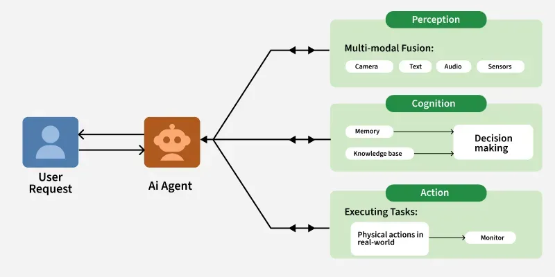

**Q: How are LLM Models classified?**
- Architecture      → decoder / encoder / MoE / SSM / multimodal
- Training stage    → base / SFT / RLHF / reasoning
- Modality          → text / vision / audio / code
- Scale             → frontier / mid-tier / SLM / edge
- Access            → proprietary / open-weights / open-source
- Domain            → general / coding / science / embeddings
- Generation        → GPT-2 era → ... → agentic era
- Context window    → standard / extended / long-context

**Q: What is the 7 types of LLM Models?**
Model Type	Key Characteristic	Core Use Case

| Model Type            | Key Characteristic                                                    | Core Use Case                                                                   |
| :-------------------- | :-------------------------------------------------------------------- | :------------------------------------------------------------------------------ |
| Base Models           | Trained on raw, unlabeled data via next-token prediction              | The foundation for all other models; lacks instruction-following                |
| Instruction-Tuned     | Fine-tuned (SFT/RLHF) to follow specific user commands                | Powering assistants like ChatGPT, Gemini, and Claude                            |
| Mixture of Experts (MoE) | Sparse architecture where only "expert" sub-networks activate         | Scaling models to trillions of parameters with faster inference                 |
| Reasoning Models      | Optimized for multi-step thought (Chain-of-Thought)                   | Complex math, coding, and logical problem-solving                               |
| Multimodal (MLLM)     | Processes text, images, audio, and video simultaneously               | Document parsing, visual Q&A, and rich data interpretation                      |
| Hybrid Models         | Dynamically switches between "fast" and "deep reasoning" paths        | Adaptive AI that balances cost and performance on-the-fly                       |
| Deep Research Agents  | Autonomous agents that iterate via web browsing and tools             | In-depth investigation and structured report generation                         |

**Q: What is an AI Agent?**
- AI Agents are software systems that use AI to pursue goals and complete tasks on behalf of users. They show reasoning, planning and memory and have a level of autonomy to make decisions, learn and adapt. They are best suited for executing multi-step plans towards a goad and taking actions such as calling APIs, using software tools, updating databases, etc.
MCP is the standard to expose the tool to an agent.
- An AI Agent is a system that uses a Large Language Model (LLM) as its "brain" to perceive its environment, reason through complex goals, and execute actions autonomously using external tools to achieve a specific outcome.

**Q: What are the Key Features of AI Agents?**
- AIAutonomy: Act independently without constant human intervention.
- Goal-Oriented: Driven by objectives, aiming to maximize success based on defined metrics.
- Perception & Observation: Gather information from the environment (sensors, digital inputs) to understand context.
- Reasoning & Rationality: Analyze data, identify patterns, and make informed, optimal decisions by combining data, domain knowledge, and past context.
- Planning: Develop strategic plans to achieve goals.
- Acting & Proactivity: Take initiative and execute actions/tasks based on decisions and plans, anticipating events rather than just reacting.
- Adaptability & Self-Refinement: Adjust strategies, learn, and improve over time in response to new circumstances, handling uncertainty and novel situations.
- Collaboration: Work effectively with humans or other AI agents to achieve shared goals through communication and coordination.

**Q: What are the different types of AI Agents in an Agentic AI System?**
- 1. Orchestration and Management Agents (OMAs): Manage the lifecycle, resources, and interactions among other agents.
- 2. Execution Agents: Sub-Agents / Worker Agents, these are fine-grained domain experts designed to do one specific thing exceptionally well.
- 3. Security and Governance Agents: Ensure compliance with policies, regulations, and ethical.
  - Proxy Agents: These serve as secure intermediaries or gateways to external systems.
  - ComplianceAuditAgent verifies that a worker agent's output strictly adheres to the original constraints of its instructions and does not deviate from them.
  - Real-Time Compliance Monitor intercepts requests (like accessing a patient database) and adjudicates them against a central policy engine to prevent unauthorized actions.
- Firewall Agents: These are designed to enforce strict access control policies, ensuring that only authorized agents can interact with specific resources or services.
- 4. Continuous Improvement and Testing Agents: These are tasked with continuously improving the system's performance, identifying bugs, and testing its functionality.
  - Planner (Generator) Agents: Used in self-improving systems, these agents are optimized for creativity and task completions.
  - Scorer (Evaluator) Agents: They objectively evaluate the planner's output against a strict rubric, providing expert feedback to refine the model's future behavior.
  - Red Team Agents: Deployed for security testing, these agents adopt a "hacker persona" to systematically mutate standard user queries into adversarial "jailbreak" attempts.
- 5. Generalist Agents: These are versatile and can perform multiple tasks with varying.

**Q: What are the different types of memories in an Agentic AI workflow?**
Memory acts as the state management system, storing knowledge, past experiences, and internal states to provide context for an agent's decision-making. It's generally categorized into three types:
- Short-Term Memory (Session/Working Memory):
    - Function: Manages immediate, active context for a current task or ongoing conversation. Holds interaction history to maintain coherent dialogue and avoid redundancy.
    - Mechanism: Managed within the LLM's context window. Techniques like sliding windows or running summarization are used to keep context concise and prevent "lost in the middle" issues.
- Long-Term Memory:
    - Function: Persistent storage for retaining and recalling information across multiple, separate sessions. Stores high-value, enduring data (e.g., user preferences, historical decisions, fraud patterns).
    - Mechanism: Relies on external, persistent storage (e.g., vector databases, key-value stores). Agents access this via Retrieval-Augmented Generation (RAG) patterns to fetch facts and ground reasoning.
- Shared Epistemic Memory:
    - Function: A system-level, global "scratchpad" or centralized knowledge pool for multi-agent workflows. All agents in a collective can read from and write to it, creating a single source of truth and preventing fragmented information or semantic drift.
    - Mechanism: Implemented using low-latency, persistent key-value stores (e.g., Redis, Memcached) with atomic operations to prevent race conditions. Entries often include Time-to-Live (TTL) or timestamp validation to assess reliability.

**Q: What are the different Agentic AI Architectures?**
## Types of Agentic AI Architectures
- [Single-Agent Architectures](https://www.exabeam.com/explainers/agentic-ai/agentic-ai-architecture-types-components-best-practices/#single-agent-architectures)
A lone autonomous entity that handles perception, reasoning, and action independently.
  - Pros: Easy to design, faster execution, simple debugging/monitoring.
  - Cons: Poor scalability; creates bottlenecks for complex or multi-step tasks.
  - Best For: Chatbots or recommendation engines.
- [Multi-Agent Architectures](https://www.exabeam.com/explainers/agentic-ai/agentic-ai-architecture-types-components-best-practices/#multi-agent-architectures)
Multiple specialized agents collaborate to solve complex problems through parallel processing.
  - Pros: High flexibility; agents adapt roles dynamically.
  - Cons: High coordination overhead; requires complex communication protocols.
  - Best For: Market research and workflow optimization.
- [Hierarchical (Vertical)](https://www.exabeam.com/explainers/agentic-ai/agentic-ai-architecture-types-components-best-practices/#hierarchical-vertical)
A "leader" agent coordinates subtasks and delegates them to subordinate agents.
  - Pros: Clear accountability and structured sequential execution.
  - Cons: Centralized leader is a single point of failure and potential bottleneck.
  - Best For: Approval chains and document generation.
- [Decentralized (Horizontal)](https://www.exabeam.com/explainers/agentic-ai/agentic-ai-architecture-types-components-best-practices/#decentralized-horizontal)
Peer agents operate as equals, sharing resources and making group-driven decisions.
  - Pros: Diverse perspectives and high adaptability for interdisciplinary problems.
  - Cons: Slower decision-making due to lack of central authority.
  - Best For: Brainstorming and collaborative design.
- [Hybrid Architectures](https://www.exabeam.com/explainers/agentic-ai/agentic-ai-architecture-types-components-best-practices/#hybrid-architectures)
Combines hierarchical and horizontal models with dynamic leadership based on task needs.
  - Pros: Versatile; balances rigid structure with creative exploration.
  - Cons: Highly complex to manage resource conflicts and shifting roles.
  - Best For: Strategic planning and dynamic team projects.
---
#### Summary Table in short
| Architecture | Structure | Best For |
|---|---|---|
| **Single Agent** | One LLM with tools in a loop | Simple, focused tasks |
| **Orchestrator-Subagent** | One planner delegates to specialized workers | Complex multi-step tasks with clear decomposition |
| **Hierarchical** | Multi-level orchestration (manager → team leads → workers) | Large-scale systems with nested task trees |
| **Peer-to-Peer (Decentralized)** | Agents communicate directly, no central coordinator | Collaborative tasks where roles are fluid |
| **Pipeline / Sequential** | Output of one agent becomes input of next | ETL-style workflows, document processing |
| **Parallel / Fan-out** | Orchestrator spawns concurrent agents, aggregates results | Research, multi-source analysis, speedup |
| **Debate / Adversarial** | Agents argue opposing positions; judge synthesizes | Fact-checking, red-teaming, critical analysis |
| **Reflexion / Self-Critique** | Agent evaluates its own output and retries | Quality-sensitive tasks requiring iteration |

Key architectural decision axes: centralized vs distributed control, sequential vs parallel execution, static vs dynamic routing.

**Q: What are the Components of a Single Agentic AI Architecture?**

- Perception: The way by which the agent collects information from its surroundings.
- Congnition: The way by which the agent must analyze the data and decide the best action.
  - Rule-Based Systems: Simple systems that follow predefined rules to make decisions.
  - Machine Learning Models: More advanced systems that use statistical techniques to learn patterns from data and make predictions.
  - Reinforcement Learning: Agentic AI systems often use reinforcement learning where they learn through trial and error by receiving feedback i.e rewards or penalties based on their actions.
- Action and Execution: The action component executes the decisions made by the agent.
- Learning and Adaptation: The ability of an agentic AI system to improve its performance over time.