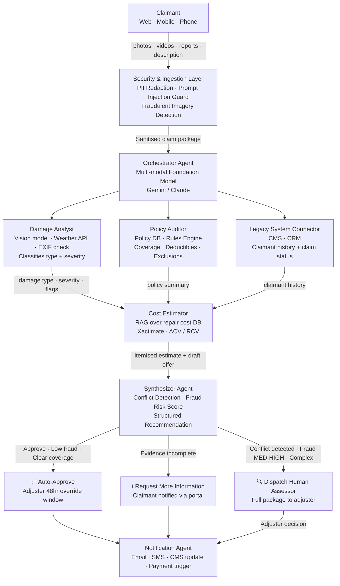
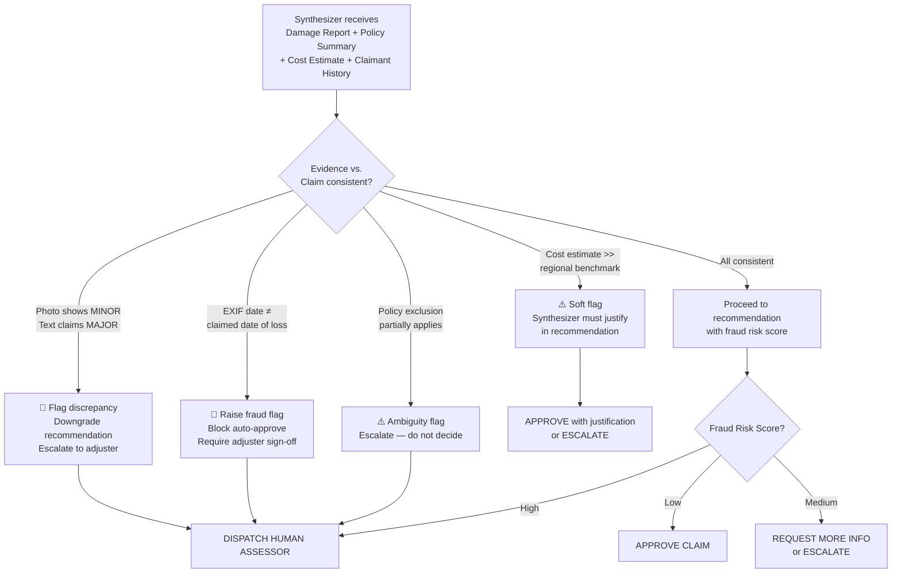
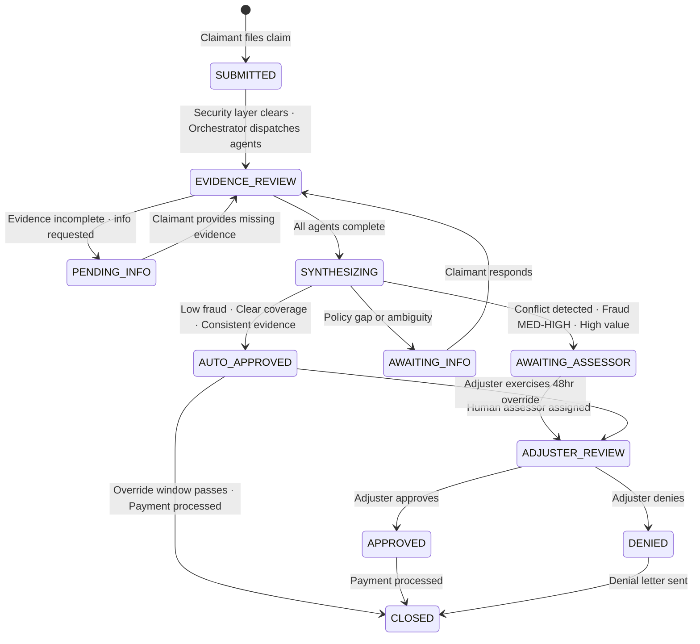
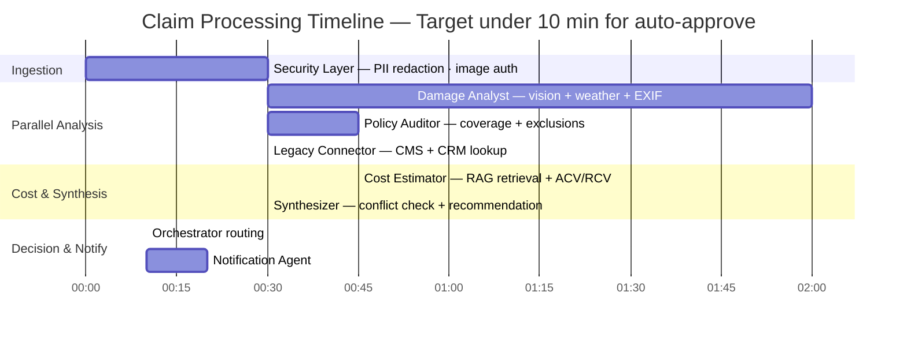

# System Design: Insurance Claims Processor

> **Domain:** InsurTech · **Pattern:** Orchestrator + Specialist Sub-agents + HITL
>
> ← [Back to Agentic AI Concepts](../Notes/01-Agentic-Concepts.md)

---

## Interview Problem Statement

> **"Design an agentic system that helps an insurance company process claims against their homeowner's policy more quickly."**

---

## Clarifying Questions

The problem is intentionally vague. These questions must be answered before committing to a design:

| Question | Why It Matters |
|---|---|
| What evidence does the claimant submit? (photos, videos, police reports, written descriptions?) | Determines whether we need vision, audio transcription, or document parsing capabilities |
| Which legacy systems must the agent interface with? (Claims Management System, CRM, policy DB?) | Defines the integration surface — tools the agents need to call |
| Has an insurance assessor already visited the site? | If yes, we have a structured assessment report; if no, the agent must infer damage from raw evidence alone |
| What is the claim value threshold for auto-approval vs. mandatory human review? | Sets the HITL escalation policy |
| What data is available on past claims? (for fraud detection and cost benchmarking) | Determines viability of RAG-based retrieval vs. fine-tuning |

---

## System Architecture Overview

```
┌──────────────────────────────────────────────────────────────────────┐
│                        CLAIMANT INTERFACE                             │
│         Web Portal / Mobile App / Phone (IVR + Transcription)        │
│                                                                       │
│   Submits: photos · videos · police report · written description     │
└──────────────────────────┬───────────────────────────────────────────┘
                           │
                           ▼
┌──────────────────────────────────────────────────────────────────────┐
│                    SECURITY & INGESTION LAYER                         │
│                                                                       │
│   • PII Redaction: strip names, addresses, policy numbers from       │
│     evidence before passing to LLMs                                  │
│   • Prompt Injection Guard: sanitize free-text fields                │
│   • Fraudulent Imagery Detection: EXIF metadata check,              │
│     reverse image search for stock/recycled photos                   │
│   • Evidence stored in secure object store (encrypted at rest)       │
└──────────────────────────┬───────────────────────────────────────────┘
                           │  Sanitised claim package
                           ▼
┌──────────────────────────────────────────────────────────────────────┐
│                       ORCHESTRATOR AGENT                              │
│                                                                       │
│   Model: Multi-modal Foundation Model (e.g., Gemini / Claude)        │
│   Pattern: Plan → Dispatch → Reflect → Synthesize                    │
│                                                                       │
│   • Creates claim context window (shared state for all sub-agents)   │
│   • Dispatches to specialist sub-agents in parallel                  │
│   • Detects conflicts between sub-agent findings                     │
│   • Applies escalation rules → routes to HITL or auto-decision       │
│   • Interfaces with legacy CMS and CRM via tool calls                │
└──────┬─────────────┬──────────────────────┬───────────────────┬──────┘
       │             │                      │                   │
       ▼             ▼                      ▼                   ▼
┌──────────┐  ┌──────────────┐   ┌─────────────────┐  ┌─────────────────┐
│  DAMAGE  │  │    POLICY    │   │  COST ESTIMATOR │  │  LEGACY SYSTEM  │
│  ANALYST │  │   AUDITOR    │   │                 │  │   CONNECTOR     │
│          │  │              │   │ • RAG over      │  │                 │
│ • Vision │  │ • Coverage   │   │   repair cost   │  │ • CMS + CRM     │
│   model  │  │   limits +   │   │   benchmarks    │  │   read/write    │
│ • EXIF   │  │   exclusions │   │ • ACV / RCV     │  │                 │
│   check  │  │ • Flags gaps │   │   per policy    │  │                 │
└─────┬────┘  └───────┬──────┘   └────────┬────────┘  └────────┬────────┘
      │               │                   │                    │
      └───────────────┴──────────────┬────┘                    │
                                     ▼                         │
┌────────────────────────────────────────────────────────────────────────┐
│                          SYNTHESIZER AGENT                              │
│                                                                         │
│   Combines: damage + policy coverage + cost estimate + claimant history│
│                                                                         │
│   RECOMMENDATION  │  CONDITIONS                                         │
│   ✅ Approve      │  Damage confirmed · Covered · Fraud risk: LOW       │
│   ℹ️ Request Info │  Evidence incomplete · Policy gap unclear           │
│   🔍 Dispatch     │  High severity · Fraud risk: MED/HIGH · Conflict    │
│      Human        │                                                     │
└──────────────────────────────┬──────────────────────────────────────────┘
                               │
           ┌───────────────────┼───────────────────┐
           ▼                   ▼                   ▼
    ✅ Auto-Approve       ℹ️ Request Info    🔍 Escalate to
    (HITL light-touch)   Claimant notified   Human Adjuster
    Adjuster 48hr        via portal          Full package
    override window                              │
           └───────────────────┴───────────────────┘
                               │
                               ▼
              ┌────────────────────────────────┐
              │        NOTIFICATION AGENT       │
              │  • Updates CMS claim status    │
              │  • Emails / SMS claimant       │
              │  • Triggers payment if approved│
              │  • Refers approved contractors │
              └────────────────────────────────┘
```

---

## Agent Breakdown

### 1. Orchestrator Agent
**Model:** Multi-modal foundation model (Gemini 1.5 Pro or Claude) — single model maintains coherent reasoning across text and image evidence without context loss between handoffs.

| Responsibility | Details |
|---|---|
| Context management | Creates and maintains the shared claim context window across all sub-agents |
| Parallel dispatch | Runs Damage Analyst + Policy Auditor + Legacy Connector simultaneously |
| Conflict detection | Compares sub-agent outputs for discrepancies before passing to Synthesizer |
| Escalation logic | Routes to auto-approve, request-info, or human adjuster paths |
| Legacy integration | Tool calls to CMS (update claim status) and CRM (read claimant history) |

### 2. Damage Analyst
**Model:** Multi-modal foundation model · **Tools:** Vision analysis, weather event API, EXIF metadata extractor

- Classifies damage **type**: water / fire / impact / theft / wind
- Classifies damage **severity**: minor / moderate / major / total loss
- Corroborates date and cause against weather records
- Flags if imagery metadata (EXIF timestamps, GPS) conflicts with the claim narrative

### 3. Policy Auditor
**Model:** LLM with RAG over policy documents · **Tools:** Policy DB API, coverage rules engine

- Pulls the claimant's active policy at the exact date of loss
- Checks perils covered, deductibles, sub-limits, exclusions
- Returns a structured policy summary — does **not** make a coverage decision

### 4. Cost Estimator
**Tools:** RAG over repair cost database (Xactimate / regional benchmarks), depreciation tables

- Retrieves comparable repair costs from RAG — avoids hallucinated cost estimates
- Applies ACV (Actual Cash Value) or RCV (Replacement Cost Value) per policy terms
- Drafts a preliminary settlement offer amount for the human adjuster

### 5. Synthesizer Agent
**Model:** LLM reasoning over structured inputs from all other agents

Outputs one of three structured recommendations with a **fraud risk score (Low / Medium / High)**:

| Recommendation | Trigger Conditions |
|---|---|
| **Approve Claim** | Damage confirmed · Covered · Cost reasonable · Fraud risk: Low |
| **Request More Information** | Evidence incomplete · Policy gap ambiguous |
| **Dispatch Human Assessor** | High severity · Fraud risk Med/High · Evidence-claim conflict |

**Conflict Resolution Logic:**
- Photo shows **minor** damage but claimant text describes **major** → flag, downgrade, escalate
- EXIF date on photos ≠ claimed date of loss → raise fraud flag
- Cost estimate significantly exceeds regional benchmark → soft flag with justification required

### 6. Legacy System Connector
**Tools:** CMS API, CRM API — reads claimant history, writes claim status at each lifecycle transition.

### 7. Notification Agent
**Tools:** Email, SMS, customer portal, contractor referral DB — delivers decision letters, triggers payment, provides approved contractors.

---

## Model Selection

| Decision | Choice | Rationale |
|---|---|---|
| NLP + Vision | **Single multi-modal model** | Avoids context loss between separate silos |
| Build vs. fine-tune | **General-purpose model + RAG** | RAG over policy and cost DB keeps estimates grounded |
| RAG for cost data | **RAG over Xactimate / regional benchmarks** | Prevents hallucinated repair costs |

---

## Safety & Human-Centric Design

**HITL:** The agent is decision support, not a decision maker. The final approval rests with a human adjuster:
- **Auto-approve path:** Adjuster receives summary + 48-hour override window
- **Escalation path:** Adjuster receives full package — damage report, policy summary, cost estimate, fraud score, draft settlement offer

**Security:**

| Threat | Mitigation |
|---|---|
| PII exposure to LLMs | PII redacted in Security Layer before any evidence reaches a model |
| Prompt injection via free-text | Input sanitisation; system prompt isolation |
| Fraudulent imagery | EXIF metadata check + reverse image search at ingestion |
| Adversarial image manipulation | Perceptual hash comparison against known fraud imagery DB |

---

## Data Flow

```
Claimant submits evidence
        │
        ▼
Security Layer: PII redaction · prompt injection guard · image auth check
        │
        ▼
Orchestrator creates claim context window
        │
        ├──► [PARALLEL] Damage Analyst ──────► damage type + severity + flags
        ├──► [PARALLEL] Policy Auditor ──────► coverage summary + exclusions
        └──► [PARALLEL] Legacy Connector ───► claimant history from CRM
        │
        ▼ (all three complete)
Cost Estimator ──► itemised repair cost + draft settlement offer
        │
        ▼
Synthesizer ──► conflict detection ──► recommendation + fraud risk score
        │
   ┌────┴──────────┬──────────────────┐
   │               │                  │
Approve        Request Info      Dispatch Assessor
(HITL light)   (notify claimant) (full package to adjuster)
   │               │                  │
   └───────────────┴──────────────────┘
                   │
        Notification Agent ──► claimant + CMS update + payment trigger
```

---

## Claim State Machine

```
SUBMITTED ──► EVIDENCE_REVIEW ──► PENDING_INFO ──► EVIDENCE_REVIEW
                    │
                    ▼
             SYNTHESIZING
                    │
        ┌───────────┼────────────────┐
        │           │                │
   AUTO_APPROVED  AWAITING_INFO  AWAITING_ASSESSOR
        │                            │
        └────────────┬───────────────┘
                     │
               ADJUSTER_REVIEW
                     │
              ┌──────┴──────┐
           APPROVED       DENIED
              └──────┬────────┘
                   CLOSED
```

---

## Diagrams

### End-to-End Agent Orchestration Flow



### Conflict Resolution Logic



### Claim State Machine



### Parallel Agent Execution Timeline



---

← [Back to Agentic AI Concepts](../Notes/01-Agentic-Concepts.md) · [All System Designs](../INDEX.md)
