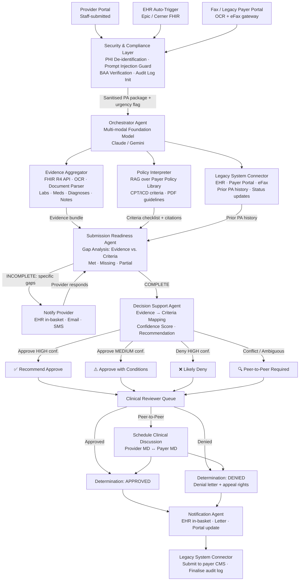
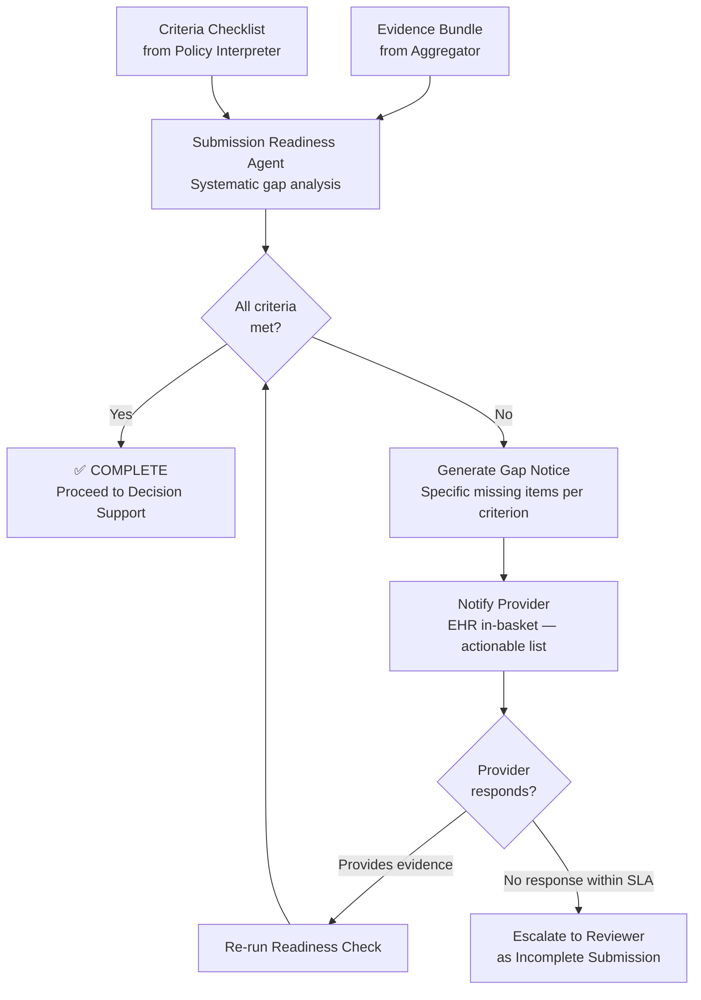
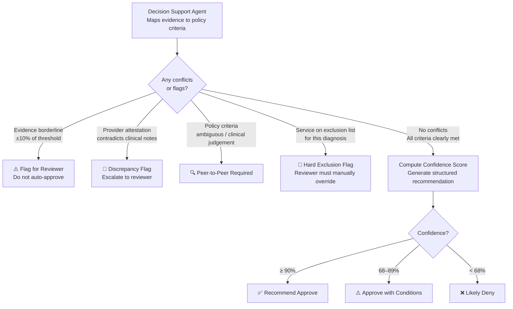
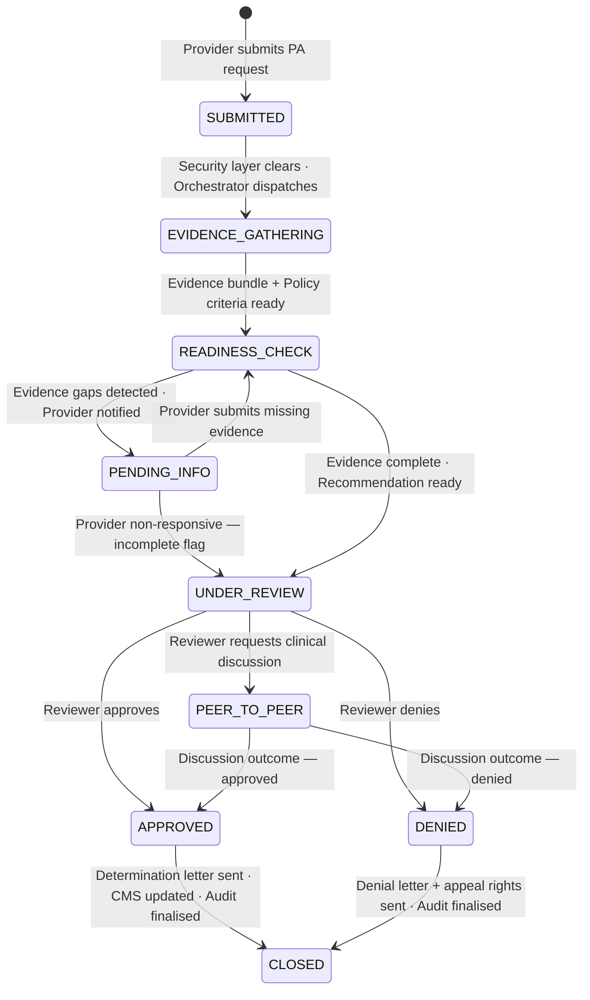

# System Design: Prior Authorization Workflow

> **Domain:** HealthTech · **Pattern:** Evidence Aggregation + Policy RAG + Submission Readiness + HITL
>
> ← [Back to Agentic AI Concepts](../Notes/01-Agentic-Concepts.md)

---

## Interview Problem Statement

> **"A national health insurer wants to reduce prior authorization processing time from an average of 3–5 business days to under 4 hours for its provider network of 50,000 physicians. Design an agentic system to support the end-to-end prior authorization workflow. Please draw the architecture."**

### Why this wording works as an interview question

| Design choice | Rationale |
|---|---|
| "National health insurer" | Stakes are clear; HIPAA/PHI compliance is implied but not stated |
| "50,000 physicians" | Forces scale thinking without prescribing exact request volume |
| "3–5 days → under 4 hours" | Gives a concrete goal while leaving implementation fully open |
| "Support the workflow" | Intentionally vague — candidate must ask: support *whom*? Providers? Reviewers? Both? |
| No mention of evidence type | Forces clarifying question on EHR, imaging, notes |
| No mention of legacy systems | Forces clarifying question on Epic, fax, payer portals |

---

## Clarifying Questions

Prior authorization is a multi-stakeholder workflow. These questions must be answered before committing to a design:

| Question | Why It Matters |
|---|---|
| Who submits the PA request — provider staff, EHR auto-trigger, or both? | Determines the intake surface and whether the system needs an EHR integration vs. a standalone portal |
| What clinical evidence is available digitally? (EHR notes, lab results, imaging reports, medication history) | Defines what the Evidence Aggregator must fetch and in what formats (FHIR, PDF, HL7) |
| Are payer policy documents structured (JSON criteria sets) or unstructured (PDF clinical guidelines)? | Structured criteria → rules engine; unstructured → RAG over PDFs; most real deployments need both |
| Which EHR platforms must the system integrate with? (Epic, Cerner, etc.) Is fax still in use? | Defines the Legacy System Connector's complexity; fax is still dominant in US healthcare |
| Are there urgency tiers — standard, expedited, concurrent/urgent? | Same pipeline but priority queue routing; urgent PAs need a near-real-time path |
| What is the scope? (medications, procedures, imaging, DME, or all authorization types?) | Each type has different policy criteria structures and evidence requirements |

---

## System Architecture Overview

```
┌──────────────────────────────────────────────────────────────────────────────────┐
│                         SUBMISSION SURFACE                                        │
│                                                                                   │
│   ┌──────────────────┐   ┌──────────────────┐   ┌───────────────────────────┐   │
│   │  Provider Portal  │   │  EHR Auto-Trigger │   │  Fax / Legacy Payer       │   │
│   │  (web / mobile)   │   │  (Epic / Cerner   │   │  Portal Ingestion         │   │
│   │  Staff-submitted  │   │   FHIR R4 event)  │   │  (OCR + eFax gateway)    │   │
│   └────────┬──────────┘   └────────┬──────────┘   └──────────────┬────────────┘  │
└────────────┼──────────────────────┼─────────────────────────────┼───────────────┘
             └──────────────────────┴──────────────┬──────────────┘
                                                   │  PA request + metadata
                                                   ▼
┌──────────────────────────────────────────────────────────────────────────────────┐
│                    SECURITY & COMPLIANCE LAYER                                    │
│                                                                                   │
│   • PHI De-identification: strip / tokenize patient identifiers before           │
│     passing clinical text to any cloud LLM                                       │
│   • Prompt Injection Guard: sanitise all free-text clinical note fields          │
│   • BAA Verification: confirm model provider has signed Business Associate       │
│     Agreement; route to on-prem model if not                                     │
│   • Audit Log Init: create immutable audit record (required for HIPAA)           │
└──────────────────────────────┬───────────────────────────────────────────────────┘
                               │  Sanitised PA package + urgency flag
                               ▼
┌──────────────────────────────────────────────────────────────────────────────────┐
│                       ORCHESTRATOR AGENT                                          │
│                                                                                   │
│   Model: Multi-modal Foundation Model (Claude / Gemini)                          │
│   Pattern: Plan → Dispatch → Reflect → Route                                     │
│                                                                                   │
│   • Routes to URGENT (4hr) or STANDARD (24hr) queue                             │
│   • Dispatches Evidence Aggregator + Policy Interpreter in parallel              │
│   • Detects conflicts between evidence and policy findings                       │
│   • Applies escalation rules before routing to reviewer                          │
└──────┬──────────────────────────┬──────────────────────────────────┬─────────────┘
       │                          │                                  │
       ▼                          ▼                                  ▼
┌─────────────────┐   ┌───────────────────────┐         ┌───────────────────────┐
│    EVIDENCE     │   │     POLICY            │         │  LEGACY SYSTEM        │
│   AGGREGATOR    │   │    INTERPRETER        │         │   CONNECTOR           │
│                 │   │                       │         │                       │
│ • FHIR R4 API  │   │ • RAG over payer      │         │ • EHR read (Epic)     │
│   (labs, meds, │   │   policy PDF library  │         │ • Submit to payer     │
│   diagnoses)   │   │ • Structured criteria │         │   portal / eFax       │
│ • OCR scanned  │   │   checklist output    │         │ • Prior PA history    │
│   docs         │   │ • Policy versioning   │         │ • CMS status updates  │
└────────┬────────┘   └──────────┬────────────┘         └───────────┬───────────┘
         └───────────────────────┴──────────────────────────────────┘
                                 │  Evidence bundle + Policy criteria + Prior PA history
                                 ▼
┌──────────────────────────────────────────────────────────────────────────────────┐
│                    SUBMISSION READINESS AGENT                                     │
│                                                                                   │
│   CRITERIA CHECK          │  STATUS     │  ACTION                                │
│   Diagnosis codes present │  ✅ Found   │  —                                     │
│   Clinical notes ≥ 90 days│  ✅ Found   │  —                                     │
│   Lab result: HbA1c       │  ❌ Missing │  Request from provider                 │
│   Prior treatment failed  │  ⚠️ Partial │  Needs clarification                   │
│   Step therapy documented │  ✅ Found   │  —                                     │
│                                                                                   │
│   Output: COMPLETE (proceed) or INCOMPLETE (notify provider of gaps)            │
└──────────────────────────────┬───────────────────────────────────────────────────┘
                               │
             ┌─────────────────┴──────────────────┐
             │                                     │
             ▼                                     ▼
     INCOMPLETE                               COMPLETE
  Notify provider ◄── provider responds          │
  of specific gaps ──────────────────► re-run    ▼
                                        DECISION SUPPORT AGENT
                                        Evidence → Criteria Mapping
                                        Confidence Score + Recommendation
                                               │
                                               ▼
┌──────────────────────────────────────────────────────────────────────────────────┐
│               HUMAN-IN-THE-LOOP — CLINICAL REVIEWER QUEUE                        │
│                                                                                   │
│   AI is decision SUPPORT. Final approve / deny rests with a licensed reviewer.  │
│                                                                                   │
│   RECOMMENDATION  │  CONFIDENCE  │  CONDITIONS                                   │
│   ✅ Approve       │  HIGH (92%)  │  All criteria met, no conflicts               │
│   ⚠️ Approve w/   │  MEDIUM      │  Minor gap or borderline criterion            │
│      conditions   │  (68–85%)    │  — reviewer must confirm                      │
│   ❌ Likely Deny  │  HIGH        │  Required criterion unmet                     │
│   🔍 Peer-to-Peer │  LOW (<68%)  │  Conflicting evidence or ambiguous policy     │
│                                                                                   │
│   SLA routing:                                                                    │
│   URGENT / Concurrent → reviewer within 1 hour                                  │
│   EXPEDITED → reviewer within 4 hours                                           │
│   STANDARD → reviewer within 24 hours                                           │
└──────────────────────────────┬───────────────────────────────────────────────────┘
                               │
              ┌────────────────┼────────────────────────┐
              ▼                ▼                        ▼
          APPROVED          DENIED              PEER-TO-PEER
              │           Denial letter +       Scheduled call
              │           appeal rights         provider MD ↔ payer MD
              └────────────────┴────────────────────────┘
                               │
              ┌────────────────────────────────┐
              │       NOTIFICATION AGENT        │
              │  EHR in-basket · Letter         │
              │  CMS / payer portal update      │
              │  Audit log finalised            │
              └────────────────────────────────┘
```

---

## Agent Breakdown

### 1. Orchestrator Agent
**Model:** Multi-modal foundation model (Claude / Gemini)

| Responsibility | Details |
|---|---|
| Urgency routing | Standard (72hr) · Expedited (24hr) · Urgent/Concurrent (4hr) — same pipeline, different priority queue |
| Parallel dispatch | Evidence Aggregator + Policy Interpreter run simultaneously to minimise latency |
| Conflict detection | Compares sub-agent outputs before routing to Decision Support Agent |
| Escalation logic | Applies confidence thresholds and conflict flags to determine reviewer queue |

### 2. Evidence Aggregator
**Tools:** FHIR R4 API (Epic / Cerner), OCR engine, document parser, eFax ingestion

- Fetches structured clinical data: diagnoses (ICD-10), procedures (CPT), medications, lab results, vitals
- OCRs scanned documents (paper referrals, imaging reports, specialist letters)
- Normalises all evidence into a structured evidence bundle with source citations
- Flags evidence that is stale (e.g., lab result older than 12 months)

### 3. Policy Interpreter
**Model:** LLM with RAG over payer policy library · **Tools:** Vector store of payer PDF guidelines + structured JSON criteria sets

- Looks up authorisation criteria for the requested service code (CPT / HCPCS / NDC)
- RAG retrieval over unstructured policy PDFs; rules engine for structured JSON criteria
- Returns a structured criteria checklist with each required evidence element and policy citation
- Handles policy versioning — always retrieves criteria valid at the date of service

> **Build vs. Fine-tune:** General-purpose LLM + RAG over a maintained policy library is preferred. PA criteria vary per payer and are updated quarterly. RAG avoids retraining costs and keeps criteria current.

### 4. Submission Readiness Agent
- Performs a systematic gap analysis: what the policy requires vs. what evidence is present
- Categorises each criterion: ✅ Met · ❌ Missing · ⚠️ Partial
- Generates a provider-facing gap notice for missing items (specific, actionable)
- Re-runs after provider responds with additional evidence

### 5. Decision Support Agent
- Maps each evidence item to its corresponding policy criterion with explicit citation
- Applies numerical threshold checks (e.g., HbA1c ≥ 8.0%, BMI ≥ 35)
- Computes per-criterion pass/fail and an overall confidence score
- Produces one of four structured recommendations: Approve · Approve with conditions · Likely Deny · Peer-to-Peer Required

**Conflict Resolution Logic:**

| Conflict Type | System Response |
|---|---|
| Evidence borderline (within 10% of numeric threshold) | Flag for reviewer · Do not auto-approve |
| Provider attestation contradicts clinical notes | Raise discrepancy flag · Escalate to reviewer |
| Policy criteria ambiguous / subject to clinical judgement | Mark as "Peer-to-Peer Required" · Do not auto-decide |
| Requested service on exclusion list for this diagnosis | Hard flag · Reviewer must override manually with reason |

### 6. Legacy System Connector
**Tools:** FHIR R4 API, eFax gateway, payer REST/EDI APIs

- Abstracts all external system integrations into a single connector
- Reads prior PA history and patient clinical context from EHR
- Submits final PA decisions to payer portals or via eFax
- Writes status updates back to EHR so providers see real-time PA status

### 7. Notification Agent
**Tools:** EHR in-basket API, email, SMS, secure portal messaging

- EHR in-basket notification to ordering provider at each state transition
- Sends gap requests with specific missing evidence items (not generic rejection)
- Delivers determination letter with policy citations
- Triggers peer-to-peer scheduling for contested denials

---

## Urgency Tiers

| Tier | Trigger | Target Total Time | Reviewer SLA |
|---|---|---|---|
| **Standard** | Routine elective procedure / medication | 72 hours | 24 hours |
| **Expedited** | Condition could worsen without timely treatment | 24 hours | 4 hours |
| **Urgent / Concurrent** | Patient currently admitted or in active treatment | 4 hours | 1 hour |

All tiers use the same pipeline — urgency flag sets queue priority and SLA alerts only.

---

## Key Design Decisions

| Decision | Choice | Rationale |
|---|---|---|
| Multi-modal vs. separate silos | **Single multi-modal model** | Clinical evidence is text + structured data + scanned PDFs |
| Policy retrieval | **RAG, not fine-tuning** | Criteria change quarterly; RAG over versioned policy store avoids retraining |
| Urgency handling | **Same pipeline, priority queue** | Avoids code duplication |
| HITL threshold | **All decisions require reviewer** | Regulatory requirement in PA |
| Auditability | **Immutable log + evidence citations** | HIPAA, appeals, and payer audit requirements |
| PHI handling | **De-identify before cloud LLM; BAA required** | HIPAA Safe Harbor or BAA-covered model endpoint |
| Legacy integration | **Dedicated Connector component** | Isolates fax/EDI/FHIR complexity from agent logic |

---

## Safety & Compliance

| Threat | Mitigation |
|---|---|
| PHI exposure to cloud LLM | De-identify / tokenize patient identifiers before any cloud model call |
| Prompt injection via clinical notes | Sanitise free-text fields in Security Layer; system prompt isolation |
| Stale policy criteria | Policy library versioned and timestamped; always retrieve criteria valid at date of service |
| Audit trail gaps | Immutable log created at intake; every agent action appended; finalised at decision |
| Appeals traceability | Every evidence→criterion mapping stored with policy citation; retrievable for appeals |

---

## Data Flow

```
Provider submits PA request (EHR auto-trigger / portal / fax)
        │
        ▼
Security Layer: PHI de-identification · prompt injection guard · audit log init
        │
        ▼
Orchestrator: parse service code · set urgency tier · create context window
        │
        ├──► [PARALLEL] Evidence Aggregator ──► evidence bundle (FHIR + OCR)
        └──► [PARALLEL] Policy Interpreter  ──► criteria checklist + citations
        │
        ▼ (both complete)
Legacy System Connector ──► prior PA history + patient clinical context
        │
        ▼
Submission Readiness Agent
        │
   ┌────┴────────────────┐
   │                     │
COMPLETE            INCOMPLETE
   │            Notify provider of gaps
   │            ◄── provider responds
   ▼
Decision Support Agent → evidence → criteria mapping → confidence score
        │
        ▼
Clinical Reviewer Queue (SLA by urgency tier)
        │
   ┌────┴────────────────┬──────────────────┐
   │                     │                  │
APPROVED             DENIED          PEER-TO-PEER
   └─────────────────────┴──────────────────┘
                         │
        Notification Agent → EHR in-basket · letter · payer portal update
        Audit Log → finalise immutable record
```

---

## PA State Machine

```
SUBMITTED → EVIDENCE_GATHERING → READINESS_CHECK
                                      │
                         ┌────────────┴────────────┐
                         ▼                         ▼
                    PENDING_INFO              UNDER_REVIEW
                (provider notified)        (SLA clock running)
                         │                         │
                provider responds      ┌───────────┼───────────┐
                         │             ▼           ▼           ▼
                         └──► re-run APPROVED   DENIED   PEER_TO_PEER
                              READINESS    │         │         │
                                          └────┬────┘         │
                                               ▼              │
                                            CLOSED  ◄─────────┘
```

---

## Diagrams

### End-to-End Agent Orchestration Flow



### Submission Readiness Gap Analysis



### Conflict Resolution Decision Tree



### PA Processing Timeline by Urgency Tier

```mermaid
gantt
    title Prior Authorization — Processing Timeline by Urgency Tier
    dateFormat HH:mm
    axisFormat %H:%M

    section URGENT — Target 4 hours
    Security + Ingestion              :u0, 00:00, 5m
    Evidence Aggregation + Policy Lookup (parallel) :u1, after u0, 20m
    Submission Readiness Check        :u2, after u1, 10m
    Decision Support + Recommendation :u3, after u2, 10m
    Clinical Reviewer SLA             :u4, after u3, 60m
    Notification + CMS submission     :u5, after u4, 5m

    section EXPEDITED — Target 24 hours
    Security + Ingestion              :e0, 00:00, 10m
    Evidence Aggregation + Policy Lookup (parallel) :e1, after e0, 30m
    Submission Readiness Check        :e2, after e1, 15m
    Provider gap response window      :e3, after e2, 120m
    Decision Support + Recommendation :e4, after e3, 15m
    Clinical Reviewer SLA             :e5, after e4, 240m
    Notification + CMS submission     :e6, after e5, 10m

    section STANDARD — Target 72 hours
    Security + Ingestion              :s0, 00:00, 15m
    Evidence Aggregation + Policy Lookup (parallel) :s1, after s0, 45m
    Submission Readiness + Provider Response :s2, after s1, 480m
    Decision Support + Recommendation :s3, after s2, 20m
    Clinical Reviewer SLA             :s4, after s3, 1440m
    Notification + CMS submission     :s5, after s4, 15m
```



### PA State Machine



---

← [Back to Agentic AI Concepts](../Notes/01-Agentic-Concepts.md) · [All System Designs](../INDEX.md)
