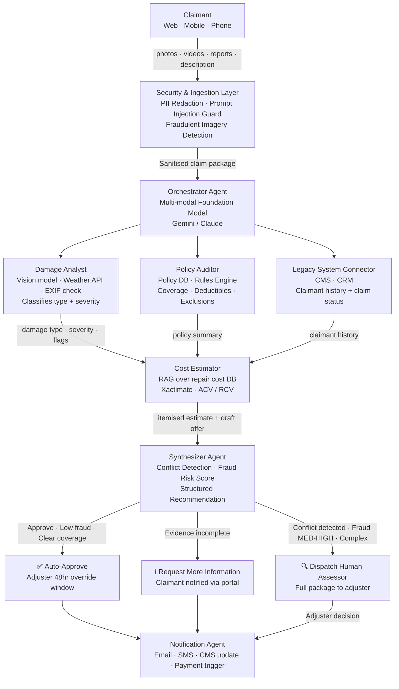
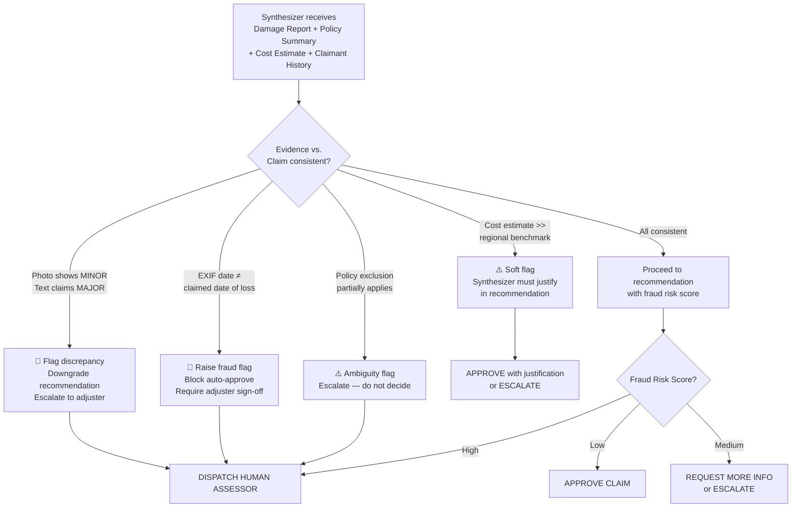
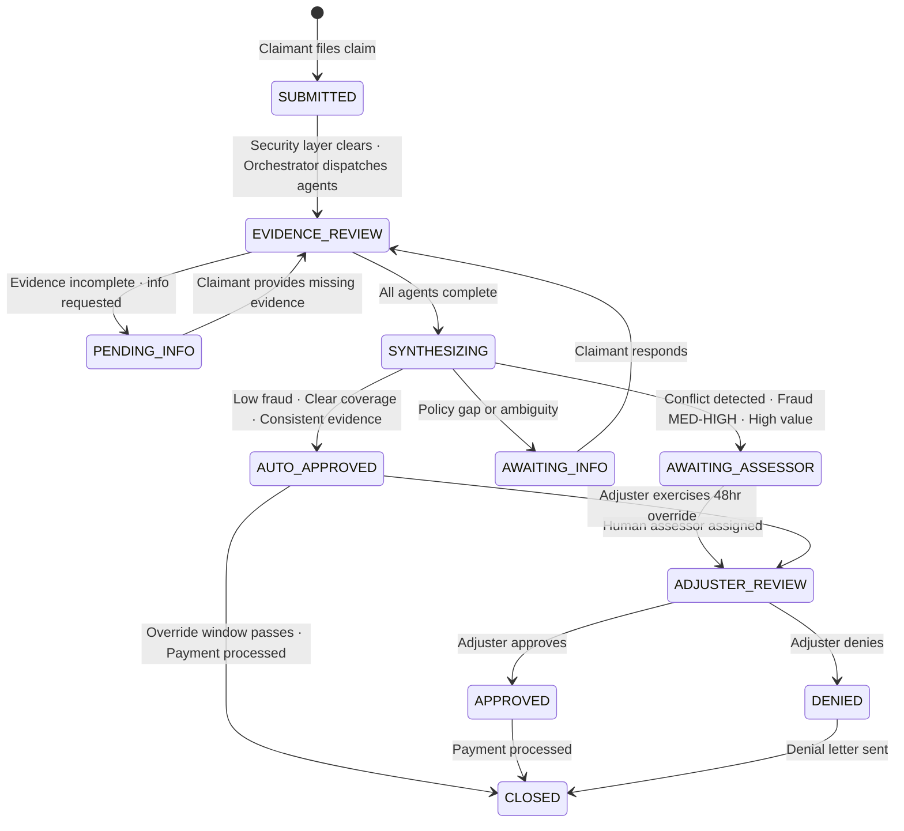
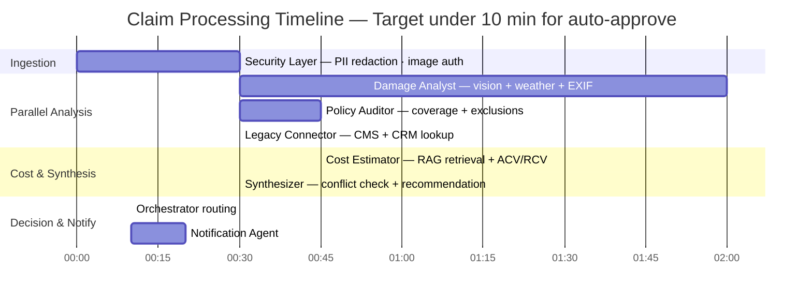

# System Architecture Diagrams

## End-to-End Agent Orchestration Flow

```mermaid
flowchart TD
    A[Claimant\nWeb · Mobile · Phone] -->|photos · videos · reports · description| B

    B[Security & Ingestion Layer\nPII Redaction · Prompt Injection Guard\nFraudulent Imagery Detection]

    B -->|Sanitised claim package| C[Orchestrator Agent\nMulti-modal Foundation Model\nGemini / Claude]

    C --> D[Damage Analyst\nVision model · Weather API · EXIF check\nClassifies type + severity]
    C --> E[Policy Auditor\nPolicy DB · Rules Engine\nCoverage · Deductibles · Exclusions]
    C --> F[Legacy System Connector\nCMS · CRM\nClaimant history + claim status]

    D -->|damage type · severity · flags| G[Cost Estimator\nRAG over repair cost DB\nXactimate · ACV / RCV]
    E -->|policy summary| G
    F -->|claimant history| G

    G -->|itemised estimate + draft offer| H[Synthesizer Agent\nConflict Detection · Fraud Risk Score\nStructured Recommendation]

    H -->|Approve · Low fraud · Clear coverage| I[✅ Auto-Approve\nAdjuster 48hr override window]
    H -->|Evidence incomplete| J[ℹ️ Request More Information\nClaimant notified via portal]
    H -->|Conflict detected · Fraud MED-HIGH · Complex| K[🔍 Dispatch Human Assessor\nFull package to adjuster]

    I --> L[Notification Agent\nEmail · SMS · CMS update · Payment trigger]
    J --> L
    K -->|Adjuster decision| L
```

## Conflict Resolution Logic

```mermaid
flowchart TD
    A[Synthesizer receives\nDamage Report + Policy Summary\n+ Cost Estimate + Claimant History]

    A --> B{Evidence vs.\nClaim consistent?}

    B -->|Photo shows MINOR\nText claims MAJOR| C[🚩 Flag discrepancy\nDowngrade recommendation\nEscalate to adjuster]

    B -->|EXIF date ≠\nclaimed date of loss| D[🚩 Raise fraud flag\nBlock auto-approve\nRequire adjuster sign-off]

    B -->|Cost estimate >>\nregional benchmark| E[⚠️ Soft flag\nSynthesizer must justify\nin recommendation]

    B -->|Policy exclusion\npartially applies| F[⚠️ Ambiguity flag\nEscalate — do not decide]

    B -->|All consistent| G[Proceed to recommendation\nwith fraud risk score]

    C --> H[DISPATCH HUMAN ASSESSOR]
    D --> H
    E --> I[APPROVE with justification\nor ESCALATE]
    F --> H
    G --> J{Fraud Risk Score?}
    J -->|Low| K[APPROVE CLAIM]
    J -->|Medium| L[REQUEST MORE INFO\nor ESCALATE]
    J -->|High| H
```

## Claim State Machine

```mermaid
stateDiagram-v2
    [*] --> SUBMITTED : Claimant files claim
    SUBMITTED --> EVIDENCE_REVIEW : Security layer clears · Orchestrator dispatches agents
    EVIDENCE_REVIEW --> PENDING_INFO : Evidence incomplete · info requested
    PENDING_INFO --> EVIDENCE_REVIEW : Claimant provides missing evidence
    EVIDENCE_REVIEW --> SYNTHESIZING : All agents complete
    SYNTHESIZING --> AUTO_APPROVED : Low fraud · Clear coverage · Consistent evidence
    SYNTHESIZING --> AWAITING_INFO : Policy gap or ambiguity
    SYNTHESIZING --> AWAITING_ASSESSOR : Conflict detected · Fraud MED-HIGH · High value
    AWAITING_INFO --> EVIDENCE_REVIEW : Claimant responds
    AWAITING_ASSESSOR --> ADJUSTER_REVIEW : Human assessor assigned
    AUTO_APPROVED --> ADJUSTER_REVIEW : Adjuster exercises 48hr override
    ADJUSTER_REVIEW --> APPROVED : Adjuster approves
    ADJUSTER_REVIEW --> DENIED : Adjuster denies
    AUTO_APPROVED --> CLOSED : Override window passes · Payment processed
    APPROVED --> CLOSED : Payment processed
    DENIED --> CLOSED : Denial letter sent
```

## Parallel Agent Execution Timeline

```mermaid
gantt
    title Claim Processing Timeline — Target under 10 min for auto-approve
    dateFormat  mm:ss
    axisFormat  %M:%S

    section Ingestion
    Security Layer — PII redaction · image auth   :a0, 00:00, 00:30

    section Parallel Analysis
    Damage Analyst — vision + weather + EXIF       :a1, after a0, 02:00
    Policy Auditor — coverage + exclusions         :a2, after a0, 00:45
    Legacy Connector — CMS + CRM lookup            :a3, after a0, 00:30

    section Cost & Synthesis
    Cost Estimator — RAG retrieval + ACV/RCV       :a4, after a1, 00:45
    Synthesizer — conflict check + recommendation  :a5, after a4, 00:30

    section Decision & Notify
    Orchestrator routing                           :a6, after a5, 00:10
    Notification Agent                             :a7, after a6, 00:20
```
