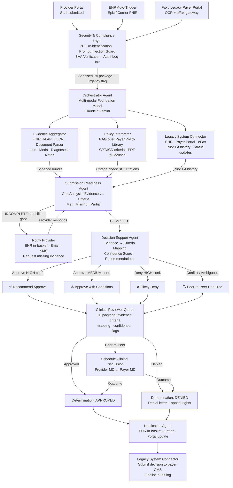
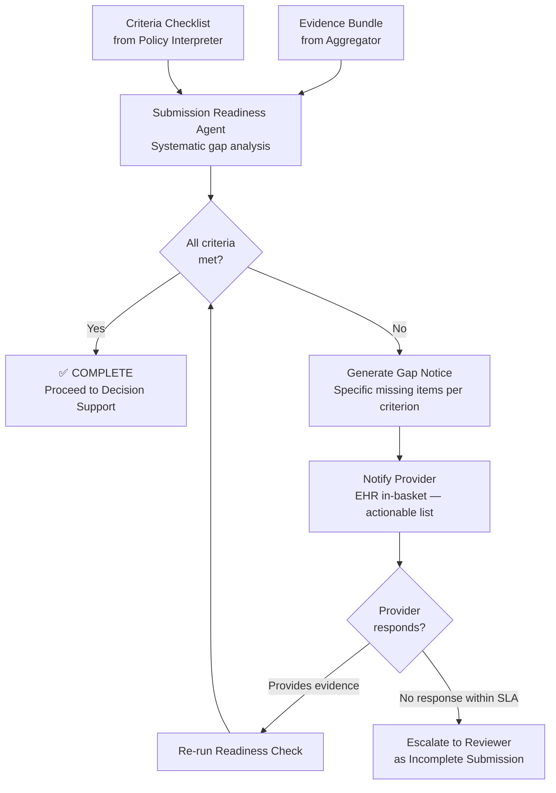
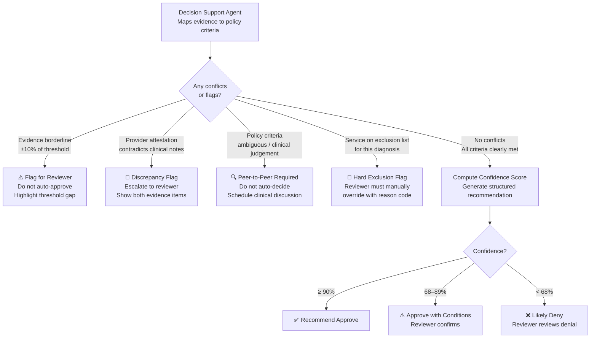
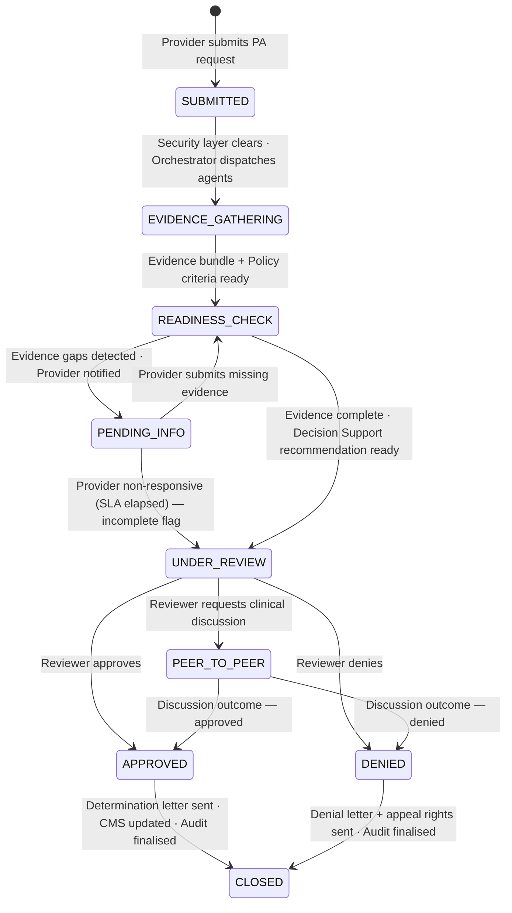

# System Architecture Diagrams

## End-to-End Agent Orchestration Flow

## Submission Readiness Gap Analysis

## Conflict Resolution Decision Tree

## PA Processing Timeline by Urgency Tier

```mermaid
gantt
    title Prior Authorization — Processing Timeline by Urgency Tier
    dateFormat HH:mm
    axisFormat %H:%M

    section URGENT — Target 4 hours
    Security + Ingestion              :u0, 00:00, 5m
    Evidence Aggregation + Policy Lookup (parallel) :u1, after u0, 20m
    Submission Readiness Check        :u2, after u1, 10m
    Decision Support + Recommendation :u3, after u2, 10m
    Clinical Reviewer SLA             :u4, after u3, 60m
    Notification + CMS submission     :u5, after u4, 5m

    section EXPEDITED — Target 24 hours
    Security + Ingestion              :e0, 00:00, 10m
    Evidence Aggregation + Policy Lookup (parallel) :e1, after e0, 30m
    Submission Readiness Check        :e2, after e1, 15m
    Provider gap response window      :e3, after e2, 120m
    Decision Support + Recommendation :e4, after e3, 15m
    Clinical Reviewer SLA             :e5, after e4, 240m
    Notification + CMS submission     :e6, after e5, 10m

    section STANDARD — Target 72 hours
    Security + Ingestion              :s0, 00:00, 15m
    Evidence Aggregation + Policy Lookup (parallel) :s1, after s0, 45m
    Submission Readiness + Provider Response :s2, after s1, 480m
    Decision Support + Recommendation :s3, after s2, 20m
    Clinical Reviewer SLA             :s4, after s3, 1440m
    Notification + CMS submission     :s5, after s4, 15m
```

## PA State Machine

