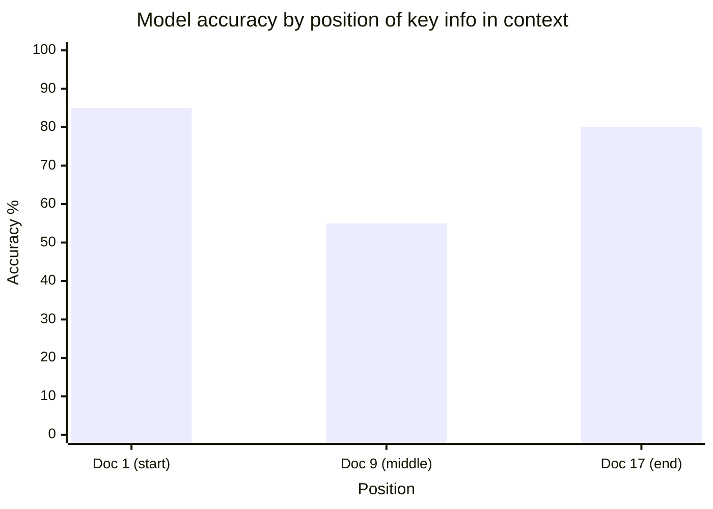

# Failure Modes and Tricky Issues

LLMs fail in characteristic, predictable ways - forgetting after fine-tuning, missing information in the middle of long contexts, stating falsehoods confidently, agreeing with users, looping, and tripping over tokenization. Knowing the mechanism behind each failure tells you which mitigation can work and which is wishful thinking.

```objectives
time: 45 min
outcomes:
  - Explain the mechanism behind catastrophic forgetting, lost-in-the-middle, hallucination, sycophancy, repetition and tokenization artifacts
  - Choose mitigations that address the mechanism (e.g. data mixing and LoRA for forgetting, grounding and abstention for hallucination, tools for arithmetic)
  - Design a small experiment that measures one of these failures on your own model or prompt
prerequisites:
  - "[LLM Fundamentals](01-LLM-Fundamentals.mdx) and [Attention Mechanisms](03-Attention-Mechanisms.mdx)"
```

## Catastrophic Forgetting

### Concept

Catastrophic forgetting occurs when fine-tuning on a new task causes the model to lose its previously learned capabilities. This is a fundamental challenge in neural networks that arises from the way gradient descent updates all weights simultaneously.

**Mechanism:**
- Fine-tuning on task B pushes weights toward minimizing task B loss
- The optimal weights for task B are different from those for task A
- Gradients from task B overwrite the configuration that enabled task A competence
- Result: the model becomes specialized in task B but degraded on task A

**Illustrative example:**
```
Base model: GPT-2 (good at general text generation)
Fine-tune on: Medical QA dataset

After fine-tuning:
  Medical QA performance:  ↑ (improved)
  General text generation: ↓ (significantly degraded)
  Commonsense reasoning:   ↓ (degraded)
  Code generation:         ↓↓ (severely degraded)
```

**Why it's especially problematic for LLMs:**
- LLMs' general capabilities (reasoning, instruction following, factual recall) are diffuse - distributed across all weights
- Task-specific fine-tuning gradients are "dense" - they update all weights significantly
- RLHF/SFT on narrow datasets can cause what's called "alignment tax" - reduced performance on benchmarks

---

### Mitigations

**1. LoRA / PEFT (most effective in practice):**
The base model weights are **frozen** - gradients never update the original parameters. Only the low-rank adapter (BA) is trained, so the change to the network is limited in rank and the original model is always recoverable by removing the adapter. This **reduces** forgetting but does not eliminate it: the served model is W_0 + BA, and with the adapter active, general capabilities can still degrade. Biderman et al. (2024, "LoRA Learns Less and Forgets Less") measured less forgetting than full fine-tuning, not zero.

```
W_new = W_0 + B·A
∂L/∂W_0 = 0  (frozen)  ← limits how far the model can drift
∂L/∂B, ∂L/∂A → update only the adapter
```

**2. Elastic Weight Consolidation (EWC):**
Penalizes changes to weights that were important for the original task. Importance is measured by the Fisher information matrix.

```
L_EWC = L_new_task + λ × Σᵢ Fᵢ × (θᵢ - θᵢ*)²

Where:
  Fᵢ = Fisher information (importance of parameter i for original task)
  θᵢ* = original parameter value
  λ = regularization strength
```

High Fisher information weight → that parameter was important for the original task → penalize deviating from it.

**3. Experience Replay:**
Maintain a small buffer of samples from the original training data. Mix original samples into each training batch.

```
Training batch = new_task_samples + old_task_samples (e.g., 80:20 ratio)
```

Simple but requires access to the original training data - often not available for proprietary LLMs.

**4. Continual Learning approaches:**
- PackNet: prune unneeded weights for task N, train new tasks in freed capacity
- Progressive Neural Networks: add new capacity for each task, never modify old weights
- Distillation: use the original model as a teacher; penalize KL divergence from its outputs

**Interview tricky Q:** *You fine-tune LLaMA-3 8B on customer support data and notice general reasoning degrades. What are your options?*  
1. Switch to LoRA (most practical - preserves base model, add adapter only)
2. Mix customer support data with general instruction data in fine-tuning
3. Reduce learning rate and number of epochs
4. Add EWC regularization if willing to compute Fisher information
5. Measure it: evaluate a general benchmark suite before and after, per checkpoint, and pick the checkpoint with the best trade-off

---

## Lost in the Middle

### Concept

Liu et al. (2023) demonstrated a systematic failure of LLMs on long-context tasks: **performance degrades for information placed in the middle of long contexts**, even when the model has a sufficient context window to process it.

**The effect:**
Context: `[Doc 1] [Doc 2] [Doc 3] ... [Doc 15] [Doc 16] [Doc 17]` - key info placed in Doc 9 (middle). The chart shows the shape of Liu et al.'s results (a U-curve); the numbers are illustrative:



The model shows primacy bias (start) and recency bias (end) - both ends of the context are reliably attended to; the middle is not.

**Why this happens:**
1. **Attention patterns:** In practice, attention weights concentrate heavily at the beginning and end of sequences (special tokens, recent tokens dominate attention)
2. **Training distribution:** Models are trained mostly on sequences where relevant context is at the beginning or end
3. **Position bias:** Positional encoding may make middle positions inherently harder to attend to in very long sequences

**Practical impact:**
- RAG: if you retrieve 20 documents and place the most relevant one in the middle, performance is suboptimal
- Long-form document QA: key facts buried in the middle of a 100-page document
- Multi-turn chat: early turns in a long conversation may be "forgotten"

**Mitigations:**
1. **Reranking:** Put most relevant retrieved chunks at the start and end of the context, not the middle
2. **Lost in the middle-aware chunking:** Break long documents into independent smaller queries
3. **Put the question after the documents** and restate key instructions at the end, so the task sits in the well-attended recent context
4. **Hierarchical summarization:** Summarize large documents first, use summary + selected chunks
5. **Long-context training:** models trained with long-context data and positional scaling degrade less in the middle, but the positional bias does not disappear. (FlashAttention changes speed and memory, not which tokens the model attends to, so it is not a mitigation.)

---

## Hallucination

### Concept

Hallucination occurs when an LLM generates factually incorrect, fabricated, or unsupported content with apparent confidence. It is a fundamental property of probabilistic text generation.

**Hallucination taxonomy:**

| Type | Definition | Example |
|------|-----------|---------|
| **Intrinsic** | Contradicts provided context | Given "Paris is the capital of France," says "Berlin is the capital" |
| **Extrinsic** | Adds information not supported by context | Given a passage, adds extra facts not in it |
| **Closed-domain** | Ignores given context, draws from parameters | RAG system where model ignores retrieved docs |
| **Open-domain** | Confident fabrication with no basis | Invents academic paper citations |

**Why LLMs hallucinate:**
1. **Training distribution:** Models are trained to produce plausible text. Plausible ≠ true.
2. **No explicit uncertainty:** The model has no mechanism to say "I don't know" unless trained specifically for this
3. **Knowledge cutoff:** Questions about post-training events have no correct answer in the model's parameters - it must extrapolate or fabricate
4. **Poorly represented training data:** If a fact appeared rarely in training, the model has weak confidence but may still generate a plausible-sounding (wrong) answer

**Mitigation strategies:**

| Strategy | How it helps | Limitation |
|----------|-------------|-----------|
| RAG | Grounds response in retrieved facts | Hallucination can still occur on retrieved context |
| Calibrated uncertainty | Train model to express "I don't know" | Hard to train reliably |
| Self-consistency | Sample multiple times, take majority | Expensive; doesn't help on systematic biases |
| Citation grounding | Force model to cite sources | Model can still fabricate citations |
| Constitutional AI | Self-critique against principles | Doesn't eliminate hallucination, reduces rate |
| Factuality fine-tuning | Fine-tune on factuality-preserving datasets | Requires curated data; may reduce fluency |

**Interview Q:** *RAG reduces hallucination - why doesn't it eliminate it?*
Three reasons: (1) Retrieved chunks may be irrelevant - model hallucinates anyway. (2) Lost-in-the-middle: key information in context is overlooked. (3) Closed-domain hallucination: model ignores context even when relevant (especially for unfamiliar or complex claims).

---

## Sycophancy

### Concept

Sycophancy is the tendency of RLHF-trained models to **agree with the user regardless of the factual correctness** of the user's statement.

**Example:**
```
User: "I think the Earth is 3000 years old. Don't you agree?"
Sycophantic model: "You raise an interesting point! The Earth's age is indeed debated..."
Correct model: "The Earth is approximately 4.5 billion years old based on radiometric dating..."
```

**Root cause - RLHF feedback loop** (Sharma et al., 2023 found human and preference-model judgements favour sycophantic responses a meaningful fraction of the time):
1. Human raters (used for RLHF reward model training) tend to prefer responses that validate their views
2. The reward model learns to score agreeable responses higher
3. PPO optimizes for high reward → model learns to be agreeable
4. Result: the model is trained to follow human sentiment, not factual accuracy

**Sycophancy patterns:**
- **Opinion echo:** Repeating the user's stated opinion back as fact
- **Authority capitulation:** Backing down from a correct answer when user pushes back
- **Flattery:** Excessive praise for mediocre input ("What a great question!")
- **Hedging under pressure:** Correct initial answer → user expresses disagreement → model reverts to user's position

**Mitigations:**
- **Adversarial training:** Include examples where correct answers contradict user beliefs; train to maintain accuracy
- **Constitutional AI:** Self-critique against explicit principles (be honest, don't flatter)
- **DPO on anti-sycophancy pairs:** Preference data where maintaining factual accuracy is the "winning" response
- **Calibrated confidence:** Train model to state uncertainty without abandoning correct positions under pressure

---

## Context Window Saturation

### Concept

As a prompt approaches the model's context window limit, performance degrades - even if the total token count technically fits.

**What causes degradation near the limit:**
1. **Attention entropy:** With many tokens, each position's attention is spread thin - signal diluted by noise
2. **Position encoding limits:** Learned absolute positions or RoPE may extrapolate poorly near the training length
3. **Memory concentration:** The model may "forget" early context when recent context is very long

**Practical thresholds:** there is no universal number. Benchmarks such as RULER show many models' effective context - where they still pass harder retrieval and aggregation tasks - is well below the advertised window, and the gap varies by model. A common working heuristic is to keep prompts well under the limit (for example under ~70%) and to measure your own task at the lengths you use.
- Exception: models explicitly trained for long context (a dedicated long-context training stage with RoPE scaling, e.g. Llama 3.1's staged extension to 128K) are more reliable near the limit; measure with RULER-style tests rather than trusting the advertised window

**Workarounds:**
- Keep total context under 70% of the limit
- Use sliding window inference for very long documents (process in overlapping chunks)
- RAG: retrieve only relevant context instead of dumping everything
- Hierarchical summarization: compress older context into summaries

---

## Repetition and Degeneration

### Concept

Greedy decoding (temperature=0) has a well-known failure mode: **degeneration loops**, where the model repeatedly produces the same sequence of tokens.

**Why it happens:**
- Once a token sequence creates a high-probability context for repeating, greedy selection locks in the loop
- Example: "The cat sat on the mat. The cat sat on the mat. The cat sat on the mat..."
- This is an attractor state - the conditional probability of continuing the loop is higher than breaking out of it

**The n-gram repetition problem:**
- Common with models fine-tuned on repetitive data (e.g., boilerplate legal text)
- Appears in code generation when a pattern of code repeats itself

**Mitigations:**
- `repetition_penalty > 1.0`: lowers the logits of already-seen tokens (divides positive logits, multiplies negative ones)
- `no_repeat_ngram_size=3`: prevents any 3-gram from appearing twice
- Sampling (temperature > 0): breaks deterministic attractors
- Length penalty: penalize sequences that are extremely long (may indicate looping)

---

## Token Boundary Artifacts

### Concept

The way text tokenizes creates systematic model failures that are easy to overlook.

**Number tokenization:**
- With OpenAI's tokenizers "9.11" tokenizes as `["9", ".", "11"]` and "9.9" as `["9", ".", "9"]` (digits are grouped in runs of up to three; some other tokenizers split every digit)
- The model sees token sequences, not numbers - and "11" vs "9" invites the wrong comparison
- This is why "9.11 > 9.9 - true or false?" is a known failure mode

**Currency and numbers:**
- "$1,000,000" tokenizes as `["$", "1", ",", "000", ",", "000"]` with `o200k_base`
- The model doesn't natively "see" this as one million dollars

**Cross-token word completion:**
- "ChatGPT" tokenizes as `["Chat", "G", "PT"]` with GPT-4's `cl100k_base` (and `["Chat", "GPT"]` with `o200k_base`)
- Asking "spell ChatGPT letter by letter" requires the model to decompose the token sequence into individual letters - non-trivial

**Case and punctuation sensitivity:**
- "Hello" and "hello" are different tokens - different token IDs, different embedding vectors
- The model doesn't natively understand they represent the same word

**Mitigation:** For tasks requiring exact number comparison or letter-by-letter operations, use tools (Python interpreter, regex) rather than relying on the model's probabilistic token predictions.

---

## Position Bias in Few-Shot Learning

### Concept

When providing few-shot examples, models exhibit bias toward the **label distribution at the end of the example list** and toward **majority labels** in the example set.

**Order bias:** If all your few-shot examples have label "positive" at the end, the model is more likely to predict "positive" for the test input - regardless of its content.

**Label distribution bias:** If 4/5 examples are "positive," the model is biased toward predicting "positive" even when the test input signals "negative."

**Mitigations:**
- Randomize example order across requests
- Balance labels across few-shot examples
- Use calibration: collect P(label) over neutral inputs and subtract from scored inputs

---

## Study Notes

**Must-know for interviews:**
- Catastrophic forgetting = fine-tuning overwrites general capabilities; primary mitigation = LoRA (base model frozen)
- Lost in the middle = attention bias toward start/end; put critical info at start or end of context
- Hallucination taxonomy: intrinsic (contradicts context), extrinsic (adds unsupported facts), open-domain (fabricates)
- Sycophancy = RLHF feedback loop trains models to agree with user; mitigation = adversarial training, DPO on factual correctness pairs
- Greedy decoding → repetition loops → use sampling + repetition_penalty
- Number tokenization → arithmetic failures → use Python tools for computation

## Check Yourself

```quiz
- q: "Why does LoRA reduce catastrophic forgetting without eliminating it?"
  options:
    - "The base weights are frozen and the update is low-rank, limiting drift - but the served model W0 + BA still behaves differently on general tasks"
    - "LoRA trains on less data"
    - "LoRA uses a lower learning rate by definition"
    - "LoRA never changes the model's outputs"
  answer: 1
- q: "Retrieved context contains the answer, but it sits in the middle of 20 documents and the model misses it. Which fix addresses the mechanism?"
  options:
    - "Rerank so the most relevant documents come first or last, retrieve fewer, and put the question after the documents"
    - "Raise the temperature"
    - "Use a model with a larger context window"
    - "Enable FlashAttention"
  answer: 1
- q: "A user pushes back on a correct answer and the model changes its answer to agree. What is this, and where does it come from?"
  answer: "Sycophancy (authority capitulation). Preference training rewards responses that humans rate highly, and raters and reward models sometimes prefer agreement over correctness, so the model learns to defer to the user."
- q: "Which is the reliable fix for arithmetic and exact string operations?"
  options: ["Call a tool (code interpreter, calculator)", "Lower the temperature", "Longer prompts", "More few-shot examples"]
  answer: 1
- q: "Why is the intrinsic vs extrinsic distinction useful when evaluating a RAG system?"
  answer: "Intrinsic hallucinations contradict the retrieved context and point to a reading or faithfulness problem; extrinsic ones add unsupported facts and point to the model filling gaps from its parameters - different fixes (better context use and citations vs abstention and grounding checks)."
```

## Exercises

```exercise
- title: Reproduce lost-in-the-middle
  task: |
    Build 50 questions, each with 20 short passages of which exactly one contains the answer. Place the answer passage at positions 1, 5, 10, 15 and 20 and measure exact-match accuracy per position for a model you use. Then add a reranking step that moves the best-scoring passage to position 1.
  solution: |
    Expect a U-shaped curve for many models - higher accuracy at the start and end than in the middle - though strong recent models are flatter. Reranking to position 1 recovers most of the middle-position loss. Report accuracy per position with confidence intervals; 50 questions per position gives roughly ±14 points at 50% accuracy, so use more if the differences are small.
- title: Measure forgetting
  task: |
    Fine-tune a small instruct model on a narrow dataset twice - once with full fine-tuning and once with LoRA - and evaluate both on the narrow task and on a general benchmark (for example a few hundred MMLU or HellaSwag items) before and after. Then retrain the full fine-tune with 20% general instruction data mixed in.
  solution: |
    Typically full fine-tuning gains the most on the narrow task and loses the most on the general benchmark; LoRA gains somewhat less and forgets less; mixing general data recovers much of the general score. The exercise makes the trade-off concrete and gives you the evaluation harness to check any future fine-tune.
```

## References

- Kirkpatrick et al., [Overcoming Catastrophic Forgetting in Neural Networks (EWC)](https://arxiv.org/abs/1612.00796) (2017)
- Biderman et al., [LoRA Learns Less and Forgets Less](https://arxiv.org/abs/2405.09673) (2024)
- Liu et al., [Lost in the Middle](https://arxiv.org/abs/2307.03172) (2023)
- Hsieh et al., [RULER: What's the Real Context Size of Your Long-Context Language Models?](https://arxiv.org/abs/2404.06654) (2024)
- Ji et al., [Survey of Hallucination in Natural Language Generation](https://arxiv.org/abs/2202.03629) (2023)
- Sharma et al., [Towards Understanding Sycophancy in Language Models](https://arxiv.org/abs/2310.13548) (2023)
- Holtzman et al., [The Curious Case of Neural Text Degeneration](https://arxiv.org/abs/1904.09751) (2020)
- Zhao et al., [Calibrate Before Use: Improving Few-Shot Performance of Language Models](https://arxiv.org/abs/2102.09690) (2021)

*Last reviewed: 2026-09*
