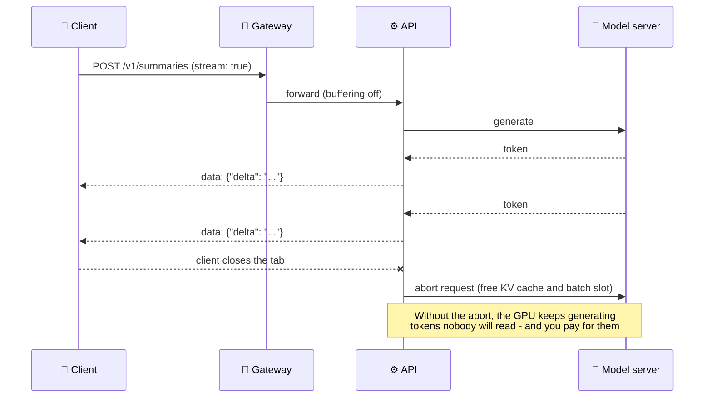

# API Design for LLM Services

An LLM service is an HTTP API with unusual properties: responses take seconds rather than milliseconds, they stream token by token, each request has a real cost, and the backend is often rate-limited by another provider. This note covers the design choices that make such an API reliable to call: choosing between request/response, streaming, WebSockets and async jobs; Server-Sent Events done right; validated contracts; errors as problem details; idempotency; rate limits and backpressure; timeouts and cancellation; and versioning.

```objectives
time: 50 min
outcomes:
  - Choose request/response, SSE streaming, WebSockets or asynchronous jobs for an LLM endpoint and justify the choice
  - Implement a streaming endpoint that stops generating when the client disconnects
  - Return consistent errors (RFC 9457 problem details) with the right status codes, including 429 with Retry-After
  - Make expensive POST requests safe to retry with idempotency keys
  - Design rate limits, timeouts and versioning for a multi-tenant model API
prerequisites:
  - "[Python for AI Engineering](01-Python-for-AI-Engineering.mdx) - asyncio and Pydantic"
  - "Optional, later in the course: [Streaming & TTFT](../../16-Inference-and-Serving/Notes/05-Streaming-and-TTFT.mdx)"
```

## Choosing the Interaction Style

| Style | Use when | Example |
|---|---|---|
| **Request/response (JSON)** | Short outputs, machine consumers, under ~10-30 s | Classification, extraction, embeddings |
| **Server-Sent Events (SSE)** | Humans read the output as it's generated; one-way server → client | Chat completions, drafting |
| **WebSocket** | Two-way, low-latency, long-lived sessions | Realtime voice, interactive agents with interruptions |
| **Asynchronous job** (`202 Accepted` + status URL or webhook) | Minutes of work, or batch | Long-document analysis, deep research, nightly batch scoring |

Most model providers expose an OpenAI-compatible chat-completions style API (JSON request, optional SSE stream), and many open-source servers - vLLM, SGLang - implement the same shape. Matching it lets clients reuse SDKs and switch backends cheaply.

---

## A Reference Implementation

The service below shows the patterns in this note in one FastAPI app: a validated request model, an SSE stream that stops on disconnect, problem-detail errors, idempotency keys and a per-client token-bucket rate limit. It was run with FastAPI 0.142 and Pydantic 2.13; tests confirmed each behaviour (output at the end).

```python
import asyncio
import json
import time
from collections.abc import AsyncIterator

from fastapi import FastAPI, Header, Request
from fastapi.responses import JSONResponse, StreamingResponse
from pydantic import BaseModel, Field

app = FastAPI(title="Summarizer API", version="1.0.0")


class SummarizeRequest(BaseModel):
    text: str = Field(min_length=1, max_length=50_000)
    max_tokens: int = Field(default=256, ge=1, le=2048)
    stream: bool = False


class SummarizeResponse(BaseModel):
    id: str
    summary: str
    usage: dict[str, int]


def problem(status: int, title: str, detail: str, headers: dict | None = None) -> JSONResponse:
    """RFC 9457 problem details - one error shape for every failure."""
    return JSONResponse({"type": "about:blank", "title": title, "status": status, "detail": detail},
                        status_code=status, media_type="application/problem+json", headers=headers)


# --- naive per-client token bucket (use Redis or the gateway in production) ---------------
BUCKET: dict[str, tuple[float, float]] = {}      # client -> (tokens, last refill time)
RATE, BURST = 2.0, 5.0                           # 2 requests/s sustained, bursts of 5


def take_token(client: str) -> float:
    """Returns 0 if allowed, else seconds until a token is available."""
    tokens, last = BUCKET.get(client, (BURST, time.monotonic()))
    now = time.monotonic()
    tokens = min(BURST, tokens + (now - last) * RATE)
    if tokens >= 1:
        BUCKET[client] = (tokens - 1, now)
        return 0.0
    BUCKET[client] = (tokens, now)
    return (1 - tokens) / RATE


# --- idempotency: the same key returns the stored result instead of doing the work twice ---
RESULTS: dict[str, dict] = {}


async def fake_generate(text: str, max_tokens: int) -> AsyncIterator[str]:
    for word in f"Summary: {text[:60]}".split()[:max_tokens]:
        await asyncio.sleep(0.01)                # stand-in for the model's decode steps
        yield word + " "


@app.post("/v1/summaries", response_model=SummarizeResponse)
async def summarize(req: SummarizeRequest, request: Request,
                    idempotency_key: str | None = Header(default=None),
                    x_client_id: str = Header(default="anonymous")):
    wait = take_token(x_client_id)
    if wait:
        return problem(429, "Too Many Requests", "Rate limit exceeded",
                       headers={"Retry-After": str(max(1, round(wait)))})

    if idempotency_key and idempotency_key in RESULTS:
        return RESULTS[idempotency_key]

    if req.stream:
        async def events() -> AsyncIterator[str]:
            async for chunk in fake_generate(req.text, req.max_tokens):
                if await request.is_disconnected():   # client went away: stop generating, free the GPU
                    return
                yield f"data: {json.dumps({'delta': chunk})}\n\n"
            yield "data: [DONE]\n\n"
        return StreamingResponse(events(), media_type="text/event-stream")

    parts = [c async for c in fake_generate(req.text, req.max_tokens)]
    body = {"id": f"sum_{len(RESULTS) + 1}", "summary": "".join(parts).strip(),
            "usage": {"input_tokens": len(req.text.split()), "output_tokens": len(parts)}}
    if idempotency_key:
        RESULTS[idempotency_key] = body
    return body
```

Tested behaviour (FastAPI `TestClient`):

```
idempotent: 200 sum_1 == sum_1                       # same Idempotency-Key -> same result, no second generation
validation: 422 ['text', 'max_tokens']               # empty text and max_tokens 99999 both rejected
stream:     text/event-stream ... data: [DONE]
rate limit: [200, 200, 200, 200, 200, 429, 429, 429] # burst of 5, then 429 with Retry-After: 1
```

The in-memory dictionaries are for illustration; a real service keeps rate-limit buckets and idempotency records in a shared store (Redis, the API gateway, a database) so they work across replicas.

---

## Streaming with Server-Sent Events



Things that go wrong with SSE in production:

- **Buffering proxies.** A reverse proxy or load balancer that buffers responses delivers the whole stream at the end, destroying time-to-first-token. Disable buffering for streaming routes (for example `X-Accel-Buffering: no` for NGINX) and raise idle timeouts.
- **Silent long pauses.** Reasoning models may think for many seconds before the first visible token. Send periodic comment lines (`: keep-alive`) so intermediaries don't close an idle connection.
- **No cancellation.** Check for client disconnects and abort the generation upstream - vLLM and similar servers abort a request when its connection closes, freeing KV-cache memory for other requests.
- **Errors after the 200.** Once streaming starts the status code is already sent, so mid-stream failures must be sent as an error event in the stream, and clients must handle them.
- **Usage accounting.** Send token usage in a final event so clients can meter cost even for streamed responses.

---

## Errors as Problem Details

Use one error shape everywhere - RFC 9457 **problem details** (`application/problem+json` with `type`, `title`, `status`, `detail`) - and pick status codes clients can act on:

| Status | Meaning in an LLM API | Client action |
|---|---|---|
| **400 / 422** | Invalid request; also **context length exceeded** or unsupported parameter | Fix the request; don't retry unchanged |
| **401 / 403** | Missing or invalid credentials; not allowed for this model or tenant | Fix credentials |
| **409** | A request with the same idempotency key is still in progress | Wait, then retry |
| **413** | Payload too large | Split or shrink input |
| **429** | Rate limit or quota exceeded, with `Retry-After` | Back off and retry |
| **500** | Bug | Retry a limited number of times; report |
| **503** | Overloaded or shedding load, with `Retry-After` | Back off and retry |
| **504** | Upstream model call timed out | Retry with backoff, or use a smaller request |

Also return a distinct, documented error `type` for content-policy refusals, so clients can tell "the model refused" from "the service failed".

---

## Idempotency

POST requests that start expensive or side-effecting work - a generation you pay for, an agent run that sends an email - must be safe to retry, because clients retry after timeouts without knowing whether the first attempt finished. The client sends an **`Idempotency-Key`** header (a UUID per logical operation; standardization is in progress at the IETF), and the server:

1. Stores the key, scoped to the client, before starting the work.
2. If the same key arrives while the first request is still running, returns **409** (or waits for it).
3. If it arrives after completion, returns the **stored response** without redoing the work.
4. Expires keys after a retention window (Stripe documents keys being pruned after at least 24 hours).

Reject a reused key with a **different** request body - it signals a client bug.

---

## Rate Limits, Quotas and Backpressure

- **Limit on what costs money.** Model providers limit requests per minute **and** tokens per minute; do the same per tenant, counting input plus requested `max_tokens` up front and correcting with actual usage afterwards.
- **Token bucket** (as above) allows short bursts while enforcing an average rate. Enforce it at the gateway or in a shared store, not per replica.
- **Tell clients where they stand.** Return `Retry-After` on 429 and 503; the IETF RateLimit header fields draft defines headers for remaining quota.
- **Backpressure, not collapse.** When the model backend is saturated, queue up to a bounded depth, then shed load with 503 + `Retry-After` rather than accepting work that will time out anyway. Queue depth is also the right autoscaling signal ([LLM Serving on Kubernetes](../../17-Production-Engineering/Notes/03-LLM-Serving-on-Kubernetes.mdx)).
- **Priority classes.** Interactive traffic ahead of batch; give batch its own quota or a separate endpoint.

---

## Timeouts, Cancellation and Deadlines

Set an **end-to-end deadline** for each request and pass it down: the gateway, API, retrieval and model calls should all know how much time remains, and give up rather than doing work whose answer will arrive too late. Keep client timeouts longer than server timeouts, so the server can return a clean 504 instead of the client seeing a dropped connection. Cap `max_tokens` server-side; an unbounded generation is an unbounded cost and latency.

---

## Versioning and Compatibility

- Put the major version in the path (`/v1/`) and change it only for breaking changes.
- **Additive changes are safe** - new optional fields, new endpoints. Removing or renaming fields, or changing what a field means, is breaking.
- Treat the **model behind an endpoint as part of the contract**: let clients pin a model version, and announce upgrades. A silent model swap can break clients as surely as a schema change.
- Announce deprecations with the `Deprecation` (RFC 9745) and `Sunset` (RFC 8594) response headers, plus documentation and a timeline.
- Publish an **OpenAPI** document (FastAPI generates it from the Pydantic models) and generate client SDKs from it.

---

## Check Yourself

```quiz
- q: "A document-analysis endpoint takes 2-6 minutes per request. Which interaction style fits best?"
  options:
    - "Synchronous JSON request/response with a 10-minute timeout"
    - "An asynchronous job: 202 Accepted with a status URL or webhook"
    - "Server-Sent Events"
    - "A WebSocket"
  answer: 2
  explain: "Minutes-long synchronous requests tie up connections and break on proxy timeouts. Return 202 with a job id, and let the client poll or receive a webhook."
- q: "Users report the chat answer appears all at once after 15 seconds, although the backend streams. What is the most likely cause?"
  options:
    - "The model is not streaming"
    - "A proxy or load balancer is buffering the response"
    - "The client uses HTTP/2"
    - "The tokenizer is slow"
  answer: 2
  explain: "Buffering intermediaries hold the response until it completes. Disable buffering for streaming routes and raise idle timeouts."
- q: "A client times out waiting for a POST that starts an agent run, and retries. How do you avoid running the agent twice?"
  answer: "Require an Idempotency-Key per logical operation. Store it before starting; a duplicate while the first is running gets 409 (or waits), a duplicate after completion gets the stored response, and keys expire after a retention window."
- q: "Which status code and header should a saturated LLM API return when it sheds load?"
  options:
    - "500 with no headers"
    - "503 Service Unavailable with Retry-After"
    - "400 Bad Request"
    - "200 with an empty body"
  answer: 2
  explain: "503 tells clients the problem is temporary and server-side; Retry-After tells them when to come back, preventing retry storms."
- q: "Why should a streaming endpoint check for client disconnects?"
  answer: "Generation keeps consuming GPU time, KV-cache memory and a batch slot - and costs money - even if nobody is reading. Aborting the upstream request when the client disconnects frees those resources for other users."
```

## Exercises

```exercise
- title: Design the error contract
  task: |
    Your chat API sits in front of a hosted model. List the error responses (status, problem type, retry advice) for: an input longer than the model's context window, the provider returning 429, the provider timing out after 60 s, a content-policy refusal, and an invalid API key.
  solution: |
    - Context too long: **400**, type `/errors/context-length-exceeded`, detail with the limit and the measured token count; don't retry unchanged.
    - Provider 429: **429** with `Retry-After` (propagate or compute from the provider's header), type `/errors/rate-limited`; retry with backoff.
    - Provider timeout: **504**, type `/errors/upstream-timeout`; retry with backoff, or reduce `max_tokens`.
    - Content-policy refusal: **200** with a structured refusal field if the model answered with a refusal, or **400** with type `/errors/content-policy` if your guardrail blocked the input - either way a distinct, documented type.
    - Invalid API key: **401**, type `/errors/unauthorized`; don't retry.
- title: Size a per-tenant token limit
  task: |
    A tenant's plan allows 200,000 tokens per minute. Requests average 3,000 input tokens and ask for max_tokens of 1,000, but actually use 400 output tokens on average. How many requests per minute can they make if you reserve max_tokens up front and correct afterwards? What if you don't correct?
  solution: |
    Reserved per request: `3,000 + 1,000 = 4,000` tokens. If reservations were never corrected, the budget would allow `200,000 / 4,000 = 50` requests per minute, and the tenant would be charged for 600 tokens per request they never used. Refunding the unused 600 when each request finishes makes actual consumption `3,400` per request, so the sustained rate is about `200,000 / 3,400 ≈ 58` requests per minute - while the up-front reservation still guarantees that requests in flight can never overshoot the budget.
```

## Study Notes

**Must-know:**
- JSON for short machine calls; SSE for human-facing streams; WebSocket for two-way realtime; async jobs (202 + status/webhook) for minutes-long work
- OpenAI-compatible request shapes let clients reuse SDKs and swap backends
- SSE pitfalls: buffering proxies, idle timeouts (send keep-alives), errors after the 200, no cancellation; abort generation on disconnect
- RFC 9457 problem details; 400/422 (incl. context too long), 409, 429 + Retry-After, 503 + Retry-After, 504
- Idempotency-Key for expensive or side-effecting POSTs: store, 409 while in flight, replay stored response, expire
- Rate limit by requests and tokens per tenant, in a shared store; bounded queues and load shedding; queue depth drives autoscaling
- End-to-end deadlines, server-side max_tokens caps; version the path, change additively, treat the model as part of the contract; Deprecation and Sunset headers

## References

- IETF, [RFC 9457 - Problem Details for HTTP APIs](https://www.rfc-editor.org/rfc/rfc9457) (2023); [RFC 6585 - Additional HTTP Status Codes (429)](https://www.rfc-editor.org/rfc/rfc6585) (2012); [RFC 9110 - HTTP Semantics (Retry-After)](https://www.rfc-editor.org/rfc/rfc9110) (2022)
- IETF HTTPAPI WG, [The Idempotency-Key HTTP Header Field](https://datatracker.ietf.org/doc/draft-ietf-httpapi-idempotency-key-header/) (draft, 2026) and [RateLimit header fields for HTTP](https://datatracker.ietf.org/doc/draft-ietf-httpapi-ratelimit-headers/) (draft, 2026)
- IETF, [RFC 9745 - The Deprecation HTTP Response Header Field](https://www.rfc-editor.org/rfc/rfc9745) (2025); [RFC 8594 - The Sunset HTTP Header Field](https://www.rfc-editor.org/rfc/rfc8594) (2019)
- WHATWG, [HTML Standard - Server-sent events](https://html.spec.whatwg.org/multipage/server-sent-events.html) (2026)
- Stripe, [Idempotent requests](https://docs.stripe.com/api/idempotent_requests) (2026); Google, [API Improvement Proposals](https://google.aip.dev/) (2026)
- [OpenAPI Specification 3.1](https://spec.openapis.org/oas/v3.1.0) (2021); [FastAPI documentation](https://fastapi.tiangolo.com/) (2026)

*Last reviewed: 2026-10*
