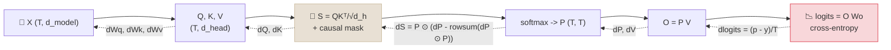

# Code Lab 01 - Attention and Backprop by Hand

Implement one causal attention head, an output projection and a cross-entropy loss in NumPy, derive every gradient by hand with the chain rule, and prove them correct twice: against central finite differences and against PyTorch autograd. Then run two small experiments that make the math visible - why attention scores are divided by √d_head, and how temperature reshapes a softmax.

← **Back to Overview:** [Math for ML](../INDEX.mdx) · **Concepts:** [Linear Algebra for Transformers](../Notes/01-Linear-Algebra-for-Transformers.mdx) · [Calculus & Optimization](../Notes/03-Calculus-and-Optimization.mdx)

```objectives
time: 1.5 hours
outcomes:
  - Implement scaled, causal single-head attention and a cross-entropy loss with correct shapes at every step
  - Derive the backward pass by hand, including the softmax Jacobian-vector product, and verify it with finite differences
  - Explain from measurements why scores are scaled by 1/√d_head
  - Relate temperature to the entropy of the next-token distribution
prerequisites:
  - "[Calculus & Optimization](../Notes/03-Calculus-and-Optimization.mdx) - chain rule, softmax + cross-entropy gradient"
  - "[Linear Algebra for Transformers](../Notes/01-Linear-Algebra-for-Transformers.mdx) - the attention shapes and formula used here"
  - "Optional, later in the course: [Attention Mechanisms](../../03-Foundation-Models/Notes/04-Attention-Mechanisms.mdx) - the full picture of attention"
```

---

## What's In This Lab

| Property | Detail |
|---|---|
| Model | One attention head (d_model 8, d_head 4) over 6 tokens, output projection to a 10-token vocabulary, mean cross-entropy |
| Checks | Central finite differences on random entries of every weight matrix; optional comparison with `torch.autograd` (`--torch`) |
| Experiments | Softmax saturation with and without 1/√d_head at d_head 16 to 1,024; temperature vs entropy |
| Verified | Runs end to end on a laptop CPU in under a second with Python 3.12, NumPy 2.5.3 and PyTorch 2.14.1 (October 2026) |
| Files | `01-Attention-and-Backprop-by-Hand/{attention_by_hand.py, requirements.txt}` |



---

## Run It

```bash
cd src/content/02-Math-for-ML/CodeLabs/01-Attention-and-Backprop-by-Hand
python -m venv .venv && source .venv/bin/activate
pip install -r requirements.txt          # numpy; torch is only needed for --torch
python attention_by_hand.py --torch
```

Output from the verified run (seed 0):

```
loss = 3.361272   (uniform guessing would give ln(10) = 2.302585)
finite-difference check: worst relative error = 1.29e-07  ->  PASS
torch autograd: loss 3.361272; max |grad difference| per tensor:
  Wq 5.6e-17, Wk 2.8e-17, Wv 5.6e-17, Wo 2.2e-16, X 3.5e-17  ->  PASS

Why divide by sqrt(d_head)?  (mean over random unit-variance q, k)
 d_head  score std (raw)  max weight raw  max weight scaled
     16              3.9           0.712              0.256
     64              7.8           0.859              0.253
    256             15.3           0.919              0.245
   1024             31.2           0.962              0.256

Temperature reshapes the next-token distribution: softmax(logits / T)
  T=0.25  ... entropy = 0.16 bits
  T=0.7   ... entropy = 1.34 bits
  T=1.0   ... entropy = 1.74 bits
  T=1.5   ... entropy = 2.03 bits
```

---

## Walkthrough - What to Look At

1. **The forward pass** (`forward`): every line notes its shape. The causal mask sets future positions to `-inf` *before* the softmax, so they get exactly zero weight - print `cache["P"]` and see the zeros above the diagonal.
2. **The loss sanity check**: an untrained model should score near `ln(vocab)`. Here it is higher (3.36 vs 2.30) because random weights make confident wrong predictions - try scaling the initial weights down by 10x and watch it approach ln 10.
3. **The softmax backward** is the only non-obvious line: `dS = P * (dP - (dP * P).sum(-1, keepdims=True))`. It is the softmax Jacobian applied to `dP` without ever building the `(T, T, T)` Jacobian. Masked positions have `P = 0`, so they get zero gradient for free.
4. **`dX` sums three paths** - X feeds Q, K and V, so its gradient is the sum of the gradients arriving along each. Forgetting one path is the classic hand-backprop bug.
5. **The scaling experiment**: with unit-variance queries and keys, raw scores have standard deviation ≈ √d_head (3.9 at 16, 31.2 at 1,024). The softmax of such large numbers puts almost all weight on one token (0.96 at d_head 1,024), where its gradient is nearly zero. Dividing by √d_head keeps the score scale near 1 at every width - the reason given in *Attention Is All You Need*.
6. **Finite differences use float64 and ε = 1e-6.** In float32 the same check fails from rounding, not from wrong gradients - a useful thing to have seen once.

---

## Check Yourself

```quiz
- q: "Why must the causal mask be applied before the softmax rather than after?"
  options:
    - "It is faster"
    - "Setting scores to -inf before the softmax gives exactly zero weight while the remaining weights still sum to 1; zeroing after the softmax would leave rows that don't sum to 1"
    - "The softmax cannot handle zeros"
    - "It makes no difference"
  answer: 2
  explain: "exp(-inf) = 0, so masked positions drop out of the normalization. Zeroing weights after the softmax leaves each row summing to less than 1 unless you renormalize."
- q: "In the lab, X feeds Wq, Wk and Wv. What is dX?"
  options:
    - "dQ Wqᵀ only"
    - "The average of the three paths"
    - "dQ Wqᵀ + dK Wkᵀ + dV Wvᵀ"
    - "dV Wvᵀ only, since only V reaches the output directly"
  answer: 3
  explain: "When a variable feeds several branches, its gradient is the sum of the gradients from each branch (multivariable chain rule)."
- q: "Without the 1/√d_head scaling, what happens to attention as d_head grows, and why does it hurt training?"
  answer: "Dot products of unit-variance vectors have variance d_head, so scores grow like √d_head and the softmax saturates onto one token. In saturation the softmax gradient is near zero, so the attention weights barely learn."
- q: "Why does the finite-difference check use float64?"
  answer: "Central differences subtract two nearly equal losses and divide by a tiny ε. In float32 the rounding error in that subtraction is comparable to the true difference, so the numeric gradient is noisy; float64 has enough precision for a clean comparison."
```

## Exercises

```exercise
- title: Add a second head
  task: |
    Extend `forward` and `backward` to two heads with d_head 2 each, concatenating their outputs before Wo. Keep the finite-difference check passing.
  hints:
    - "Split Q, K, V into two column blocks; run the attention math per head; concatenate O along the last axis."
    - "In backward, split dO into the two heads' column blocks and run the single-head backward on each."
  solution: |
    Reshape Q, K, V from `(T, 4)` to `(2, T, 2)` (head-first), compute `S`, `P` and `O` per head with batched matmuls, and concatenate `O` back to `(T, 4)`. In the backward pass, split `dO` the same way, apply the single-head formulas per head, and concatenate `dQ`, `dK`, `dV` back to `(T, 4)` before computing the weight gradients. The finite-difference check should still report a worst relative error near 1e-7.
- title: Temperature and loss
  task: |
    Divide the logits by a temperature T inside the loss and derive the new gradient with respect to the logits. Verify it with the finite-difference check at T = 0.5 and T = 2.
  solution: |
    With `z' = z / T`, the chain rule gives `∂L/∂z = (1/T)(p' - y)`, where `p' = softmax(z / T)`. So in `backward`, compute `dlogits` from the tempered probabilities and divide by T. Lower temperatures amplify the gradient (1/T > 1), one reason distillation with a temperature multiplies the soft-target loss by T² to keep gradient scales comparable.
```

## References

- Vaswani et al., [Attention Is All You Need](https://arxiv.org/abs/1706.03762) (2017) - section 3.2.1, scaled dot-product attention
- Baydin et al., [Automatic Differentiation in Machine Learning: a Survey](https://arxiv.org/abs/1502.05767) (2015)
- Karpathy, [micrograd](https://github.com/karpathy/micrograd) (2020) - a tiny scalar autograd engine
- Hinton, Vinyals and Dean, [Distilling the Knowledge in a Neural Network](https://arxiv.org/abs/1503.02531) (2015) - the T² factor

*Last reviewed: 2026-10*
