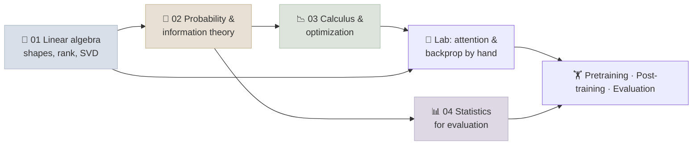

# 02 - Math for ML

The math that LLM engineering actually uses, taught through where it shows up: linear algebra for tensor shapes, attention, parameter counts and LoRA; probability and information theory for the next-token distribution, sampling, the training loss, perplexity and KL penalties; calculus and optimization for backpropagation, Adam and learning-rate schedules; and statistics for comparing models without fooling yourself. No proofs for their own sake - every idea is tied to a model, a training run or an eval.

```objectives
scope: module
time: 5-6 hours (notes + lab)
outcomes:
  - Track tensor shapes through a transformer layer and count its parameters and FLOPs
  - Explain the training loss as maximum likelihood, and convert between loss, perplexity and bits
  - Derive gradients with the chain rule, and explain how Adam, weight decay and learning-rate schedules shape training
  - Report an eval score with a confidence interval and compare two models with a paired test
  - Implement attention and its backward pass by hand and verify the gradients
prerequisites:
  - "High-school algebra and some Python - the notes introduce everything else"
  - "Optional, later in the course: [PyTorch Fundamentals](../06-PyTorch/INDEX.mdx) - the lab's autograd check uses it"
```

## Where This Module Fits



## Chapter Map

| # | Chapter | You will learn | Time |
|---|---|---|---|
| 1 | [Linear Algebra for Transformers](Notes/01-Linear-Algebra-for-Transformers.mdx) | Dot products and cosine similarity, shapes through a layer, parameter and FLOP counts, rank and LoRA, SVD, norms | 50 min |
| 2 | [Probability & Information Theory](Notes/02-Probability-and-Information-Theory.mdx) | The LM as a product of conditionals, softmax and temperature, maximum likelihood, perplexity, entropy, KL, Bayes and base rates | 50 min |
| 3 | [Calculus & Optimization](Notes/03-Calculus-and-Optimization.mdx) | Chain rule and backprop, key gradients, learning-rate stability, momentum, Adam/AdamW, schedules, exploding and vanishing gradients | 55 min |
| 4 | [Statistics for Evaluation](Notes/04-Statistics-for-Evaluation.mdx) | Standard errors and Wilson intervals, bootstrap, paired tests and McNemar, clustering, multiple comparisons, sample size, pass@k, kappa | 50 min |
| 5 | [Q&A Review Bank](Notes/05-Interview-QA-Bank.mdx) | 16 questions across the module | 30 min |

## Code Lab

- [Attention & Backprop by Hand](CodeLabs/01-Attention-and-Backprop-by-Hand.mdx) - one attention head in NumPy, gradients derived by hand and verified against finite differences and PyTorch autograd, plus experiments on √d scaling and temperature. Runs on any laptop in seconds.

## How Much Math Do You Need?

For building applications - prompting, RAG, agents - notes 2 and 4 are the most useful: sampling, loss and perplexity, and reading eval results honestly. For training, fine-tuning and serving work, all four notes are the working vocabulary of the papers and code in the Large Language Models and Production & Operations tracks. Nothing here requires calculus beyond the chain rule or linear algebra beyond matrix multiplication and SVD.

## Resources

- [Q&A Review Bank](Notes/05-Interview-QA-Bank.mdx) and [module quiz](/quiz/math-for-ml)
- Deisenroth, Faisal and Ong, [Mathematics for Machine Learning](https://mml-book.github.io/) - free book covering all four notes in more depth
- [Readiness Self-Assessment](../22-Review/01-Readiness-Self-Assessment.mdx) - this module covers the "linear algebra, probability, optimization" domain

## Key Cross-References

- Attention, shapes and FLOPs in context → [Attention Mechanisms](../03-Foundation-Models/Notes/04-Attention-Mechanisms.mdx), [GPT From Scratch](../06-PyTorch/CodeLabs/02-GPT-From-Scratch.mdx)
- Optimizers and schedules at scale → [Training Stability & Optimizers](../07-Pretraining/Notes/06-Training-Stability-and-Optimizers.mdx)
- KL penalties and preference losses → [Preference Optimization](../08-Post-Training/Notes/02-Preference-Optimization.mdx)
- Statistics applied to real evals → [Building Your Own Evals](../04-Evaluation/Notes/04-Building-Your-Own-Evals.mdx)

## Summary & Key Terms

[Summary & Key Terms](APPENDIX.mdx) - a quick recap of this module and its essential vocabulary.

---

## Next Topic

Previous: [01 - Python & Systems](../01-Python-and-Systems/INDEX.mdx) · Next: [03 - Foundation Models](../03-Foundation-Models/INDEX.mdx)
