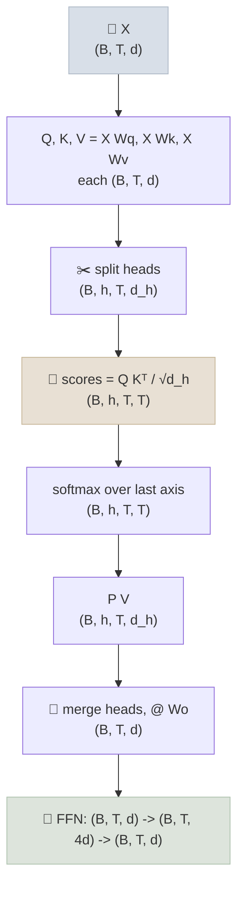

# Linear Algebra for Transformers

A transformer is mostly matrix multiplication: embeddings are vectors, every layer applies matrices to them, and attention is a matrix of dot products. This note covers the linear algebra you need to read and reason about LLM code and papers - vectors and similarity, matrix shapes through a transformer layer, counting parameters and FLOPs, rank and low-rank factorization (the idea behind LoRA), SVD, and norms.

```objectives
time: 50 min
outcomes:
  - Track tensor shapes through embedding, attention and feed-forward layers, including the multi-head reshape
  - Count a transformer's parameters and estimate the FLOPs of a matrix multiply and of training
  - Explain rank and low-rank factorization, and compute how many parameters LoRA trains for a given rank
  - Describe what SVD gives you and why the truncated SVD is the best low-rank approximation
  - Use dot products, cosine similarity and norms correctly in retrieval, normalization and gradient clipping
prerequisites:
  - "Python and NumPy basics; PyTorch tensors are covered later in the course in [Tensors & Autograd](../../06-PyTorch/Notes/01-Tensors-and-Autograd.mdx)"
```

## Vectors, Dot Products and Similarity

<div class="audience-biz" markdown="1">

A model represents every token, sentence or document as a list of numbers - a vector - in a space where meaning becomes geometry: things with similar meaning point in similar directions. "How similar are these two texts?" becomes "what is the angle between these two vectors?", which is what search and retrieval systems compute millions of times a second.

</div>

<div class="audience-tech" markdown="1">

A vector `x ∈ ℝ^d` is a point or direction in d-dimensional space. Token embeddings in current LLMs have d in the thousands. The **dot product** `x · y = Σ xᵢ yᵢ = ‖x‖ ‖y‖ cos θ` measures how aligned two vectors are, scaled by their lengths. **Cosine similarity** divides out the lengths: `cos θ = x · y / (‖x‖ ‖y‖)`, in [-1, 1].

</div>

Where this shows up:

- **Attention scores** are dot products between a query and every key ([Attention Mechanisms](../../03-Foundation-Models/Notes/04-Attention-Mechanisms.mdx)).
- **Retrieval** ranks documents by cosine similarity (or dot product) between embeddings ([Embeddings & Vector Search](../../13-RAG/Notes/02-Embeddings-and-Vector-Search.mdx)). If embeddings are normalized to length 1, dot product and cosine similarity are the same, and many vector databases rely on that.
- **The output layer** computes a dot product between the final hidden state and every token's output embedding; the largest dot products become the most likely next tokens.

---

## Matrices and Shapes

A matrix `W` of shape `(m, n)` is a linear map from ℝⁿ to ℝᵐ - or, with the row-vector convention most ML code uses, `y = x W` maps a length-m row vector to length n. The one rule to internalize:

```
(a, b) @ (b, c) -> (a, c)        inner dimensions must match; they disappear
```

Batched tensors follow the same rule on their last two dimensions; leading dimensions (batch, heads) are carried along.

**Shapes through one transformer layer** (B = batch, T = sequence length, d = model width, h = heads, d_h = d / h):



The `(T, T)` score matrix is why attention memory and compute grow with the square of sequence length - and why FlashAttention's trick of never materializing it matters.

---

## Counting Parameters and FLOPs

**Parameters per layer.** Attention has four `d x d` matrices (Q, K, V, output): `4d²`. A classic FFN expands to `4d` and back: `2 x d x 4d = 8d²`. So a layer has about **12d²** parameters, ignoring biases and norms.

**Worked example - GPT-2 small** (d = 768, 12 layers, vocabulary 50,257, context 1,024):

| Part | Formula | Parameters |
|---|---|---|
| Transformer layers | `12 x 12 x 768²` | 84.9M |
| Token embeddings (shared with output layer) | `50,257 x 768` | 38.6M |
| Position embeddings | `1,024 x 768` | 0.8M |
| **Total** (biases and norms add 0.1M) | | **≈ 124.4M** |

That matches GPT-2 small's published 124M. Modern models change the constants - gated FFNs (SwiGLU) use three matrices instead of two, and grouped-query attention shrinks K and V - but the habit of counting `d x d` blocks carries over.

**FLOPs.** Multiplying `(m, k) @ (k, n)` takes `m x n x k` multiply-adds, which is **`2mnk` FLOPs**. For a whole model, a forward pass costs about `2N` FLOPs per token (N = parameters), and the backward pass about twice that, so training costs **≈ 6ND** FLOPs for D training tokens - the estimate behind [Scaling Laws & Compute Budgets](../../07-Pretraining/Notes/04-Scaling-Laws-and-Compute-Budgets.mdx).

---

## Rank and Low-Rank Factorization

The **rank** of a matrix is the number of linearly independent directions it can produce - the dimension of its output space. A `d x d` matrix can have rank up to d. A matrix of rank r can be written as a product of two thin matrices:

```
W (d_out x d_in), rank r  =  B (d_out x r) @ A (r x d_in)
parameters: d_out x d_in   vs   r x (d_out + d_in)
```

This is the whole idea of **LoRA**: freeze the pretrained `W` and learn a low-rank update `ΔW = B A`. Research on the "intrinsic dimension" of fine-tuning found that adapting a pretrained model needs far fewer degrees of freedom than the model has, which is why a small r works.

**Worked example.** One `4096 x 4096` projection, LoRA rank 16:

- Full matrix: `4096² = 16,777,216` parameters
- LoRA: `16 x (4096 + 4096) = 131,072` parameters - **0.78%** of the matrix

That ratio, applied across every adapted matrix, is why a LoRA fine-tune fits on one GPU ([LoRA & QLoRA Hands-On](../../08-Post-Training/Notes/06-LoRA-and-QLoRA-Hands-On.mdx)).

---

## Singular Value Decomposition

Every matrix factors as **`W = U Σ Vᵀ`**: `U` and `V` have orthonormal columns (rotations), and `Σ` is diagonal with non-negative **singular values** `σ₁ ≥ σ₂ ≥ ...` (stretches). Read it as: rotate, stretch along each axis, rotate.

Three facts you will use:

- **The rank is the number of non-zero singular values.** Many small singular values mean the matrix is "nearly" low-rank.
- **Truncated SVD is the best low-rank approximation** (Eckart-Young, 1936): keeping the top r singular values gives the rank-r matrix closest to `W`. This underpins low-rank compression, and LoRA variants such as PiSSA that initialize the adapter from the top singular directions.
- **The largest singular value is the spectral norm** - the most the matrix can stretch any vector. Large spectral norms across layers are one way activations and gradients blow up.

---

## Norms

| Norm | Definition | Where it shows up |
|---|---|---|
| **L2 (Euclidean)** of a vector | `‖x‖ = √(Σ xᵢ²)` | Embedding normalization; gradient clipping uses the L2 norm of all gradients together |
| **L1** | `Σ |xᵢ|` | Sparsity penalties |
| **Frobenius** of a matrix | `√(Σ Wᵢⱼ²)` | Weight decay is a Frobenius penalty in disguise |
| **Spectral** | largest singular value | Stability analysis, spectral normalization |

**LayerNorm and RMSNorm** rescale each token's activation vector: LayerNorm subtracts the mean and divides by the standard deviation; RMSNorm (used by most current LLMs) only divides by the root-mean-square `√(mean(xᵢ²))`, which is cheaper and works as well in practice. Both keep activation magnitudes stable from layer to layer.

---

## Check Yourself

```quiz
- q: "Q has shape (B, h, T, d_h) and K has the same shape. What is the shape of Q @ K.transpose(-2, -1)?"
  options:
    - "(B, h, d_h, d_h)"
    - "(B, h, T, T)"
    - "(B, T, d_h)"
    - "(B, h, T, d_h)"
  answer: 2
  explain: "Transposing the last two axes of K gives (B, h, d_h, T). The inner d_h cancels: (T, d_h) @ (d_h, T) -> (T, T), with B and h carried along."
- q: "A model has d = 4096 and 32 layers with a classic 4x FFN. Roughly how many parameters are in its transformer layers?"
  options:
    - "About 0.5B"
    - "About 6.4B"
    - "About 12.9B"
    - "About 50B"
  answer: 2
  explain: "12 x d² per layer = 12 x 4096² ≈ 201M; x 32 layers ≈ 6.4B. Embeddings add more on top."
- q: "LoRA with rank 8 on a 2048 x 8192 matrix trains how many parameters?"
  options:
    - "16,384"
    - "65,536"
    - "81,920"
    - "16,777,216"
  answer: 3
  explain: "r x (d_out + d_in) = 8 x (2048 + 8192) = 81,920 - about 0.5% of the 16.8M-parameter matrix."
- q: "Why does the truncated SVD matter for model compression?"
  answer: "Keeping the top r singular values and vectors gives the closest possible rank-r approximation to the matrix (Eckart-Young). If most singular values are small, a low-rank factorization keeps most of the matrix's behaviour with far fewer parameters."
- q: "Your embeddings are normalized to unit length. Is ranking by dot product different from ranking by cosine similarity?"
  answer: "No. For unit vectors, x · y = ‖x‖‖y‖ cos θ = cos θ, so the two rankings are identical - which is why many vector databases use the cheaper inner product on normalized embeddings."
```

## Exercises

```exercise
- title: FLOPs for one forward pass
  task: |
    A 7B-parameter model processes a prompt of 2,000 tokens. Estimate the forward-pass FLOPs, and the time on a GPU that sustains 400 TFLOP/s on this workload.
  hints:
    - "Forward ≈ 2N FLOPs per token."
  solution: |
    `2 x 7 x 10⁹ x 2,000 = 2.8 x 10¹³` FLOPs. At `4 x 10¹⁴` FLOP/s: `0.07 s`. This ignores attention's T² term (small at 2K tokens for a 7B model) and assumes the GPU stays busy - true for prefill, which is compute-bound, but not for token-by-token decode, which is memory-bandwidth-bound ([KV Cache](../../16-Inference-and-Serving/Notes/01-KV-Cache-and-Inference-Optimization.mdx)).
- title: Shapes with grouped-query attention
  task: |
    A model has d = 4096, 32 query heads and 8 KV heads (grouped-query attention), head dimension 128. Give the shapes of Wq, Wk and Wv, and the parameter saving in K and V compared with full multi-head attention.
  solution: |
    Wq: `4096 x (32 x 128) = 4096 x 4096`. Wk and Wv: `4096 x (8 x 128) = 4096 x 1024` each. With full MHA, K and V would each be `4096 x 4096`; GQA cuts them to a quarter, saving `2 x 4096 x 3072 ≈ 25.2M` parameters per layer - and, more importantly, shrinking the KV cache 4x.
```

## Study Notes

**Must-know:**
- `(a, b) @ (b, c) -> (a, c)`; attention scores are `(B, h, T, T)` - quadratic in sequence length
- Parameters per classic layer ≈ 12d² (4d² attention + 8d² FFN); GPT-2 small ≈ 124M
- Matmul FLOPs = 2mnk; forward ≈ 2N per token; training ≈ 6ND
- Rank-r matrix = thin B @ A; LoRA trains r(d_in + d_out) parameters per adapted matrix
- SVD = rotate, stretch, rotate; truncated SVD is the best low-rank approximation; top singular value = spectral norm
- Cosine = dot product of unit vectors; RMSNorm divides by the root-mean-square

## References

- Deisenroth, Faisal and Ong, [Mathematics for Machine Learning](https://mml-book.github.io/) (Cambridge University Press, 2020) - chapters 2-4
- Strang, [Linear Algebra and Learning from Data](https://math.mit.edu/~gs/learningfromdata/) (2019)
- Vaswani et al., [Attention Is All You Need](https://arxiv.org/abs/1706.03762) (2017)
- Kaplan et al., [Scaling Laws for Neural Language Models](https://arxiv.org/abs/2001.08361) (2020) - the 6ND estimate
- Hu et al., [LoRA: Low-Rank Adaptation of Large Language Models](https://arxiv.org/abs/2106.09685) (2021); Aghajanyan et al., [Intrinsic Dimensionality Explains the Effectiveness of Language Model Fine-Tuning](https://arxiv.org/abs/2012.13255) (2020)
- Eckart and Young, [The Approximation of One Matrix by Another of Lower Rank](https://doi.org/10.1007/BF02288367) (Psychometrika, 1936); Meng et al., [PiSSA](https://arxiv.org/abs/2404.02948) (2024)
- Zhang and Sennrich, [Root Mean Square Layer Normalization](https://arxiv.org/abs/1910.07467) (2019)

*Last reviewed: 2026-10*
