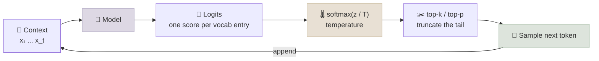

# Probability and Information Theory

A language model is a probability distribution over text, so the vocabulary of LLM work is the vocabulary of probability: distributions, conditional probability, likelihood, entropy, cross-entropy and KL divergence. This note covers those ideas through the places they appear - the next-token distribution, sampling with temperature and top-p, the training loss, perplexity, the KL penalties in post-training, and Bayes' rule when you read a classifier's or judge's accuracy.

```objectives
time: 50 min
outcomes:
  - Write a language model as a product of conditional next-token distributions, and explain how softmax, temperature and top-p shape sampling
  - Show that maximum-likelihood training is the same as minimizing cross-entropy, and convert a loss to perplexity and bits
  - Explain entropy, cross-entropy and KL divergence, and the difference between forward and reverse KL
  - Use Bayes' rule to turn a classifier's recall and false-positive rate into the precision you will see in production
prerequisites:
  - "[Linear Algebra for Transformers](01-Linear-Algebra-for-Transformers.mdx)"
  - "Optional, later in the course: [LLM Fundamentals](../../03-Foundation-Models/Notes/01-LLM-Fundamentals.mdx) - tokens and sampling parameters in context"
```

## A Language Model Is a Probability Distribution

The **chain rule of probability** lets you write the probability of any sequence as a product of conditionals:

```
p(x₁, x₂, ..., x_T) = p(x₁) · p(x₂ | x₁) · p(x₃ | x₁, x₂) · ... · p(x_T | x₁ ... x_{T-1})
```

An autoregressive LLM models exactly the right-hand side: at each position it outputs a **categorical distribution** over the vocabulary for the next token, given everything before it. Generation is sampling from that distribution, appending the token and repeating.



**Softmax** turns logits `z` into probabilities: `pᵢ = exp(zᵢ) / Σⱼ exp(zⱼ)`. Only differences between logits matter (adding a constant to all of them changes nothing), which is why implementations subtract the maximum before exponentiating - same answer, no overflow.

**Temperature** divides the logits before the softmax: `softmax(z / T)`. T < 1 sharpens the distribution toward the top token (T → 0 is greedy decoding); T > 1 flattens it. For logits `[2, 1, 0.5, 0, -1]`, the top token's probability is 0.98 at T = 0.25, 0.56 at T = 1 and 0.44 at T = 1.5 (the [lab](../CodeLabs/01-Attention-and-Backprop-by-Hand.mdx) prints these).

**Top-k and top-p (nucleus) sampling** cut off the long tail of unlikely tokens before sampling: top-k keeps the k most likely; top-p keeps the smallest set whose probabilities sum to at least p, then renormalizes. Holtzman et al. (2019) showed that sampling from the full tail produces incoherent text, while greedy decoding produces repetitive text - truncating the tail is the compromise.

---

## Likelihood and the Training Loss

Training picks parameters θ that make the training text as probable as possible - **maximum likelihood**. Because the sequence probability is a product, we maximize its logarithm instead, which turns the product into a sum and avoids numerical underflow:

```
maximize  Σₜ log p_θ(xₜ | x<ₜ)      ⟺      minimize  -(1/T) Σₜ log p_θ(xₜ | x<ₜ)
```

The right-hand side is the **negative log-likelihood**, and it is exactly the **cross-entropy** between the one-hot "true next token" and the model's distribution. This is the loss every pretraining and SFT run reports.

**Perplexity** is the exponential of the cross-entropy in nats: `PPL = exp(loss)`. A loss of 2.0 nats gives a perplexity of **7.39** - as uncertain, on average, as choosing uniformly among about 7 tokens. Dividing by ln 2 gives bits: 2.0 nats ≈ **2.89 bits per token**. Perplexity depends on the tokenizer, so compare models with different tokenizers in **bits per byte** (total bits divided by bytes of text) instead.

A sanity check worth knowing: an untrained model that guesses uniformly over a vocabulary of V tokens has loss `ln V` - about 10.8 for a 50K vocabulary. A training run whose first loss is far from that has an initialization bug.

---

## Entropy, Cross-Entropy and KL Divergence

| Quantity | Formula | Meaning |
|---|---|---|
| **Entropy** H(p) | `-Σ p(x) log p(x)` | Average surprise of outcomes drawn from p; how uncertain p is |
| **Cross-entropy** H(p, q) | `-Σ p(x) log q(x)` | Average surprise when outcomes come from p but you predicted with q |
| **KL divergence** KL(p ‖ q) | `Σ p(x) log (p(x) / q(x))` | The extra surprise from using q instead of p; ≥ 0, and 0 only when p = q |

They are tied together by **H(p, q) = H(p) + KL(p ‖ q)**. Since the entropy of the data is fixed, minimizing cross-entropy during training is the same as minimizing the KL divergence from the data distribution to the model.

**KL is not symmetric**, and which direction you use changes behaviour:

- **Forward KL(p ‖ q)** - penalizes q for putting low probability where p has mass, so q spreads out to *cover* every mode of p. Maximum-likelihood training and standard distillation from a teacher's soft probabilities behave this way.
- **Reverse KL(q ‖ p)** - penalizes q for putting mass where p has little, so q *concentrates* on a mode it can match well.

**Where KL appears in post-training:** RLHF adds a penalty `β · KL(π ‖ π_ref)` that keeps the policy close to the SFT reference model, so it can't drift into reward-hacking text; DPO derives its loss from the same KL-constrained objective ([Preference Optimization](../../08-Post-Training/Notes/02-Preference-Optimization.mdx)). A higher β keeps the model closer to the reference.

---

## Bayes' Rule and Base Rates

```
p(A | B) = p(B | A) · p(A) / p(B)
```

Bayes' rule matters most when you read the accuracy of a classifier - a guard model, an injection detector, an LLM judge - because the **base rate** of what you are detecting changes everything.

**Worked example.** A prompt-injection detector catches 95% of attacks (recall) and wrongly flags 5% of normal requests. In production, 1% of requests are attacks. Of the requests it flags, how many are real attacks?

- Flagged attacks: `0.01 x 0.95 = 0.0095`
- Flagged normal requests: `0.99 x 0.05 = 0.0495`
- Precision: `0.0095 / (0.0095 + 0.0495) ≈ 16%`

So **five out of six alerts are false alarms**, even though "95% accurate" sounded excellent. This is why detectors are evaluated on realistic traffic mixes, and why their output often goes to a review queue rather than an automatic block ([Safety Evaluation & Red-Teaming](../../04-Evaluation/Notes/05-Safety-Evaluation-and-Red-Teaming.mdx)).

---

## Expectation and Variance

The **expectation** `E[X] = Σ x p(x)` is the long-run average; the **variance** `Var[X] = E[(X - E[X])²]` measures spread. Two consequences you will meet:

- An eval score is an average of per-item scores, so it has a variance - and a confidence interval - that shrinks like `1/√n` ([Statistics for Evaluation](04-Statistics-for-Evaluation.mdx)).
- Gradients computed on a mini-batch are noisy estimates of the full gradient; bigger batches reduce the variance, which is one reason learning rate and batch size are tuned together ([Calculus & Optimization](03-Calculus-and-Optimization.mdx)).

---

## Check Yourself

```quiz
- q: "A model's validation loss is 1.5 nats per token. What is its perplexity?"
  options:
    - "1.5"
    - "About 2.2"
    - "About 4.5"
    - "About 31.6"
  answer: 3
  explain: "Perplexity = exp(loss) = exp(1.5) ≈ 4.48."
- q: "Lowering the sampling temperature from 1.0 to 0.3 does what to the next-token distribution?"
  options:
    - "Flattens it, so rare tokens are sampled more often"
    - "Sharpens it toward the most likely tokens"
    - "Leaves it unchanged; temperature only affects speed"
    - "Removes all but the top token"
  answer: 2
  explain: "softmax(z / T) with T < 1 magnifies differences between logits, concentrating probability on the top tokens. Only T → 0 is fully greedy."
- q: "Why is minimizing cross-entropy on training data the same as minimizing KL(data ‖ model)?"
  answer: "H(p, q) = H(p) + KL(p ‖ q). The entropy H(p) of the data distribution does not depend on the model, so the two objectives differ by a constant and have the same minimizer."
- q: "A judge model agrees with humans 90% of the time on 'bad answer' labels, and flags 10% of good answers as bad. If 5% of production answers are bad, what fraction of flagged answers are actually bad?"
  options:
    - "90%"
    - "About 68%"
    - "About 32%"
    - "5%"
  answer: 3
  explain: "Flagged bad: 0.05 x 0.9 = 0.045. Flagged good: 0.95 x 0.1 = 0.095. Precision = 0.045 / 0.14 ≈ 32%."
- q: "What does the KL penalty in RLHF do, and what happens if β is set too low?"
  answer: "It penalizes the policy for moving away from the reference (SFT) model, keeping outputs fluent and close to what the reference would say. With β too low the policy can drift far from the reference to exploit the reward model - reward hacking, degenerate or repetitive text."
```

## Exercises

```exercise
- title: Bits per byte across tokenizers
  task: |
    Model A (vocabulary 32K) reports a loss of 2.2 nats per token on a corpus; its tokenizer produces 0.30 tokens per byte. Model B (vocabulary 128K) reports 2.5 nats per token on the same corpus, at 0.24 tokens per byte. Which model predicts the text better?
  hints:
    - "Convert to bits per byte: (nats per token / ln 2) x tokens per byte."
  solution: |
    A: `2.2 / 0.693 x 0.30 ≈ 0.95` bits per byte. B: `2.5 / 0.693 x 0.24 ≈ 0.87` bits per byte. **B is better** even though its per-token loss is higher - its tokens carry more text each, so per-token loss isn't comparable across tokenizers.
- title: Entropy of a next-token distribution
  task: |
    Compute the entropy in bits of a next-token distribution [0.5, 0.25, 0.125, 0.125]. Then compute the cross-entropy if the model predicts [0.25, 0.25, 0.25, 0.25] instead, and the KL divergence.
  solution: |
    H(p) = `0.5x1 + 0.25x2 + 0.125x3 + 0.125x3 = 1.75` bits. H(p, q) with uniform q = `-Σ p log₂ 0.25 = 2` bits. KL(p ‖ q) = `2 - 1.75 = 0.25` bits - the cost of ignoring the structure in p.
```

## Study Notes

**Must-know:**
- LM = chain rule of probability: product of next-token conditionals; generation = repeated sampling
- softmax(z / T): temperature sharpens (T < 1) or flattens (T > 1); top-k/top-p truncate the tail
- Maximum likelihood = minimize negative log-likelihood = cross-entropy loss
- Perplexity = exp(loss in nats); bits = nats / ln 2; compare tokenizers with bits per byte; initial loss ≈ ln V
- H(p, q) = H(p) + KL(p ‖ q); KL ≥ 0 and asymmetric: forward covers modes, reverse seeks one
- RLHF and DPO keep the policy near a reference with a KL term weighted by β
- Bayes and base rates: a 95%-recall detector at 1% prevalence can have ~16% precision

## References

- Shannon, [A Mathematical Theory of Communication](https://doi.org/10.1002/j.1538-7305.1948.tb01338.x) (Bell System Technical Journal, 1948)
- Deisenroth, Faisal and Ong, [Mathematics for Machine Learning](https://mml-book.github.io/) (2020) - chapter 6
- Goodfellow, Bengio and Courville, [Deep Learning](https://www.deeplearningbook.org/) (MIT Press, 2016) - chapter 3
- Holtzman et al., [The Curious Case of Neural Text Degeneration](https://arxiv.org/abs/1904.09751) (2019) - nucleus sampling
- Hinton, Vinyals and Dean, [Distilling the Knowledge in a Neural Network](https://arxiv.org/abs/1503.02531) (2015)
- Ouyang et al., [Training Language Models to Follow Instructions with Human Feedback](https://arxiv.org/abs/2203.02155) (2022); Rafailov et al., [Direct Preference Optimization](https://arxiv.org/abs/2305.18290) (2023)

*Last reviewed: 2026-10*
