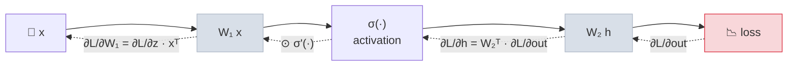
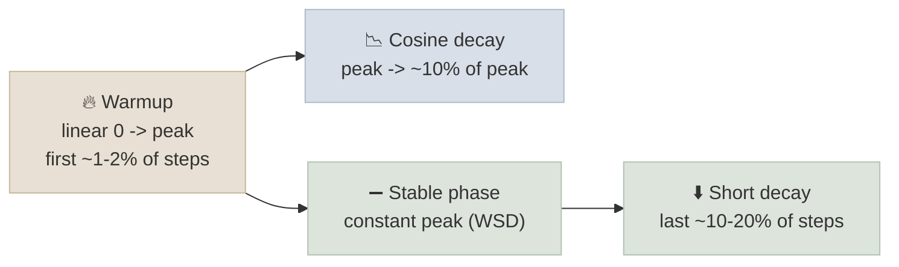

# Calculus and Optimization

Training a neural network means repeatedly computing how the loss changes with every parameter - the gradient - and nudging the parameters downhill. This note covers the calculus behind that (derivatives, gradients and the chain rule), how backpropagation applies the chain rule efficiently, the gradients worth knowing by heart, and the optimizers and learning-rate schedules that turn gradients into stable training: SGD with momentum, Adam and AdamW, warmup and decay, and gradient clipping.

```objectives
time: 55 min
outcomes:
  - Apply the chain rule to a computational graph and explain why reverse-mode autodiff (backpropagation) costs about twice a forward pass
  - Derive the gradient of softmax with cross-entropy and of a matrix multiply
  - Explain why too large a learning rate diverges, using a one-dimensional quadratic
  - Write the update rules for SGD with momentum and AdamW, and estimate the memory each needs
  - Choose a learning-rate schedule and diagnose exploding or vanishing gradients
prerequisites:
  - "[Linear Algebra for Transformers](01-Linear-Algebra-for-Transformers.mdx)"
  - "[Probability & Information Theory](02-Probability-and-Information-Theory.mdx) - the cross-entropy loss"
```

## Derivatives, Gradients and Jacobians

- The **derivative** `f'(x)` is the slope of f at x: how much f changes per unit change in x.
- For a function of many inputs, the **gradient** `∇f` collects the partial derivatives `∂f/∂xᵢ` into a vector that points in the direction of steepest increase. Training moves parameters in the direction of **minus** the gradient of the loss.
- For a function with many inputs and many outputs, the **Jacobian** is the matrix of all partial derivatives `∂yᵢ/∂xⱼ`. You rarely build it explicitly; backpropagation only ever needs Jacobian-vector products.

---

## The Chain Rule and Backpropagation

If `y = f(u)` and `u = g(x)`, then `dy/dx = dy/du · du/dx`. A neural network is a long composition of functions, so the gradient of the loss with respect to any parameter is a product of local derivatives along the path from that parameter to the loss.



**Backpropagation** is reverse-mode automatic differentiation. It runs the forward pass, storing intermediate values (activations), then walks the graph backwards from the loss, multiplying by one local derivative at a time. Each step reuses the gradient already computed for the step after it, so the gradient for **every** parameter costs only a small constant multiple of one forward pass. In practice the backward pass costs about **2x** the forward pass (one matrix multiply for the input gradient, one for the weight gradient), which is where the `6ND` training-FLOPs estimate comes from: 2 for forward, 4 for backward.

The stored activations are why training needs far more memory than inference, and why activation checkpointing - recomputing them during the backward pass instead of storing them - trades compute for memory ([GPU Memory & Hardware](../../07-Pretraining/Notes/02-GPU-and-Hardware.mdx)).

---

## Gradients Worth Knowing

**Softmax + cross-entropy.** With logits z, probabilities `p = softmax(z)` and a one-hot target y:

```
∂L/∂z = p - y
```

The gradient is just "predicted minus actual": push up the correct token's logit by `1 - p_correct` and push every other logit down by its probability. This clean form is why frameworks fuse softmax and cross-entropy into one operation (it is also more numerically stable).

**Matrix multiply.** For `Y = X W` with upstream gradient `dY`:

```
dW = Xᵀ dY        dX = dY Wᵀ
```

Check by shapes: `X` is `(B, n)`, `W` is `(n, m)`, `dY` is `(B, m)`; `Xᵀ dY` is `(n, m)` like W, and `dY Wᵀ` is `(B, n)` like X. Shape-matching is a reliable way to recover these formulas.

**Activations.** ReLU passes the gradient through where its input was positive and blocks it elsewhere. GELU and SiLU (used in modern FFNs) are smooth versions with small non-zero gradients for negative inputs.

The [lab](../CodeLabs/01-Attention-and-Backprop-by-Hand.mdx) derives every gradient of an attention head this way and checks them against finite differences and PyTorch autograd.

---

## Gradient Descent and the Learning Rate

Plain gradient descent updates `θ ← θ - η ∇L(θ)` with learning rate η.

**Why too large a learning rate diverges.** Take the simplest loss, `L(θ) = (λ/2) θ²`, with curvature λ. The gradient is `λθ`, so one step gives `θ ← (1 - ηλ) θ`. That shrinks toward the minimum only if `|1 - ηλ| < 1`, i.e. **`η < 2/λ`**. Above that, every step overshoots further and the loss explodes. A real network has many directions with different curvatures; the sharpest one (the largest eigenvalue of the Hessian) sets the largest stable learning rate. When those curvatures differ a lot, the problem is **ill-conditioned**: a learning rate small enough for the sharp directions crawls along the flat ones - the problem momentum and Adam are designed to ease.

**Stochastic gradients.** Each step uses a mini-batch, so the gradient is a noisy estimate. Larger batches reduce the noise, which is why batch size and learning rate are usually scaled together.

---

## Optimizers

| Optimizer | Update (per parameter) | State kept | Notes |
|---|---|---|---|
| **SGD** | `θ ← θ - η g` | none | Simple; sensitive to conditioning |
| **SGD + momentum** | `v ← μ v + g`; `θ ← θ - η v` | 1 vector | Averages gradients over steps; speeds progress along consistent directions |
| **Adam** | `m ← β₁m + (1-β₁)g`; `v ← β₂v + (1-β₂)g²`; `θ ← θ - η m̂ / (√v̂ + ε)` | 2 vectors | Per-parameter step size: divides by a running estimate of gradient magnitude; `m̂, v̂` are bias-corrected |
| **AdamW** | Adam, plus `θ ← θ - ηλθ` applied separately | 2 vectors | **Decoupled** weight decay; the default for training transformers |

Adam's per-parameter scaling makes it robust to the very different gradient scales of embeddings, attention and norm parameters - the main reason it dominates LLM training. Its cost is memory: in mixed-precision training each parameter needs BF16 weights and gradients (2 + 2 bytes) plus FP32 master weights and two FP32 Adam states (4 + 4 + 4), about **16 bytes per parameter** - 112 GB for a 7B model before activations, which is why optimizer-state sharding (ZeRO, FSDP) exists ([Distributed Training at Scale](../../07-Pretraining/Notes/05-Distributed-Training-at-Scale.mdx)).

Why "decoupled"? In Adam, an L2 penalty added to the loss gets divided by `√v̂` like any other gradient, so parameters with large gradients are barely regularized. AdamW applies weight decay directly to the weights, outside the adaptive scaling, which regularizes all parameters as intended and generalizes better.

---

## Learning-Rate Schedules



- **Warmup** starts with a small learning rate while Adam's second-moment estimates are still unreliable and the early updates are large; skipping it is a common cause of early loss spikes.
- **Cosine decay** lowers the learning rate smoothly to a fraction of the peak; lower final learning rates let the model settle into a better minimum.
- **Warmup-stable-decay (WSD)** keeps the peak constant and decays only at the end, so you can branch off a decayed checkpoint at any point - convenient when the total training length isn't fixed in advance (popularized for small models by MiniCPM, 2024).

Fine-tuning uses the same shapes with much lower peaks than pretraining ([Training Stability & Optimizers](../../07-Pretraining/Notes/06-Training-Stability-and-Optimizers.mdx)).

---

## Exploding and Vanishing Gradients

In a deep network, the gradient at an early layer is a product of many Jacobians. If their typical scale is above 1, gradients **explode**; below 1, they **vanish**. Transformers stay trainable at depth because of:

- **Residual connections** - `x + f(x)` has a Jacobian `I + ∂f/∂x`, so there is always an identity path for the gradient
- **Normalization** (LayerNorm / RMSNorm, usually before each sub-layer) - keeps activation scales stable
- **Careful initialization** - small initial weights on residual branches
- **Gradient clipping** - if the global L2 norm of all gradients exceeds a threshold (commonly 1.0), scale them all down; this caps the damage of a rare bad batch without changing the direction

A healthy run's gradient norm settles into a steady range; sudden spikes in gradient norm usually come just before loss spikes.

---

## Check Yourself

```quiz
- q: "For softmax followed by cross-entropy with a one-hot target y, what is the gradient with respect to the logits?"
  options:
    - "y - p"
    - "p - y"
    - "p (1 - p)"
    - "log p - y"
  answer: 2
  explain: "∂L/∂z = p - y: predicted probabilities minus the one-hot target. Gradient descent then moves the logits by -(p - y), raising the correct token."
- q: "On the loss L(θ) = 2θ², at what learning rate does gradient descent stop converging?"
  options:
    - "0.25"
    - "0.5"
    - "1.0"
    - "2.0"
  answer: 2
  explain: "L = (λ/2)θ² with λ = 4, so each step gives θ ← (1 - 4η)θ. Convergence needs |1 - 4η| < 1, i.e. η < 0.5. At exactly 0.5 it oscillates between ±θ forever; above it, it diverges. (At η = 0.25 it jumps to the minimum in one step.)"
- q: "Roughly how much memory do weights, gradients and AdamW state take for a 13B-parameter model trained in mixed precision?"
  options:
    - "26 GB"
    - "52 GB"
    - "208 GB"
    - "416 GB"
  answer: 3
  explain: "About 16 bytes per parameter: 13B x 16 = 208 GB, before activations. This is why optimizer state is sharded across GPUs."
- q: "Why does backpropagation cost only about twice the forward pass, no matter how many parameters there are?"
  answer: "Reverse-mode autodiff walks the graph once from the loss backwards, reusing each downstream gradient for every upstream node. Each layer does about two matrix multiplies (input gradient and weight gradient) versus one in the forward pass, so the total is a constant multiple of the forward cost rather than one pass per parameter."
- q: "What is the difference between Adam with L2 regularization and AdamW?"
  answer: "With L2 added to the loss, the decay term is divided by Adam's per-parameter √v̂ like the rest of the gradient, so parameters with large gradients get little regularization. AdamW applies the decay directly to the weights, separately from the adaptive update, so every parameter is decayed at the intended rate."
```

## Exercises

```exercise
- title: Derive the matmul gradient from shapes
  task: |
    A layer computes `Y = X W + b` with X of shape (32, 512), W of shape (512, 2048) and b of shape (2048,). Given the upstream gradient dY, write dW, db and dX and give their shapes.
  solution: |
    `dW = Xᵀ dY` → (512, 32) @ (32, 2048) = **(512, 2048)**. `db = dY.sum(axis=0)` → **(2048,)** - b was broadcast over the batch, so its gradient sums over the batch. `dX = dY Wᵀ` → (32, 2048) @ (2048, 512) = **(32, 512)**.
- title: Read the training curve
  task: |
    A pretraining run with peak learning rate 3e-4, no warmup, and AdamW shows the loss dropping for 200 steps, then a spike to near its initial value, then slow recovery. The gradient norm jumped from about 0.8 to 40 just before the spike. Give two likely causes and three fixes.
  solution: |
    Causes: the learning rate is too high for the sharpest directions early in training (no warmup, while Adam's second-moment estimates are still small and steps are large); possibly an outlier batch. Fixes: add linear warmup over the first 1-2% of steps; enable gradient clipping at a global norm of 1.0; lower the peak learning rate. Also check data for corrupted or extremely long documents near that step, and look at which layers' gradient norms spiked ([Training Stability & Optimizers](../../07-Pretraining/Notes/06-Training-Stability-and-Optimizers.mdx)).
```

## Study Notes

**Must-know:**
- Gradient = direction of steepest increase; train along minus the gradient
- Chain rule along the graph; backprop = reverse-mode autodiff; backward ≈ 2x forward → training ≈ 6ND
- Activations are stored for the backward pass - the reason training needs so much memory
- Softmax + CE gradient = p - y; matmul: dW = Xᵀ dY, dX = dY Wᵀ (check by shapes)
- Quadratic with curvature λ: GD stable only if η < 2/λ; the sharpest direction limits the learning rate
- Momentum averages gradients; Adam scales per parameter by √v̂; AdamW decouples weight decay; ~16 bytes/param in mixed precision
- Schedules: warmup, then cosine decay or warmup-stable-decay
- Residuals, normalization, initialization and gradient clipping keep deep networks trainable

## References

- Rumelhart, Hinton and Williams, [Learning Representations by Back-Propagating Errors](https://doi.org/10.1038/323533a0) (Nature, 1986)
- Baydin et al., [Automatic Differentiation in Machine Learning: a Survey](https://arxiv.org/abs/1502.05767) (2015)
- Goodfellow, Bengio and Courville, [Deep Learning](https://www.deeplearningbook.org/) (MIT Press, 2016) - chapters 4, 6 and 8
- Kingma and Ba, [Adam: A Method for Stochastic Optimization](https://arxiv.org/abs/1412.6980) (2014); Loshchilov and Hutter, [Decoupled Weight Decay Regularization](https://arxiv.org/abs/1711.05101) (2017)
- Hu et al., [MiniCPM: Unveiling the Potential of Small Language Models with Scalable Training Strategies](https://arxiv.org/abs/2404.06395) (2024) - warmup-stable-decay schedule
- Deisenroth, Faisal and Ong, [Mathematics for Machine Learning](https://mml-book.github.io/) (2020) - chapters 5 and 7

*Last reviewed: 2026-10*
