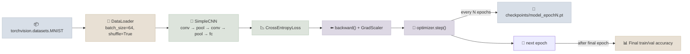

# Code Lab 01 - Raw PyTorch Classifier

A small CNN image classifier trained end-to-end in **raw PyTorch** - no `Trainer` class, no wrapper library. This lab exists to make every mechanic from the Notes files (Dataset/DataLoader, the hand-written training loop, checkpointing, mixed precision) concrete in one runnable script.

← **Back to Overview:** [PyTorch Fundamentals](../INDEX.mdx) · **Back to Concepts:** [Training Loop From Scratch](../Notes/03-Training-Loop-From-Scratch.mdx) · [Checkpointing & Mixed Precision](../Notes/04-Checkpointing-and-Mixed-Precision.mdx)

```objectives
time: 1-2 hours
outcomes:
  - Run a complete raw-PyTorch training job - DataLoader, CNN, hand-written loop, validation, checkpoints, mixed precision
  - Resume training from a checkpoint and confirm the run continues where it stopped
  - Measure the effect of batch size and mixed precision on speed and memory
prerequisites:
  - "[Training Loop From Scratch](../Notes/03-Training-Loop-From-Scratch.mdx) and [Checkpointing & Mixed Precision](../Notes/04-Checkpointing-and-Mixed-Precision.mdx)"
  - "Python 3.10+; a GPU is optional (AMP is disabled automatically on CPU)"
```

---

## What's In This Lab

| Property | Detail |
|---|---|
| Task | Image classification (MNIST digits, via `torchvision.datasets`) |
| Model | A small hand-written CNN (`SimpleCNN` in `model.py`) |
| Training | Hand-written loop - custom `Dataset` usage via `torchvision`, `DataLoader`, forward/backward/step |
| Checkpointing | Saves model + optimizer state every N epochs to `checkpoints/` |
| Mixed Precision | `torch.amp.autocast("cuda")` + `GradScaler` (auto-disabled gracefully on CPU-only machines) |
| Output | Final train/val accuracy printed at the end of the run |
| Complexity | Beginner-Intermediate |
| Files | `01-Raw-PyTorch-Classifier/{train.py, model.py, requirements.txt, README.mdx}` |

## Architecture



## Running

```bash
cd 02-Prog-Langs/PyTorch/CodeLabs/01-Raw-PyTorch-Classifier
pip install -r requirements.txt
python train.py
```

Full details, code walkthrough, and what each part demonstrates: see [README](https://github.com/sundante/sun-course-genai/tree/main/src/content/02-Prog-Langs/PyTorch/CodeLabs/01-Raw-PyTorch-Classifier).

## Check Yourself

```quiz
- q: "The run is interrupted after epoch 3 and restarted with the checkpoint. Which state must the checkpoint contain for training to continue identically?"
  options:
    - "Model and optimizer state_dicts, the epoch, and RNG states"
    - "Only the model weights"
    - "Only the optimizer state"
    - "The whole pickled model object"
  answer: 1
- q: "Why is GradScaler created with `enabled=use_amp` in train.py?"
  answer: "So the same script runs on CPU-only machines: when AMP is off, the scaler becomes a no-op and the loop code doesn't need a separate branch."
- q: "Validation accuracy is noisy between two evaluations of the same checkpoint. What is the first thing to check?"
  options: ["That model.eval() and torch.no_grad() wrap validation", "The learning rate", "The number of workers", "The checkpoint interval"]
  answer: 1
```

## Exercises

```exercise
- title: Break it on purpose
  task: |
    Introduce each bug separately and record what happens: (1) remove `optimizer.zero_grad()`; (2) remove `model.eval()` from validation; (3) move only the inputs, not the labels, to the GPU; (4) divide accuracy by `len(loader)`. Which fail loudly and which silently?
  solution: |
    (3) fails loudly with a device-mismatch error. (1) trains erratically - accumulated gradients make effective steps grow - but runs. (2) and (4) are silent: (2) gives noisier, slightly lower validation accuracy (dropout on), (4) reports accuracy inflated by about the batch size. Silent bugs are why the notes stress checks and asserts.
- title: Speed and memory table
  task: |
    Run 2 epochs with batch sizes 32, 128 and 512, with and without AMP, recording epoch time and peak GPU memory. Explain the pattern.
  solution: |
    Larger batches improve throughput until the GPU is saturated or the data loader becomes the bottleneck; memory grows roughly linearly with batch size (activations). AMP lowers memory and speeds up convolutions on tensor-core GPUs; on a model this small the gain is modest because the GPU is underused - the lesson is to profile before optimising.
```

## References

- PyTorch tutorials, [Learn the Basics](https://docs.pytorch.org/tutorials/beginner/basics/intro.html) (2026)
- PyTorch documentation, [Automatic Mixed Precision](https://docs.pytorch.org/docs/stable/amp.html) (2026)
- LeCun et al., [Gradient-Based Learning Applied to Document Recognition](http://yann.lecun.com/exdb/publis/pdf/lecun-98.pdf) (1998) - the MNIST paper

*Last reviewed: 2026-09*
