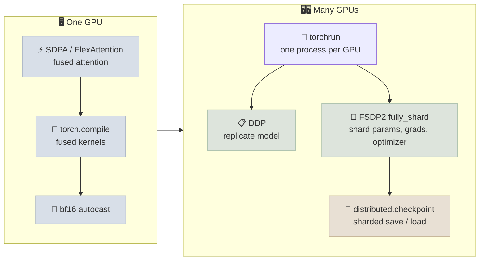

# PyTorch for LLMs

The first five notes cover PyTorch mechanics that apply to any model. Training and serving language models adds a specific toolkit: fused attention kernels, compilation, bf16, and - once a model outgrows one GPU - distributed data parallelism, parameter sharding and distributed checkpoints. This note maps that toolkit to the current PyTorch APIs.

```objectives
time: 60 min
outcomes:
  - Use scaled_dot_product_attention and FlexAttention instead of hand-written attention, and explain why they are faster
  - Decide when torch.compile helps, and recognize graph breaks and recompilation
  - Choose bf16, fp16 or fp32 for training and explain why bf16 needs no GradScaler
  - Launch multi-GPU training with torchrun and choose between DDP and FSDP2 (fully_shard)
  - Save and load large-model checkpoints safely - safetensors, torch.load weights_only, and torch.distributed.checkpoint
prerequisites:
  - "[Checkpointing & Mixed Precision](04-Checkpointing-and-Mixed-Precision.mdx)"
  - "[Debugging & GPU Memory](05-Debugging-and-GPU-Memory.mdx)"
```

## The LLM Toolkit at a Glance



---

## Fused Attention: SDPA and FlexAttention

### Concept

A naive attention implementation materializes the full `T × T` score matrix in GPU memory, then reads it back for softmax and again for the value product. `torch.nn.functional.scaled_dot_product_attention` (SDPA) dispatches to fused kernels - FlashAttention, memory-efficient attention, or cuDNN - that compute attention in tiles and never store the full matrix.

```python
import torch.nn.functional as F

# q: (B, n_head, T, d_head); k, v: (B, n_kv_head, T, d_head)
y = F.scaled_dot_product_attention(q, k, v, is_causal=True, enable_gqa=True)
```

- `is_causal=True` applies the causal mask inside the kernel - don't build a mask tensor.
- `enable_gqa=True` handles grouped-query attention without repeating K/V in memory.
- To force or debug a backend, use `torch.nn.attention.sdpa_kernel(SDPBackend.FLASH_ATTENTION)` (the older `torch.backends.cuda.sdp_kernel` is deprecated).

**FlexAttention** (`torch.nn.attention.flex_attention`) covers the attention variants SDPA doesn't: sliding windows, document masking for packed sequences, prefix-LM masks, soft-capping. You write the mask or score modification as a small Python function; `torch.compile` turns it into a fused kernel.

```python
from torch.nn.attention.flex_attention import flex_attention, create_block_mask

def sliding_window_causal(b, h, q_idx, kv_idx):
    return (q_idx >= kv_idx) & (q_idx - kv_idx <= 1024)

block_mask = create_block_mask(sliding_window_causal, B=None, H=None, Q_LEN=T, KV_LEN=T)
flex = torch.compile(flex_attention)   # uncompiled flex_attention is a slow reference path
y = flex(q, k, v, block_mask=block_mask)
```

---

## torch.compile

### Concept

`torch.compile(model)` traces the model's Python into a graph and generates fused kernels (via TorchInductor/Triton on GPUs). For transformer training it typically removes a large share of the small elementwise kernels around the matmuls - normalization, activation, residual adds - and speeds up training noticeably; the gain depends on the model and GPU, so measure it.

What to watch:

- **Compile time.** The first iterations are slow while kernels compile; this is amortized over a long run.
- **Graph breaks.** Python the compiler can't trace (data-dependent control flow, `.item()` in the forward pass, some third-party calls) splits the graph and loses fusion. `TORCH_LOGS="graph_breaks"` lists them.
- **Recompilation.** Changing input shapes can trigger recompiles. Keep sequence lengths fixed (or bucketed) during training, or mark dynamic dimensions.

---

## Precision: bf16 by Default

| Format | Exponent / mantissa bits | Range | Needs loss scaling? | Use for |
|--------|--------------------------|-------|---------------------|---------|
| fp32 | 8 / 23 | Wide | No | Master weights, optimizer state, reductions |
| fp16 | 5 / 10 | Narrow (max ~65,504) | Yes (`GradScaler`) | Older GPUs without bf16 |
| bf16 | 8 / 7 | Same as fp32 | No | Default for LLM training on A100/H100-class GPUs |
| fp8 (E4M3 / E5M2) | 4/3 or 5/2 | Narrow | Per-tensor or per-block scaling | Large-scale training and inference on H100+ (see [Pretraining at Scale](../../../03-Pretraining/INDEX.mdx)) |

```python
with torch.autocast(device_type="cuda", dtype=torch.bfloat16):
    logits, loss = model(x, y)
loss.backward()          # no GradScaler: bf16 has fp32's exponent range, so gradients don't underflow
optimizer.step()
```

Autocast keeps precision-sensitive operations (softmax, norms, losses) in fp32. Compute the cross-entropy on fp32 logits - the [GPT lab](../CodeLabs/02-GPT-From-Scratch.mdx) calls `logits.float()` before the loss for this reason.

---

## Multi-GPU: torchrun, DDP and FSDP2

### torchrun

`torchrun --nproc_per_node=8 train.py` starts one process per GPU and sets `RANK`, `LOCAL_RANK` and `WORLD_SIZE`. Each process calls `torch.distributed.init_process_group("nccl")` and pins itself to `LOCAL_RANK`. Multi-node runs add `--nnodes` and a rendezvous endpoint.

### DDP - replicate the model

`DistributedDataParallel` keeps a full copy of the model, gradients and optimizer state on every GPU and all-reduces gradients during `backward()`. It is the simplest option and the fastest when the whole training state fits on one GPU.

### FSDP2 - shard everything

When it doesn't fit (mixed-precision Adam needs ~16 bytes per parameter - see [GPU & Hardware](../../../03-Pretraining/Notes/02-GPU-and-Hardware.mdx)), **fully sharded data parallelism** splits parameters, gradients and optimizer state across GPUs and gathers each layer's full weights only while that layer runs. PyTorch's current API is `fully_shard` (FSDP2), which represents each parameter as a sharded `DTensor`:

```python
from torch.distributed.fsdp import fully_shard, MixedPrecisionPolicy

mp = MixedPrecisionPolicy(param_dtype=torch.bfloat16, reduce_dtype=torch.float32)
for block in model.blocks:          # shard each transformer block as its own unit...
    fully_shard(block, mp_policy=mp)
fully_shard(model, mp_policy=mp)    # ...then the root (embeddings, head)

optimizer = torch.optim.AdamW(model.parameters(), lr=3e-4)  # created after sharding
```

| | DDP | FSDP2 (`fully_shard`) |
|---|-----|------------------------|
| Memory per GPU | Full model + grads + optimizer | ~1/N of each, plus one layer's full weights at a time |
| Communication | All-reduce gradients | All-gather params (forward/backward) + reduce-scatter grads |
| When | Model state fits on one GPU | It doesn't, or you want larger batches |
| Composes with | - | Tensor / context parallelism via `DeviceMesh` (see [Pretraining at Scale](../../../03-Pretraining/INDEX.mdx)) |

---

## Checkpoints for Large Models

| Tool | What it does | Use when |
|------|--------------|----------|
| `safetensors` | Stores raw tensors plus a JSON header; loading can't execute code; memory-mapped | Publishing and loading model weights (the Hugging Face default) |
| `torch.load(..., weights_only=True)` | Restricts unpickling to tensors and simple types. It is the default since PyTorch 2.6 | Loading any `.pt` file you didn't create |
| `torch.distributed.checkpoint` (DCP) | Each rank saves its own shards in parallel; loading can reshard to a different GPU count; `async_save` overlaps saving with training | Training checkpoints for FSDP / multi-GPU runs |

```python
import torch.distributed.checkpoint as dcp
from torch.distributed.checkpoint.state_dict import get_state_dict, set_state_dict

model_sd, optim_sd = get_state_dict(model, optimizer)
dcp.save({"model": model_sd, "optim": optim_sd}, checkpoint_id=f"ckpt/step_{step}")
```

**Why not pickle?** A `.pt` file saved with `torch.save` is a pickle; unpickling can run arbitrary code. Downloading someone's checkpoint and calling `torch.load` with `weights_only=False` is equivalent to running their script.

---

## Profiling

`torch.profiler` records CPU and CUDA activity per operator; export a trace and open it in Perfetto to see whether the GPU is waiting on the data loader, on communication, or on small kernels.

```python
from torch.profiler import profile, ProfilerActivity, schedule

with profile(activities=[ProfilerActivity.CPU, ProfilerActivity.CUDA],
             schedule=schedule(wait=1, warmup=1, active=3)) as prof:
    for step in range(5):
        train_step()
        prof.step()
prof.export_chrome_trace("trace.json")
```

For end-to-end efficiency, compute **model FLOPs utilization (MFU)**: achieved training FLOPs per second (≈ 6 × parameters × tokens per second for a dense transformer) divided by the GPU's peak. Well-tuned large runs report roughly 35-50% MFU on H100s; far lower usually means a data, communication or small-kernel bottleneck.

---

## Check Yourself

```quiz
- q: "Why does bf16 training not need a GradScaler while fp16 does?"
  options:
    - "bf16 has fp32's 8-bit exponent, so small gradients don't underflow to zero"
    - "bf16 has more mantissa bits than fp16"
    - "GradScaler only works on NVIDIA GPUs"
    - "bf16 gradients are always computed in fp32"
  answer: 1
  explain: "fp16's 5-bit exponent can't represent very small values, so gradients are scaled up before backward and unscaled before the step. bf16 trades mantissa precision for fp32's range, which removes the underflow problem."
- q: "A 13B model's full training state doesn't fit on one 80 GB GPU. What does FSDP2 change compared with DDP?"
  options:
    - "Each GPU holds a shard of parameters, gradients and optimizer state, gathering a layer's full weights only while it runs"
    - "Each GPU holds a different subset of layers, and activations flow between GPUs"
    - "It keeps the model on CPU and streams it to the GPU"
    - "It compresses gradients to 8 bits before all-reduce"
  answer: 1
  explain: "Option 2 describes pipeline parallelism, not FSDP."
- q: "You downloaded `model.pt` from an unfamiliar repository. What is the risk in `torch.load('model.pt', weights_only=False)`, and what should you do instead?"
  answer: "The file is a pickle, and unpickling can execute arbitrary code - loading it is like running an untrusted script. Use weights_only=True (the default since PyTorch 2.6), or better, prefer a safetensors version of the weights."
```

## Exercises

```exercise
- title: Measure torch.compile
  task: |
    Using the [GPT From Scratch lab](../CodeLabs/02-GPT-From-Scratch.mdx) on a GPU, time 200 steps with and without `--compile` (discard the first 20 steps of each). Report tokens/second and the compile time. Then add a `.item()` call inside `GPT.forward` and use `TORCH_LOGS="graph_breaks"` to see what it does.
- title: Plan a sharded run
  task: |
    You will fine-tune an 8B dense model with full fine-tuning (not LoRA) on 8× 80 GB GPUs with mixed-precision AdamW. Estimate the model-state memory per GPU under DDP and under FSDP2, and say which is feasible.
  solution: |
    Model state ≈ 16 bytes × 8B = 128 GB. DDP puts all of it on every GPU - 128 GB > 80 GB, so it does not fit. FSDP2 shards it: ~128 / 8 = 16 GB per GPU plus one layer's gathered weights and activations, which fits comfortably.
```

## References

- PyTorch docs: [scaled_dot_product_attention](https://pytorch.org/docs/stable/generated/torch.nn.functional.scaled_dot_product_attention.html), [FlexAttention](https://pytorch.org/blog/flexattention/), [torch.compile](https://pytorch.org/docs/stable/torch.compiler.html), [FSDP2 `fully_shard`](https://pytorch.org/docs/stable/distributed.fsdp.fully_shard.html), [Distributed Checkpoint](https://pytorch.org/docs/stable/distributed.checkpoint.html)
- Zhao et al., [PyTorch FSDP: Experiences on Scaling Fully Sharded Data Parallel](https://arxiv.org/abs/2304.11277) (2023)
- Dao et al., [FlashAttention](https://arxiv.org/abs/2205.14135) (2022); Dao, [FlashAttention-2](https://arxiv.org/abs/2307.08691) (2023)
- Liang et al., [TorchTitan](https://arxiv.org/abs/2410.06511) (2024) - a reference implementation of FSDP2 + tensor/pipeline/context parallelism
- Hugging Face, [safetensors](https://huggingface.co/docs/safetensors)

*Last reviewed: 2026-09*
