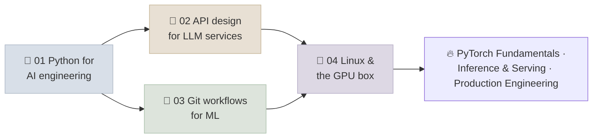

# 02 - Python & Systems

The engineering toolkit underneath every GenAI system: Python projects that install the same way everywhere, typed and tested code, concurrent model calls that respect rate limits, HTTP APIs that stream and fail gracefully, Git workflows that make results reproducible, and the Linux and GPU skills to run and debug a model server yourself. PyTorch Fundamentals, the other half of this module, builds on it.

```objectives
scope: module
time: 4-5 hours
outcomes:
  - Set up a reproducible Python project and write typed, tested, concurrent code for model calls
  - Design an LLM API with streaming, problem-detail errors, idempotency, rate limits and versioning
  - Run a Git workflow with pre-commit checks, large-file handling, eval gates and reproducible runs
  - Operate a Linux GPU machine - SSH, processes and signals, systemd services, nvidia-smi, drivers and CUDA versions, logs
prerequisites:
  - "Basic Python and a terminal"
```

## Where This Fits



## Chapter Map

| # | Chapter | You will learn | Time |
|---|---|---|---|
| 1 | [Python for AI Engineering](Notes/01-Python-for-AI-Engineering.mdx) | uv, pyproject and lockfiles; Pydantic at the boundaries; asyncio fan-out with semaphores, timeouts and jittered retries; testing with fakes vs evals; profiling | 50 min |
| 2 | [API Design for LLM Services](Notes/02-API-Design-for-LLM-Services.mdx) | JSON vs SSE vs WebSocket vs async jobs; streaming pitfalls and cancellation; RFC 9457 errors; idempotency keys; rate limits and backpressure; deadlines; versioning | 50 min |
| 3 | [Git Workflows for ML](Notes/03-Git-Workflows-for-ML.mdx) | What goes in Git, LFS, DVC or a registry; trunk-based PRs with eval gates; pre-commit hooks; reproducible runs; git bisect; leaked secrets | 40 min |
| 4 | [Linux & the GPU Box](Notes/04-Linux-and-the-GPU-Box.mdx) | SSH config and port forwarding, tmux, signals and preemption, systemd services, nvidia-smi, driver vs CUDA versions, disks, OOM and Xid errors | 45 min |
| 5 | [Q&A Review Bank](Notes/05-Interview-QA-Bank.mdx) | 16 questions across the section | 30 min |

The Python and API samples in notes 1 and 2 were run (Python 3.12, FastAPI 0.142, Pydantic 2.13, pytest); the pre-commit config and bisect script in note 3 were validated with `pre-commit validate-config` and `bash -n`. The Linux snippets in note 4 (signal handler, systemd unit) are standard patterns that were not run here.

## Resources

- [Q&A Review Bank](Notes/05-Interview-QA-Bank.mdx) and the [module quiz](/quiz/prog-langs)
- [Readiness Self-Assessment](../../Interview-Questions/01-Readiness-Self-Assessment.mdx) - this section covers the "Python, APIs, Docker, Git, Linux" domain together with [Docker for GPU Inference](../../09-Production-Engineering/Notes/01-Docker-for-GPU-Inference.mdx)
- [FastAPI + vLLM Endpoint lab](../../08-Serving-and-Inference/CodeLabs/01-FastAPI-vLLM-Endpoint.mdx) - the API patterns here applied to a real model server

## Section Appendix

[Summary & Key Terms](APPENDIX.mdx) - a quick recap of this section and its essential vocabulary.

---

## Next Topic

Previous: [01 - LLM Foundations](../../01-LLM-Foundations/INDEX.mdx) · Next: [02 - PyTorch Fundamentals](../PyTorch/INDEX.mdx)
