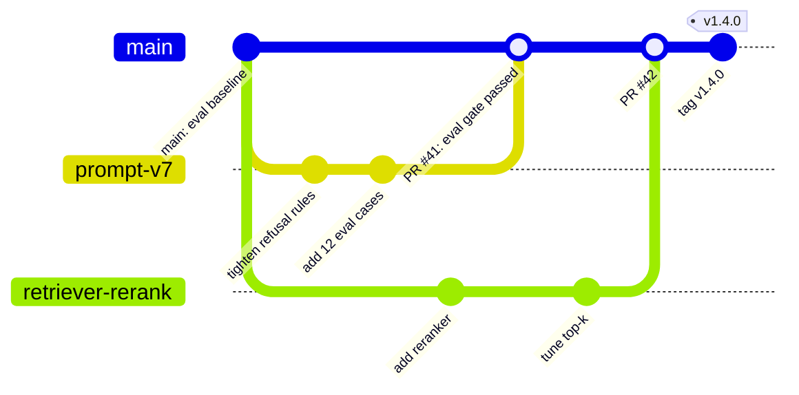

# Git Workflows for ML

Git is how a team keeps code, configuration and prompts consistent, reviewed and recoverable. ML and LLM projects add problems ordinary software doesn't have: large files that don't belong in Git, notebooks that produce noisy diffs, results that are only meaningful if you can say exactly which code, data and settings produced them, and prompts that change behaviour as much as code does. This note covers a working Git setup for that: what to version where, branching and reviews, pre-commit checks, large files with LFS, DVC and the Hugging Face Hub, reproducible runs, and recovering from leaked secrets.

```objectives
time: 40 min
outcomes:
  - Decide what belongs in Git, Git LFS, DVC or a model registry, and set up .gitignore accordingly
  - Run a trunk-based workflow with short-lived branches, pull requests and CI checks, including eval gates for prompt changes
  - Configure pre-commit hooks for formatting, notebooks, large files and secrets
  - Tie every experiment to a commit, data version, config and environment so it can be reproduced
  - Respond correctly to a secret committed to a repository, and use git bisect to find a regression
prerequisites:
  - "Basic Git: clone, add, commit, push, branch"
```

## What Goes Where

| Artifact | Where | Why |
|---|---|---|
| Code, configs, prompts, small eval sets, lockfiles, Dockerfiles, IaC | **Git** | Small, text, needs review and diffs |
| Notebooks | **Git, outputs stripped** | Outputs bloat diffs and can leak data |
| Medium binary files (images, small models) in a code repo | **Git LFS** | Keeps pointers in Git, contents in LFS storage |
| Datasets and pipeline outputs | **DVC** (or a data lake with versioned snapshots) | Versions large data in object storage, tied to Git commits |
| Model weights and checkpoints | **Model registry** or the Hugging Face Hub | Large, with lifecycle stages and access control ([Model Lifecycle & Rollout](../../../09-Production-Engineering/Notes/03-Model-Lifecycle-and-Rollout.mdx)) |
| Secrets (API keys, tokens) | **Secret manager** - never Git | Git history is permanent and copied to every clone |

A starting `.gitignore` for an LLM project excludes `.venv/`, `__pycache__/`, `.env`, `data/` (tracked by DVC instead), `checkpoints/`, `wandb/` and `mlruns/`, and large model files such as `*.safetensors` and `*.gguf`.

---

## Branches, Pull Requests and CI



**Trunk-based development** works well for ML teams: short-lived branches (hours to a few days) merged into `main` through pull requests, with `main` always deployable. Long-lived experiment branches drift and become unmergeable; run experiments through configuration and flags on `main` instead.

**Pull request checks** for an LLM application:

- Lint, format, type check and unit tests on every PR ([Python for AI Engineering](01-Python-for-AI-Engineering.mdx))
- A **fast eval subset** whenever prompts, model versions, retrieval settings or tool definitions change - prompts are code, and a prompt edit needs the same review and gate as a code edit ([Prompts in Production](../../../11-Prompt-Engineering/Notes/08-Prompts-in-Production.mdx))
- Infrastructure plans posted to the PR for IaC changes ([Infrastructure as Code](../../../09-Production-Engineering/Notes/08-Infrastructure-as-Code.mdx))

**Commits:** small, one logical change each, with messages that say why. Squash-merging PRs keeps `main`'s history readable, and tags mark releases.

---

## Pre-commit Hooks

The `pre-commit` framework runs checks on staged files before each commit, and the same config runs in CI:

```yaml
# .pre-commit-config.yaml
repos:
  - repo: https://github.com/astral-sh/ruff-pre-commit
    rev: v0.16.10
    hooks:
      - id: ruff-check
        args: [--fix]
      - id: ruff-format
  - repo: https://github.com/pre-commit/pre-commit-hooks
    rev: v6.0.0
    hooks:
      - id: check-added-large-files    # blocks accidental multi-MB commits
        args: [--maxkb=1000]
      - id: detect-private-key
      - id: check-merge-conflict
      - id: check-yaml
  - repo: https://github.com/kynan/nbstripout
    rev: 0.9.1
    hooks:
      - id: nbstripout                 # strip notebook outputs and execution counts
  - repo: https://github.com/gitleaks/gitleaks
    rev: v8.30.1
    hooks:
      - id: gitleaks                   # scan staged changes for API keys and tokens
```

Install once per clone with `pre-commit install`; run on everything with `pre-commit run --all-files`. Pin `rev` values (the ones above were current in October 2026) and update them deliberately with `pre-commit autoupdate`.

---

## Large Files: LFS, DVC and the Hub

- **Git LFS** replaces large files in Git with small pointer files and stores the contents on an LFS server. Simple, but every clone that needs the files downloads them, and LFS storage on hosted Git is metered.
- **DVC** tracks datasets and pipeline outputs: the data lives in object storage (S3, GCS, Azure Blob), and small `.dvc` files and `dvc.lock` in Git record exactly which version each commit used. `dvc repro` reruns only the pipeline stages whose inputs changed.
- **The Hugging Face Hub** hosts models and datasets in Git-based repositories, with large files stored on its Xet storage backend (which deduplicates chunks across versions). It is the default distribution channel for open weights; pin a specific **revision** (commit hash) when you download, not just the repository name.

---

## Reproducible Runs

A result is reproducible only if you can recover everything that produced it:

| Ingredient | Record |
|---|---|
| Code | Git commit SHA - and refuse to launch official runs from a dirty working tree |
| Data | DVC version, dataset revision or snapshot id |
| Configuration | The full resolved config (not just overrides), saved with the run |
| Environment | Lockfile hash, container image digest, CUDA and driver versions |
| Randomness | Seeds - knowing that GPU kernels can still be non-deterministic |
| Models | Base model id and revision; adapter or checkpoint ids |

Experiment trackers record most of this automatically - MLflow, for example, tags each run with the Git commit of the source it ran from. Make the tracker's run id the link between a number in a report and everything behind it.

---

## Finding Regressions with git bisect

When quality or latency dropped "somewhere in the last 40 commits", `git bisect` binary-searches the history - about 6 test runs for 40 commits instead of 40:

```bash
git bisect start
git bisect bad HEAD                 # current version fails
git bisect good v1.3.0              # last known good release
git bisect run ./scripts/eval_gate.sh   # exit 0 = good, 1 = bad, 125 = skip this commit
git bisect reset
```

With a script that runs a small deterministic eval and exits non-zero below a threshold, bisect finds the commit that broke the behaviour unattended. Keep that eval subset fast and stable for exactly this reason.

---

## When a Secret Is Committed

1. **Revoke and rotate the credential immediately.** Assume it is compromised the moment it was pushed - public repositories are scanned for keys within minutes.
2. Then remove it from history with `git filter-repo` (the tool the Git documentation recommends over `filter-branch`), force-push, and ask collaborators to re-clone.
3. Add a secret-scanning hook (gitleaks, above) and enable your Git host's push protection so it doesn't happen again.

Rewriting history without rotating the key fixes nothing: forks, clones and caches still contain it.

---

## Check Yourself

```quiz
- q: "Where should a 40 GB training dataset used by several experiments be versioned?"
  options:
    - "Directly in Git"
    - "Git LFS in the code repository"
    - "DVC (or versioned snapshots in object storage), with the version pointer committed to Git"
    - "Nowhere - datasets don't need versioning"
  answer: 3
  explain: "The data lives in object storage; small pointer and lock files in Git record which version each commit used, so experiments are reproducible without bloating the repository."
- q: "An API key was pushed to a public repository an hour ago. What is the first thing to do?"
  options:
    - "Rewrite history with git filter-repo"
    - "Make the repository private"
    - "Revoke and rotate the key"
    - "Delete the file in a new commit"
  answer: 3
  explain: "The key must be assumed compromised. Rotate first; cleaning history afterwards is hygiene, not remediation."
- q: "Why should prompt changes go through pull requests with an eval gate?"
  answer: "A prompt change alters system behaviour as much as a code change - it can break formats, refusals or accuracy - but no compiler or unit test notices. Review plus a fast eval subset on every prompt change catches regressions before they ship, and the Git history shows who changed what and why."
- q: "Quality dropped somewhere in the last 64 commits. Roughly how many eval runs does git bisect need to find the culprit?"
  options:
    - "6"
    - "8"
    - "32"
    - "64"
  answer: 1
  explain: "Bisect halves the range each step: log2(64) = 6 test runs."
- q: "Why strip notebook outputs before committing?"
  answer: "Outputs and execution counts change on every run, producing huge noisy diffs and merge conflicts, and they can contain data, credentials or personal information printed during analysis."
```

## Exercises

```exercise
- title: Make a run reproducible
  task: |
    A teammate reports "fine-tuned model scored 71.4% on our eval" in a chat message. List what must be recorded for that number to be reproducible, and how you would make recording it automatic.
  solution: |
    Record: Git commit SHA of the training and eval code (clean tree); base model id and revision; dataset version (DVC or snapshot id) for training and eval sets; the full resolved training and eval configs; lockfile hash and container image digest; hardware, CUDA and driver versions; seeds; the eval harness version and settings (prompt template, shots, decoding); and the checkpoint id. Make it automatic by launching runs through a script that refuses a dirty tree, logs all of this to the experiment tracker, and prints the tracker run id - then report "71.4% (run abc123)" instead of a bare number.
- title: Write the bisect script
  task: |
    Write the outline of `scripts/eval_gate.sh` for git bisect: it should skip commits that don't build, run a 50-item deterministic eval, and fail below 85% accuracy.
  solution: |
    ```bash
    #!/usr/bin/env bash
    set -u
    uv sync --frozen >/dev/null 2>&1 || exit 125      # can't build this commit: tell bisect to skip it
    score=$(uv run python -m evals.run --subset smoke50 --temperature 0 --print-accuracy) || exit 125
    python3 -c "import sys; sys.exit(0 if float('$score') >= 0.85 else 1)"
    ```
    Exit code 125 means "skip"; 0 means good; any other non-zero means bad. Use temperature 0 and a pinned model version so the eval is as deterministic as possible.
```

## Study Notes

**Must-know:**
- Git for code, configs, prompts, small eval sets, lockfiles; DVC or snapshots for data; registry or Hub for weights; secret manager for secrets
- Trunk-based: short-lived branches, PRs, CI checks; eval gates on prompt, model and retrieval changes
- pre-commit: ruff, large-file guard, private-key and secret scanning (gitleaks), nbstripout; same config in CI; pin and update revs deliberately
- Reproducibility = commit + data version + resolved config + environment + seeds + model revisions, logged with a tracker run id
- git bisect with an eval script finds regressions in log2(n) runs
- Leaked secret: rotate first, then git filter-repo, then prevention

## References

- Chacon and Straub, [Pro Git](https://git-scm.com/book/en/v2) (2nd ed., 2014-2026)
- [Trunk Based Development](https://trunkbaseddevelopment.com/) (2026)
- [pre-commit](https://pre-commit.com/) (2026); [gitleaks](https://github.com/gitleaks/gitleaks) (2026)
- [Git LFS](https://git-lfs.com/) (2026); Iterative, [DVC documentation](https://dvc.org/doc) (2026)
- Hugging Face, [Xet: our Storage Backend](https://huggingface.co/docs/hub/storage-backends) (2026)

*Last reviewed: 2026-10*
