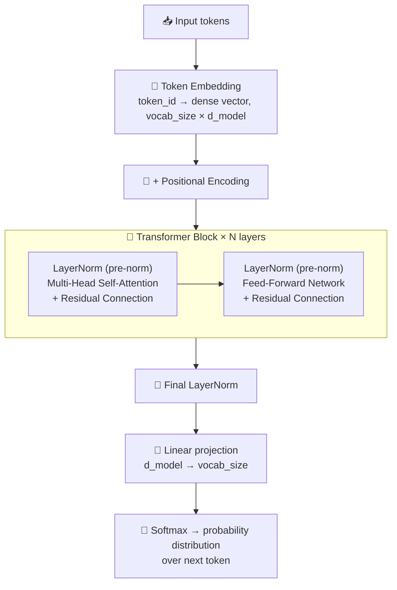

# Transformer Architecture

The transformer is the network behind every modern LLM: a stack of identical blocks, each mixing information across tokens with attention and transforming each token with a feed-forward network, wrapped in residual connections and normalization. This chapter walks through a decoder-only block from embeddings to logits, and shows how to read a model's configuration and count its parameters.

```objectives
time: 50 min
outcomes:
  - Trace a decoder-only forward pass from token IDs to next-token probabilities
  - Compare positional encodings (sinusoidal, learned, RoPE, ALiBi) by extrapolation behaviour and explain why RoPE needs scaling to extend context
  - Explain Pre-LN vs Post-LN and LayerNorm vs RMSNorm, and why modern models use Pre-RMSNorm
  - Count a model's parameters from its config (including GQA and untied embeddings) and check against the published size
prerequisites:
  - "[LLM Fundamentals](01-LLM-Fundamentals.mdx)"
  - "Matrix multiplication and softmax"
```

## Transformer Architecture Overview

### Concept

The transformer architecture, introduced in "Attention Is All You Need" (Vaswani et al., 2017), replaced recurrent networks (LSTMs, GRUs) as the dominant architecture for sequence modeling. Its key insight: replace sequential recurrence with **parallel attention** - compute relationships between all positions simultaneously.

**Why transformers displaced RNNs:**
- RNNs process tokens sequentially → cannot parallelize → slow training
- RNNs struggle with long-range dependencies (gradient vanishing over many steps)
- Transformers compute all pairwise relationships in one pass → fully parallelizable on GPUs
- Self-attention has direct access to any position in the sequence, regardless of distance

**The original architecture** had two components:
1. **Encoder** - reads the full input with bidirectional attention, produces context representations
2. **Decoder** - generates output tokens autoregressively, attends to encoder output via cross-attention

Modern LLMs (GPT, LLaMA, Gemma) use **decoder-only** - the encoder is dropped. See [Model Architecture Types](05-Model-Architecture-Types.mdx) for why.

**High-level decoder-only forward pass:**



---

## Input Embedding and Positional Encoding

### Concept

**Token Embedding:** Maps each token ID to a learnable dense vector of size `d_model` (512–8192 depending on model). This is a lookup table - a matrix of shape `[vocab_size, d_model]` - learned during training.

**The positional encoding problem:** Self-attention is permutation-invariant by design - the same tokens in different orders produce the same attention outputs without positional information. You must inject position explicitly.

**Three approaches, each with different trade-offs:**

### 1. Sinusoidal Positional Encoding (original Transformer)

Fixed (not learned), uses sine/cosine at different frequencies:

```
PE(pos, 2i)   = sin(pos / 10000^(2i/d_model))
PE(pos, 2i+1) = cos(pos / 10000^(2i/d_model))
```

- Advantage: defined for any position, with no parameters
- Disadvantage: models still degrade on lengths not seen in training - being defined for a position is not the same as generalising to it

### 2. Learned Absolute Positional Embeddings (GPT-2, BERT)

A trainable embedding table of shape `[max_seq_len, d_model]`, just like token embeddings.

- Advantage: the model optimizes position representations for the task
- Disadvantage: hard limit at `max_seq_len` - cannot extrapolate to longer sequences

### 3. Rotary Position Embeddings - RoPE (LLaMA, Gemma, Mistral)

Instead of adding position to the embedding, RoPE **rotates** the query and key vectors in attention by an angle proportional to position. The dot product Q·K then naturally encodes relative position.

```
Q_rotated = Q * rotation_matrix(pos_q)
K_rotated = K * rotation_matrix(pos_k)
Q·K encodes relative position (pos_q - pos_k)
```

- Advantage: encodes **relative** position in the attention score, and its frequencies can be rescaled (Position Interpolation, NTK scaling, YaRN) to extend context with a short fine-tuning stage
- Caveat: unscaled RoPE does **not** extrapolate well beyond the trained length (Press et al., 2022) - long-context models get there by scaling plus long-context training
- Used by: LLaMA-2/3, Gemma, Mistral, Phi, Falcon
- RoPE with scaling (YaRN, LongRoPE) allows extending context beyond the training length

### 4. ALiBi - Attention with Linear Biases (MPT, BLOOM)

Adds a position-dependent bias directly to attention scores (not embeddings):
```
attention_score = Q·K / sqrt(d_k) - m * |i - j|
```
Where `m` is a per-head slope and `|i-j|` is the distance between positions.

- Advantage: zero extra parameters; strong length generalization beyond training length
- Disadvantage: doesn't encode exact position, only proximity - can hurt tasks needing absolute position

| Encoding | Model examples | Extrapolates? | Relative position? |
|----------|----------------|---------------|--------------------|
| Sinusoidal | Original Transformer | Poorly | No |
| Learned absolute | GPT-2, BERT | No | No |
| RoPE | LLaMA, Gemma, Mistral | With scaling | Yes |
| ALiBi | MPT, BLOOM | Yes, naturally | Proximity only |

---

## Layer Normalization and Residual Connections

### Concept

Two techniques that make deep transformers trainable: residual connections and layer normalization.

**Residual connections (He et al., 2016):**
```
output = LayerNorm(x + Sublayer(x))  # Post-LN (original)
output = x + Sublayer(LayerNorm(x))  # Pre-LN (modern)
```

Why they matter: in a 32-layer network without residuals, gradients must flow through 32 multiplicative transformations and easily vanish to zero or explode. Residuals create a "highway" - gradients can flow directly from the output to any layer without passing through all the transformations.

**Layer Normalization:** Normalizes across the feature dimension (d_model) for each token independently:
```
LayerNorm(x) = γ * (x - μ) / sqrt(σ² + ε) + β
```
Where γ, β are learned scale and shift parameters; μ, σ are computed per-token across features.

**RMSNorm (used by Llama, Mistral, Qwen, Gemma, DeepSeek):** drops the mean-centering and the bias, normalizing only by the root-mean-square:
```
RMSNorm(x) = γ * x / sqrt(mean(x²) + ε)
```
It is cheaper than LayerNorm and trains just as well, which is why nearly every modern decoder uses it. Where this note says "LayerNorm" in a Pre-LN block, modern models use RMSNorm in that position.

**Pre-LN vs Post-LN - a critical difference:**

| | Post-LN (original "Attention is All You Need") | Pre-LN (modern LLMs: LLaMA, GPT-3) |
|--|----------------------------------------------|-------------------------------------|
| Formula | `LayerNorm(x + Sublayer(x))` (LN after residual) | `x + Sublayer(LayerNorm(x))` (LN before sublayer) |
| Training stability | Requires careful learning rate warmup; can diverge | Much more stable; easier to train without warmup |
| Final layer | Needs no extra LN | Needs final LN before the output projection |
| Gradient flow | Gradients pass through LN at every layer | LN is bypassed by the residual path |

**Why modern LLMs use Pre-LN:** More stable training dynamics, easier to scale to very deep networks, less sensitive to learning rate choice.

---

## Feed-Forward Network (FFN)

### Concept

Each transformer block has an FFN that applies the same two-layer MLP to each token **independently** (no cross-token interaction - that's attention's job):

**Original FFN (ReLU):**
```
FFN(x) = W2 · ReLU(W1 · x + b1) + b2
```
- Dimensions: `d_model → 4 * d_model → d_model` (the 4× expansion is the original choice)
- This creates a "wide" intermediate layer that stores fact-like associations

**SwiGLU variant (LLaMA, Gemma, Mistral):**
```
FFN(x) = W2 · (SiLU(W1 · x) ⊗ (W3 · x))
```
Where SiLU(x) = x · sigmoid(x) and ⊗ is element-wise multiplication (gating).

SwiGLU uses **three** weight matrices (W1, W2, W3) but the intermediate dimension is scaled down to compensate (~2/3 × 4 × d_model). Empirically outperforms ReLU and GELU variants.

**Why the FFN matters as much as attention:**
- Attention routes information between tokens
- FFN stores and recalls knowledge - "factual associations" are often thought to live in FFN weights
- The FFN holds most of the parameters: with the original 4× ReLU design and d_model=4096, each FFN is 4096 → 16384 → 4096 = 2 × (4096 × 16384) ≈ 134M parameters per layer, about twice the attention weights

---

## Key Architectural Hyperparameters

### Concept

Understanding model shape hyperparameters is essential for VRAM estimation (see [GPU and Hardware](../../07-Pretraining/Notes/02-GPU-and-Hardware.mdx)) and for interpreting model cards.

| Hyperparameter | Meaning | Typical values |
|----------------|---------|----------------|
| `d_model` (hidden size) | Embedding and residual stream dimension | 2048–8192 |
| `n_layers` | Number of transformer blocks | 24–80 |
| `n_heads` | Number of attention heads | 16–64 |
| `d_head` | Dimension per head = d_model / n_heads | 64–128 |
| `n_kv_heads` | KV heads (< n_heads for GQA) | 8–n_heads |
| `d_ffn` | FFN intermediate dimension | 4× d_model (or ~2.67× for SwiGLU) |
| `vocab_size` | Number of tokens in vocabulary | 32K–200K |
| `max_position` | Maximum sequence length | 4K–1M |

**Example - LLaMA-3 8B:**
- `d_model = 4096`, `n_layers = 32`, `n_heads = 32`, `n_kv_heads = 8` (GQA), `d_ffn = 14336` (SwiGLU)

**Parameter count estimation** (`vocab_size = 128,256`, `d_head = 128`):
```
Attention/layer: Q and O: 2 × 4096 × 4096        = 33.6M
                 K and V: 2 × 4096 × (8 × 128)    =  8.4M   (GQA: only 8 KV heads)
                                                   = 41.9M
FFN/layer:       3 × 4096 × 14336 (SwiGLU)        = 176.2M
32 layers:       32 × (41.9M + 176.2M + norms)    ≈ 6.98B
Embedding:       128,256 × 4096                   ≈ 0.53B
Output head:     128,256 × 4096 (not tied)        ≈ 0.53B
Total                                             ≈ 8.03B ✓
```
Without GQA (four full d_model² projections) attention would be 67M per layer - GQA saves about 0.8B parameters here, and far more in KV-cache memory.

### Code

```python
import torch
import torch.nn as nn
import math

class TransformerBlock(nn.Module):
    """Minimal decoder-only transformer block (Pre-LN, standard multi-head attention, GELU FFN)."""
    def __init__(self, d_model=512, n_heads=8, d_ffn=2048, dropout=0.1):
        super().__init__()
        self.norm1 = nn.LayerNorm(d_model)
        self.norm2 = nn.LayerNorm(d_model)
        self.attn = nn.MultiheadAttention(d_model, n_heads, batch_first=True)
        self.ffn = nn.Sequential(
            nn.Linear(d_model, d_ffn),
            nn.GELU(),
            nn.Linear(d_ffn, d_model),
            nn.Dropout(dropout),
        )

    def forward(self, x, causal_mask=None):
        # Pre-LN + residual
        normed = self.norm1(x)
        attn_out, _ = self.attn(normed, normed, normed, attn_mask=causal_mask)
        x = x + attn_out          # residual
        x = x + self.ffn(self.norm2(x))  # residual
        return x

class MiniDecoder(nn.Module):
    def __init__(self, vocab_size=1000, d_model=512, n_layers=6, n_heads=8):
        super().__init__()
        self.embed = nn.Embedding(vocab_size, d_model)
        self.pos_embed = nn.Embedding(2048, d_model)  # learned absolute
        self.blocks = nn.ModuleList([
            TransformerBlock(d_model, n_heads) for _ in range(n_layers)
        ])
        self.norm = nn.LayerNorm(d_model)
        self.head = nn.Linear(d_model, vocab_size, bias=False)

    def forward(self, token_ids):
        B, T = token_ids.shape
        positions = torch.arange(T, device=token_ids.device).unsqueeze(0)
        x = self.embed(token_ids) + self.pos_embed(positions)

        # Causal mask: upper triangle = -inf
        causal_mask = torch.triu(
            torch.full((T, T), float('-inf'), device=x.device), diagonal=1
        )
        for block in self.blocks:
            x = block(x, causal_mask)

        x = self.norm(x)
        logits = self.head(x)  # [B, T, vocab_size]
        return logits

# Quick sanity check
model = MiniDecoder(vocab_size=1000, d_model=256, n_layers=4)
tokens = torch.randint(0, 1000, (2, 16))  # batch=2, seq_len=16
logits = model(tokens)
print(f"Input shape: {tokens.shape}")
print(f"Output shape: {logits.shape}")  # [2, 16, 1000]
print(f"Parameters: {sum(p.numel() for p in model.parameters()):,}")
```

---

## Study Notes

**Must-know for interviews:**
- Transformers replaced RNNs by computing all pairwise token relationships in parallel (no sequential bottleneck)
- Decoder-only = causal attention mask, autoregressive generation; encoder-only = bidirectional, no generation
- Pre-LN is more stable than Post-LN and is used by all modern LLMs (LLaMA, Gemma, GPT-3+)
- Residual connections prevent gradient vanishing in deep networks
- RoPE encodes relative position via rotation; with frequency scaling plus long-context training it extends context (unscaled, it extrapolates poorly); used by LLaMA, Gemma, Mistral, Qwen
- FFN stores factual associations; SwiGLU variant outperforms ReLU and is used in LLaMA/Gemma
- d_model, n_layers, n_heads, d_ffn are the four key hyperparameters for parameter count estimation

## Check Yourself

```quiz
- q: "Why do Pre-LN transformers train more stably than Post-LN ones?"
  options:
    - "The residual path bypasses the normalization, so gradients flow directly through the stack"
    - "Pre-LN has fewer parameters"
    - "Pre-LN removes the need for attention"
    - "Pre-LN uses a larger learning rate"
  answer: 1
- q: "A model's config has d_model=4096, 32 query heads, 8 KV heads, d_head=128. How many parameters are in one layer's K projection?"
  options: ["4096 × 1024 ≈ 4.2M", "4096 × 4096 ≈ 16.8M", "8 × 128 ≈ 1K", "32 × 128 × 4096 ≈ 16.8M"]
  answer: 1
  explain: "K projects d_model to n_kv_heads × d_head = 8 × 128 = 1024 dimensions."
- q: "Why can't a model with learned absolute position embeddings handle sequences longer than max_seq_len?"
  answer: "Positions beyond the table have no embedding at all - there is nothing to look up - so the model has no representation for them without extending and retraining the table."
- q: "What does RMSNorm drop compared with LayerNorm?"
  options: ["Mean-centering and the bias term", "The learned scale", "The epsilon", "Normalization across features"]
  answer: 1
- q: "Where do most of a dense transformer's parameters live?"
  options: ["The FFN (MLP) blocks", "The attention projections", "The layer norms", "The positional encoding"]
  answer: 1
  explain: "In Llama 3 8B, each layer has about 176M FFN parameters versus about 42M attention parameters."
```

## Exercises

```exercise
- title: Count parameters from a config
  task: |
    Download the `config.json` of an open model you use (for example a Qwen3 or Llama checkpoint) and compute its parameter count by hand: attention (with its KV heads), FFN (SwiGLU uses three matrices), norms, embeddings, and the output head (check `tie_word_embeddings`). Compare with `sum(p.numel() for p in model.parameters())` loaded on the meta device.
  hints: ["`with torch.device('meta'): model = AutoModelForCausalLM.from_config(config)` builds the model without allocating memory"]
  solution: |
    Your hand count should match within a few thousand parameters (biases, if any, and norm weights are the usual misses). Tied embeddings count once; untied ones twice. The exercise makes model cards legible: "8B" is mostly FFN, then attention, then embeddings - and GQA shrinks the K/V projections.
- title: Watch RoPE fail and scale
  task: |
    Take a small RoPE model trained at 2K context (for example the GPT From Scratch lab model) and measure validation loss by position at 2K, 4K and 8K. Then apply linear position interpolation (divide positions by 4) and fine-tune briefly at 8K. Plot loss vs position before and after.
  solution: |
    Without scaling, loss rises sharply beyond the trained length - relative encoding alone does not extrapolate. Interpolation squeezes 8K positions into the trained range; after a short fine-tune, loss at long positions drops close to in-range values. This is the mechanism behind long-context extension stages (see Pretraining).
```

## References

- Vaswani et al., [Attention Is All You Need](https://arxiv.org/abs/1706.03762) (2017)
- Xiong et al., [On Layer Normalization in the Transformer Architecture](https://arxiv.org/abs/2002.04745) (2020)
- Zhang and Sennrich, [Root Mean Square Layer Normalization](https://arxiv.org/abs/1910.07467) (2019)
- Su et al., [RoFormer: Enhanced Transformer with Rotary Position Embedding](https://arxiv.org/abs/2104.09864) (2021)
- Press et al., [Train Short, Test Long: Attention with Linear Biases (ALiBi)](https://arxiv.org/abs/2108.12409) (2022)
- Shazeer, [GLU Variants Improve Transformer](https://arxiv.org/abs/2002.05202) (2020)
- Grattafiori et al., [The Llama 3 Herd of Models](https://arxiv.org/abs/2407.21783) (2024)

*Last reviewed: 2026-09*
