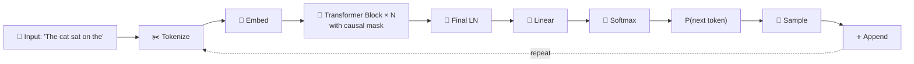
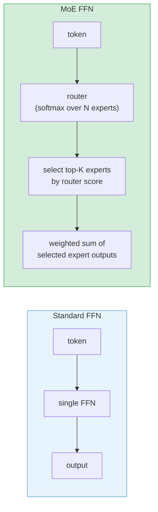

# Model Architecture Types

Transformers come in three shapes - encoder-only, decoder-only and encoder-decoder - distinguished by the attention mask and the training objective, and each shape can be made sparse with mixture-of-experts layers. This chapter explains what each shape can and cannot do, why decoder-only models took over general-purpose AI, and how to choose one for a task.

```objectives
time: 45 min
outcomes:
  - Distinguish encoder-only, decoder-only and encoder-decoder models by attention mask, training objective and what they can output
  - Explain why decoder-only models became the default for general-purpose assistants, and where encoders and encoder-decoders still win
  - "Explain mixture-of-experts: total vs active parameters, routing, load balancing, and why it saves compute but not memory"
  - Choose an architecture (and model size class) for a task and justify it
prerequisites:
  - "[Transformer Architecture](03-Architecture.mdx) and [Attention Mechanisms](04-Attention-Mechanisms.mdx)"
```

## Encoder-Only Architecture

### Concept

Encoder-only models use **bidirectional self-attention** - each token can attend to all other tokens simultaneously. There is no causal mask; the model sees the full context in both directions.

**Training objective - Masked Language Modeling (MLM):**
- Randomly mask 15% of tokens in the input
- Train the model to predict the masked tokens from context
- This forces the model to understand bidirectional context

**Architecture specifics:**
- Input sequence → bidirectional attention → contextual representations per token
- No autoregressive generation - the model produces a fixed-size representation for each token, not new tokens
- Classification and span-extraction heads are added on top of the final hidden states

**When to use encoder-only:**
- **Text classification** (sentiment analysis, intent detection): take the [CLS] token embedding → linear head
- **Named Entity Recognition (NER)**: classify each token's hidden state → per-token labels
- **Semantic similarity / embeddings**: mean pool or [CLS] embedding → similarity search
- **Extractive QA** (SQuAD): predict start/end token positions within the context

**Key models:**

| Model | Parameters | Context | Key innovation |
|-------|-----------|---------|----------------|
| BERT-base | 110M | 512 | Bidirectional MLM + NSP |
| BERT-large | 340M | 512 | Larger BERT |
| RoBERTa | 125M/355M | 512 | Removed NSP, more data, better MLM |
| DeBERTa-v3 | 183M | 512 | Disentangled attention, ELECTRA pretraining |
| DistilBERT | 66M | 512 | 40% smaller, 60% faster, 97% of BERT quality |
| BGE-M3 | ~560M | 8K | Multi-function embedding model |

**Tricky Q:** *Can a BERT-family model generate text?*  
No - BERT was never trained to autoregressively predict the next token. Its output is a contextual representation, not a probability distribution over the next token. You can build a seq2seq encoder-decoder on top of a BERT encoder, but the encoder alone cannot generate.

---

## Decoder-Only Architecture

### Concept

Decoder-only models use **causal (left-to-right) self-attention** - each token can only attend to itself and all preceding tokens. The model is trained to predict the next token.

**Training objective - Causal Language Modeling (CLM):**
- Given tokens t₁, t₂, ..., tₙ₋₁, predict tₙ
- Loss is cross-entropy on the predicted next-token distribution vs the actual next token
- The simplicity of this objective is a key reason for the architecture's dominance

**Why decoder-only won:**

1. **Unified objective:** CLM pretraining + instruction fine-tuning (SFT) + RLHF all use the same token prediction framework - no architectural changes between stages
2. **Natural generation:** The architecture is inherently designed to generate; no adapter or cross-attention bridge needed
3. **Emergent reasoning:** At scale, decoder-only models develop chain-of-thought reasoning by learning to produce intermediate "thinking" tokens
4. **In-context learning:** Few-shot prompting works naturally by prepending examples before the query
5. **Scalability:** Simple objective → easy to scale to trillions of training tokens

**Architecture flow:**


**Key models:**

| Model | Params | Context | Key innovation |
|-------|--------|---------|----------------|
| GPT-2 | 1.5B | 1024 | First large-scale CLM demo |
| GPT-3 | 175B | 2048 | In-context learning at scale |
| GPT-4 (2023) | Undisclosed | 8K / 32K | Multimodal input, top-tier reasoning at release |
| LLaMA-2 | 7B–70B | 4K | Open weights, commercial license |
| LLaMA-3.1 | 8B–405B | 128K | GQA, strong open weights |
| Gemma 2 | 2B–27B | 8K | Google open weights, interleaved local (sliding-window) and global attention |
| Mistral 7B | 7B | 8K (v0.1) / 32K (v0.2+) | GQA + sliding window attention (v0.1) |
| Phi-3-mini | 3.8B | 128K | High quality from small size |
| Falcon | 7B–180B | 2K–8K | Multi-Query Attention |
| DeepSeek-V3 | 671B MoE (37B active) | 128K | MLA, fine-grained MoE, FP8 training |

---

## Encoder-Decoder Architecture

### Concept

Encoder-decoder models have two components:
1. **Encoder:** reads the input with bidirectional attention → produces context representations
2. **Decoder:** generates output tokens autoregressively, attending to both its own output (causal self-attention) and the encoder output (**cross-attention**)

**Cross-attention:**
```
Q = decoder hidden states (what the decoder wants to know)
K = V = encoder output    (what the input provides)
cross_attention_output = softmax(Q·Kᵀ / √d_k) · V
```

This allows the decoder to directly "look up" relevant parts of the input at each generation step.

**Training objectives:**

- **T5 (Span Corruption):** Mask contiguous spans of input tokens (replace with single mask token), train decoder to reconstruct the spans
- **BART (Denoising):** Corrupt input via masking, shuffling, deletion; train decoder to reconstruct the clean sequence

**When to use encoder-decoder:**
- **Machine translation:** long input → long output with reordering
- **Abstractive summarization:** input document → shorter summary (not extractive)
- **Document-to-structured output:** parse a document into a structured format
- **Question generation:** answer + context → question

**Key models:**

| Model | Parameters | Key innovation |
|-------|-----------|----------------|
| T5-base/large | 220M/770M | Text-to-text unified framework |
| FLAN-T5 | 80M–11B | Instruction fine-tuned T5 |
| BART | 140M/400M | Denoising pretraining |
| mT5 | 300M–13B | Multilingual T5 |
| mBART | 610M | Multilingual denoising |

**Tricky Q:** *Why did decoder-only models overtake encoder-decoder for summarization and translation?*  

Two reasons: (1) At sufficient scale, decoder-only models learn to produce appropriate-length summaries and translations via instruction fine-tuning, without the architectural inductive bias of cross-attention. (2) A single decoder-only model can handle many tasks via prompting, while encoder-decoder models require task-specific fine-tuning to perform well. Operational simplicity wins.

---

## Architecture Comparison

### Concept

| Dimension | Encoder-Only | Decoder-Only | Encoder-Decoder |
|-----------|-------------|-------------|-----------------|
| Attention direction | Bidirectional | Causal (left-to-right) | Encoder: bi; Decoder: causal + cross |
| Training objective | MLM / ELECTRA | CLM (next token) | Denoising / span corruption |
| Can generate text? | No | Yes | Yes |
| Best for | Classification, NER, embeddings | Generation, reasoning, chat | Seq2seq tasks |
| In-context learning | Poor | Excellent | Moderate |
| Instruction fine-tuning | Awkward | Natural | Possible |
| Production dominance | Embedding models | General LLMs | Niche seq2seq |

---

## Mixture of Experts (MoE)

### Concept

MoE is an architectural modification to the FFN layer, not a new architecture class. Instead of one dense FFN per layer, the model has N "expert" FFNs and a learned **router** that selects top-K experts per token.



**Key MoE concept: sparse activation**
- Total parameters: N × (d_model × d_ffn) - much larger than a dense model
- Active parameters per token: only K experts are used - much smaller computation
- Example: Mixtral-8x7B has 8 expert FFNs per layer and routes each token to 2 of them. Only the FFN blocks are replicated - attention and embeddings are shared - so the total is ~47B parameters (not 8 × 7B = 56B), with ~13B active per token

**MoE advantages:**
- Scale model capacity without proportional compute increase
- Different experts can specialize in different domains/languages/task types
- Efficient at inference for large models (only K/N of FFN is computed per token)

**MoE challenges:**
- Load balancing: without constraints, router collapses all tokens to the same 1–2 experts
- Communication overhead in distributed training (all-to-all for expert routing)
- MoE saves compute, not memory: all experts must be resident in GPU memory (47B for Mixtral), and the KV cache is unchanged because attention is not sparse

**Models:**
- Mixtral-8x7B: 8 experts, top-2 routing, 47B total / 13B active
- DeepSeek-V3, Qwen3-235B-A22B, Llama 4, gpt-oss, Kimi K2: fine-grained MoE with many small experts - see [Modern Architectures](06-Modern-Architectures.mdx)
- Switch Transformer (Google): pioneered MoE at scale with top-1 routing

---

## Model Family Comparison Table

### Concept

A reference table of influential model families and the architectural idea each is known for. It is deliberately historical - for the current lineup see the [Model Landscape](08-Model-Landscape.mdx). Closed-model internals are listed as undisclosed unless the vendor published them.

| Model Family | Org | Type | Context | Architecture innovations |
|-------------|-----|------|---------|--------------------------|
| GPT-2 | OpenAI | Decoder | 1K | First demo of large CLM |
| GPT-3 | OpenAI | Decoder | 2K | 175B in-context learning |
| GPT-4 / 4o | OpenAI | Undisclosed | 128K | Multimodal, top-tier at release |
| GPT-4.1 | OpenAI | Undisclosed | 1M | Extended context, code + general |
| LLaMA-2 | Meta | Decoder | 4K | Open weights, GQA (70B) |
| LLaMA-3 / 3.1 | Meta | Decoder | 8K / 128K | GQA all sizes, 405B |
| LLaMA-4 Scout | Meta | MoE Transformer | 10M | Ultra-long context, open weights |
| LLaMA-4 Maverick | Meta | MoE Transformer | 1M | Balanced capability/cost |
| Gemma | Google | Decoder | 8K | Multi-query attention (2B), open weights |
| Gemma 2 | Google | Decoder | 8K | GQA + local+global attn |
| Gemini 2.5 Pro | Google DeepMind | Undisclosed | 1M | Complex reasoning, multimodal |
| Gemma 3 | Google | Decoder | 128K | 5:1 local:global attention, QK-norm |
| Mistral 7B | Mistral | Decoder | 8K / 32K | GQA + sliding window (v0.1) |
| Mixtral 8x7B | Mistral | Decoder (MoE) | 32K | Top-2 MoE, 47B/13B active |
| Phi-3-mini | Microsoft | Decoder | 128K | 3.8B, textbook-quality data |
| Qwen3 | Alibaba Cloud | Dense + MoE | 32K native (128K with YaRN) | Hybrid thinking mode, Apache-2.0 |
| DeepSeek-V3 / R1 | DeepSeek | MoE (671B / 37B active) | 128K | MLA, aux-loss-free balancing, open reasoning (R1) |
| gpt-oss | OpenAI | MoE (117B / 5.1B active) | 128K | Open weights, MXFP4 experts, banded attention |
| Command A | Cohere | Decoder | 256K | Tuned for RAG, tool use and enterprise search |
| BERT-base | Google | Encoder | 512 | MLM + NSP, bidirectional |
| RoBERTa | Meta | Encoder | 512 | Better BERT training |
| DeBERTa-v3 | Microsoft | Encoder | 512 | Disentangled attention |
| T5 / FLAN-T5 | Google | Enc-Dec | 512–2K | Text-to-text, instruction |
| BART | Meta | Enc-Dec | 1K | Denoising pretraining |

---

## LLM Types by Modality

### Concept

Beyond architecture type, LLMs are also categorized by the **modalities they handle**. This affects model selection, embedding strategy, and system design.

| Type | Description | Examples | Use Cases |
|------|-------------|----------|-----------|
| Text-Only | Trained on text corpora only | GPT-3, LLaMA, BERT, Falcon | General NLP, summarization, generation |
| Multilingual | Trained on multilingual corpora | XLM-R, mT5, BLOOM, GPT-4 | Translation, cross-lingual search |
| Multimodal | Input: image/video/audio + text | GPT-4o, Gemini, Qwen-VL, LLaVA | Image captioning, audio Q&A, OCR, document understanding |
| Code | Specialized in programming languages | Codex, CodeLLaMA, CodeGemma, StarCoder | Code generation, completion, refactoring |
| Speech-Text | Integrate speech recognition and synthesis | Whisper, SeamlessM4T | Transcription, speech translation |
| Image/Vision | Image understanding and classification | ViT, ConvNeXT, DETR, Mask2Former | Object detection, segmentation, depth estimation |

**Modality in system design:** When building a multi-modal pipeline (e.g., processing scanned PDFs + structured data + free text), you must choose whether to use a single multi-modal foundation model (simplicity, one context) or multiple specialized models (higher per-task accuracy, more complex orchestration). For RAG over images, multimodal embeddings (CLIP, Gemini Embeddings) are required - text-only embeddings cannot capture visual content.

**Models by specific task (quick reference):**

| Model | Task |
|-------|------|
| Wav2Vec2 | Audio classification, automatic speech recognition (ASR) |
| Vision Transformer (ViT), ConvNeXT | Image classification |
| DETR | Object detection |
| Mask2Former | Image segmentation |
| GLPN | Depth estimation |
| BERT | Text classification, token classification, question answering |
| GPT-2, LLaMA | Text generation |
| BART, T5 | Summarization and translation |
| Codex, CodeLLaMA | Code generation |
| Whisper | Speech-to-text transcription |

---

## When to Choose Which Architecture

### Concept

**Use encoder-only (BERT/DeBERTa/BGE) when:**
- Task is purely classification, NER, or span extraction
- You need high-quality fixed-size embeddings for search/RAG
- Inference must be very fast (smaller models, no generation overhead)
- Labels are sentence-level or token-level - not generative

**Use decoder-only (LLaMA/Gemma/GPT) when:**
- Task requires free-form text generation
- You want a single model for multiple tasks via prompting
- You need in-context learning (few-shot examples in prompt)
- You plan to instruction fine-tune for custom tasks

**Use encoder-decoder (T5/FLAN-T5/BART) when:**
- Task is explicitly seq2seq with fixed input and output schemas
- You have limited compute - smaller fine-tuned encoder-decoder can beat large decoder-only for specific structured tasks
- Translation or summarization at scale where encoder-decoder efficiency matters

**Practical rule of thumb:** Default to decoder-only for new projects. Switch to encoder-only if you need embeddings or fast token classification. Encoder-decoder is a niche choice for legacy systems or very specific seq2seq workloads.

### Code

```python
from transformers import (
    AutoTokenizer, AutoModelForSequenceClassification,  # Encoder-only
    AutoModelForCausalLM,                               # Decoder-only
    AutoModelForSeq2SeqLM,                             # Encoder-Decoder
    pipeline
)

# --- Encoder-only: text classification ---
classifier = pipeline(
    "text-classification",
    model="distilbert-base-uncased-finetuned-sst-2-english"
)
result = classifier("This movie was absolutely fantastic!")
print(f"Encoder-only classification: {result}")

# --- Decoder-only: text generation ---
generator = pipeline(
    "text-generation",
    model="gpt2",  # small, runs locally
    max_new_tokens=50,
    temperature=0.7
)
result = generator("The transformer architecture revolutionized AI because")
print(f"\nDecoder-only generation: {result[0]['generated_text']}")

# --- Encoder-Decoder: summarization ---
summarizer = pipeline(
    "summarization",
    model="facebook/bart-large-cnn",
    max_length=60,
    min_length=20
)
article = """
The transformer architecture, introduced in the paper "Attention Is All You Need" by Vaswani 
et al. in 2017, revolutionized natural language processing. It replaced recurrent neural 
networks with a self-attention mechanism that could process all tokens simultaneously, 
enabling much faster training and better handling of long-range dependencies.
"""
result = summarizer(article)
print(f"\nEncoder-Decoder summary: {result[0]['summary_text']}")

# --- Checking architecture type programmatically ---
from transformers import AutoConfig

for model_name in ["bert-base-uncased", "gpt2", "facebook/bart-large"]:
    config = AutoConfig.from_pretrained(model_name)
    print(f"{model_name}: {config.model_type} - {config.architectures}")
```

---

## Functional Model Categories

### Concept

Beyond the three architecture shapes, people describe models by what they are trained to do. These are overlapping labels, not separate architectures - one model can be an MoE, a reasoning model and a vision-language model at once.

| Category | What it is | Examples | Typical use |
|---|---|---|---|
| **Reasoning model** | A decoder-only LLM post-trained, largely with RL on verifiable tasks, to produce a long chain of thought before answering (see [Post-Training & Fine-Tuning](../../08-Post-Training/INDEX.mdx)) | DeepSeek-R1, OpenAI o-series, Qwen3 in thinking mode | Maths, code, multi-step planning |
| **Mixture of experts** | Sparse FFN layers: a router sends each token to a few experts | Mixtral, DeepSeek-V3, Qwen3-235B-A22B, gpt-oss | Large capacity at lower compute per token |
| **Vision-language model** | A vision encoder (often a ViT) whose features are mapped into the LM's embedding space by a projector, trained on image-text data, or a natively multimodal model | LLaVA, Qwen-VL, Gemma 3, GPT-4o | Documents, screenshots, image Q&A, agent perception |
| **Small language model** | Models of roughly 1-8B parameters, trained (often with distillation from a larger model) to run on a single GPU or device | Phi, Gemma, Qwen and Llama small sizes | On-device use, latency-critical sub-tasks, fine-tuning |
| **Computer-use / action model** | An LLM trained or tuned to output actions - tool calls, clicks, keystrokes - from screenshots or UI trees | OpenAI's Computer-Using Agent, Anthropic's computer-use capability, Gemini computer-use models | Browser and desktop agents (see [Computer-Use and Browser Agents](../../19-Agent-Engineering/Notes/06-Computer-Use-and-Browser-Agents.mdx)) |
| **Embedding model** | Usually an encoder (or a decoder adapted) trained with contrastive objectives to output a fixed vector | BGE, E5, Gemini and OpenAI embedding models | Search, RAG, clustering |
| **Large concept model** (research) | Models that predict the next sentence-level embedding ("concept") instead of the next token | Meta's LCM (2024) | Research into language-agnostic reasoning |

**Distinctions worth knowing:**
- **Reasoning model vs chat model:** same architecture; the difference is post-training that rewards correct final answers and lets the model spend tokens thinking first.
- **Vision-language training** typically goes: pretrained vision encoder and LM → train the projector on image-caption pairs → instruction-tune on visual tasks (LLaVA's recipe); newer models are trained multimodally from the start.
- **Small model vs quantized large model:** a small model has fewer parameters; quantization keeps the parameter count and lowers the precision. They trade off differently (see [Quantized Inference](../../16-Inference-and-Serving/Notes/03-Quantized-Inference.mdx)).
- **Action models vs tool use:** any tool-calling LLM can act through tools; computer-use models are additionally trained on screen-and-action data so they can operate interfaces that have no API.

---

## Study Notes

**Must-know for interviews:**
- Three architecture families: encoder-only (bidirectional, MLM, classification), decoder-only (causal, CLM, generation), encoder-decoder (cross-attention, seq2seq)
- Decoder-only dominates production for general LLMs - simple CLM objective + instruction fine-tuning = powerful general purpose model
- BERT uses bidirectional attention - cannot generate; best for embeddings and classification
- MoE: sparse routing selects top-K experts per token → large total params, small active params
- LLaMA-3, Gemma, Mistral all use GQA for efficient KV caching
- When in doubt: reach for a decoder-only model (e.g. Llama, Qwen, Gemma)

## Check Yourself

```quiz
- q: "Why can't BERT generate free text?"
  options:
    - "It was trained with masked-token prediction and bidirectional attention, so it has no next-token distribution to sample from"
    - "It is too small"
    - "It has no vocabulary"
    - "Its context is only 512 tokens"
  answer: 1
- q: "Mixtral 8x7B has about 47B parameters, not 56B. Why?"
  options:
    - "Only the FFN experts are replicated; attention and embeddings are shared"
    - "Two experts are removed after training"
    - "It is quantized"
    - "The router merges experts"
  answer: 1
- q: "What does a mixture-of-experts model save compared with a dense model of the same total size?"
  options: ["Compute per token", "GPU memory for weights", "KV-cache memory", "Training data"]
  answer: 1
  explain: "All experts must be resident in memory; only the compute per token falls, because each token uses a few experts."
- q: "What distinguishes a reasoning model from an ordinary chat model with the same architecture?"
  answer: "Post-training - largely reinforcement learning on tasks with checkable answers - that teaches it to produce a long chain of thought before the final answer."
- q: "You need fast, cheap intent classification for 50 million support messages a day. Which architecture class do you start with, and why?"
  answer: "A small fine-tuned encoder (BERT/DeBERTa class): classification needs no generation, encoders are small and fast, and bidirectional context suits labelling - generation would add cost and latency for no benefit."
```

## Exercises

```exercise
- title: Choose the architecture
  task: |
    For each task pick encoder-only, decoder-only or encoder-decoder and a size class, and justify it: (a) deduplicating 20M product titles by semantic similarity; (b) a customer-facing assistant that answers policy questions; (c) translating 1M short UI strings into 30 languages on a fixed budget; (d) tagging personal data in documents at the token level.
  solution: |
    (a) Encoder embedding model - fixed vectors plus approximate nearest-neighbour search; no generation. (b) Decoder-only instruct model with RAG - open-ended generation grounded in documents. (c) Either a small encoder-decoder translation model (cheap, strong for a fixed task) or a small decoder-only model; measure quality per dollar on a sample. (d) Encoder token classifier (NER-style) - per-token labels with bidirectional context, fast and cheap.
- title: Total vs active parameters
  task: |
    A MoE layer has 64 experts, each an FFN with d_model = 4096 and d_ffn = 1408 (SwiGLU), and routes each token to 6 experts plus 2 always-on shared experts. Compute the FFN parameters per layer in total and active per token.
  solution: |
    Each expert: 3 × 4096 × 1408 ≈ 17.3M parameters. Total per layer: (64 + 2) × 17.3M ≈ 1.14B. Active per token: (6 + 2) × 17.3M ≈ 138M - about 12% of the layer's FFN parameters, which is the compute saving; memory must still hold all 1.14B.
```

## References

- Devlin et al., [BERT](https://arxiv.org/abs/1810.04805) (2019)
- Raffel et al., [Exploring the Limits of Transfer Learning with a Unified Text-to-Text Transformer (T5)](https://arxiv.org/abs/1910.10683) (2020)
- Lewis et al., [BART](https://arxiv.org/abs/1910.13461) (2020)
- Brown et al., [Language Models are Few-Shot Learners (GPT-3)](https://arxiv.org/abs/2005.14165) (2020)
- Fedus et al., [Switch Transformers](https://arxiv.org/abs/2101.03961) (2022); Jiang et al., [Mixtral of Experts](https://arxiv.org/abs/2401.04088) (2024)
- Liu et al., [Visual Instruction Tuning (LLaVA)](https://arxiv.org/abs/2304.08485) (2023)
- LCM team (Meta), [Large Concept Models](https://arxiv.org/abs/2412.08821) (2024)

*Last reviewed: 2026-09*
