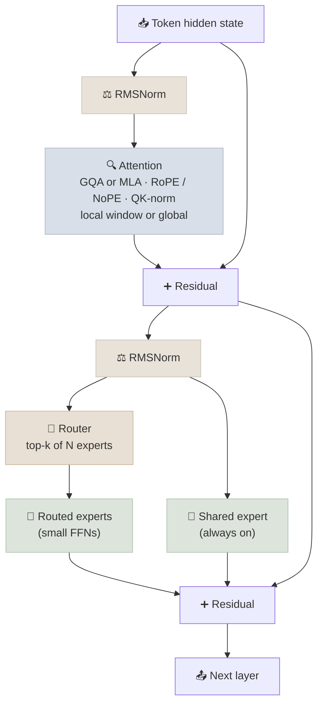
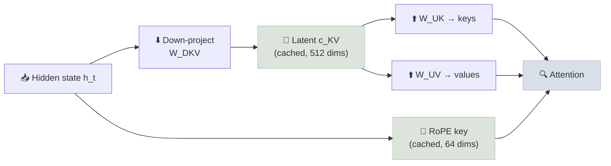
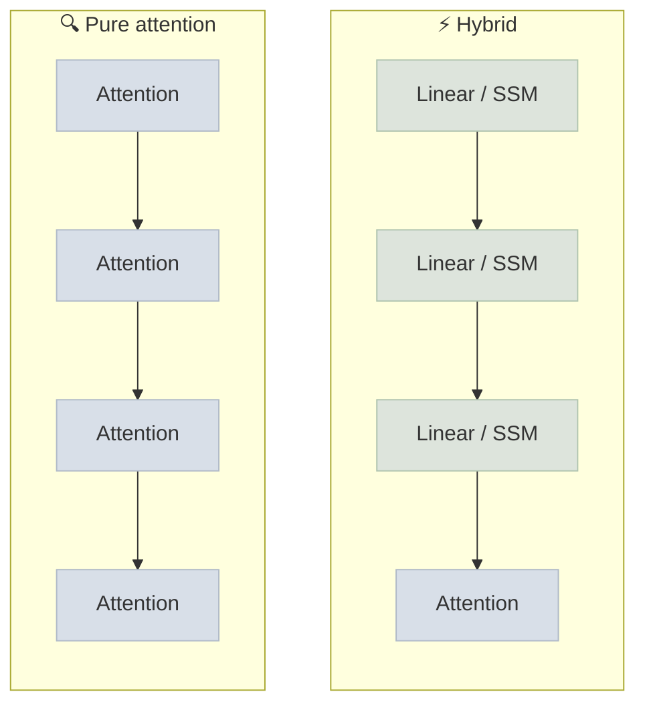

# Modern Architectures (2024-2026)

The 2017 transformer is still the backbone of every frontier LLM, but the models released since 2024 change almost every component around it: how keys and values are cached, how feed-forward capacity is spread across experts, how attention handles long sequences, and whether every layer is attention at all. This note covers the changes that show up in current model cards, so you can read one and know what each line means.

```objectives
time: 60 min
outcomes:
  - Explain multi-head latent attention (MLA) and compute its KV-cache saving against GQA
  - Describe a modern mixture-of-experts layer - fine-grained routed experts, shared experts, top-k routing and load balancing - and reason about total vs active parameters
  - Explain why models interleave local (sliding-window) and global attention layers, and what attention sinks and QK-norm fix
  - Compare state-space and linear-attention hybrids with pure attention for long-context cost
  - Distinguish late-fusion (adapter) multimodal models from early-fusion native multimodal models
prerequisites:
  - "[Transformer Architecture](03-Architecture.mdx) - the decoder block, RoPE, RMSNorm"
  - "[Attention Mechanisms](04-Attention-Mechanisms.mdx) - multi-head attention and GQA"
  - "[Model Architecture Types](05-Model-Architecture-Types.mdx) - the basic mixture-of-experts idea"
```

## The Modern Decoder Block at a Glance

A 2025-era open model such as DeepSeek-V3, Qwen3 or Kimi K2 still stacks decoder blocks - normalize, attend, add; normalize, feed-forward, add - but each sub-part has been re-engineered for one of three costs: **KV-cache memory** (long context, many users), **FLOPs per token** (serving cost), or **training stability** (bigger, longer runs).



| Cost it attacks | Technique | Where you see it |
|-----------------|-----------|------------------|
| KV-cache memory | Grouped-query attention (GQA) | Llama 3/4, Qwen3, Gemma 3, gpt-oss |
| KV-cache memory | Multi-head latent attention (MLA) | DeepSeek-V2/V3/R1, Kimi K2 |
| KV-cache memory + compute at long context | Sliding-window / local-global interleaving | Gemma 2/3, gpt-oss, Mistral 7B v0.1 |
| FLOPs per token | Fine-grained mixture of experts | DeepSeek-V3, Qwen3 MoE, Llama 4, gpt-oss, Kimi K2 |
| Long-context cost | State-space / linear-attention hybrids | Jamba, Nemotron-H, MiniMax-01, Qwen3-Next |
| Training stability | RMSNorm, QK-norm, logit soft-capping, z-loss | OLMo 2, Gemma 2/3, Qwen3 |
| Decode speed | Multi-token prediction heads | DeepSeek-V3 |

---

## Multi-Head Latent Attention (MLA)

### Concept

GQA shrinks the KV cache by letting several query heads share one key/value head. **MLA** (introduced in DeepSeek-V2, 2024) takes a different route: instead of caching per-head keys and values, it caches one small **latent vector** per token and reconstructs keys and values from it with up-projection matrices.

```
Standard MHA cache per token, per layer:   2 × n_heads × d_head   values
GQA cache per token, per layer:            2 × n_kv_heads × d_head values
MLA cache per token, per layer:            d_c + d_rope            values
                                           (latent)  (decoupled RoPE key)
```

Two details make it work:

- **Absorbed projections.** At inference the key up-projection can be folded into the query projection, and the value up-projection into the output projection, so the model attends over the latent directly and never materializes full keys and values for past tokens.
- **Decoupled RoPE.** Rotary position encoding does not commute with the low-rank compression, so MLA carries a separate small positional key (64 dims in DeepSeek-V3) alongside the latent.

In DeepSeek-V3 (128 heads × 128 dims, 61 layers), the latent is 512 dims plus the 64-dim RoPE key: **576 cached values per token per layer instead of 32,768** for full multi-head attention - a ~57× reduction. DeepSeek reports MLA matching or beating full MHA quality, which GQA at comparable compression does not.



**Trade-off:** MLA adds projection work and makes kernels more specialized; serving engines needed dedicated MLA kernels (FlashMLA, and MLA support in vLLM and SGLang) before it was as fast as GQA in practice.

---

## Mixture of Experts, 2025 Edition

### Concept

The Mixtral-style MoE (2023) replaced each FFN with 8 experts and routed each token to 2. Current MoE models push further in four ways:

1. **Fine-grained experts.** Many small experts instead of a few large ones - DeepSeek-V3 uses 256 routed experts with 8 active per token; Qwen3-235B-A22B uses 128 with 8 active; Kimi K2 uses 384 with 8 active. More, smaller experts give the router more combinations to specialize with.
2. **Shared experts.** One or more experts that every token passes through, holding common knowledge so routed experts can specialize (DeepSeek-V3, Llama 4, Kimi K2). Qwen3's MoE models dropped the shared expert.
3. **Load balancing without a big auxiliary loss.** A classic auxiliary loss pushes the router toward uniform expert use but also fights the language-modeling objective. DeepSeek-V3's *auxiliary-loss-free* balancing adds a per-expert bias to the routing scores (used only to pick experts, not to weight them) and nudges it up or down depending on whether the expert is under- or over-loaded.
4. **Extreme sparsity.** Active parameters are now a small slice of the total:

| Model (release) | Total params | Active per token | Experts (routed, active) | Active fraction |
|-----------------|--------------|------------------|--------------------------|-----------------|
| DeepSeek-V3 / R1 (Dec 2024 / Jan 2025) | 671B | 37B | 256 routed + 1 shared, 8 active | ~5.5% |
| Llama 4 Maverick (Apr 2025) | 400B | 17B | 128 routed + 1 shared | ~4.3% |
| Qwen3-235B-A22B (Apr 2025) | 235B | 22B | 128, 8 active | ~9.4% |
| gpt-oss-120b (Aug 2025) | 117B | 5.1B | 128, 4 active | ~4.4% |
| Kimi K2 (Jul 2025) | ~1T | 32B | 384 routed + 1 shared, 8 active | ~3.1% |

**What this means in practice:**

- **Compute scales with active parameters** - a 671B MoE costs roughly what a 37B dense model costs per token in FLOPs.
- **Memory scales with total parameters** - all 671B must be resident somewhere, which is why MoE serving relies on multi-GPU expert parallelism (see [Inference & Serving](../../16-Inference-and-Serving/INDEX.mdx)) and aggressive weight quantization (gpt-oss ships its MoE weights in 4-bit MXFP4 so the 120B model fits on one 80 GB GPU).
- **Quality tracks something between the two.** Rules of thumb that place an MoE "somewhere near the geometric mean of total and active" dense-equivalent are folklore, not a law - compare on benchmarks for your task.

### Multi-token prediction (MTP)

DeepSeek-V3 trains extra sequential modules that predict the token after next as well as the next token. It densifies the training signal, and at inference the extra head doubles as a built-in draft model for speculative decoding - DeepSeek reports an 85-90% acceptance rate for the second token and about 1.8× decode throughput.

---

## Attention Patterns for Long Context

### Local-global interleaving

Full (global) attention costs O(n²) compute and a KV cache that grows with the whole context. **Sliding-window (local) attention** only attends to the last W tokens, so its cache is bounded. Modern models interleave the two so information can still flow across the full context:

- **Gemma 2** alternates local (4,096-token window) and global layers 1:1.
- **Gemma 3** uses 5 local layers (1,024-token window) per global layer, cutting KV-cache memory at 128K context substantially.
- **gpt-oss** alternates full attention with 128-token banded (local) attention.

### Positional encoding choices

- **RoPE with scaling** remains the default; long-context variants rescale its frequencies (see [Transformer Architecture](03-Architecture.mdx)).
- **NoPE layers** - some layers use no positional encoding at all and rely on the causal mask for order. Llama 4's "iRoPE" interleaves RoPE and NoPE layers, which Meta credits for Llama 4 Scout's 10M-token context.

### Attention sinks

Models trained with softmax attention dump a large share of attention onto the first few tokens even when those tokens carry no meaning - a "sink" for probability mass the model has nowhere else to put (Xiao et al., 2023). Evicting those tokens from a sliding-window cache breaks generation, so streaming inference keeps them; gpt-oss goes further and learns an explicit per-head sink logit.

### QK-norm and other stability tricks

Very large runs suffer loss spikes when attention logits grow without bound. **QK-norm** normalizes queries and keys (RMSNorm) before the dot product; OLMo 2, Gemma 3 and Qwen3 use it (Qwen3 dropped the QKV bias in its favour). Gemma 2 instead soft-caps logits, and PaLM-style **z-loss** penalizes large softmax normalizers. These are covered with other stability techniques in [Pretraining at Scale](../../07-Pretraining/INDEX.mdx).

---

## Beyond Pure Attention: State-Space and Linear-Attention Hybrids

### Concept

A **state-space model (SSM)** layer such as Mamba processes the sequence with a fixed-size recurrent state instead of attending over all previous tokens: compute is linear in sequence length and there is no growing KV cache. **Linear attention** variants (Lightning Attention, Gated DeltaNet) get similar properties from a kernelized attention formulation.

Pure SSMs lag attention on tasks that require exact recall of earlier tokens (copying, retrieval from context). The production answer has been **hybrids**: mostly linear-time layers, with a few full-attention layers to handle precise recall.

| Model | Layer mix | Why |
|-------|-----------|-----|
| Jamba (AI21, 2024) | Mamba + attention (1 attention per 8 layers) + MoE | Long context on a single GPU |
| MiniMax-01 (2025) | Lightning (linear) attention, with softmax attention every 8th layer | 1M+ token context at lower cost |
| Nemotron-H (NVIDIA, 2025) | Mostly Mamba-2 layers, a small fraction attention | Faster inference at similar accuracy |
| Qwen3-Next (Sep 2025) | Gated DeltaNet + gated attention, 3:1, plus sparse MoE | Long-context efficiency |



**When it matters:** hybrids shine when contexts are long and memory is the bottleneck. For short-context chat, a well-optimized GQA transformer is usually just as fast, and has far better kernel and tooling support.

---

## Native Multimodality

### Concept

There are two ways to make an LLM see (and hear):

- **Late fusion (adapter).** Take a pretrained vision encoder (a ViT such as SigLIP), project its patch embeddings into the LLM's embedding space with a small adapter, and fine-tune. LLaVA popularized this; it is cheap and reuses strong unimodal models.
- **Early fusion (native).** Tokenize images (and audio) into the same sequence as text and pretrain the whole model on interleaved data from the start. Chameleon (Meta, 2024) demonstrated it; Llama 4 and the major closed models describe themselves as natively multimodal.

"Omni" models extend early fusion to audio in and out, so one model can listen and speak without a separate speech-to-text and text-to-speech pipeline - which cuts latency for voice agents.

---

## Check Yourself

```quiz
- q: "A 671B-parameter MoE model activates 37B parameters per token. Compared with a 37B dense model, what is roughly true?"
  options:
    - "Similar FLOPs per token, but it needs memory for all 671B parameters"
    - "Similar memory, but about 18× the FLOPs per token"
    - "Both memory and FLOPs are about the same as the 37B model"
    - "Both memory and FLOPs are about 18× higher"
  answer: 1
  explain: "Compute follows the active parameters; memory follows the total, because any expert might be chosen for the next token. That is why MoE serving is a memory and communication problem."
- q: "What does MLA cache for each token, instead of per-head keys and values?"
  options:
    - "A low-rank latent vector plus a small decoupled RoPE key"
    - "Keys and values for one shared head, as in multi-query attention"
    - "Nothing - MLA recomputes keys and values from scratch at every step"
    - "Only the values; keys are recomputed from the queries"
  answer: 1
  explain: "Keys and values are reconstructed from the cached latent by up-projections (absorbed into the query and output projections at inference). The RoPE key is kept separately because rotary encoding does not commute with the compression."
- q: "Why do models like Gemma 3 interleave sliding-window layers with a few global-attention layers rather than using only sliding windows?"
  options:
    - "Local layers bound the KV cache; the global layers still let information travel across the whole context"
    - "Global layers are faster than local layers on GPUs"
    - "Sliding-window layers cannot use RoPE"
    - "It is required for mixture-of-experts routing"
  answer: 1
- q: "Why are most production state-space models hybrids that keep some attention layers?"
  answer: "Pure SSM and linear-attention layers compress the past into a fixed-size state, so they are weaker at exact recall of earlier tokens (copying, in-context retrieval). A few full-attention layers restore precise recall while most layers keep linear cost."
```

## Exercises

```exercise
- title: MLA vs GQA at long context
  task: |
    DeepSeek-V3 has 61 layers and caches a 512-dim latent plus a 64-dim RoPE key per token per layer. Llama 3 70B has 80 layers, 8 KV heads and a head dimension of 128.

    1. Compute the BF16 KV cache per token (all layers) for each model.
    2. Compute the cache for one 128K-token sequence for each.
    3. DeepSeek-V3 has ~10× more total parameters. Which model can hold more concurrent 128K-token conversations on the same GPUs once weights are loaded, and why is that not the whole story?
  hints:
    - "MLA per token per layer: (d_c + d_rope) values × 2 bytes."
  solution: |
    1. MLA: `(512 + 64) × 2 bytes × 61 layers = 70,272 bytes ≈ 68.6 KiB`. GQA: `2 × 8 × 128 × 2 bytes × 80 layers = 327,680 bytes = 320 KiB`.
    2. At 131,072 tokens: MLA ≈ **8.6 GiB**, GQA ≈ **40 GiB**.
    3. Per sequence, DeepSeek-V3's cache is ~4.7× smaller, so each sequence is much cheaper to keep. But its 671B weights need far more GPUs to hold in the first place, and MoE decode adds expert-parallel communication. Capacity per dollar depends on the whole deployment, not the cache alone.
- title: Read a model card
  task: |
    Pick any open-weight model released in the last six months and find its config (`config.json` on Hugging Face). Identify: attention type (MHA/GQA/MLA) and KV-head count, any sliding-window or hybrid layers, MoE expert counts (routed, shared, active), and positional encoding. Write two sentences on which serving cost each choice targets.
```

## Study Notes

**Must-know:**
- MLA caches a compressed latent per token; DeepSeek-V3 caches 576 values per token per layer vs 32,768 for full MHA
- Modern MoE = many small routed experts + (often) a shared expert + top-k routing + load balancing; compute ∝ active params, memory ∝ total params
- Auxiliary-loss-free balancing adjusts per-expert routing biases instead of adding a loss term
- Local-global interleaving bounds KV cache while keeping long-range information flow; attention sinks must stay in a streaming cache
- QK-norm, logit soft-capping and z-loss exist to stop attention logits from blowing up in large runs
- SSM / linear-attention hybrids trade some exact-recall ability for linear-time long context; a few attention layers restore it
- Early-fusion multimodal models train on interleaved tokens from the start; late fusion bolts an encoder on with an adapter

## References

- Vaswani et al., [Attention Is All You Need](https://arxiv.org/abs/1706.03762) (2017)
- Ainslie et al., [GQA: Training Generalized Multi-Query Transformer Models](https://arxiv.org/abs/2305.13245) (2023)
- DeepSeek-AI, [DeepSeek-V2](https://arxiv.org/abs/2405.04434) (2024) - introduces MLA and DeepSeekMoE
- DeepSeek-AI, [DeepSeek-V3 Technical Report](https://arxiv.org/abs/2412.19437) (2024) - aux-loss-free balancing, MTP, FP8 training
- Wang et al., [Auxiliary-Loss-Free Load Balancing Strategy for Mixture-of-Experts](https://arxiv.org/abs/2408.15664) (2024)
- Jiang et al., [Mixtral of Experts](https://arxiv.org/abs/2401.04088) (2024)
- Qwen Team, [Qwen3 Technical Report](https://arxiv.org/abs/2505.09388) (2025)
- Kimi Team, [Kimi K2: Open Agentic Intelligence](https://arxiv.org/abs/2507.20534) (2025)
- OpenAI, [gpt-oss-120b & gpt-oss-20b Model Card](https://arxiv.org/abs/2508.10925) (2025)
- Gemma Team, [Gemma 3 Technical Report](https://arxiv.org/abs/2503.19786) (2025)
- Xiao et al., [Efficient Streaming Language Models with Attention Sinks](https://arxiv.org/abs/2309.17453) (2023)
- Gu & Dao, [Mamba](https://arxiv.org/abs/2312.00752) (2023); Dao & Gu, [Mamba-2](https://arxiv.org/abs/2405.21060) (2024)
- Lieber et al., [Jamba](https://arxiv.org/abs/2403.19887) (2024); MiniMax, [MiniMax-01](https://arxiv.org/abs/2501.08313) (2025); NVIDIA, [Nemotron-H](https://arxiv.org/abs/2504.03624) (2025)
- Chameleon Team, [Chameleon: Mixed-Modal Early-Fusion Foundation Models](https://arxiv.org/abs/2405.09818) (2024); Liu et al., [Visual Instruction Tuning (LLaVA)](https://arxiv.org/abs/2304.08485) (2023)

*Last reviewed: 2026-09*
