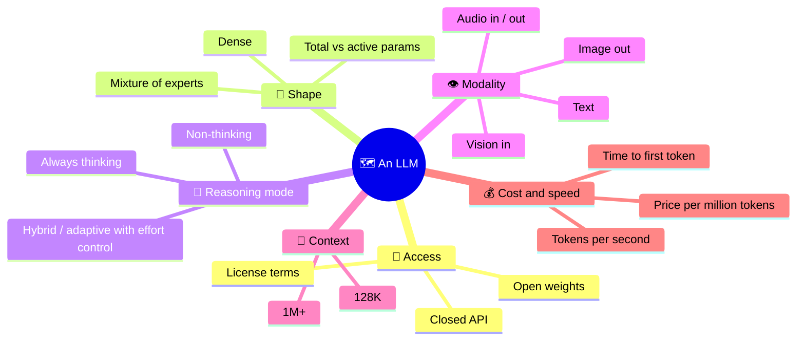
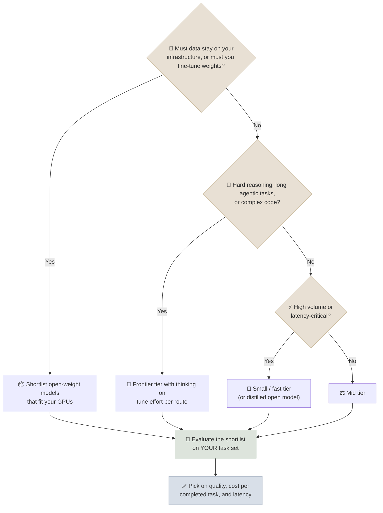

# Model Landscape

New frontier models now ship every few weeks, so any list of "the best models" is stale within a quarter. This page gives you a durable way to read the landscape - the axes that actually separate models - plus a dated snapshot with a link to each vendor's own model page. It is the **only** page in the course that names current model versions; everywhere else, notes refer to model families so they don't go out of date.

```objectives
time: 30 min
outcomes:
  - Place any model on the axes that matter - access and license, dense vs MoE, reasoning mode, modality, context, cost
  - Explain the main 2025-2026 trends (sparse MoE, adaptive "thinking", 1M-token context, the open/closed gap) with concrete examples
  - Choose a shortlist of models for a use case, and design the evaluation that makes the final call
  - Keep this knowledge current from primary sources rather than leaderboard screenshots
prerequisites:
  - "[Model Architecture Types](05-Model-Architecture-Types.mdx)"
  - "[Modern Architectures](06-Modern-Architectures.mdx) - MoE, MLA, hybrids"
```

## The Axes That Matter



| Axis | What to check | Why it matters |
|------|---------------|----------------|
| **Access and license** | Closed API only? Open weights? Apache-2.0 / MIT, or a custom license with usage limits (e.g. Llama's community license)? | Decides whether you can self-host, fine-tune, run on-prem, or ship in a product |
| **Shape** | Dense or MoE; total and active parameters | Active params drive cost per token; total params drive the GPU memory you need to self-host |
| **Reasoning mode** | Does the model think before answering? Can you switch it off or set an effort level? | Thinking improves hard math, code and multi-step tasks, and costs latency and output tokens |
| **Modality** | Which inputs and outputs are native | Native audio/vision avoids a pipeline of separate models |
| **Context** | Advertised window, and measured quality near the end of it | Advertised length ≠ usable length - see [Failure Modes](07-Failure-Modes-and-Tricky-Issues.mdx) |
| **Cost and speed** | Input/output price, cached-input price, throughput, latency | Often the deciding factor once two models are "good enough" |

---

## Trends That Shaped 2025-2026

**1. Reasoning became a dial, not a separate model.** In 2024 reasoning models (OpenAI o1, then DeepSeek-R1) were separate products. By late 2025 most flagships were *hybrid*: DeepSeek-V3.1 switches between thinking and non-thinking modes, Qwen3 exposes the same toggle, and API models expose an **effort** setting. Current Claude models, for example, use *adaptive thinking* - the model decides how much to think, bounded by an effort level from `low` to `max` - rather than a fixed thinking-token budget. The training recipe behind this is covered in [Post-Training & Fine-Tuning](../../08-Post-Training/INDEX.mdx).

**2. Sparse MoE became the default for large open models.** DeepSeek-V3/R1 (671B total, 37B active), Qwen3-235B-A22B, Llama 4 Maverick (400B / 17B), gpt-oss-120b (117B / 5.1B) and Kimi K2 (~1T / 32B) are all mixtures of experts. Dense models remain common below ~30B parameters, where they are simpler to serve.

**3. Million-token context became standard at the frontier.** Current Claude, GPT and Gemini flagships advertise ~1M-token windows; Llama 4 Scout advertises 10M. Measured quality near the end of the window still lags the advertised number, and long prompts are expensive without [prompt caching](../../05-Prompt-Engineering/INDEX.mdx).

**4. The open-weight gap narrowed to months.** DeepSeek-R1 (January 2025, MIT license) matched the then-leading closed reasoning model on math and code benchmarks; through 2025-2026, open releases from DeepSeek, Qwen, Moonshot (Kimi) and Z.ai (GLM) repeatedly landed within a few points of closed frontier models on coding and agentic benchmarks. OpenAI's return to open weights with gpt-oss (August 2025, Apache-2.0) is part of the same shift.

**5. Small models got much better, mostly through distillation.** Sub-10B models trained on the outputs of large reasoning models (e.g. the DeepSeek-R1 distilled Qwen and Llama checkpoints, Qwen3's small dense models) now handle tasks that needed a frontier model two years earlier - which makes on-device and low-cost serving realistic.

---

## Snapshot: Major Families (as of 2026-09-26)

Names and versions change quickly - treat this table as a starting point and follow the source link for the current lineup.

| Developer | Current flagship family (per source) | Access | Notes | Source |
|-----------|--------------------------------------|--------|-------|--------|
| OpenAI | GPT-6 (Astra, Sol, Luna tiers) | Closed API | ~1M-token context; open-weight gpt-oss-120b / 20b (Aug 2025, Apache-2.0) | [OpenAI models](https://developers.openai.com/api/docs/models) |
| Anthropic | Claude Fable 5.1 (most capable), Claude Opus 5 / Opus 5.5, Sonnet 5, Haiku 4.5 | Closed API; also on AWS, Google Cloud, Microsoft Foundry | 1M-token context (Haiku 4.5: 200K); adaptive thinking with effort levels | [Claude models](https://platform.claude.com/docs/en/about-claude/models/overview) |
| Google | Gemini 3.x (e.g. 3.8 Flash stable, 3.1 Pro preview) | Closed API; open Gemma family | Native audio/vision; separate Live (voice) and image models | [Gemini models](https://ai.google.dev/gemini-api/docs/models) |
| DeepSeek | DeepSeek-V4 (`deepseek-v4-pro`, `deepseek-flash`) | API + open weights | MLA + fine-grained MoE lineage from V2/V3; R1 (Jan 2025) popularized open reasoning | [DeepSeek API docs](https://api-docs.deepseek.com/) |
| Alibaba (Qwen) | Qwen3 family and successors | Open weights (mostly Apache-2.0) + API | Dense 0.6B-32B and MoE up to 235B-A22B at the Qwen3 launch (Apr 2025); hybrid thinking | [Qwen on Hugging Face](https://huggingface.co/Qwen) |
| Meta | Llama 4 (Scout, Maverick) | Open weights, Llama 4 Community License | Natively multimodal MoE; Scout advertises 10M context | [Llama](https://www.llama.com/) |
| Moonshot AI | Kimi K2 line | Open weights (modified MIT) + API | ~1T-parameter MoE, 32B active, MLA; trained with the MuonClip optimizer | [Kimi K2 paper](https://arxiv.org/abs/2507.20534) |
| Z.ai (Zhipu) | GLM-4.5 / 4.6 line | Open weights (MIT for GLM-4.5) + API | 355B MoE (and a 106B "Air" variant) aimed at agentic coding | [GLM-4.5 on Hugging Face](https://huggingface.co/zai-org) |

---

## Reference Open-Weight Architectures

These are stable, published facts - good anchors for the architecture notes and for self-hosting estimates.

| Model | Released | Total / active params | Attention | Context | License |
|-------|----------|-----------------------|-----------|---------|---------|
| DeepSeek-V3 / R1 | Dec 2024 / Jan 2025 | 671B / 37B | MLA | 128K | MIT (R1); V3 weights under a model license |
| Qwen3-235B-A22B | Apr 2025 | 235B / 22B | GQA + QK-norm | 32K native, 128K with YaRN | Apache-2.0 |
| Qwen3-32B (dense) | Apr 2025 | 32B / 32B | GQA + QK-norm | 32K native, 128K with YaRN | Apache-2.0 |
| Llama 4 Maverick | Apr 2025 | 400B / 17B | GQA, iRoPE | 1M | Llama 4 Community License |
| Llama 4 Scout | Apr 2025 | 109B / 17B | GQA, iRoPE | 10M | Llama 4 Community License |
| Gemma 3 27B | Mar 2025 | 27B dense | GQA, 5:1 local:global | 128K | Gemma terms of use |
| gpt-oss-120b | Aug 2025 | 117B / 5.1B | GQA, alternating banded window | 128K | Apache-2.0 |
| gpt-oss-20b | Aug 2025 | 21B / 3.6B | GQA, alternating banded window | 128K | Apache-2.0 |
| Kimi K2 | Jul 2025 | ~1T / 32B | MLA | 128K | Modified MIT |
| GLM-4.5 | Jul 2025 | 355B / 32B | GQA | 128K | MIT |

---

## Choosing a Model



Three habits separate good model choices from benchmark-chasing:

1. **Measure cost per completed task, not per token.** A cheaper model that needs three retries, or a thinking model that solves it in one call, changes the maths.
2. **Evaluate on your own data.** Public benchmarks are saturated or contaminated for many tasks - see [Evaluation & Benchmarks](../../04-Evaluation/INDEX.mdx).
3. **Try the strong model at low effort before building a cascade.** A frontier model at reduced reasoning effort is often cheaper and simpler than routing between several models.

---

## Staying Current

| Source | Use it for |
|--------|-----------|
| Vendor model pages (linked in the snapshot) | Exact model IDs, context limits, prices, deprecation dates |
| Technical reports and model cards (arXiv, Hugging Face) | Architecture, training data, evaluation methodology |
| [Artificial Analysis](https://artificialanalysis.ai/) | Independent speed, price and aggregate-intelligence comparisons |
| [LMArena](https://lmarena.ai/) | Human-preference rankings (style-sensitive; see the Evaluation module) |
| [Epoch AI](https://epoch.ai/) | Training-compute trends and benchmark tracking |

---

## Check Yourself

```quiz
- q: "Two models score within a point of each other on your evaluation. Model A costs half as much per token but needs, on average, 2.5 attempts to finish a task; Model B finishes in one. Which is cheaper per completed task?"
  options:
    - "Model B - A's 2.5 attempts at half price cost 1.25× B's single attempt"
    - "Model A - it is half the price per token"
    - "They cost the same"
    - "It cannot be estimated without the context length"
  answer: 1
  explain: "0.5 × 2.5 = 1.25. Cost per completed task, not per token, is the number that matters."
- q: "You must self-host on 8× 80 GB GPUs. Which fact about an MoE model decides whether it fits?"
  options:
    - "Total parameters (all experts must be resident), at your serving precision"
    - "Active parameters per token"
    - "The number of attention heads"
    - "The advertised context window"
  answer: 1
- q: "Why does this course keep current model names on one page instead of in every note?"
  answer: "Model versions change every few weeks. Concepts (MoE, MLA, thinking modes) are durable, so notes teach families and mechanisms and link here; one page is easy to keep current, dozens are not."
```

## Exercises

```exercise
- title: Build a shortlist
  task: |
    You are choosing a model for an internal code-review assistant: ~5,000 pull requests a day, diffs up to 30K tokens, source code must not leave the company's cloud account.

    1. Which axes rule models in or out before any benchmark?
    2. Produce a shortlist of three (at least one open-weight), using the vendor pages linked above.
    3. Describe the evaluation you would run to choose between them.
  solution: |
    1. Data residency rules out consumer APIs but not cloud-hosted ones (Bedrock, Vertex AI and Microsoft Foundry serve closed models inside your cloud account) and allows self-hosted open weights. Context must comfortably exceed 30K tokens; volume makes price and cached-input pricing important.
    2. Any reasonable mix: a frontier closed model via your cloud provider, a mid-tier closed model, and an open-weight coding-strong MoE sized to your GPUs.
    3. Build a set of ~100-200 real historical PRs with known issues (bugs caught later, reviewer comments), score each model's findings for precision and recall with a rubric (and spot-check with humans), and compare cost and latency per review at the effort level you would run in production.
```

## Study Notes

**Must-know:**
- Read models on six axes: access/license, shape (dense vs MoE, total vs active), reasoning mode, modality, context, cost/speed
- 2025-2026 trends: reasoning as an effort dial, sparse MoE for large open models, ~1M-token context at the frontier, open weights within months of closed, strong distilled small models
- Self-hosting memory is driven by total parameters; per-token compute by active parameters
- Choose on cost per completed task and on your own evaluation, not on leaderboard rank

## References

- DeepSeek-AI, [DeepSeek-R1](https://arxiv.org/abs/2501.12948) (2025); [DeepSeek-V3 Technical Report](https://arxiv.org/abs/2412.19437) (2024)
- Qwen Team, [Qwen3 Technical Report](https://arxiv.org/abs/2505.09388) (2025)
- Meta, [The Llama 4 herd](https://ai.meta.com/blog/llama-4-multimodal-intelligence/) (2025)
- OpenAI, [gpt-oss-120b & gpt-oss-20b Model Card](https://arxiv.org/abs/2508.10925) (2025)
- Kimi Team, [Kimi K2](https://arxiv.org/abs/2507.20534) (2025); Gemma Team, [Gemma 3](https://arxiv.org/abs/2503.19786) (2025)
- Z.ai, [GLM-4.5](https://arxiv.org/abs/2508.06471) (2025)
- Wikipedia, [List of large language models](https://en.wikipedia.org/wiki/List_of_large_language_models) - release dates and licenses with citations
- Vendor model pages, accessed 2026-09-26: [OpenAI](https://developers.openai.com/api/docs/models), [Claude](https://platform.claude.com/docs/en/about-claude/models/overview), [Gemini](https://ai.google.dev/gemini-api/docs/models), [DeepSeek](https://api-docs.deepseek.com/)

*Last reviewed: 2026-09-26*
