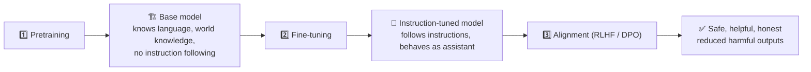

# Pretraining: Overview, Tokenization and Objectives

Pretraining turns a randomly initialised network into a base model by training it to predict text over trillions of tokens. This chapter gives the big picture of a pretraining run and covers two foundations the rest of the module builds on - how text becomes tokens, and which training objective each architecture uses - then points to the chapters that go deep on data, scaling, distributed training and stability.

```objectives
time: 45 min
outcomes:
  - Describe the stages from pretraining to an aligned assistant, and the scale (tokens, GPU-hours, cost) of a modern pretraining run
  - Train and apply a BPE tokenizer, and compare tokenization algorithms and vocabulary sizes by their effect on sequence length
  - Write the loss for causal LM, masked LM and span corruption, and explain label shifting and padding masks
  - Map each part of a pretraining run to the chapter that covers it in depth
prerequisites:
  - "[LLM Fundamentals](../../01-LLM-Foundations/Notes/01-LLM-Fundamentals.mdx) and [Model Architecture Types](../../01-LLM-Foundations/Notes/04-Model-Architecture-Types.mdx)"
```

## Pre-Training

### Concept

Pretraining is the large-scale phase where a model learns general language understanding from massive unlabeled text corpora. It requires enormous compute and data but is done only once - the resulting base model is then fine-tuned for specific tasks.

**The three stages of an LLM's life:**


**Scale of pretraining:**
- Llama 3 8B: ~15 trillion tokens (15T), ~1.3M H100 GPU-hours (Meta model card; the 70B took ~6.4M)
- Frontier closed models do not publish token counts or compute; open reports (Llama 3, DeepSeek-V3, Qwen3) are the reliable reference points
- Rule of thumb: at roughly $2-4 per H100-hour, **1M GPU-hours costs ~$2M-$4M** in cloud compute (a frontier run is tens of millions of GPU-hours)

---

## Tokenization

### Concept

Before training, all text is converted to token sequences using a fixed vocabulary tokenizer built from the training data.

**Byte-Pair Encoding (BPE) - step by step:**

```
Initial vocabulary: all individual bytes (256 symbols)

Training procedure:
1. Split all training text into characters/bytes
2. Count frequency of all adjacent symbol pairs
3. Merge the most frequent pair into a new symbol
4. Repeat until vocabulary reaches target size (e.g., 32K)

Example:
  Text: "low lower lowest"
  Initial: [l,o,w] [l,o,w,e,r] [l,o,w,e,s,t]
  Most frequent pair: (l,o) → merge to (lo)
  → [lo,w] [lo,w,e,r] [lo,w,e,s,t]
  Most frequent pair: (lo,w) → merge to (low)
  → [low] [low,e,r] [low,e,s,t]
  ...continues until target vocab size
```

**Tokenization algorithms - full comparison:**

| Algorithm | Description | Characteristics | Used by | Pros | Cons |
|-----------|-------------|-----------------|---------|------|------|
| Whitespace | Splits on spaces | Fast, naive | Early NLP tools | Very simple | Poor for subword languages |
| Character-level | Each char is a token | Fine-grained | Some toy/code models | Robust to OOV | Long sequences |
| Word-level | Splits on words | Basic NLP | NLTK, SpaCy | Easy to read | Poor generalization |
| BPE (Byte-Pair Encoding) | Merges most frequent subword pairs | Greedy, deterministic | GPT-2, RoBERTa, CodeBERT | Efficient, fast | Doesn't adapt well |
| WordPiece | Probabilistic merges | Likelihood-based | BERT, DistilBERT | Better OOV handling | Slightly slower |
| Unigram Language Model | Chooses most likely subword sequence | Probabilistic | ALBERT, T5, Gemini | Flexible, language-agnostic | More complex |
| SentencePiece (BPE/Unigram) | Works on raw UTF-8 bytes | Multilingual models | T5, mT5, Gemini | No pre-tokenization needed | May be less readable |
| Byte-Level BPE | Extends BPE to raw bytes | Includes spaces, emojis | GPT-2, GPT-Neo, GPT-J | No UNK tokens | Tokens may be unreadable |
| SentencePiece (byte-level) | Uses bytes with Unigram | Language-agnostic | PaLM, Gemini | Works on all scripts | Needs detokenization mapping |
| tiktoken (OpenAI) | Byte-level BPE (open-source library) | Special tokens, efficient | GPT-3.5, GPT-4, GPT-4o, Llama 3 (tiktoken-based) | Very fast | Vocabularies tied to specific model families |

**Key practical notes:**
- **SentencePiece (LLaMA 1/2, Gemma, T5):** Works on raw text without pre-tokenization - handles all languages and code uniformly; no whitespace issues.
- **tiktoken (OpenAI):** GPT-4 uses `cl100k_base` (~100K vocabulary); GPT-4o and later use `o200k_base` (~200K). Larger vocabularies cut token counts, especially for non-English text and code. Llama 3 moved from SentencePiece to a tiktoken-based 128K BPE vocabulary for the same reason.
- **Multilingual/emoji-rich datasets:** Always use byte-level tokenization to avoid OOV.
- **Training vs inference:** Tokenizer must match exactly - inconsistency causes silent failures.

**Tokenizer implementations across provider ecosystems:**

| Provider | Tokenizer/Model | Algorithm | Notes |
|----------|----------------|-----------|-------|
| Hugging Face | BertTokenizer | WordPiece | For BERT and variants |
| | GPT2Tokenizer | Byte-Level BPE | GPT-2, GPT-Neo |
| | RobertaTokenizer | BPE | No space token splitting |
| | T5Tokenizer | SentencePiece (Unigram) | Used in T5, mT5 |
| | LlamaTokenizer | SentencePiece (BPE) | Used in LLaMA 1/2 (Llama 3 switched to a tiktoken-based BPE) |
| | BloomTokenizer | Byte-Level BPE | For BLOOM |
| Google | Gemini, Gemma | SentencePiece (~256K vocabulary) | Gemma reuses Gemini's SentencePiece vocabulary |
| | PaLM / T5 / mT5 | SentencePiece (Unigram) | Internal tokenizer tools |
| AWS Bedrock | Claude (Anthropic) | Proprietary | Not publicly documented; count tokens with the provider's token-counting API |
| | Mistral / LLaMA | SentencePiece (BPE) | HF model hosted via Bedrock |
| OpenAI | GPT-3.5/GPT-4, GPT-4o+ | tiktoken BPE (`cl100k_base`, `o200k_base`) | Open-source encoder library |
| Meta | LLaMA 1/2 | SentencePiece (BPE), 32K vocab | Open |
| Meta | Llama 3+ | tiktoken-based BPE, 128K vocab | Open, better multilingual compression |

**Popular tokenization libraries:**

| Library | Algorithms supported | Notes |
|---------|---------------------|-------|
| `transformers` (HuggingFace) | BPE, WordPiece, Unigram, SentencePiece | Easy integration |
| `tokenizers` (HuggingFace) | Fast Rust-based tokenizers | Train your own |
| `sentencepiece` | BPE, Unigram | Used by Google models |
| `tiktoken` | GPT BPE | Used in OpenAI APIs |

---

## Training Objectives

### Concept

**Causal Language Modeling (CLM) - Decoder-only:**
```
Input:   "The cat sat on the mat"
Targets: "cat sat on the mat <EOS>"
Loss:    CrossEntropy(logits, targets) averaged over all non-padding positions
```

The model sees tokens 0..t-1 and predicts token t. This is why causal masking is applied during training - the model must predict each position without seeing future tokens. The loss is the average cross-entropy over all predicted positions in the sequence.

**Masked Language Modeling (MLM) - Encoder-only (BERT):**
```
Input:   "The [MASK] sat on the [MASK]"
Targets: "cat" and "mat"
Loss:    CrossEntropy only on masked positions
```

15% of tokens are replaced: 80% with [MASK], 10% with a random token, 10% kept unchanged (this mix helps the model generalize beyond just masked positions).

**Span Corruption - Encoder-Decoder (T5):**
```
Input:   "The <X> on the mat. The <Y> is fluffy."  (spans replaced by sentinels)
Target:  "<X> cat sat <Y> cat"
Loss:    CrossEntropy on the decoder's output
```

---

### Code

```python
# Minimal CLM training loop (conceptual)
import torch
from transformers import AutoTokenizer, AutoModelForCausalLM
from torch.optim import AdamW
from torch.optim.lr_scheduler import CosineAnnealingLR

model_name = "gpt2"  # small, runnable locally
tokenizer = AutoTokenizer.from_pretrained(model_name)
model = AutoModelForCausalLM.from_pretrained(model_name)

tokenizer.pad_token = tokenizer.eos_token

# Sample training data
texts = [
    "The transformer architecture revolutionized NLP.",
    "Scaling laws predict model performance from compute.",
]

def tokenize(texts, max_length=64):
    return tokenizer(
        texts, 
        truncation=True, 
        padding="max_length", 
        max_length=max_length,
        return_tensors="pt"
    )

optimizer = AdamW(model.parameters(), lr=1e-4, weight_decay=0.01)
scheduler = CosineAnnealingLR(optimizer, T_max=100)

model.train()
for step in range(10):
    batch = tokenize(texts)
    input_ids = batch["input_ids"]
    attention_mask = batch["attention_mask"]
    
    # Labels = input_ids shifted by 1 (CLM: predict next token)
    # HuggingFace handles the shift internally when labels == input_ids
    labels = input_ids.clone()
    labels[attention_mask == 0] = -100  # ignore padding in loss

    outputs = model(input_ids=input_ids, attention_mask=attention_mask, labels=labels)
    loss = outputs.loss

    optimizer.zero_grad()
    loss.backward()
    torch.nn.utils.clip_grad_norm_(model.parameters(), 1.0)  # gradient clipping
    optimizer.step()
    scheduler.step()

    print(f"Step {step}: loss={loss.item():.4f}")

# BPE tokenizer training demo (HuggingFace `tokenizers`)
from tokenizers import Tokenizer
from tokenizers.models import BPE
from tokenizers.trainers import BpeTrainer
from tokenizers.pre_tokenizers import Whitespace

tokenizer_bpe = Tokenizer(BPE(unk_token="[UNK]"))
tokenizer_bpe.pre_tokenizer = Whitespace()
trainer = BpeTrainer(vocab_size=1000, special_tokens=["[UNK]", "[CLS]", "[PAD]", "[MASK]"])
# trainer.train(["corpus.txt"])  # train on your corpus
print("BPE tokenizer configured (needs corpus file to actually train)")
```

---

## The Rest of a Pretraining Run

The other ingredients each have a chapter in this module:

| Topic | Key ideas | Chapter |
|---|---|---|
| **Data** | Web-scale extraction, language ID, exact and MinHash near-deduplication, classifier-based quality filtering (FineWeb-Edu, DCLM), PII removal, mixtures and annealing - Llama 3's final mix was roughly 50% general knowledge, 25% maths and reasoning, 17% code, 8% multilingual | [Data Curation & Mixtures](03-Data-Curation-and-Mixtures.mdx) |
| **Scale** | Loss falls as a power law in parameters, data and compute; Chinchilla's compute-optimal ratio is ~20 tokens per parameter; modern models train far beyond it because smaller models are cheaper to serve (Llama 3 8B saw ~15T tokens) | [Scaling Laws & Compute Budgets](04-Scaling-Laws-and-Compute-Budgets.mdx) |
| **Parallelism** | Data, tensor, pipeline, context and expert parallelism; ZeRO/FSDP sharding; mixed-precision Adam needs ~16 bytes per parameter of model state - 8× the bf16 weights - before activations | [Distributed Training at Scale](05-Distributed-Training-at-Scale.mdx) and [GPU & Hardware](02-GPU-and-Hardware.mdx) |
| **Stability** | Warmup plus cosine or warmup-stable-decay schedules, gradient clipping, loss-spike handling, QK-norm, z-loss, optimizer choices (AdamW, Muon) | [Training Stability & Optimizers](06-Training-Stability-and-Optimizers.mdx) |
| **Hardware** | GPU generations, interconnects, MFU | [Accelerators & Interconnects](07-Accelerators-and-Interconnects.mdx) |

Two memory techniques appear in every run and are worth knowing here: **mixed precision** (bf16 compute with fp32 master weights) and **gradient checkpointing** (discard most activations in the forward pass and recompute them during backward - roughly one extra forward pass, about 30% more compute, for a large cut in activation memory).

---

## Study Notes

- Pretraining = next-token (or masked/span) prediction over trillions of tokens; post-training turns the base model into an assistant
- Llama 3 8B: ~15T tokens and ~1.3M H100 GPU-hours; 1M GPU-hours is roughly $2-4M at cloud prices
- BPE builds a vocabulary by repeatedly merging the most frequent adjacent pair; byte-level BPE never needs an unknown token
- Larger vocabularies (Llama 3's 128K, OpenAI's o200k) shorten sequences, especially for code and non-English text
- CLM: cross-entropy on every next token, labels shifted by the framework, padding masked with -100; MLM: 15% of tokens selected (80/10/10); T5: sentinel span corruption
- Data, scaling, parallelism, stability and hardware each have their own chapter

## Check Yourself

```quiz
- q: "Why did Llama 3 move from a 32K SentencePiece vocabulary to a 128K tiktoken-based BPE vocabulary?"
  options:
    - "Larger vocabularies encode text in fewer tokens, especially non-English text and code, lowering compute per document"
    - "SentencePiece cannot handle bytes"
    - "Smaller vocabularies cause more hallucination"
    - "tiktoken is the only open-source tokenizer"
  answer: 1
- q: "In Hugging Face causal-LM training, what should `labels` be set to at padding positions?"
  options: ["-100, so they are ignored by the loss", "0", "The pad token id", "The EOS token id"]
  answer: 1
- q: "In BERT's masked-LM objective, what happens to the 15% of selected tokens?"
  answer: "80% are replaced with [MASK], 10% with a random token, and 10% are left unchanged - so the model can't rely on seeing [MASK] to know where to predict, which also matches fine-tuning inputs that contain no [MASK] tokens."
- q: "A 1B-parameter model is trained on 20B tokens. Roughly how many training FLOPs is that?"
  options: ["1.2 × 10²⁰", "2 × 10¹⁹", "1.2 × 10¹⁸", "6 × 10²¹"]
  answer: 1
  explain: "Training compute ≈ 6 × N × D = 6 × 10⁹ × 2 × 10¹⁰ = 1.2 × 10²⁰ FLOPs."
```

## Exercises

```exercise
- title: Train a tokenizer and measure it
  task: |
    Train byte-level BPE tokenizers with vocabulary sizes 8K, 32K and 128K on the same 100 MB text sample (Hugging Face `tokenizers`). For a held-out English sample, a Python file and a non-English sample, report tokens per 1,000 characters for each.
  solution: |
    Tokens per character fall as the vocabulary grows, with diminishing returns for English and larger gains for code and non-English text (if they are in the training sample). The trade-off: a larger vocabulary means a larger embedding and output matrix (vocab × d_model each) and rarer tokens with fewer training examples each.
- title: BPE by hand
  task: |
    Run BPE merges by hand on the corpus "low low low lower lowest newest newest" until you have made four merges. Show the merge list and the final segmentation of "lowest".
  solution: |
    Word counts: low ×3, lower ×1, lowest ×1, newest ×2. Merge 1: (l, o) with 5 occurrences (tied with (o, w) - ties are broken by the implementation's ordering). Merge 2: (lo, w) -> low, 5. Merge 3: (e, s) -> es, 3 (lowest + newest ×2; tied with (s, t)). Merge 4: (es, t) -> est, 3. Final segmentations: low = [low], lower = [low, e, r], lowest = [low, est], newest = [n, e, w, est].
```

## References

- Sennrich et al., [Neural Machine Translation of Rare Words with Subword Units (BPE)](https://arxiv.org/abs/1508.07909) (2016)
- Kudo and Richardson, [SentencePiece](https://arxiv.org/abs/1808.06226) (2018)
- Devlin et al., [BERT](https://arxiv.org/abs/1810.04805) (2019); Raffel et al., [T5](https://arxiv.org/abs/1910.10683) (2020)
- Grattafiori et al., [The Llama 3 Herd of Models](https://arxiv.org/abs/2407.21783) (2024)
- Chen et al., [Training Deep Nets with Sublinear Memory Cost (gradient checkpointing)](https://arxiv.org/abs/1604.06174) (2016)
- Meta, [Llama 3 model card](https://github.com/meta-llama/llama3/blob/main/MODEL_CARD.md) (2024)

*Last reviewed: 2026-09*
