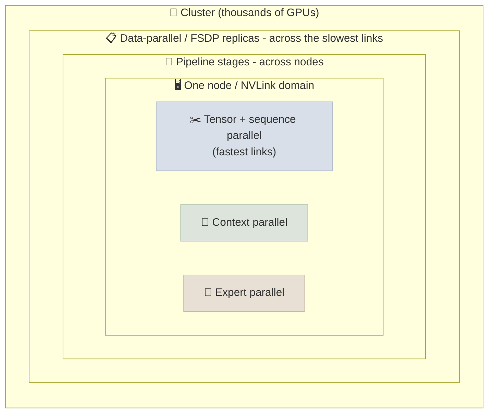

# Distributed Training at Scale

[GPU & Hardware](02-GPU-and-Hardware.mdx) introduced data, tensor and pipeline parallelism and ZeRO. Frontier runs combine all of them - plus context and expert parallelism - across tens of thousands of GPUs, and they have to survive hardware failures every few hours. This note is about how those pieces fit together, how low-precision (FP8) training works, and how you know whether a run is efficient.

```objectives
time: 60 min
outcomes:
  - Explain 4D/5D parallelism (data/FSDP, tensor, pipeline, context, expert) and map each dimension onto the network hierarchy
  - Choose a parallelism layout for a given model size, sequence length and cluster
  - Explain how FP8 training works (formats, scaling granularity, what stays in higher precision)
  - Compute and interpret model FLOPs utilization (MFU)
  - Describe the fault-tolerance machinery a multi-week run needs
prerequisites:
  - "[GPU & Hardware](02-GPU-and-Hardware.mdx) - DP, TP, PP, ZeRO"
  - "[PyTorch for LLMs](../../02-Prog-Langs/PyTorch/Notes/06-PyTorch-for-LLMs.mdx) - torchrun, FSDP2"
```

## The Parallelism Dimensions

| Dimension | What is split | Communication | Where it runs best |
|-----------|---------------|---------------|--------------------|
| **Data parallel (DP / FSDP / ZeRO)** | The batch; with FSDP also params, grads and optimizer state | All-gather params, reduce-scatter grads (FSDP) or all-reduce grads (DDP) | Across nodes - tolerant of lower bandwidth |
| **Tensor parallel (TP)** | Individual weight matrices (heads, FFN columns/rows) | All-reduce (or reduce-scatter + all-gather) twice per layer | **Inside a node** over NVLink - very bandwidth-hungry |
| **Sequence parallel (SP)** | Activations for the norm and dropout regions along the sequence, alongside TP | Replaces TP's all-reduces with reduce-scatter/all-gather | Same group as TP |
| **Pipeline parallel (PP)** | Layers into stages | Point-to-point activations between stages | Across nodes; costs a "bubble" of idle time |
| **Context parallel (CP)** | The sequence dimension for attention (ring attention) | K/V blocks passed around a ring of GPUs | Long-context training (128K+) |
| **Expert parallel (EP)** | MoE experts across GPUs | All-to-all token dispatch and combine | MoE models; needs fast all-to-all |



**The layout rule:** put the most communication-heavy dimension on the fastest links. TP talks every layer, so it stays inside an NVLink domain (8 GPUs on HGX servers, 72 on a GB200 NVL72 rack). DP/FSDP talks once per step (and overlaps with compute), so it spans the data-center network.

**A published example - Llama 3 405B** (16K H100s): TP = 8 within each server, PP = 16 across servers, CP up to 16 for long-context stages, and data parallelism across the rest, with a modified FSDP. Meta reported 38-43% MFU in BF16.

### The pipeline bubble

With p pipeline stages and m micro-batches per step, a simple 1F1B schedule leaves each GPU idle for roughly `(p - 1) / (m + p - 1)` of the step. More micro-batches shrink the bubble; interleaved schedules (several smaller stages per GPU) and DeepSeek's **DualPipe** (which overlaps forward and backward chunks, and their communication) shrink it further.

### Context parallelism

Attention's memory grows with sequence length, and at 128K tokens even FlashAttention's activations don't fit on one GPU for a large model. **Ring attention** splits the sequence across GPUs: each holds a chunk of queries and passes key/value chunks around a ring, computing blockwise attention as they arrive, overlapping communication with compute.

### Expert parallelism

An MoE layer sends each token to its top-k experts, which live on different GPUs. That means two **all-to-all** exchanges per MoE layer (dispatch and combine). The costs to manage: load imbalance (a hot expert stalls everyone), and all-to-all bandwidth across nodes. DeepSeek-V3 limited each token to experts on at most 4 nodes and wrote custom communication kernels to overlap it with compute.

---

## FP8 Training

### Concept

Hopper and Blackwell GPUs run FP8 matrix multiplies at roughly twice their BF16 throughput. FP8 has two formats:

| Format | Exponent / mantissa | Typical use |
|--------|---------------------|-------------|
| E4M3 | 4 / 3 | Weights and activations (forward) - more precision |
| E5M2 | 5 / 2 | Gradients (backward) - more range |

FP8's range is tiny, so every tensor needs a **scale factor**. The granularity of that scale is the main design choice:

- **Per-tensor scaling** (NVIDIA Transformer Engine's original recipe): one scale per tensor, often computed from a history of recent maximum values ("delayed scaling"). Simple, but one outlier value wastes the range for the whole tensor.
- **Fine-grained scaling** (DeepSeek-V3): per 1×128 tile for activations and per 128×128 block for weights, with higher-precision accumulation. It tolerates outliers and was used to train a 671B MoE in FP8 end to end.
- **Microscaling formats** (MXFP8, and the 4-bit MXFP4/NVFP4 on Blackwell): the scale is part of the format - one shared scale per small block of values - so hardware applies it directly.

What stays in higher precision: master weights and optimizer state (FP32), and sensitive operations - embeddings, the output head, normalization, attention softmax, and often the MoE router.

DeepSeek-V3's full training took 2.788M H800 GPU-hours, which DeepSeek attributes in part to FP8 training and its communication/compute overlap.

---

## Measuring Efficiency: MFU

```
MFU = achieved model FLOPs per second / peak hardware FLOPs per second
    = (6 · N · tokens_per_second) / (num_gpus · peak_flops_per_gpu)
```

Use the **dense** peak (vendor spec sheets often quote sparse numbers that are 2× higher) in the precision you actually train in. Rough bands for large dense models on H100-class GPUs:

| MFU | Interpretation |
|-----|----------------|
| < 20% | Something is wrong - data loading, tiny micro-batches, communication not overlapped, many small kernels |
| 30-45% | Typical for well-tuned large runs (Llama 3 405B: 38-43% in BF16) |
| > 50% | Excellent; usually needs custom kernels and careful overlap |

Hardware FLOPs utilization (HFU) also counts recomputed activations, so HFU ≥ MFU when activation checkpointing is on.

---

## Fault Tolerance

At 16K GPUs, failures are routine. During a 54-day period of Llama 3 405B pretraining, Meta logged 466 job interruptions, 419 of them unexpected - most traced to GPU or HBM faults, with others from network, host and software issues. The run still achieved over 90% effective training time.

What a large run needs:

- **Frequent, fast checkpoints.** Asynchronous, sharded saves (e.g. `torch.distributed.checkpoint.async_save`) so saving doesn't stall training; in-memory or local-SSD checkpoints between slower remote saves.
- **Automated detection and restart.** Health checks, NCCL timeouts and watchdogs to catch hung collectives; spare nodes to swap in; automatic resume from the last checkpoint.
- **Deterministic data loading.** The data loader must resume at exactly the right sample after a restart, or you silently repeat or skip data.
- **Straggler and silent-corruption detection.** One slow GPU slows every synchronous step; silent data corruption shows up as unexplained loss spikes, so compare per-rank statistics and replay suspicious steps.

---

## Check Yourself

```quiz
- q: "Why is tensor parallelism normally kept within a single NVLink domain?"
  options:
    - "It performs collectives inside every layer, so it needs the highest-bandwidth, lowest-latency links"
    - "It only works with 8 GPUs"
    - "It cannot be combined with data parallelism across nodes"
    - "NCCL does not support tensor parallelism over InfiniBand"
  answer: 1
- q: "A run has 16 pipeline stages and 16 micro-batches per step with a plain 1F1B schedule. Roughly what fraction of time is the pipeline bubble?"
  options:
    - "About 48%"
    - "About 6%"
    - "About 94%"
    - "0% - 1F1B has no bubble"
  answer: 1
  explain: "(p - 1) / (m + p - 1) = 15 / 31 ≈ 48%. You would raise the micro-batch count, use an interleaved schedule, or reduce pipeline depth."
- q: "Why did DeepSeek-V3 use fine-grained (tile and block) FP8 scaling instead of one scale per tensor?"
  answer: "Activations and weights contain outliers. With one scale per tensor, a few large values force a coarse scale that crushes the precision of everything else. Scaling per small tile or block confines each outlier's effect to its own block."
- q: "A cluster of 1,024 H100s trains a 70B dense model at 1.0M tokens/second. What is the MFU in BF16?"
  options:
    - "About 41%"
    - "About 14%"
    - "About 83%"
    - "About 4%"
  answer: 1
  explain: "6 × 70e9 × 1.0e6 = 4.2e17 FLOP/s achieved; peak = 1,024 × 989e12 ≈ 1.01e18. 4.2e17 / 1.01e18 ≈ 0.41."
```

## Exercises

```exercise
- title: Choose a layout
  task: |
    You are pretraining a 70B dense model with an 8K context on 1,024 H100s (128 nodes of 8 GPUs, NVLink inside each node, 400 Gb/s InfiniBand per GPU between nodes). Mixed-precision AdamW needs ~16 bytes of model state per parameter.

    Propose TP, PP and DP/FSDP degrees. Show that model state fits in 80 GB per GPU, and say which dimension you would add later for a 128K-context extension stage.
  solution: |
    One reasonable layout: TP = 8 (one node), PP = 1 or 2, FSDP across the remaining 64-128 ways. Model state = 70e9 × 16 B ≈ 1.12 TB. With TP = 8 and FSDP = 128 (PP = 1), each GPU holds ≈ 1.12 TB / 1,024 ≈ 1.1 GB of sharded state plus gathered layer weights and activations - comfortable. For the 128K stage, add context parallelism (e.g. CP = 4-16) so attention activations for the long sequence fit, reducing the FSDP degree accordingly.
- title: Measure a small run
  task: |
    Take the [GPT From Scratch lab](../../02-Prog-Langs/PyTorch/CodeLabs/02-GPT-From-Scratch.mdx), run it on one GPU, and compute its MFU from the logged tokens/second (use 6 × parameters for FLOPs per token and your GPU's dense BF16 peak). Then enable `--compile` and recompute. Why is MFU for a 10M-parameter model so much lower than for a 70B model?
```

## Study Notes

**Must-know:**
- Five parallelism dimensions: DP/FSDP, TP (+SP), PP, CP (ring attention), EP (all-to-all)
- Map the chattiest dimension to the fastest links: TP inside an NVLink domain; DP/FSDP across the network
- Pipeline bubble ≈ (p - 1)/(m + p - 1); shrink with more micro-batches, interleaving, DualPipe
- FP8: E4M3 forward / E5M2 backward; scaling granularity (per-tensor, fine-grained, microscaling) is the key design choice; master weights and sensitive ops stay in higher precision
- MFU = 6N × tokens/s ÷ (GPUs × dense peak); 30-45% is typical for well-tuned large runs
- Failures are routine at scale; async sharded checkpoints, auto-restart and deterministic data loading are mandatory

## References

- Shoeybi et al., [Megatron-LM](https://arxiv.org/abs/1909.08053) (2019); Narayanan et al., [Efficient Large-Scale Language Model Training on GPU Clusters](https://arxiv.org/abs/2104.04473) (2021)
- Korthikanti et al., [Reducing Activation Recomputation in Large Transformer Models](https://arxiv.org/abs/2205.05198) (2022) - sequence parallelism
- Rajbhandari et al., [ZeRO](https://arxiv.org/abs/1910.02054) (2019); Zhao et al., [PyTorch FSDP](https://arxiv.org/abs/2304.11277) (2023)
- Liu et al., [Ring Attention with Blockwise Transformers](https://arxiv.org/abs/2310.01889) (2023)
- Micikevicius et al., [FP8 Formats for Deep Learning](https://arxiv.org/abs/2209.05433) (2022); Rouhani et al., [Microscaling Data Formats](https://arxiv.org/abs/2310.10537) (2023)
- DeepSeek-AI, [DeepSeek-V3 Technical Report](https://arxiv.org/abs/2412.19437) (2024) - fine-grained FP8, DualPipe, expert parallelism
- Llama Team, [The Llama 3 Herd of Models](https://arxiv.org/abs/2407.21783) (2024) - 4D parallelism, MFU, failure statistics
- Liang et al., [TorchTitan](https://arxiv.org/abs/2410.06511) (2024)

*Last reviewed: 2026-09*
