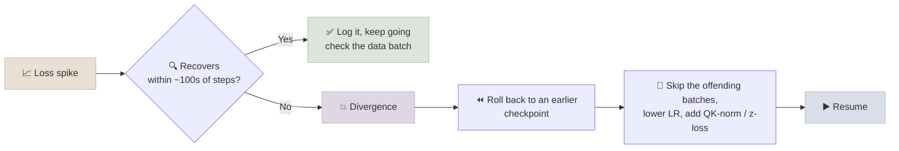
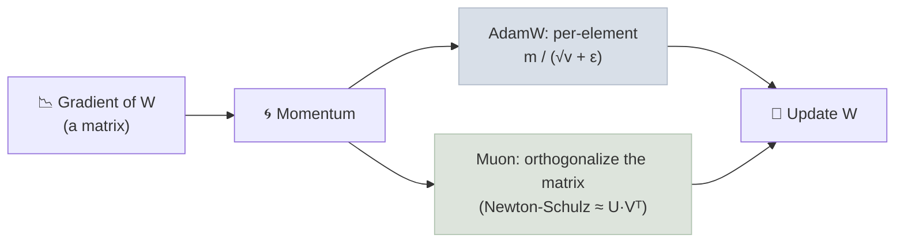

# Training Stability and Optimizers

A multi-month pretraining run can be lost to a single loss spike that never recovers. The techniques in this note - schedules, normalization tricks, hyperparameter transfer and newer optimizers - exist so a run that works at 100M parameters keeps working at 100B, without a full hyperparameter search at full scale.

```objectives
time: 50 min
outcomes:
  - Diagnose loss spikes and divergence and list the standard mitigations
  - Explain QK-norm, z-loss and logit soft-capping and the failure each one prevents
  - Compare cosine and warmup-stable-decay (WSD) schedules and explain why WSD suits continual training
  - Explain μP (hyperparameter transfer) at a conceptual level
  - Explain what Muon changes relative to AdamW, and why MuonClip was needed at trillion-parameter scale
prerequisites:
  - "[Distributed Training at Scale](05-Distributed-Training-at-Scale.mdx)"
  - "[Transformer Architecture](../../01-LLM-Foundations/Notes/02-Architecture.mdx) - Pre-LN, RMSNorm"
```

## What Instability Looks Like



Common causes: attention logits growing without bound, output logits drifting large, bad data (a batch of long repeated tokens or binary junk), learning rate too high for the batch size, and - at scale - hardware faults that silently corrupt values.

---

## The Standard Stabilizers

| Technique | What it does | Why it helps |
|-----------|--------------|--------------|
| **LR warmup** | Ramp the learning rate from ~0 over the first few thousand steps | Adam's variance estimates are unreliable at the start; large early updates destabilize |
| **Gradient clipping** (global norm, typically 1.0) | Rescale gradients whose total norm exceeds a threshold | Caps the damage of one bad batch |
| **AdamW with β₂ ≈ 0.95** | Shorter memory for the second-moment estimate than the default 0.999 | Adapts faster when gradient scale changes, reducing spikes |
| **Pre-norm + RMSNorm** | Normalize before each sub-layer | Keeps the residual stream well-conditioned in deep stacks |
| **QK-norm** | RMSNorm on queries and keys before the dot product | Bounds attention logits; prevents the attention-entropy collapse seen in very large runs |
| **z-loss** | Small penalty (e.g. 1e-4 × log²Z) on the softmax normalizer of the output logits | Stops output logits drifting to huge values (used in PaLM) |
| **Logit soft-capping** | `cap · tanh(logits / cap)` on attention and/or final logits | Hard ceiling on logit magnitude (Gemma 2) |
| **Batch skipping and rollback** | Restart from before a spike and skip the batches that triggered it | PaLM's practical fix when spikes didn't recover |

---

## Learning-Rate Schedules

### Cosine

Warm up, then decay along a cosine curve to ~10% of the peak by the planned final step. It is robust and well understood, but the schedule is tied to the total step count: stopping early, or continuing training later, means the learning rate was wrong for most of the run.

### Warmup-Stable-Decay (WSD)

Warm up, hold the peak learning rate constant for most of the run, then decay quickly (typically over the last 10-20%). Popularized by MiniCPM (2024):

- **Continual training is cheap.** Keep the constant-LR checkpoint; to train longer, resume from it and decay later. With cosine you would have to restart.
- **The decay phase is where loss drops** - which aligns naturally with annealing on high-quality data (see [Data Curation and Mixtures](03-Data-Curation-and-Mixtures.mdx)).
- **One run, many budgets.** Branch decays off the stable phase at several points to get scaling-law data from one run.

---

## μP: Hyperparameters That Transfer

With standard parametrization, the best learning rate and initialization scale shift as you widen the model, so a sweep done at 100M parameters doesn't tell you the right settings at 10B. **Maximal update parametrization (μP)** rescales initialization and per-layer learning rates by width so the optimal hyperparameters stay (approximately) constant as width grows. The workflow becomes: sweep on a small proxy, then train the large model with the same settings. Several open model reports (e.g. Cerebras-GPT, MiniCPM) use μP or close variants; others instead fit power laws for the optimal learning rate and batch size across scales (DeepSeek LLM).

---

## Optimizers Beyond AdamW

### Concept

**AdamW** is still the default: per-parameter adaptive step sizes from first and second moment estimates, with decoupled weight decay. Its cost is two FP32 state tensors per parameter - 8 of the ~16 bytes/parameter of mixed-precision training memory.

**Muon** (Jordan et al., 2024) treats each 2D weight matrix as a matrix rather than a bag of numbers. It takes the momentum-averaged gradient and **orthogonalizes** it (approximately, with a few Newton-Schulz iterations), so the update pushes equally in all directions of the matrix instead of being dominated by a few large singular directions. Embeddings, the output head and 1D parameters (norm gains) still use AdamW.

- Moonshot AI (Liu et al., 2025) scaled Muon to large LLMs with weight decay and per-matrix update-scale matching and reported roughly 2× compute efficiency relative to AdamW at compute-optimal training.
- Muon needs only one momentum buffer per parameter (less optimizer memory than Adam's two).
- **MuonClip** (Kimi K2): at trillion-parameter scale Muon produced exploding attention logits. Kimi K2 added *QK-clip* - rescale the query and key projection weights whenever the maximum attention logit exceeds a threshold - and reported pretraining on 15.5T tokens with no loss spikes.



---

## Check Yourself

```quiz
- q: "Why does a warmup-stable-decay (WSD) schedule make continual pretraining easier than cosine?"
  options:
    - "The stable-phase checkpoint is still at peak LR, so you can resume from it and decay later without restarting"
    - "WSD uses a lower peak learning rate"
    - "WSD removes the need for warmup"
    - "Cosine schedules cannot be checkpointed"
  answer: 1
- q: "Attention logits keep growing during a large run and training becomes unstable. Which technique targets that directly?"
  options:
    - "QK-norm (normalize queries and keys before the dot product)"
    - "z-loss on the output softmax"
    - "Increasing β₂ to 0.999"
    - "Removing weight decay"
  answer: 1
  explain: "z-loss targets the output logits' normalizer, not attention. Raising β₂ makes Adam slower to adapt, which usually worsens spikes."
- q: "What problem does μP solve?"
  answer: "Under standard parametrization, the optimal learning rate and initialization change with model width, so small-scale sweeps don't transfer. μP rescales initialization and per-layer learning rates so the optimal hyperparameters stay roughly constant with width: tune on a small proxy, reuse at full scale."
- q: "What does Muon do differently from AdamW for a hidden-layer weight matrix?"
  options:
    - "Orthogonalizes the momentum update of the whole matrix instead of scaling each element independently"
    - "Uses second-order Hessian information for every parameter"
    - "Removes momentum entirely"
    - "Applies Adam only to the output layer"
  answer: 1
```

## Exercises

```exercise
- title: WSD vs cosine in the GPT lab
  task: |
    Implement WSD in the [GPT From Scratch lab](../../02-Prog-Langs/PyTorch/CodeLabs/02-GPT-From-Scratch.mdx) (hold the peak LR until 80% of steps, then decay linearly). Train the same model with cosine and WSD for the same steps and compare final validation loss. Then continue the WSD run for 50% more steps from its 80% checkpoint, and explain why you can't do the same cleanly with cosine.
- title: Diagnose a spike
  task: |
    At step 41,200 of a 7B run, loss jumps from 2.10 to 3.40, the global gradient norm jumps 20×, and loss has not recovered after 500 steps. List, in order, what you would check and what you would do.
  solution: |
    1. Inspect the batches around step 41,200 for bad data (long repeated sequences, binary junk, a single dominant source).
    2. Check per-layer statistics: attention and output logit magnitudes, activation norms, and per-rank loss (to rule out a faulty GPU).
    3. Roll back to a checkpoint a few hundred steps before the spike, skip the offending data range, and resume.
    4. If it recurs: lower the peak LR or extend warmup; add QK-norm or z-loss if logits were growing; confirm gradient clipping is active; check for hardware errors on the ranks involved.
```

## Study Notes

**Must-know:**
- Stabilizers: warmup, grad-norm clipping, β₂ ≈ 0.95, pre-norm RMSNorm, QK-norm (attention logits), z-loss (output logits), soft-capping, skip-and-rollback
- WSD: constant LR then short decay - enables continual training and branching decays; the decay phase pairs with annealing data
- μP: parametrize so small-model hyperparameters transfer to large widths
- Muon: orthogonalized momentum updates for 2D matrices; ~2× compute efficiency reported at scale; MuonClip (QK-clip) fixed exploding attention logits in Kimi K2

## References

- Chowdhery et al., [PaLM](https://arxiv.org/abs/2204.02311) (2022) - z-loss, batch skipping on loss spikes
- Dehghani et al., [Scaling Vision Transformers to 22 Billion Parameters](https://arxiv.org/abs/2302.05442) (2023) - QK-norm for stability
- Wortsman et al., [Small-scale proxies for large-scale Transformer training instabilities](https://arxiv.org/abs/2309.14322) (2023)
- Yang et al., [Tensor Programs V: Tuning Large Neural Networks via Zero-Shot Hyperparameter Transfer (μP)](https://arxiv.org/abs/2203.03466) (2022)
- Hu et al., [MiniCPM](https://arxiv.org/abs/2404.06395) (2024) - WSD schedule
- Jordan et al., [Muon: An optimizer for hidden layers in neural networks](https://kellerjordan.github.io/posts/muon/) (2024)
- Liu et al., [Muon is Scalable for LLM Training](https://arxiv.org/abs/2502.16982) (2025)
- Kimi Team, [Kimi K2](https://arxiv.org/abs/2507.20534) (2025) - MuonClip / QK-clip
- Loshchilov & Hutter, [Decoupled Weight Decay Regularization (AdamW)](https://arxiv.org/abs/1711.05101) (2017)

*Last reviewed: 2026-09*
