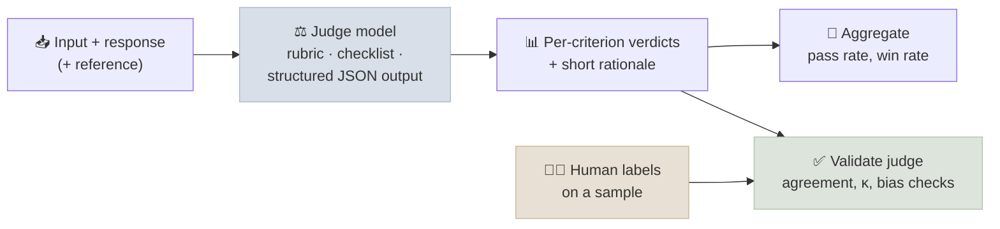

# LLM-as-Judge

Most useful LLM outputs - summaries, answers, plans, code reviews - have no single correct string to compare against. Human grading is accurate but slow and expensive. Using a strong model to grade outputs ("LLM-as-a-Judge", often abbreviated **LaaJ**) makes evaluation scale, but the judge brings its own biases. This note covers judge designs, the known biases, and how to validate a judge before trusting it.

```objectives
time: 40 min
outcomes:
  - Choose between pointwise (rubric) and pairwise judging, and reference-based vs reference-free grading
  - Name the main judge biases - position, verbosity, self-preference, style - and a mitigation for each
  - Write a judge prompt with an explicit rubric and structured output
  - Validate a judge against human labels and report agreement properly
prerequisites:
  - "[What Benchmarks Measure](01-What-Benchmarks-Measure.mdx)"
  - "Optional, later in the course: [Prompt & Context Engineering](../../05-Prompt-Engineering/INDEX.mdx) - structured outputs"
```

## Judge Designs

| Design | How | Good for | Watch out for |
|--------|-----|----------|---------------|
| **Pointwise with a rubric** | Judge scores one response against explicit criteria (e.g. 1-5 per criterion, or pass/fail per check) | Regression tracking, absolute quality bars | Score drift; coarse or vague scales |
| **Pairwise** | Judge picks the better of two responses | Comparing two models or prompts | Position bias; doesn't give absolute quality |
| **Reference-based** | Judge compares the response with a gold answer | Factual QA, extraction, anything with a known answer | Penalizes correct answers phrased differently if the rubric is careless |
| **Reference-free** | Judge assesses the response on its own merits | Open-ended writing, helpfulness | Judge's own knowledge limits and preferences |

**Binary checks beat vague scales.** "Does the answer cite the policy section? yes/no" is more reliable than "Rate accuracy 1-10". Decompose quality into a checklist of specific, independently judgeable criteria.



---

## Known Biases and Mitigations

| Bias | What happens | Mitigation |
|------|--------------|------------|
| **Position** | In pairwise judging, the judge favours the first (or second) response | Evaluate both orders; count a win only if consistent, otherwise a tie |
| **Verbosity** | Longer answers score higher regardless of quality | Rubric criteria that reward concision; length-controlled comparisons |
| **Self-preference** | A judge rates outputs from its own model family higher | Use a judge from a different family, or an ensemble |
| **Style and confidence** | Confident, well-formatted answers beat hedged correct ones | Criteria that check correctness separately from presentation |
| **Rubric leakage** | The model being evaluated was tuned against the same judge prompt | Keep the evaluation judge separate from any reward model used in training |

Zheng et al. (2023) found a strong judge's agreement with human experts on MT-Bench was comparable to agreement between humans, alongside clear position, verbosity and self-enhancement biases. Both findings still hold: judges are useful and measurably biased.

---

## A Judge Prompt Template

```text
You are grading an answer to a customer's billing question.

<question>{question}</question>
<policy_excerpt>{retrieved_policy}</policy_excerpt>
<answer>{answer}</answer>

Evaluate each criterion independently. For each, give a one-sentence reason, then a verdict.
1. correct: every factual claim is supported by the policy excerpt
2. complete: the answer addresses every part of the question
3. actionable: the customer knows exactly what to do next
4. no_invention: the answer does not invent fees, dates, or procedures

Return JSON: {"correct": {"reason": "...", "pass": true|false}, ...}
```

Put the reasoning **before** the verdict (so the verdict is conditioned on it), ask for structured output, and keep temperature at 0 (or average several samples) for stability.

---

## Validating a Judge

Before you trust a judge's numbers:

1. **Label a sample by hand** - 100-200 items, ideally by two people.
2. **Measure agreement** - accuracy against the human majority, and Cohen's κ (chance-corrected); compare with human-human agreement as the ceiling.
3. **Check the confusion matrix** - a judge that is lenient on false claims is worse than its accuracy suggests.
4. **Probe biases directly** - swap orders, pad answers with filler, and check scores move only when they should.
5. **Re-validate** when you change the judge model, the rubric, or the kind of outputs being judged.

---

## Check Yourself

```quiz
- q: "In a pairwise comparison, the judge prefers response A when A is shown first, and B when B is shown first. How should you record it?"
  options:
    - "As a tie - the preference is driven by position, not quality"
    - "As a win for A"
    - "As a win for B"
    - "Discard the judge"
  answer: 1
- q: "Why is 'pass/fail per specific criterion' usually more reliable than a single 1-10 score?"
  options:
    - "Narrow, concrete questions are easier to judge consistently and easier to validate against humans"
    - "Binary outputs use fewer tokens"
    - "1-10 scales are not supported by structured output"
    - "It removes position bias"
  answer: 1
- q: "Your judge agrees with human labels 82% of the time. Two human annotators agree with each other 85% of the time. What does that suggest?"
  answer: "The judge is close to the human ceiling on this task, so it is probably usable - provided the disagreements aren't concentrated on the errors you care most about (check the confusion matrix) and the bias probes pass."
```

## Exercises

```exercise
- title: Build and validate a judge
  task: |
    Pick a task you care about (e.g. summarizing support tickets). Collect 60 model outputs and label each pass/fail on three criteria yourself. Write a judge prompt with those criteria, run it, and report per-criterion accuracy and Cohen's κ against your labels. Then run a position-swap or padding probe and report whether the judge's verdicts changed.
- title: Reduce verbosity bias
  task: |
    Take 30 pairs where one answer is correct and concise and the other is correct but padded with 3× the text. Measure how often your judge prefers the padded answer, then revise the rubric to fix it and measure again.
```

## Study Notes

**Must-know:**
- Pointwise (rubric) vs pairwise; reference-based vs reference-free; prefer decomposed binary criteria
- Biases: position, verbosity, self-preference, style/confidence, rubric leakage - with a mitigation for each
- Judge prompt: explicit criteria, reasoning before verdict, structured output, low temperature
- Validate against human labels (accuracy, κ, confusion matrix) and probe biases before trusting scores

## References

- Zheng et al., [Judging LLM-as-a-Judge with MT-Bench and Chatbot Arena](https://arxiv.org/abs/2306.05685) (2023)
- Liu et al., [G-Eval: NLG Evaluation using GPT-4 with Better Human Alignment](https://arxiv.org/abs/2303.16634) (2023)
- Dubois et al., [Length-Controlled AlpacaEval](https://arxiv.org/abs/2404.04475) (2024)
- Panickssery et al., [LLM Evaluators Recognize and Favor Their Own Generations](https://arxiv.org/abs/2404.13076) (2024)
- Cohen, [A Coefficient of Agreement for Nominal Scales](https://doi.org/10.1177/001316446002000104) (1960)

*Last reviewed: 2026-09*
