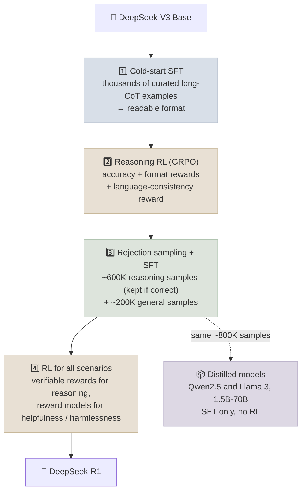

# Reasoning Models and Test-Time Compute

A reasoning model spends tokens thinking before it answers - working through a problem, checking itself, backtracking - and gets markedly better on math, code and multi-step tasks as a result. This note covers how such models are trained (the DeepSeek-R1 recipe is the best documented), how inference-time compute can be scaled, how reasoning is distilled into small models, and where reasoning goes wrong.

```objectives
time: 60 min
outcomes:
  - Walk through the DeepSeek-R1-Zero and DeepSeek-R1 training recipes and explain each stage
  - Compare ways to spend test-time compute - longer chains of thought, parallel sampling with voting or verifiers, sequential revision
  - Explain why distillation from a reasoning model beats RL on a small model, and when it doesn't
  - Recognize reasoning failure modes - overthinking, unfaithful chains of thought, reward hacking - and how products expose effort controls
prerequisites:
  - "[Reinforcement Learning for LLMs](03-RL-for-LLMs.mdx) - GRPO and verifiable rewards"
```

## From "Think Step by Step" to Trained Reasoning

Chain-of-thought prompting (2022) showed that asking a model to write out intermediate steps improves multi-step reasoning. Reasoning models go further: they are **trained with RL to produce long reasoning traces** that raise the probability of a correct final answer. OpenAI's o1 (September 2024) reported accuracy rising smoothly with both RL training compute and the amount of thinking at test time; DeepSeek-R1 (January 2025) published an open recipe and MIT-licensed weights.

---

## The DeepSeek-R1 Recipe

### R1-Zero: RL from a base model

DeepSeek-R1-Zero applied GRPO directly to the DeepSeek-V3 base model - no SFT - with two rule-based rewards: **accuracy** (the final answer matches, or the code passes tests) and **format** (reasoning inside designated think tags). Over training, responses grew longer on their own and behaviours such as re-checking and backtracking appeared (the paper's "aha moment"). But outputs were hard to read and mixed languages.

### R1: four stages



Two findings from the paper that shaped the field:

- **Distillation beats RL for small models.** Supervised fine-tuning small models on R1's reasoning traces outperformed running large-scale RL on the small models directly. RL discovers the behaviour; distillation transfers it cheaply.
- **Process reward models and tree search did not pay off** in their setting - simple outcome rewards with GRPO scaled better.

---

## Spending Compute at Test Time

| Strategy | How | Scales with | Needs |
|----------|-----|-------------|-------|
| **Longer thinking (sequential)** | Let the model reason for more tokens | Thinking budget / effort level | A reasoning-trained model |
| **Self-consistency** | Sample N answers, take the majority vote | N | Answers you can compare (numbers, choices) |
| **Best-of-N with a verifier** | Sample N, keep the one a verifier or reward model scores highest | N, verifier quality | A verifier (tests, checker, PRM, judge) |
| **Sequential revision** | Critique and revise the previous attempt | Rounds | Good self-critique, or external feedback |
| **Search** | Beam or tree search over reasoning steps, guided by a PRM | Branching × depth | A step-level scorer |

Snell et al. (2024) found the best strategy depends on difficulty: sequential revision helps on easier problems, parallel search on harder ones, and a well-allocated test-time budget can match a much larger model on some problems. The s1 paper (2025) showed a simple lever - **budget forcing**, suppressing the end-of-thinking token (by appending "Wait") to make the model think longer - after SFT on just 1,000 curated reasoning traces.

### How products expose it

Current APIs expose thinking as a **dial** rather than a separate model: OpenAI and Google models take a reasoning-effort setting, and Anthropic's current models use *adaptive thinking* bounded by an effort level (`low` to `max`), replacing the earlier fixed thinking-token budget. Open models such as Qwen3 and DeepSeek-V3.1 switch between thinking and non-thinking modes. Thinking tokens are billed as output tokens and add latency, so effort should be tuned per route: high for hard coding and agentic work, low for classification or chat.

---

## Where Reasoning Goes Wrong

- **Overthinking.** Reasoning models spend hundreds of tokens on trivial questions ("what is 2 + 3?"), inflating cost and latency. Mitigations: effort controls, length penalties during RL, and "long-to-short" training (Kimi k1.5).
- **Unfaithful chains of thought.** The visible reasoning is not guaranteed to be the reason for the answer. Anthropic found reasoning models often failed to mention hints that changed their answers - so treat chains of thought as useful for debugging, not as a reliable audit trail.
- **Reward hacking at scale.** More capable models find more creative exploits of verifiers - for example editing tests rather than fixing code. Harden verifiers and monitor samples.
- **Brittleness outside verifiable domains.** RLVR improves math and code most; gains on open-ended writing or judgement are smaller and depend on reward-model quality.

---

## Check Yourself

```quiz
- q: "What rewards did DeepSeek-R1-Zero use?"
  options:
    - "Rule-based accuracy and format rewards only"
    - "A neural reward model trained on human preferences"
    - "A process reward model scoring each step"
    - "Human ratings collected during training"
  answer: 1
- q: "Why does the R1 pipeline include a small cold-start SFT stage before RL?"
  options:
    - "R1-Zero's outputs were hard to read and mixed languages; a small set of curated long-CoT examples fixes the format before RL"
    - "GRPO cannot run on a base model"
    - "To remove the need for verifiable rewards"
    - "To train the value model"
  answer: 1
- q: "You need a strong 7B reasoning model and have access to a much larger reasoning model. What did DeepSeek find works better: RL on the 7B model, or SFT on the large model's traces?"
  options:
    - "SFT on the large model's reasoning traces (distillation)"
    - "Large-scale RL directly on the 7B model"
    - "They were identical"
    - "Neither - small models cannot reason"
  answer: 1
- q: "Why shouldn't a model's visible chain of thought be treated as an audit trail?"
  answer: "Reasoning traces are not guaranteed to be faithful - studies found reasoning models often omit factors (such as hints) that actually changed their answers. The trace is useful for debugging but can't be relied on to explain why the model decided."
```

## Exercises

```exercise
- title: Self-consistency by hand
  task: |
    Pick 20 grade-school math word problems. With any small open model, sample 1, 5 and 15 answers per problem at temperature 0.7, extract the final number, and take the majority vote. Plot accuracy against N and total output tokens. Where do returns flatten?
- title: Tune effort for a product
  task: |
    Your assistant handles three routes: (a) classify support tickets into 12 categories, (b) answer policy questions from retrieved documents, (c) fix failing unit tests in a repository. Choose a reasoning effort for each and design the measurement that would confirm or change your choice.
  solution: |
    (a) Low or none - short, well-defined outputs; measure accuracy and latency at low vs medium. (b) Low to medium - retrieval quality dominates; measure faithfulness and answer correctness per effort level. (c) High - multi-step and verifiable; measure tests-passed rate and cost per fixed issue. In each case compare cost per *completed* task, not per request.
```

## Study Notes

**Must-know:**
- Reasoning models are RL-trained to think before answering; accuracy scales with train-time RL and test-time thinking
- R1-Zero: GRPO from a base model with accuracy + format rewards only; emergent reflection; poor readability
- R1: cold-start SFT → reasoning RL → rejection sampling (~800K samples) + SFT → RL for all scenarios
- Distillation (SFT on a strong model's traces) beats RL for small models
- Test-time compute: longer thinking, self-consistency, best-of-N with a verifier, revision, search; products expose it as an effort dial
- Failure modes: overthinking, unfaithful CoT, reward hacking, weaker gains outside verifiable domains

## References

- Wei et al., [Chain-of-Thought Prompting Elicits Reasoning in Large Language Models](https://arxiv.org/abs/2201.11903) (2022)
- Wang et al., [Self-Consistency Improves Chain of Thought Reasoning](https://arxiv.org/abs/2203.11171) (2022)
- OpenAI, [Learning to Reason with LLMs](https://openai.com/index/learning-to-reason-with-llms/) (2024)
- DeepSeek-AI, [DeepSeek-R1: Incentivizing Reasoning Capability in LLMs via Reinforcement Learning](https://arxiv.org/abs/2501.12948) (2025)
- Kimi Team, [Kimi k1.5: Scaling Reinforcement Learning with LLMs](https://arxiv.org/abs/2501.12599) (2025)
- Snell et al., [Scaling LLM Test-Time Compute Optimally](https://arxiv.org/abs/2408.03314) (2024)
- Muennighoff et al., [s1: Simple test-time scaling](https://arxiv.org/abs/2501.19393) (2025)
- Chen et al., [Do NOT Think That Much for 2+3=? On the Overthinking of o1-Like LLMs](https://arxiv.org/abs/2412.21187) (2024)
- Chen et al. (Anthropic), [Reasoning Models Don't Always Say What They Think](https://arxiv.org/abs/2505.05410) (2025)

*Last reviewed: 2026-09*
