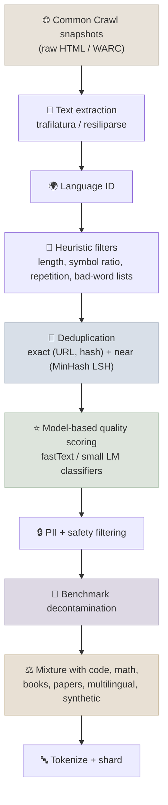
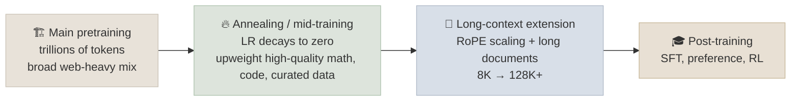

# Data Curation and Mixtures

At frontier scale, the data pipeline matters more than most architecture choices. Two models with the same architecture and compute can differ by several benchmark points purely because of what they were trained on. This note covers how modern pretraining corpora are built: extraction and filtering, deduplication, model-based quality classifiers, synthetic data, and how the mixture changes over the course of a run.

```objectives
time: 60 min
outcomes:
  - Describe each stage of a web-scale pretraining pipeline and the failure it prevents
  - Explain exact vs near deduplication, and how MinHash LSH finds near-duplicates at scale
  - Explain model-based quality filtering (FineWeb-Edu, DCLM) and its risks
  - Describe how data mixtures, annealing, mid-training and long-context extension shape a model late in training
  - Weigh synthetic data's benefits against model collapse and contamination
prerequisites:
  - "[Training & Pretraining](01-Training-and-Pretraining.mdx) - the basic pipeline and objectives"
```

## The Modern Pipeline



| Stage | What goes wrong without it |
|-------|---------------------------|
| **Extraction** | Boilerplate (menus, cookie banners) dominates; the choice of HTML-to-text extractor alone measurably changes downstream quality |
| **Heuristic filters** | Spam, keyword lists, machine-generated gibberish, pages that are mostly symbols |
| **Deduplication** | The model memorizes repeated text, wastes compute on it, and leaks more PII |
| **Quality scoring** | The corpus reflects the average web page, not the most informative ones |
| **Decontamination** | Benchmark answers leak into training, inflating evaluation scores |
| **Mixing** | The model is weak at code, math or low-resource languages that are rare on the web |

---

## Deduplication

### Concept

- **Exact dedup** removes identical URLs and documents (content hashes), and often repeated lines or paragraphs (boilerplate that survives extraction).
- **Near dedup** catches documents that differ only slightly - templated pages, mirrors, pages with different ads. The standard tool is **MinHash with locality-sensitive hashing (LSH)**:

```
1. Shingle each document into n-grams (e.g. 5-word shingles).
2. For each of k hash functions, keep the minimum hash over the document's shingles.
   The fraction of matching minimums between two documents estimates their Jaccard similarity.
3. Split the k values into b bands of r rows; documents that match exactly on any band
   become candidate pairs. This makes finding similar pairs sub-quadratic.
4. Cluster candidates and keep one document per cluster.
```

The bands-and-rows split sets the similarity threshold: with b bands of r rows, two documents with Jaccard similarity s become candidates with probability `1 - (1 - s^r)^b`, an S-shaped curve you tune to catch pairs above ~0.7-0.8 similarity.

**A counter-intuitive result:** FineWeb found that deduplicating *across* all Common Crawl snapshots at once hurt quality relative to deduplicating within each snapshot - global dedup disproportionately removed documents that recur because they are good. Dedup is a tuned hyperparameter, not an unconditional good.

---

## Model-Based Quality Filtering

### Concept

Heuristics remove obvious junk; **quality classifiers** decide what is worth training on. The recipe:

1. Label a sample of documents for "quality" - by a large LLM (FineWeb-Edu used Llama 3 70B to rate educational value on a 0-5 scale) or by similarity to a trusted reference set (DCLM trained a fastText classifier with instruction-style data as positives).
2. Train a cheap classifier (fastText, or a small transformer) on those labels.
3. Score the whole corpus and keep the top fraction.

| Dataset | Size | Filtering idea | Result |
|---------|------|----------------|--------|
| FineWeb (2024) | 15T tokens | Careful extraction, heuristic filters, per-snapshot MinHash dedup | Strong baseline open web corpus |
| FineWeb-Edu (2024) | 1.3T tokens (threshold 3) | LLM-labelled educational value → classifier | Large gains on knowledge and reasoning benchmarks (MMLU, ARC) at equal tokens |
| DCLM-Baseline (2024) | ~4T tokens | fastText classifier trained on instruction-like positives | Competitive with far larger training budgets on core benchmarks |

**Risks:** a classifier encodes its labeller's taste. Aggressive filtering can remove dialects, informal language and minority viewpoints, and it narrows diversity - which can hurt long-tail knowledge even when benchmark averages go up. Keep the threshold a tuned hyperparameter and track diverse evaluations.

---

## Mixtures, Annealing and Mid-Training

### Concept

A pretraining corpus is a **mixture** of sources - filtered web, code, math, scientific papers, books, multilingual text - with weights chosen by small-scale ablations (train small proxy models on candidate mixtures, pick the best, scale up). Llama 3's published final mix was roughly half general knowledge, a quarter math and reasoning, 17% code and 8% multilingual.

The mixture is not fixed for the whole run:



- **Annealing.** As the learning rate decays at the end of pretraining, the model is most sensitive to what it sees. Upweighting a small amount of high-quality data here (Llama 3 annealed on curated sources) produces outsized gains - and annealing a small model on a candidate dataset is a cheap way to measure that dataset's value.
- **Mid-training.** A distinct phase between pretraining and post-training that shifts the mix toward reasoning, code, instruction-like and domain data - increasingly common in 2025 model reports.
- **Long-context extension.** Training directly at 128K is wasteful. Models pretrain at 4K-8K, then extend the context in stages with RoPE scaling and long documents (Llama 3 extended from 8K to 128K in six stages over roughly 800B tokens).

---

## Synthetic Data

### Concept

Synthetic data - text generated by another model - is now a standard ingredient:

- **Rephrasing** web documents into cleaner forms (e.g. Wikipedia-style or Q&A-style rewrites) increases the useful signal per token.
- **Textbook-style data** (the Phi models) teaches reasoning patterns densely.
- **Math and code with verification** - generate problems and solutions, keep only those that pass a checker or unit tests.
- **Reasoning traces** distilled from a stronger model are central to post-training (see [Post-Training & Reasoning](../../05-Post-Training/INDEX.mdx)).

**Risks:**

- **Model collapse.** Training repeatedly on a model's own outputs, without fresh real data, loses the tails of the distribution (Shumailov et al., 2024). Mixing synthetic with real data, and filtering it, avoids most of the problem in practice.
- **Contamination.** A generator that saw benchmark questions can reproduce them; decontaminate synthetic data like any other source.
- **Licensing.** Some model licenses restrict using outputs to train other models - check before distilling.

---

## Check Yourself

```quiz
- q: "With MinHash LSH using b bands of r rows, what does increasing r (with b fixed) do?"
  options:
    - "Raises the similarity threshold - fewer, closer pairs become candidates"
    - "Lowers the threshold - more loosely similar pairs become candidates"
    - "Has no effect on which pairs are found, only on speed"
    - "Switches from near to exact deduplication"
  answer: 1
  explain: "A pair must match on all r rows of some band; that probability is s^r, which falls quickly for s < 1 as r grows. More bands (larger b) lowers the threshold instead."
- q: "Why can annealing a small model on a candidate dataset estimate that dataset's value cheaply?"
  options:
    - "Late in training, at low learning rate, the model is most sensitive to the data it sees, so gains show up after few tokens"
    - "Annealing doubles the effective learning rate"
    - "Small models are more sensitive to contamination"
    - "Annealing removes the need for evaluation"
  answer: 1
- q: "Give two risks of aggressive model-based quality filtering."
  answer: "It reflects the labeller's taste and can remove dialects, informal registers and minority viewpoints; and it reduces diversity, which can hurt long-tail knowledge and robustness even while benchmark averages improve. It can also overfit the corpus toward what the benchmarks reward."
```

## Exercises

```exercise
- title: MinHash by hand
  task: |
    Implement MinHash with 128 hash functions over 5-word shingles in Python (use `hashlib` with 128 different salts). Take a Wikipedia paragraph, make three variants (one word changed, one sentence removed, full rewrite), and compare the estimated Jaccard similarity with the exact Jaccard similarity of the shingle sets.
- title: Design a mixture ablation
  task: |
    You have compute for twenty 400M-parameter proxy runs of 10B tokens each. Design an experiment to choose the code fraction (between 5% and 25%) and the quality-classifier threshold for web data. What would you measure, and what could make the result fail to transfer to the full-size model?
  solution: |
    A small grid (e.g. code ∈ {5, 10, 15, 20, 25}% × threshold ∈ {top 10, 20, 30, 50}%) fits the budget. Measure held-out loss per domain plus benchmarks that are informative at small scale (e.g. early-signal tasks, code pass@k on easy problems). Transfer risks: small models don't show emergent abilities; the optimal mixture shifts with scale and token budget; and repeated-epoch effects differ when the full run sees much more data.
```

## Study Notes

**Must-know:**
- Pipeline: extract → language ID → heuristics → dedup (exact + MinHash near-dedup) → quality classifier → PII/safety → decontaminate → mix → tokenize
- MinHash estimates Jaccard similarity; LSH banding makes candidate search sub-quadratic; b and r set the threshold
- FineWeb-Edu and DCLM: small classifiers trained on LLM or reference-set labels drive large quality gains
- The mix changes over the run: broad pretraining → annealing / mid-training on high-quality data → staged long-context extension
- Synthetic data is standard; manage collapse, contamination and license risks

## References

- Penedo et al., [The FineWeb Datasets](https://arxiv.org/abs/2406.17557) (2024)
- Li et al., [DataComp-LM (DCLM)](https://arxiv.org/abs/2406.11794) (2024)
- Llama Team, [The Llama 3 Herd of Models](https://arxiv.org/abs/2407.21783) (2024) - data mix, annealing, long-context stages
- Broder, [On the Resemblance and Containment of Documents](https://doi.org/10.1109/SEQUEN.1997.666900) (1997) - MinHash
- Lee et al., [Deduplicating Training Data Makes Language Models Better](https://arxiv.org/abs/2107.06499) (2021)
- Gunasekar et al., [Textbooks Are All You Need](https://arxiv.org/abs/2306.11644) (2023)
- Maini et al., [Rephrasing the Web](https://arxiv.org/abs/2401.16380) (2024)
- Shumailov et al., [AI models collapse when trained on recursively generated data](https://www.nature.com/articles/s41586-024-07566-y) (Nature, 2024)

*Last reviewed: 2026-09*
