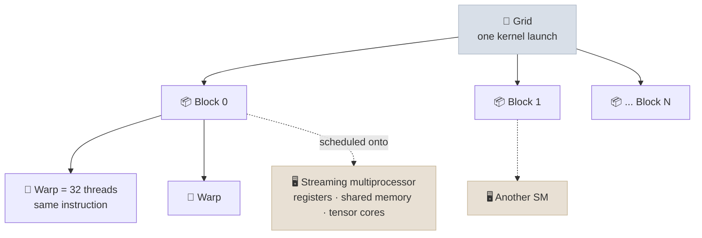
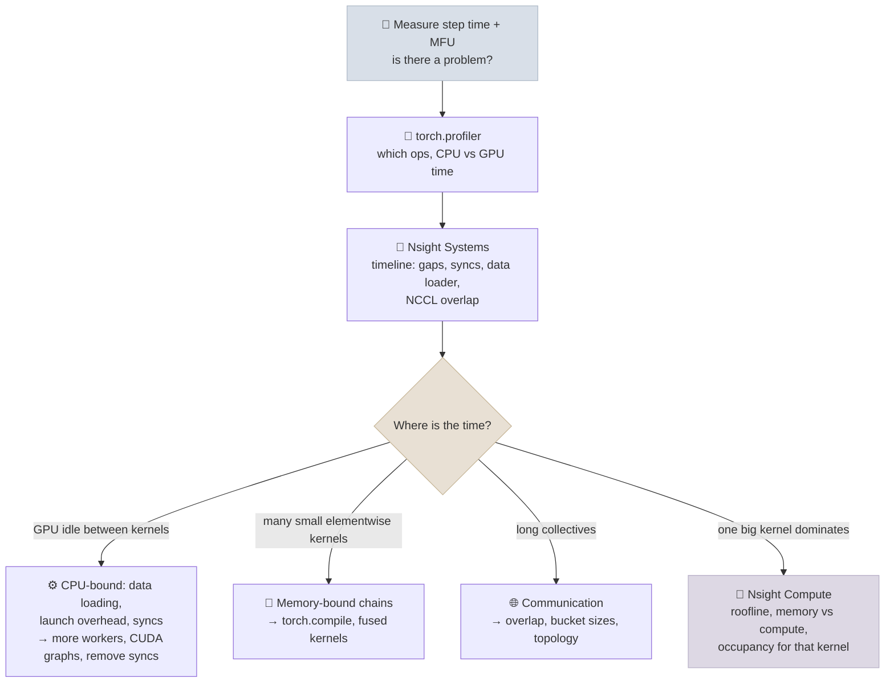

# CUDA Concepts and GPU Profiling

A GPU is fast only when you keep its thousands of cores fed with data, and most slow training or serving code is slow because of memory traffic, small kernels or the CPU getting in the way - not because of the math. This note covers the CUDA execution model (threads, warps, blocks and SMs), the memory hierarchy, why kernel fusion matters, what Triton and `torch.compile` do, and a profiling workflow with `torch.profiler`, Nsight Systems and Nsight Compute for finding the real bottleneck.

```objectives
time: 55 min
outcomes:
  - Describe the CUDA execution model - threads, warps, blocks, SMs - and what occupancy means
  - Place data in the GPU memory hierarchy (registers, shared memory, L2, HBM) and estimate a kernel's memory traffic
  - Explain why fusing memory-bound operations speeds them up, and read a simple Triton kernel
  - Time GPU code correctly, given that kernel launches are asynchronous
  - Run a profiling workflow - torch.profiler, Nsight Systems, Nsight Compute - and classify a bottleneck as data loading, launch overhead, memory bandwidth, compute or communication
prerequisites:
  - "[Accelerators & Interconnects](07-Accelerators-and-Interconnects.mdx) - the roofline model and ridge point"
  - "[PyTorch for LLMs](../../02-Prog-Langs/PyTorch/Notes/06-PyTorch-for-LLMs.mdx) - torch.compile and MFU"
```

## The Execution Model

<div class="audience-biz" markdown="1">

A GPU has a hundred-plus independent processors, each running thousands of small threads in lock-step groups. It is spectacular at doing the same arithmetic on huge arrays, but each piece of work has to be launched by the CPU and fetch its data from memory. Most performance engineering is about launching fewer, bigger pieces of work and moving less data, so the arithmetic units are never idle.

</div>

<div class="audience-tech" markdown="1">

A CUDA **kernel** is a function launched on the GPU over a **grid** of **thread blocks**. Each block runs on one **streaming multiprocessor (SM)** - an H100 SXM has 132 - and its threads execute in **warps** of 32 that issue the same instruction together (SIMT). Threads in a block can share fast on-chip memory and synchronize; different blocks cannot rely on each other. The GPU hides memory latency by switching between many resident warps: while one waits for memory, another computes.

</div>



Three consequences worth remembering:

- **Divergence costs time.** If threads in a warp take different branches, the warp runs both paths with some threads masked off.
- **Occupancy** - how many warps are resident per SM relative to the maximum (64 on Hopper) - limits how well latency is hidden. It is capped by registers per thread and shared memory per block; high occupancy helps memory-bound kernels, though well-tuned matmul kernels often run at low occupancy on purpose, using registers and shared memory heavily instead.
- **Small kernels underuse the GPU.** A kernel with fewer blocks than there are SMs leaves processors idle, and every launch costs a few microseconds of CPU-side overhead.

---

## The Memory Hierarchy

| Level | Size (H100) | Speed | Scope |
|---|---|---|---|
| **Registers** | 64K 32-bit registers per SM (256 KB) | Fastest | One thread |
| **Shared memory / L1** | Up to 228 KB shared memory per SM (256 KB combined L1 + shared) | Very fast, on-chip | One thread block |
| **L2 cache** | 50 MB | Fast, on-chip | Whole GPU |
| **HBM (global memory)** | 80 GB at 3.35 TB/s (SXM) | Slowest on the GPU, yet far faster than CPU memory | Whole GPU |

Data used once must come from HBM; the game is to **load each byte from HBM as few times as possible** and reuse it from registers and shared memory. Tiled matrix multiplication loads tiles of the inputs into shared memory and reuses each loaded value for many multiply-adds. FlashAttention applies the same idea to attention: it computes the softmax in tiles in shared memory and never writes the `T x T` score matrix to HBM ([GPU Memory & Hardware](02-GPU-and-Hardware.mdx)).

**Arithmetic intensity**, from the [roofline model](07-Accelerators-and-Interconnects.mdx): FLOPs per byte moved. The H100's ridge point is about 295 FLOP/byte for dense BF16.

| Operation (BF16) | FLOPs / byte | Bound |
|---|---|---|
| `4096 x 4096 @ 4096 x 4096` matmul | ≈ 1,365 | Compute |
| One token's `1 x 4096 @ 4096 x 4096` (decode, batch 1) | ≈ 1 | Memory bandwidth |
| Elementwise ops (GELU, add, residual, most norms) | ≈ 1 or less | Memory bandwidth |

---

## Kernel Fusion

Every unfused elementwise operation reads its inputs from HBM and writes its output back. A chain of them moves the same data repeatedly.

**Worked example.** Three elementwise operations on a `4096 x 16384` BF16 activation (134 MB):

- Unfused: each reads and writes the tensor - `3 x 2 x 134 MB ≈ 805 MB`, about **0.24 ms** at 3.35 TB/s
- Fused into one kernel: one read and one write - `268 MB`, about **0.08 ms**

A 3x speedup with identical math - and fusion also removes two kernel launches. This is what FlashAttention, fused optimizers, fused RMSNorm and `torch.compile` all exploit.

**Triton** is a Python-embedded language for writing GPU kernels at the level of blocks of data rather than individual threads; the compiler handles the thread-level details. `torch.compile`'s default backend (Inductor) generates Triton kernels that fuse chains of operations automatically. A fused SwiGLU gate (`silu(gate) * up`), which otherwise needs two kernels and five tensor passes, in one kernel with three:

```python
import torch
import triton
import triton.language as tl

@triton.jit
def swiglu_kernel(gate_ptr, up_ptr, out_ptr, n, BLOCK: tl.constexpr):
    pid = tl.program_id(axis=0)                      # which block of elements this program handles
    offs = pid * BLOCK + tl.arange(0, BLOCK)
    mask = offs < n                                  # guard the ragged last block
    g = tl.load(gate_ptr + offs, mask=mask).to(tl.float32)
    u = tl.load(up_ptr + offs, mask=mask).to(tl.float32)
    out = g * tl.sigmoid(g) * u                      # silu(g) * u, computed in registers
    tl.store(out_ptr + offs, out.to(out_ptr.dtype.element_ty), mask=mask)

def swiglu(gate: torch.Tensor, up: torch.Tensor) -> torch.Tensor:
    assert gate.is_contiguous() and up.is_contiguous()
    out = torch.empty_like(gate)
    n = gate.numel()
    swiglu_kernel[(triton.cdiv(n, 1024),)](gate, up, out, n, BLOCK=1024)
    return out
```

This kernel follows the pattern of Triton's official tutorials but was not GPU-run for this note. In practice, try `torch.compile` first - it usually produces this fusion for you - and write a custom kernel only when profiling shows a hot spot it misses.

---

## Timing GPU Code Correctly

Kernel launches are **asynchronous**: the CPU queues work and returns immediately. Timing with `time.time()` around GPU code measures how long it took to *queue* the work, not to run it.

```python
import torch

start, end = torch.cuda.Event(enable_timing=True), torch.cuda.Event(enable_timing=True)
for _ in range(3):                  # warm up: compilation, caches, allocator
    step()
torch.cuda.synchronize()
start.record()
for _ in range(20):
    step()
end.record()
torch.cuda.synchronize()            # wait for the GPU before reading the timer
print(f"{start.elapsed_time(end) / 20:.2f} ms per step")
```

The flip side: an accidental synchronization - `.item()`, `.cpu()`, printing a tensor, `torch.cuda.synchronize()` inside the loop - stalls the CPU until the GPU drains, so the GPU then idles while the CPU prepares the next launch. Hidden syncs in a training loop are a common cause of low utilization.

**Launch overhead.** When a step is many tiny kernels (small batches, decode), CPU launch time dominates. **CUDA Graphs** record a sequence of launches once and replay it with a single launch; `torch.compile(mode="reduce-overhead")` uses them, and serving engines such as vLLM capture CUDA graphs for decode.

---

## A Profiling Workflow



1. **Start with numbers.** Step time, tokens per second and **MFU** - achieved model FLOPs per second divided by peak ([PyTorch for LLMs](../../02-Prog-Langs/PyTorch/Notes/06-PyTorch-for-LLMs.mdx)). Well-tuned large dense training reaches roughly 35-50% MFU on H100s; far below that, something specific is wrong.
2. **`torch.profiler`** - per-operator CPU and CUDA time, memory, and a Chrome/Perfetto trace. Sort by CUDA time to find the operators that matter; compare CPU and CUDA timelines to spot a CPU-bound loop.

   ```python
   from torch.profiler import profile, ProfilerActivity, schedule

   with profile(activities=[ProfilerActivity.CPU, ProfilerActivity.CUDA],
                schedule=schedule(wait=1, warmup=1, active=3), record_shapes=True) as prof:
       for _ in range(5):
           step()
           prof.step()
   print(prof.key_averages().table(sort_by="cuda_time_total", row_limit=15))
   prof.export_chrome_trace("trace.json")          # open in https://ui.perfetto.dev
   ```

3. **Nsight Systems** (`nsys profile --trace=cuda,nvtx,osrt -o run python train.py`) - a whole-system timeline of CPU threads, kernel launches, memory copies and NCCL communication. It answers "why is the GPU idle?" - waiting on the data loader, on a sync, or on communication that isn't overlapped with compute. Add NVTX ranges (`torch.cuda.nvtx.range_push("attention")`) to label regions.
4. **Nsight Compute** (`ncu --set full -o kernel python train.py`, filtered to the kernel you care about) - per-kernel detail: achieved memory bandwidth and FLOP/s against the roofline, occupancy, and the reasons warps stall. Use it last, on the one kernel that dominates.

---

## Common Bottlenecks and Fixes

| Symptom | Likely cause | Fix |
|---|---|---|
| GPU utilization low, gaps between kernels | Data loading on the CPU, synchronizations, Python overhead | More `DataLoader` workers, pinned memory, prefetch; remove `.item()` in the loop; CUDA graphs |
| Many short elementwise kernels | Unfused memory-bound operations | `torch.compile`; fused kernels (RMSNorm, optimizer, attention) |
| Matmuls slow for their size | Odd shapes not multiples of 8 or 64, FP32 instead of BF16 | Pad dimensions; use BF16 or FP8 tensor cores |
| Attention dominates and memory explodes at long context | Unfused attention materializing `T x T` | FlashAttention / SDPA backends |
| Long NCCL kernels, compute waiting | Communication not overlapped | Overlap gradient all-reduce with backward; tune bucket sizes; check interconnect topology ([Distributed Training at Scale](05-Distributed-Training-at-Scale.mdx)) |
| Decode tokens/s low at batch 1 | Memory-bandwidth bound by design | Batch more requests; quantize weights and KV cache ([Inference & Serving](../../08-Serving-and-Inference/INDEX.mdx)) |

---

## Check Yourself

```quiz
- q: "How many threads are in a CUDA warp, and what do they share?"
  options:
    - "16; a register file"
    - "32; they issue the same instruction together"
    - "64; one shared memory bank"
    - "1,024; a thread block"
  answer: 2
  explain: "A warp is 32 threads executing in lock-step (SIMT). Branch divergence within a warp serializes the paths."
- q: "You time a training step with time.time() before and after the GPU calls and get 2 ms, but throughput suggests 40 ms per step. What happened?"
  options:
    - "The GPU is faster than expected"
    - "Kernel launches are asynchronous; you measured how long it took to queue work, not run it"
    - "time.time() has 1 ms resolution"
    - "The profiler was enabled"
  answer: 2
  explain: "Synchronize (or use CUDA events) before reading the timer. Without it you measure launch time only."
- q: "Why does fusing three elementwise operations into one kernel speed them up, when the arithmetic is identical?"
  answer: "Elementwise operations are memory-bandwidth bound: each unfused kernel reads and writes the whole tensor from HBM. Fused, the data is read once and written once, with intermediate results kept in registers - about a third of the memory traffic, plus fewer kernel launches."
- q: "Nsight Systems shows the GPU idle for 30% of each step, with gaps between kernels and the main CPU thread busy in the data loader. What do you do?"
  answer: "The step is CPU/input bound. Increase DataLoader workers, enable pinned memory and prefetching, move preprocessing (tokenization, augmentation) offline or onto the GPU, and remove synchronizations in the loop; re-profile to confirm the gaps close before touching kernels."
- q: "What is the arithmetic intensity of batch-1 decode for a 4096 x 4096 BF16 weight matrix, and what does it imply?"
  answer: "About 1 FLOP per byte (2 x 4096² FLOPs for 2 x 4096² bytes of weights), far below the H100's ~295 FLOP/byte ridge point, so decode is memory-bandwidth bound. Batching more sequences reuses each weight read and raises intensity."
```

## Exercises

```exercise
- title: Estimate a norm's runtime
  task: |
    RMSNorm over a BF16 activation of shape (8, 4096, 8192) reads the input and the weight vector and writes the output. Estimate the minimum runtime on an H100 SXM, and say whether making it compute-faster would help.
  hints:
    - "The weight vector is tiny compared with the activation."
  solution: |
    Activation size: `8 x 4096 x 8192 x 2 bytes ≈ 537 MB`. Read plus write ≈ 1.07 GB; at 3.35 TB/s that is about **0.32 ms** minimum. The arithmetic (a square, a mean, a reciprocal square root and a multiply per element) is tiny relative to the bytes, so the kernel is memory-bound: only reducing traffic helps - for example fusing RMSNorm with the preceding residual add or the following matmul's input cast.
- title: Read a profile
  task: |
    `torch.profiler` for one training step of a small GPT shows (CUDA time): `aten::mm` 38%, `aten::add` / `aten::mul` / `aten::gelu` together 27%, `aten::_softmax` + masking 18%, optimizer `aten::add_` and `aten::mul_` over every parameter 12%, other 5%. Suggest a change for each of the three non-matmul groups.
  solution: |
    - Elementwise chain (27%): `torch.compile` the model so Inductor fuses residual adds, GELU and scaling into fewer Triton kernels.
    - Softmax + masking (18%): switch to `F.scaled_dot_product_attention` with `is_causal=True` so a FlashAttention-style fused kernel is used and the score matrix never hits HBM.
    - Optimizer (12%): use the fused or foreach AdamW implementation (`torch.optim.AdamW(..., fused=True)`), which updates all parameters in a few large kernels instead of many small ones.

    Then re-profile: the matmul share should rise, and MFU with it.
```

## Study Notes

**Must-know:**
- Kernel → grid of blocks → warps of 32 threads on SMs (132 on H100 SXM); divergence serializes; occupancy hides latency
- Memory hierarchy: registers → shared memory/L1 (228 KB/SM) → L2 (50 MB) → HBM (80 GB, 3.35 TB/s); reuse on-chip, minimize HBM traffic
- Arithmetic intensity vs ridge point (~295 FLOP/byte on H100 BF16): big matmuls compute-bound; elementwise ops and batch-1 decode memory-bound
- Fusion cuts memory traffic and launches; FlashAttention, fused norms and optimizers, `torch.compile` (Inductor → Triton)
- Launches are async: time with CUDA events after synchronizing; hidden syncs (`.item()`) starve the GPU; CUDA graphs cut launch overhead
- Workflow: step time and MFU → torch.profiler → Nsight Systems timeline → Nsight Compute for the one hot kernel

## References

- NVIDIA, [CUDA C++ Programming Guide](https://docs.nvidia.com/cuda/cuda-c-programming-guide/index.html) (2026) and [Hopper Tuning Guide](https://docs.nvidia.com/cuda/hopper-tuning-guide/index.html) (2026)
- NVIDIA, [NVIDIA Hopper Architecture In-Depth](https://developer.nvidia.com/blog/nvidia-hopper-architecture-in-depth/) (2022)
- Williams, Waterman and Patterson, [Roofline: An Insightful Visual Performance Model](https://doi.org/10.1145/1498765.1498785) (CACM, 2009)
- Tillet, Kung and Cox, [Triton: An Intermediate Language and Compiler for Tiled Neural Network Computations](https://doi.org/10.1145/3315508.3329973) (MAPL 2019); [Triton fused-softmax tutorial](https://triton-lang.org/main/getting-started/tutorials/02-fused-softmax.html)
- Ansel et al., [PyTorch 2: Faster Machine Learning Through Dynamic Python Bytecode Transformation and Graph Compilation](https://doi.org/10.1145/3620665.3640366) (ASPLOS 2024)
- He, [Making Deep Learning Go Brrrr From First Principles](https://horace.io/brrr_intro.html) (2022)
- PyTorch, [torch.profiler](https://docs.pytorch.org/docs/stable/profiler.html) (2026); NVIDIA, [Nsight Systems](https://docs.nvidia.com/nsight-systems/) and [Nsight Compute](https://docs.nvidia.com/nsight-compute/) (2026)

*Last reviewed: 2026-10*
