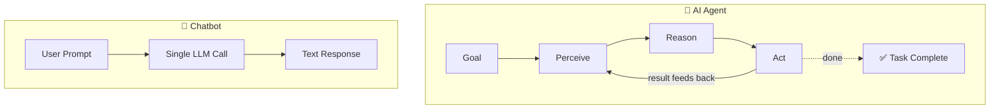
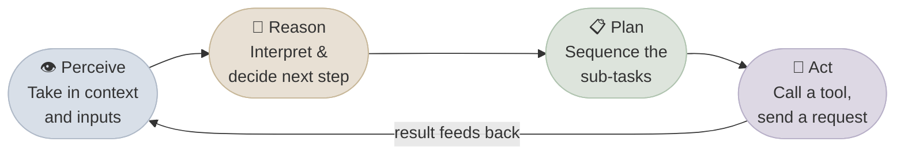
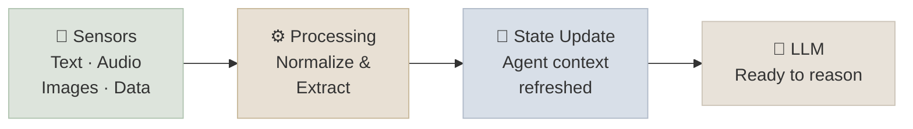
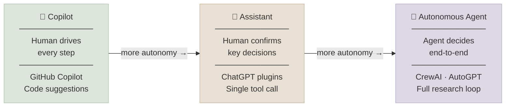

# What Are AI Agents

## The One-Line Definition

An AI Agent is a software system that **perceives its environment, reasons about a goal, plans a sequence of actions, and executes those actions autonomously** - repeating this loop until the goal is achieved or it decides to stop.

Think of it like hiring a contractor instead of asking a question. A chatbot answers. An AI Agent *gets things done* - it figures out the steps, uses the right tools, checks its own work, and keeps going until the job is finished. You give it a goal; it drives to the outcome.

Unlike a single LLM call (RAG, chains, or a function), an agent owns its control loop. It decides what to do next at each step - which tool to call, whether to re-plan, and when the task is complete. The LLM is not writing text; it is making decisions that have real-world effects.

---

## Chatbot vs Automation vs AI Agent

There are three generations of software that do "smart" things. Most tools you've used are in the first two categories. AI Agents are the third - and the differences are meaningful when you're deciding what to buy or build.

The critical distinction is who owns the control flow. In a chatbot, the user drives every turn. In automation, a script drives a fixed sequence. In an agent, the LLM drives dynamically - selecting tools, re-planning on failure, and deciding when the goal is met.

| | Chatbot | RPA / Automation Script | AI Agent |
|---|---|---|---|
| **Input** | Natural language prompt | Predefined trigger / schedule | Natural language goal |
| **Reasoning** | Single LLM call | Hardcoded logic | Multi-step LLM reasoning |
| **Actions** | Text response only | Fixed sequence of steps | Dynamic tool selection |
| **Adaptability** | None - reruns from scratch | None - breaks on unexpected input | High - replans on failure |
| **Memory** | Context window only | None (stateless) or DB | Short-term + optional long-term |
| **Example** | "Summarize this email" | "Every day at 9am, send report" | "Research competitors and draft a report, then email it to the team" |

---

## The Four Pillars of an AI Agent

### 1. Perceive

The agent reads the room. Before it does anything, it takes in everything relevant - your request, what tools have already returned, what it remembers from earlier, and what state the world is in. This is its raw picture of the situation.

The perception layer assembles the context window for the next LLM forward pass: user message, prior tool results, memory retrievals, system prompt, and environment state. Everything the model will reason over comes from here.

### 2. Reason

This is where the agent thinks. It looks at what it knows, considers the goal, and decides what to do next - whether that's asking a question, using a tool, or delivering a result. This is what makes it feel intelligent: it's not following a script, it's thinking through the situation.

The LLM processes the full context window and outputs a decision: a tool call (structured JSON), a final answer, or an intermediate reasoning step. Strategies like ReAct (Reason + Act interleaved), chain-of-thought prompting, or scratchpad reasoning all happen in this step.

### 3. Plan

For complex goals, the agent doesn't just wing it - it breaks the work into steps. Some agents map out the whole plan upfront, others figure it out one step at a time, adapting as new information comes in.

Planning strategies range from Plan-and-Execute (full upfront decomposition, a separate planner LLM) to ReAct (one step at a time, plan embedded in the reasoning trace) to Reflexion (retry with lessons learned from failures). The right strategy depends on task uncertainty.

### 4. Act

This is where the agent actually does something in the world: runs a search, writes a file, sends an email, calls an API. The result of that action comes back and the loop starts again - the agent checks the result and decides what to do next.

The agent emits a tool call; the orchestration runtime executes it in a sandboxed environment and returns the result as a `tool_result` message. The result is appended to the context window and becomes input to the next Perceive step.

This **Perceive → Reason → Plan → Act** loop runs until the task is complete.

---

## Why an LLM + a Database Is Not an Agent

Connecting an AI to a knowledge base gives it access to your information - but it still can't *do* anything with it. A knowledgeable assistant who can't make phone calls, run calculations, or send emails isn't very useful for getting work done. An AI Agent needs all four working together: a reasoning engine, live data access, the ability to run actions, and specialized capabilities for specific tasks.

A common architecture mistake: LLM + vector store = agent. It doesn't. The LLM can retrieve context, but it has no execution capability. A functioning agent requires all four layers orchestrated together - and swapping in a smarter model without the surrounding system produces a smarter chatbot, not an agent.

| Component | Role |
|---|---|
| **AI Model** | Reasoning engine - interprets context and decides what to do |
| **Data Layer** | Real-time access to live systems (databases, APIs, documents) |
| **Code Execution** | Runs computations, calls APIs, performs actions |
| **Specialized Models** | Handles domain-specific sub-tasks (vision, classification, scoring) |

---

## The Four Characteristics of an AI Agent

### Reflective

An AI Agent watches its own performance and adjusts course when something isn't working - without you having to tell it. If the approach isn't landing, it tries a different one.

The agent monitors output quality against its success criteria and can trigger a re-plan. This is distinct from Reflexion (explicit retry with memory of failure) - reflection can be built into the reasoning prompt or implemented as an evaluation step before committing an action.

### Interactive

An AI Agent can communicate with multiple parties at once - you, other AI systems, external tools - and adapts how it talks depending on who it's talking to. It doesn't get confused when the conversation involves several moving parts.

Multi-party interaction includes human-agent turns, agent-agent messaging (in multi-agent systems), and tool call/result cycles. The agent manages context state across all of these simultaneously within its context window.

### Reactive and Proactive

A reactive agent responds to what you ask. A proactive agent spots a problem coming and handles it before you even notice. The best production agents do both - they answer your questions *and* flag issues you didn't think to ask about.

Reactive behavior: the agent responds to user input or tool results. Proactive behavior: the agent detects a missing precondition mid-task and resolves it autonomously rather than failing (e.g., requesting a missing credential before a tool call would fail). Both require state tracking across the task loop.

### Autonomous

Once you give it a goal, the agent figures out the middle steps itself. You don't need to hold its hand through each decision. Most production systems are *semi-autonomous* - the agent handles the routine steps and checks in on the important ones.

Autonomy level determines the interrupt frequency: Copilot (every step requires human acceptance), Assistant (interrupt at pre-defined decision gates), Autonomous (interrupt only at task start/end or on error). The orchestration layer implements the interrupt conditions.

---

## The Perception Component

The richer the agent's senses, the fuller its picture of the situation. A well-designed agent doesn't just read your text message - it can also look at images you attach, listen to audio, and read structured data like spreadsheets. All of this gets processed together before it decides what to do.

**Example:** A health monitoring agent takes in your text question, a photo of your meal, and your activity data - processes all of it - and gives advice that considers the full picture, not just what you typed.

The perception layer normalizes multiple input modalities into a unified context representation:
- **Text** → tokenization → token embeddings
- **Images** → vision encoder → patch embeddings appended to context
- **Audio** → spectrogram encoder → sequence embeddings
- **Structured data** → schema-aware serialization → text representation

All modalities converge into the context window before the LLM forward pass. The agent's "state" is the assembled context at the start of each loop iteration.

**Perception cycle:**

---

## Anatomy of an AI Agent

An AI agent is a system of six coordinated components - Brain, Planning, Tools, Memory, Perception, and Governance - working together in a continuous loop.

→ See [Anatomy of an AI Agent](./02-Anatomy-of-an-AI-Agent.mdx) for a deep dive into each component with diagrams and examples.

---

## The Autonomy Spectrum

Not all AI systems are fully autonomous agents. Think of it as a dial:

When evaluating AI products, the autonomy level tells you how much oversight you need. **Copilot** tools make you faster - you still drive every decision. **Assistant** tools handle the routine steps and bring you in on the important calls. **Autonomous** tools run end-to-end with minimal check-ins. Most enterprise deployments start at Assistant level - high value, manageable risk.

Autonomy level determines the system's error recovery strategy and oversight requirements. Copilot: human-in-the-loop at every step (zero autonomous actions). Assistant: interrupt conditions defined at design time (e.g., "pause before sending any external communication"). Autonomous: interrupt only on unrecoverable error or task completion - requires robust guardrails, sandboxing, and output validation at every step.

| Level | Human Role | Best For |
|---|---|---|
| **Copilot** | Reviews and accepts every suggestion | Code completion, writing assistance |
| **Assistant** | Approves key decisions, reviews output | Customer support, data lookup |
| **Autonomous** | Sets goal and reviews final result | Complex research, multi-step pipelines |

Most production systems sit at **Assistant** level - agents that can do significant work but check in at decision points.

---

## What Makes an AI Agent "Intelligent"

The intelligence isn't in any single feature - it's in how these five capabilities work together:

1. **Tool use** - It can look things up, run calculations, and take actions instead of guessing. It knows what it doesn't know.
2. **Multi-step reasoning** - It can tackle a goal that requires ten steps, not just one. It doesn't forget the goal halfway through.
3. **Self-correction** - When something goes wrong, it notices and tries a different approach - without you telling it to.
4. **Memory** - It remembers what it did five steps ago and connects the dots across a long task.
5. **Goal orientation** - It stays focused on *your* objective, even when the path to get there turns out to be more complex than expected.

The intelligence emerges from composing five mechanisms:

1. **Tool use** - Grounding via external function calls prevents hallucination on factual queries; the model knows the boundary of its parametric knowledge.
2. **Multi-step reasoning** - The agent decomposes complex goals into a sequence of tool calls and reasoning steps, maintaining task state across the entire sequence.
3. **Self-correction** - Output validation (schema checks, semantic evaluation) can trigger re-planning; Reflexion explicitly stores failure observations and conditions the retry.
4. **Memory** - In-context window for working state; external vector/KV stores for facts and episode recall that exceed the context limit.
5. **Goal orientation** - The system prompt and task description anchor every reasoning step; the agent re-checks against the original goal before committing to each action.

---

## Study Notes

- An agent is defined by its **autonomy** - it decides what to do next, not just responds
- The core loop is always **Perceive → Reason → Plan → Act → repeat**
- The LLM is the **brain**, tools are the **hands**, memory is the **notepad**
- Autonomy exists on a **spectrum** - most production agents are semi-autonomous (human confirms key decisions)
- The difference between an agent and a chain: a **chain** has a fixed sequence, an **agent** decides the sequence dynamically
