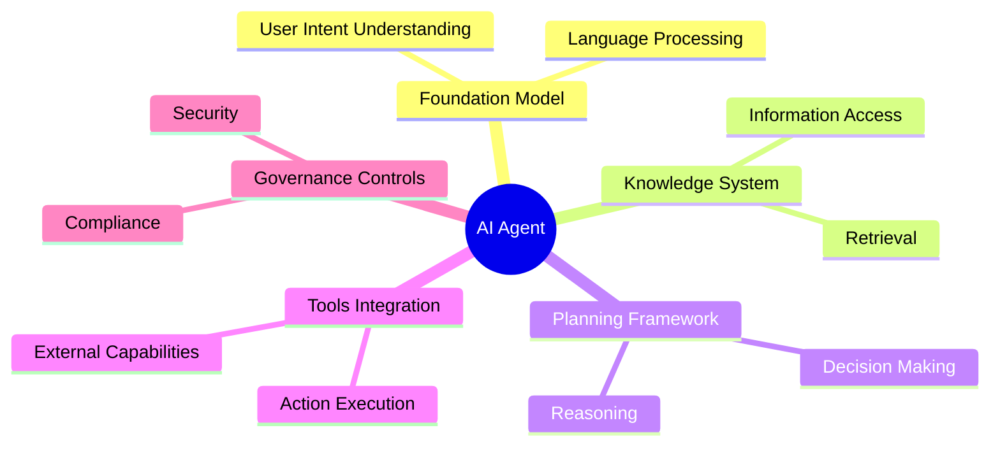
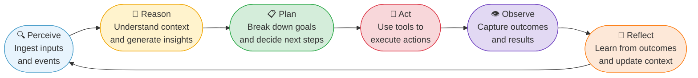
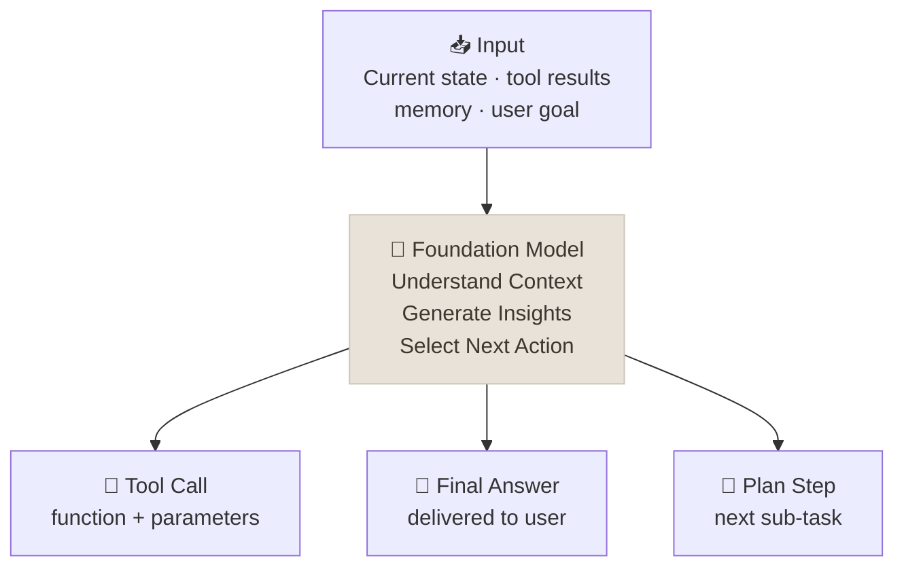
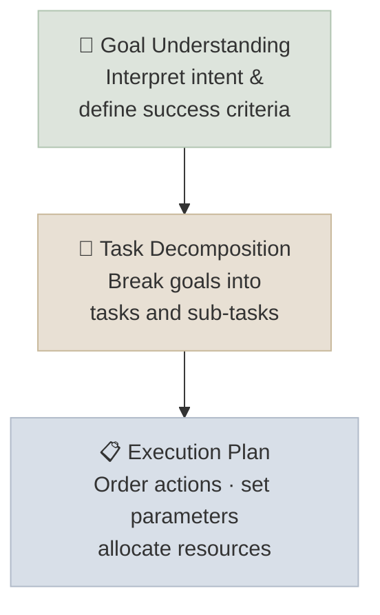
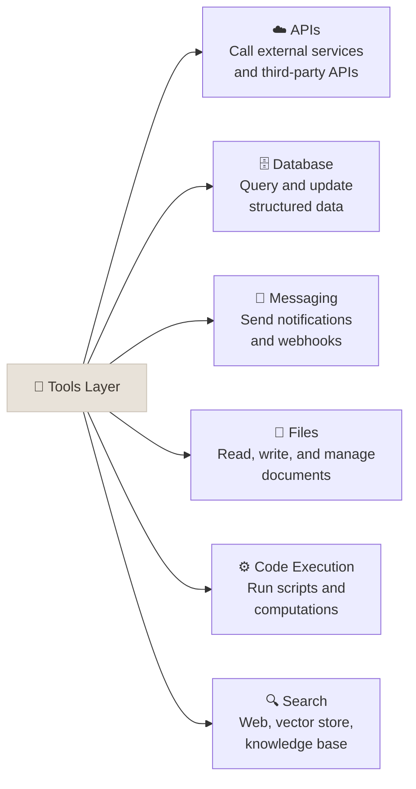
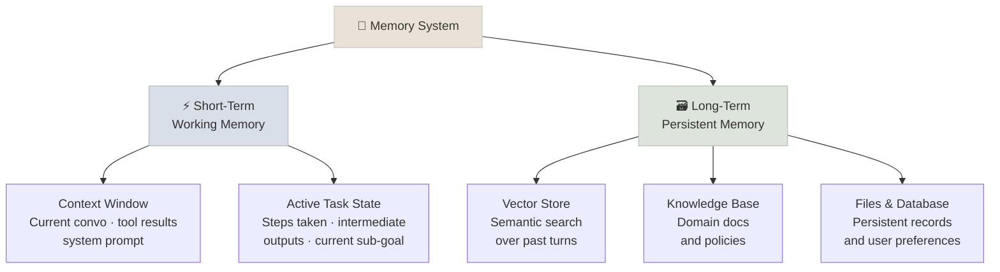
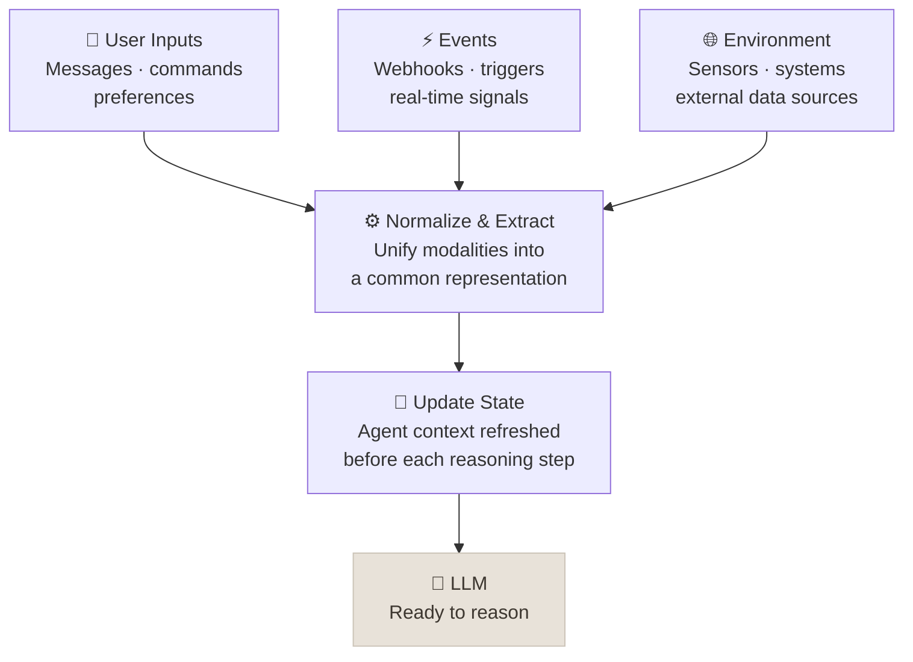
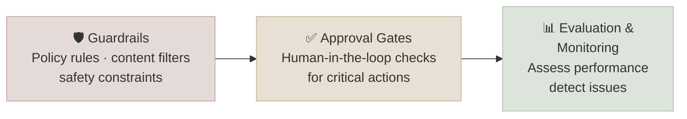
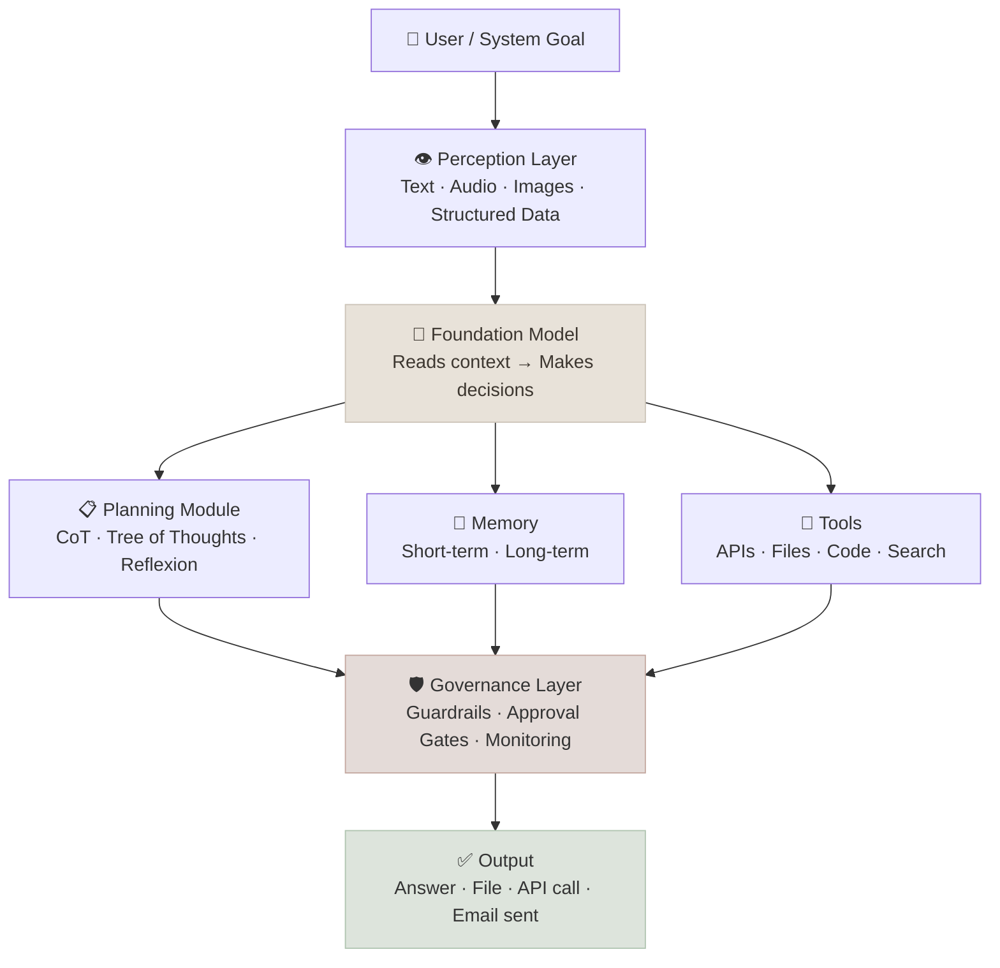

# Anatomy of an AI Agent

An AI agent is a system of coordinated parts - not a single model, not a single product. Think of it like a well-run operations team: a decision-maker, a set of tools, a filing system, a set of sensors, and a manager making sure nothing goes wrong. Remove any one piece and the whole operation breaks down.

An AI agent is an orchestrated system of six components. The LLM is not the agent - it is the reasoning engine inside the agent. The agent loop, tool execution, memory retrieval, and governance all live outside the model itself.

Six core components work together in a continuous loop. Remove any one of them and the system degrades from an *agent* to a *tool*.

---

## The Agent Loop

Think of this like a project manager running a task. They read the brief (Perceive), think through the approach (Reason), map out the steps (Plan), do the work (Act), check what happened (Observe), and adjust before the next step (Reflect). The loop keeps going until the job is done - or they decide it can't be done.

The loop terminates when the model emits a final answer token, a `stop` tool call, or a configured stop condition is reached (max iterations, token budget exhausted, task goal met). Each iteration appends tool results and observations to the context window - the loop has O(n) context growth, which matters for budget planning in long-running agents.

---

## Component 1 - Brain (Foundation Model / LLM Core)

The LLM is the decision-maker. It reads the full situation - what you asked, what tools have already returned, what the agent remembers - and decides the next move. The critical shift from a chatbot: the model isn't writing a reply, it's making a choice. That choice might be "search the web," "run this calculation," or "I have enough - here's the answer."

At each step the model receives a context window containing: system prompt, user goal, conversation history, tool schemas, prior tool results, and memory retrievals. It outputs one of three token sequences: a `tool_call` object (name + arguments), a final `assistant` message, or an intermediate reasoning trace. Model capability directly determines the quality of tool selection, error detection, and goal adherence across long task sequences.

| Chatbot | Agent |
|---------|-------|
| Single LLM call → text response | Multiple LLM calls → decisions |
| No state between turns | Maintains goal and task state |
| Answers the prompt | Chooses what to do next |
| Returns content | Returns actions |

---

## Component 2 - Planning Framework

Complex goals need a game plan. The agent doesn't just dive in - it figures out what success looks like, breaks the goal into steps, and sequences the work. When something goes wrong mid-task, it doesn't give up: it revises the plan and retries. This is what makes agents capable of handling open-ended goals that a script or chatbot would fail at.

Three planning strategies, each suited to different uncertainty levels:

- **Chain of Thought** - single-path linear trace embedded in the reasoning prompt. Low overhead; works for well-defined tasks. Vulnerable to early mistakes propagating through the chain.
- **Tree of Thoughts** - branch-and-prune search: generate N candidate next steps, score each, select best, continue. Higher cost; better for ambiguous or creative goals.
- **Reflexion** - attempt → evaluate outcome → store failure observation in episodic memory → retry with failure context. Best for tasks requiring iteration (code generation, research synthesis).

Most production agents use CoT by default with Reflexion-style retries on tool call errors.

| Strategy | How It Works | Best For |
|----------|-------------|----------|
| **Chain of Thought** | Think step-by-step before acting | Linear, well-defined tasks |
| **Tree of Thoughts** | Explore multiple options, score them, pick the best branch | Creative or ambiguous goals |
| **Reflexion** | Try an approach, evaluate the outcome, retry with lessons learned | Tasks that require iteration and self-correction |

---

## Component 3 - Tools Integration

Tools are the agent's hands - the things it can actually *do* in the world. Without tools, the agent can only think, not act. A well-tooled agent can search the web, read and write files, query your databases, run calculations, and send messages. The breadth of what the agent can accomplish is directly determined by which tools you give it access to.

Tools are exposed to the model as JSON schemas (name, description, parameter schema). The model emits a `tool_call` object; the orchestration runtime routes it to the correct function, executes in a sandbox, and returns a `tool_result`. Tools are increasingly defined via **MCP (Model Context Protocol)** - a standardized schema format that makes tools portable across agent frameworks. See [04 - MCP](../../04-MCP/INDEX.mdx).

**Tool call lifecycle:**
1. Model emits `tool_call` with name + arguments
2. Runtime validates arguments against schema
3. Executes function in isolated environment
4. Returns `tool_result` appended to context window
5. Model re-runs with updated context

---

## Component 4 - Knowledge System (Memory)

**Short-term memory** is like a whiteboard - everything the agent is actively working with. When the task ends, it gets wiped. **Long-term memory** is the filing cabinet - facts, past interactions, and preferences that persist across sessions. The agent uses long-term memory the same way a good employee uses their notes: to avoid repeating mistakes, recall context from last week, and apply lessons learned.

**Short-term (in-context):** The KV cache state of the context window. Hard limit is the model's context length (128K–1M tokens depending on model). When the window fills, agents summarize old turns and carry the summary forward - a lossy compression that trades detail for continuity.

**Long-term (external):**
- **Vector store** - semantic similarity search (cosine/dot-product over embeddings); retrieves relevant past turns or documents by meaning, not exact match.
- **KV store** - exact-match lookup by key; fast, structured, no semantic search.
- **Relational DB** - structured queries over persistent state; useful for task history, user preferences, and audit logs.

Memory retrieval is itself a tool call - the agent queries its memory store the same way it queries any other tool.

| Memory Type | Stored Where | Lifespan | Use Case |
|-------------|-------------|----------|---------|
| Working context | Context window | Current run | Tool results, recent messages |
| Episodic notes | Vector store | Across runs | Past interactions, decisions |
| Long-term knowledge | Files / DB | Permanent | Domain facts, user preferences |

---

## Component 5 - Perception (Inputs)

The richer the agent's senses, the fuller its picture of the situation. A well-designed agent doesn't just read your text message - it can look at images, listen to audio, and read structured data from your systems. All of these get processed together before it decides what to do. The more inputs it can handle, the more context it has - and the better its decisions.

**Example:** A health monitoring agent takes in your text question, a photo of your meal, and your activity data - processes all three - then gives advice based on the full picture, not just what you typed.

Each modality has its own encoding pipeline before entering the context window:
- **Text** → tokenization (BPE/SentencePiece) → token embeddings
- **Images** → vision encoder (ViT patch embeddings) → image tokens appended to context
- **Audio** → spectrogram → audio encoder → sequence embeddings
- **Structured data** → schema-aware serialization → text representation (JSON/markdown table)

All modalities converge into a unified token sequence in the context window. The "state update" is the diff between the previous context and the new assembled context - tool results, new user messages, and retrieved memories are all appended here.

---

## Component 6 - Governance Layer (Guardrails)

Guardrails are the safety checks between "the agent decided to do X" and "X actually happened." The more autonomy you give an agent, the more important these become. They're how you prevent an autonomous agent from sending an email to the wrong person, deleting the wrong records, or running up an unexpected bill. Think of them as the confirmation dialogs and approval workflows that sit between the agent's decisions and their real-world effects.

Six mechanisms, each operating at a different layer of the agent stack:

| Mechanism | Layer | Implementation |
|-----------|-------|---------------|
| **Sandboxing** | Execution | Container isolation, syscall filtering, network egress rules |
| **Human-in-the-loop** | Orchestration | Interrupt conditions → approval workflow → resume or abort |
| **Token limits** | Budget | Max tokens per run, per tool call, per session |
| **Output validation** | Post-generation | Schema checks on tool arguments, semantic classifiers on final output |
| **Scope limits** | Access control | Tool allowlists, data permission scopes, role-based access |
| **Rate limiting** | Execution | Per-tool, per-session request caps to prevent runaway loops |

HITL gates are the most expensive (latency) but highest-value guardrail for irreversible actions (writes, sends, deletes). Design HITL conditions at the data model level, not as afterthoughts.

---

## All Six Components Together

The goal comes in at the top and flows through all six layers before anything happens in the real world. The perception layer gathers the full picture. The LLM decides what to do. Planning, Memory, and Tools support the execution. The Governance layer sits between the agent's decisions and their effects - making sure the right things happen, safely.

Data flows: user goal → perception (normalize inputs) → LLM (decide action) → planning/memory/tools (execute) → governance (validate + gate) → output. Context accumulates at each step. Governance is not a post-processing step - it intercepts between the LLM decision and the tool execution. This placement is critical: validating *before* execution, not after.

---

## The Minimal Mental Model

When you encounter any AI agent, ask these six questions:

1. **Brain** - How capable is the underlying AI model? Does it reason well on your type of task?
2. **Planning** - Can it handle multi-step, messy problems? What happens when the first approach fails?
3. **Tools** - What can it actually *do* in your systems? What is explicitly off-limits?
4. **Memory** - What does it remember? Does it carry context from past sessions or start fresh every time?
5. **Perception** - What inputs does it work with? Just text, or can it handle images and data from your systems?
6. **Guardrails** - What's stopping it from doing something expensive or irreversible? Who has to approve critical actions?

These six questions tell you everything you need to know about whether an AI agent is right for your use case.

1. **Brain** - Model capability, context length, tool-use fidelity (does it emit well-formed tool calls consistently?), latency/cost profile.
2. **Planning** - Planning strategy (CoT / ToT / Reflexion), max re-plan depth, failure detection mechanism.
3. **Tools** - Tool schema coverage, execution sandbox, error handling on tool failure, MCP compatibility.
4. **Memory** - Context window limit, summarization strategy, external memory backend (vector store type, retrieval strategy, TTL).
5. **Perception** - Supported modalities, encoding pipeline, context budget allocated to non-text inputs.
6. **Guardrails** - HITL interrupt conditions, output validation schema, token budget, scope/permission model, audit logging.

---

## Study Notes

- The LLM is the **brain** - but the brain alone is helpless without the other five components
- Planning strategies (CoT, ToT, Reflexion) are what let agents handle **multi-step, ambiguous goals**
- Tools are the **hands** - they're what make the agent's decisions have real-world effects
- Memory is the **notepad** - without it, long tasks fall apart and context is lost
- Perception is the **senses** - the agent can only reason over what it can perceive
- Guardrails are the **safety net** - the more autonomy you grant, the more critical they become
- The agent loop (Perceive → Reason → Plan → Act → Observe → Reflect) **never stops mid-task** - it cycles until a stop condition is reached
