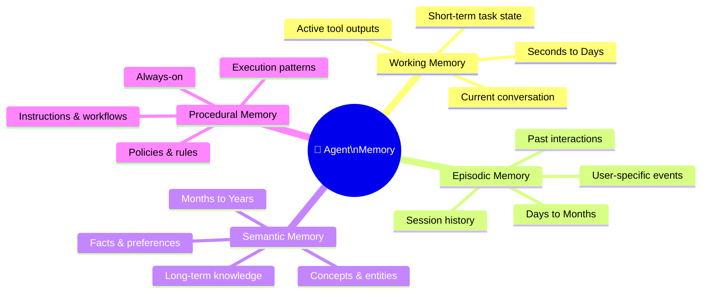
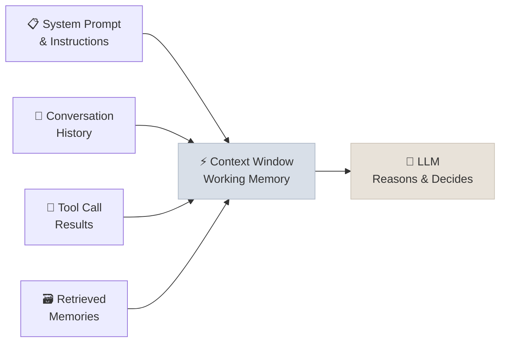
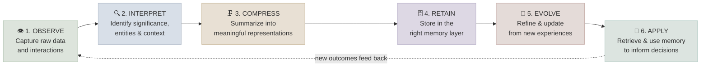
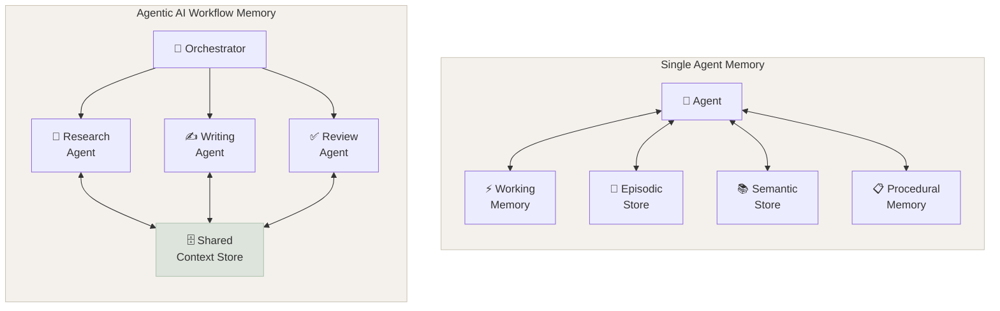

# Agent Memory

## Memory Is Not Storage - It's Intelligence Over Time

A human expert you hire on day one knows nothing about your business. By month six, they're invaluable - they remember what worked, what failed, your preferences, your processes, and the context behind every decision. That accumulation of experience is memory.

An AI Agent without memory is like that expert resetting to day one before every meeting. With a well-designed memory system, the agent learns, personalises, and compounds its usefulness over time. Memory is what turns a smart tool into a trusted collaborator.

Memory in an AI Agent is the infrastructure that maintains state across three key boundaries:

- **Within-context** - the active inference window (working memory)
- **Across-turns** - session history and event records (episodic memory)
- **Across-sessions** - learned facts, preferences, and execution patterns (semantic + procedural memory)

The choice of memory architecture determines whether an agent can personalize, generalize, and compound knowledge over time - or whether it's a stateless function that resets on every call.

---

## The Four Types of Agent Memory

An AI Agent's memory system is composed of four distinct layers, each serving a different time horizon and purpose.

---

### 1. Working Memory

Think of working memory as the agent's whiteboard right now. Everything the agent holds in mind during this conversation lives here - what you asked for, what it's already done, and what the tools have returned. The moment the conversation ends, this whiteboard gets erased.

**Example:** You ask an agent to draft an email to the CFO with a formal tone and attach last quarter's report. Working memory holds all three requirements simultaneously as it writes - it won't forget the attachment while it's thinking about the tone.

Working memory is the **active context window** - the complete token sequence assembled and fed to the LLM at the start of each reasoning step. It includes:

- System prompt and instructions
- Full conversation history (this session)
- Prior tool call inputs and outputs
- Retrieved memories from episodic/semantic stores
- Current task state

Bounded by the model's context limit (128K–200K tokens for frontier models). When the context fills, content must be summarized or evicted - this is the core challenge of long-running agents.

---

### 2. Episodic Memory

Episodic memory is the agent's diary - a record of what happened, when, and with whom. It allows the agent to pick up where you left off, across separate sessions, without you having to re-explain your context every time.

**Example:** You called a customer support agent last Tuesday about a billing error. When you call back on Friday, the agent recalls the previous case instantly. You don't have to repeat yourself - it already knows your account, the issue, and what was promised.

Episodic memory is implemented as a **vector store with timestamped interaction records**. Each episode (conversation turn, task execution, key event) is:

1. Chunked and embedded using an embedding model
2. Stored with metadata (timestamp, user ID, session ID, entity tags)
3. Retrieved at inference time via semantic similarity search

Retrieval is triggered by relevance to the current context - not time order. This enables "remember what we discussed last week about X" type queries without scanning the full history.

Common implementations: Pinecone, Weaviate, pgvector, Chroma.

---

### 3. Semantic Memory

Semantic memory is the agent's accumulated knowledge - facts, preferences, relationships, and domain expertise that persist indefinitely. The more the agent works with you, the richer this store becomes.

**Example:** After dozens of interactions, an agent has quietly learned: you prefer bullet points over paragraphs, you only read reports on Mondays, and your team uses Notion not Confluence. It applies all of this automatically - you never had to explain it explicitly.

Semantic memory is a **long-term knowledge store** containing:

- User preferences and behavioral patterns (extracted from episodic events)
- Domain-specific entities and facts (e.g., org chart, product catalog, technical glossary)
- Relationship graphs between entities (user → team → project → stakeholder)
- Distilled insights from past task outcomes

**Storage:** Vector embeddings (similarity-based retrieval) + optionally a knowledge graph (structured relationship queries). Populated via a background extraction pipeline that processes episodic events and identifies durable facts worth promoting to semantic memory.

---

### 4. Procedural Memory

Procedural memory is the agent's playbook - the rules, standard operating procedures, and workflows it follows consistently. This is what makes the agent reliable and predictable: no matter who asks, it behaves the same way in the same situation.

**Example:** An IT support agent always follows the same password reset flow - verify identity, confirm account, send reset link, log a ticket, follow up in 30 minutes. Every time. Every user. No exceptions. That consistency comes from procedural memory.

Unlike the other three types, procedural memory is **not retrieved at runtime** - it is baked into the agent's default behavior through:

- **System prompt** - explicit instructions, constraints, output formats
- **Tool schemas** - the defined interface for every tool the agent can call
- **Fine-tuned model weights** - behaviors baked in through RLHF or instruction tuning
- **Agent frameworks** - LangGraph state machines, CrewAI task definitions

Procedural memory defines the execution patterns that should be invariant across contexts. Updating it requires a deployment change, not a memory retrieval.

---

## The Memory Lifecycle

Memory is not static. Every interaction is an opportunity to observe, learn, and improve. The diagram below shows how raw interactions become lasting intelligence.

**In plain terms:** Every interaction the agent has is a chance to get smarter. It watches what happens, figures out what matters, compresses it into a useful summary, stores it in the right place, refines it over time, and then uses it the next time a relevant situation comes up. The loop keeps tightening.

The lifecycle is implemented as an asynchronous pipeline that runs alongside (or after) the main agent loop:

| Stage | Implementation |
|-------|---------------|
| **Observe** | Event capture hook - logs every LLM turn, tool call, and user message |
| **Interpret** | LLM extraction pass - identifies entities, topics, decisions, and importance signals |
| **Compress** | Chunking + summarization - converts raw text into dense, retrievable representations |
| **Retain** | Embedding + upsert - stores to episodic (timestamped events) or semantic (extracted facts) store |
| **Evolve** | Conflict resolution + preference updating - newer data can update or deprecate older facts |
| **Apply** | Retrieval-augmented generation - memory store queried at the start of each reasoning step |

---

## Memory Retention by Type

| Memory Type | What It Holds | Typical Retention | Storage Mechanism |
|---|---|---|---|
| **Working** | Current context, this session's tool calls | Seconds to hours | LLM context window (tokens) |
| **Episodic** | Past interactions, events, outcomes | Days to months | Vector store + timestamp metadata |
| **Semantic** | Facts, preferences, knowledge, entities | Months to years | Vector store + knowledge graph |
| **Procedural** | Rules, workflows, SOPs, tool schemas | Permanent (until updated) | System prompt, tool defs, fine-tuning |

---

## A Real-World Example: Customer Insights Agent

Imagine an AI agent helping a sales representative prepare for a customer call:

- **Working memory:** You've just told it the customer is upset about last month's outage and you want to lead with an apology and a discount offer
- **Episodic memory:** It recalls the three previous calls with this customer - what issues were raised, what was promised, and who the key decision-maker is
- **Semantic memory:** It knows this customer's industry (manufacturing), their contract size, and their stated preference for concise executive summaries
- **Procedural memory:** It always structures pre-call briefs the same way - situation, risks, suggested talking points, and next steps

In 30 seconds, it produces a briefing that would have taken a human 20 minutes to compile.

The pipeline for that briefing:

1. **Episodic retrieval** - similarity search on `customer_id + "call history"` → returns last 3 interaction summaries
2. **Semantic retrieval** - entity lookup on `customer_id` → returns preferences, contract data, decision-maker graph
3. **Working memory assembly** - user message + retrieved episodic + retrieved semantic + system prompt are assembled into context
4. **Procedural execution** - system prompt defines the output schema (situation → risks → talking points → next steps); the LLM fills it
5. **Post-generation** - the new call prep and any stated user preferences are extracted and queued for episodic + semantic store upsert

---

## Agent Memory vs Agentic AI Workflow Memory

There's an important distinction worth understanding as you evaluate AI systems:

A **single AI Agent** has its own private memory - it remembers conversations, learns preferences, and holds a playbook. Everything it knows is its own.

An **Agentic AI Workflow** (a system of multiple coordinating agents) has a different memory challenge: multiple specialists need to share information. A research agent, a writing agent, and a review agent might all work on the same document - but they each have their own working memory, and the system needs a way to pass context between them.

Think of it like a hospital: individual doctors remember their own patient interactions (agent memory), but there's also a central patient record system everyone can write to and read from (shared workflow memory).

The architectural distinction matters at system design time:

| Dimension | Single Agent | Agentic AI Workflow |
|---|---|---|
| **Memory ownership** | Private to one agent | Shared across multiple agents |
| **State passing** | In context window | Via message passing or shared store |
| **Consistency** | Single source of truth | Requires conflict resolution across agents |
| **Scalability** | Limited by context window | Distributed - each agent has its own context |
| **Complexity** | Simple - one memory system | High - need to design shared memory protocol |

The key design question for multi-agent systems: **which memory is private to an agent, and which is shared?** A specialist agent (e.g., a code execution agent) typically has private procedural memory but writes its results to a shared episodic store that other agents can read.

---

## Study Notes

- **Memory is what gives agents continuity** - without it, every interaction is a blank slate
- There are **four types**: Working (now), Episodic (what happened), Semantic (what's known), Procedural (how to act)
- The **lifecycle** is: Observe → Interpret → Compress → Retain → Evolve → Apply - a continuous loop
- **Working memory is bounded** by the context window - this is the #1 constraint in long-running agents
- **Procedural memory is the only type not retrieved** - it's encoded in the system prompt and tool definitions
- In **multi-agent systems**, shared memory is an explicit design decision - agents don't share memory automatically
- Agent memory is **per-agent**; workflow memory is **systemic** - both are needed in production Agentic AI systems
