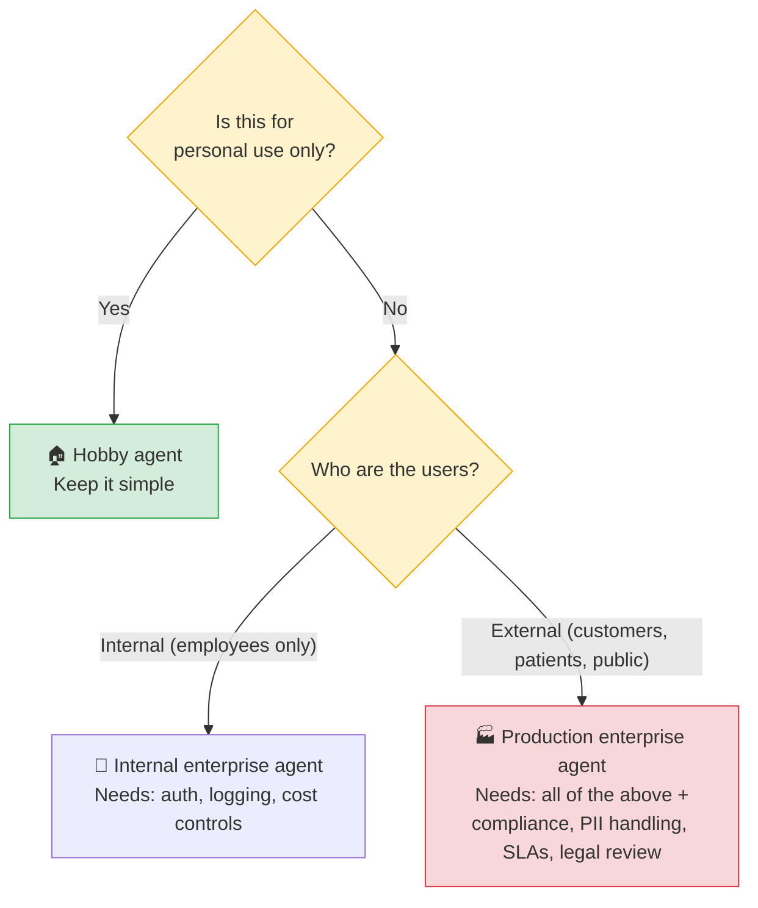

# Enterprise vs Personal AI Agents

Building an AI agent for a weekend project and building one that runs in a hospital or bank are fundamentally different engineering challenges. The gap isn't the AI model - it's everything around it: reliability, security, auditability, and governance.

---

## The Core Difference

| | Personal / Hobby Agent | Enterprise Agent |
|---|---|---|
| **Goal** | Learn, explore, automate a personal task | Solve a business problem at scale, reliably |
| **Users** | Just you (or a small group) | Employees, customers, regulators |
| **Stakes** | Low - a wrong answer is annoying | High - a wrong answer can mean legal liability or patient harm |
| **Scale** | Tens of runs | Thousands of concurrent runs |
| **Budget** | Willing to pay a few dollars | Must optimize cost per run at scale |
| **Maintenance** | You fix it when it breaks | Must be monitored 24/7; SLA commitments |

---

## Personal / Hobby Agent Characteristics

**What you're optimizing for:** Learning, speed of experimentation, getting something useful quickly.

**Typical stack:**
- Python script with LangChain or direct API calls
- Local tools (filesystem, local SQLite)
- Hardcoded API keys in `.env`
- No authentication layer
- Errors surface as tracebacks in your terminal
- You run it on your laptop

**What you DON'T need to worry about:**
- Multi-tenancy (it's just you)
- Audit logs
- PII handling
- Cost governance
- Uptime SLAs

**Great hobby agent projects:**
- Personal research summarizer ("summarize all articles I bookmarked this week")
- Home automation scripts ("check my calendar and remind me before each meeting")
- Local file organizer ("sort my downloads folder by type")
- Code review helper ("review this diff and flag obvious issues")
- Custom ChatGPT-like assistant for a hobby topic

---

## Enterprise Agent Characteristics

**What you're optimizing for:** Reliability, auditability, security, cost control, and the ability to scale to thousands of users.

### Reliability & Correctness

- **Structured output validation** - every LLM response parsed and validated against a schema before acting on it
- **Retry + fallback logic** - if a tool call fails, retry with backoff; if it still fails, gracefully degrade
- **Human-in-the-loop checkpoints** - for consequential actions (send email, process payment), require human confirmation
- **Graceful failure modes** - agent failing should not silently corrupt data

### Security & Access Control

- **Least-privilege tool access** - the agent only has access to the data and APIs it needs for the specific task
- **No hardcoded credentials** - secrets managed by a secrets manager (AWS Secrets Manager, HashiCorp Vault)
- **Input sanitization** - protect against prompt injection (malicious content in tool results trying to hijack the agent)
- **Output filtering** - PII masking, content policy checks before responses reach end users
- **Authentication** - agent actions tied to a user identity for audit purposes

### Observability & Auditability

- **Trace every agent step** - full log of: input received, reasoning trace, tool called, result, final output
- **Latency and cost tracking** - per-run cost (token count × price) and time-to-complete
- **Error rate dashboards** - track failure modes in production
- **Compliance audit trail** - in regulated industries, you may need to prove what the agent did and why

### Cost Governance

- **Token budgets** - hard limits on tokens per run to prevent runaway loops burning through API quota
- **Caching** - cache repeated tool calls (e.g., the same document lookup in the same session)
- **Model tiering** - use a cheaper/faster model for routine steps; escalate to a capable model only when needed
- **Rate limiting** - protect downstream APIs from being hammered by agent loops

---

## The Decision Framework: What Level Do You Need?

---

## When to Use Off-the-Shelf Frameworks vs Build Custom

| Situation | Recommendation |
|---|---|
| Learning / prototyping | LangChain, CrewAI - fast to get started |
| Simple internal tool | LangChain/LangGraph with custom tools |
| Complex multi-agent system | LangGraph (controllable state machines) or CrewAI (role-based crews) |
| GCP/Vertex AI ecosystem | Google ADK |
| Need maximum control & minimal deps | Build a thin custom loop on raw LLM API |
| Enterprise with strict compliance | Custom agent loop + your company's existing observability stack |

Off-the-shelf frameworks trade control for speed. As requirements get more specific, the abstraction cost grows. Many enterprise teams start with a framework and gradually replace pieces with custom implementations.

---

## Human-in-the-Loop Patterns

Enterprise agents rarely operate fully autonomously. Here are the standard checkpoints:

| Pattern | Description | Use Case |
|---|---|---|
| **Approval gate** | Agent pauses and asks human to approve before taking action | Send email, execute a trade, process refund |
| **Draft-and-review** | Agent produces output; human reviews before it goes anywhere | Customer reply drafts, legal documents |
| **Exception escalation** | Agent handles routine cases autonomously; escalates edge cases | Tier-1 support, claims processing |
| **Confidence threshold** | Agent acts if confidence > X%, escalates if below | Medical coding, fraud detection |

The right pattern depends on the **cost of a wrong action**. High cost → more human oversight.

---

## Common Enterprise Anti-Patterns

1. **Giving the agent too much access** - an agent that can read and write all tables in your database is a prompt injection attack away from a data breach
2. **No token budget** - a loop that halluccinates a goal and keeps calling tools until it hits your API rate limit (and your bill)
3. **Ignoring latency** - a 30-second agent response is fine for async tasks but terrible for real-time customer interactions
4. **No fallback** - when the LLM or a tool is unavailable, the agent should degrade gracefully, not crash the workflow
5. **Logging the model's reasoning but not the tool calls** - you need both to understand why an agent did what it did

---

## Study Notes

- The model is often the **smallest part** of the engineering challenge for enterprise agents - the hard work is reliability, security, and observability
- Start with hobby projects to understand how agents behave; bring those lessons when building production systems
- Human-in-the-loop is not a limitation - for high-stakes domains it's **the correct design**
- Cost governance is not an afterthought - a misconfigured agent loop can spend thousands of dollars in minutes
- Prompt injection is a real attack vector: any content that enters the agent's context from an external source is untrusted input
