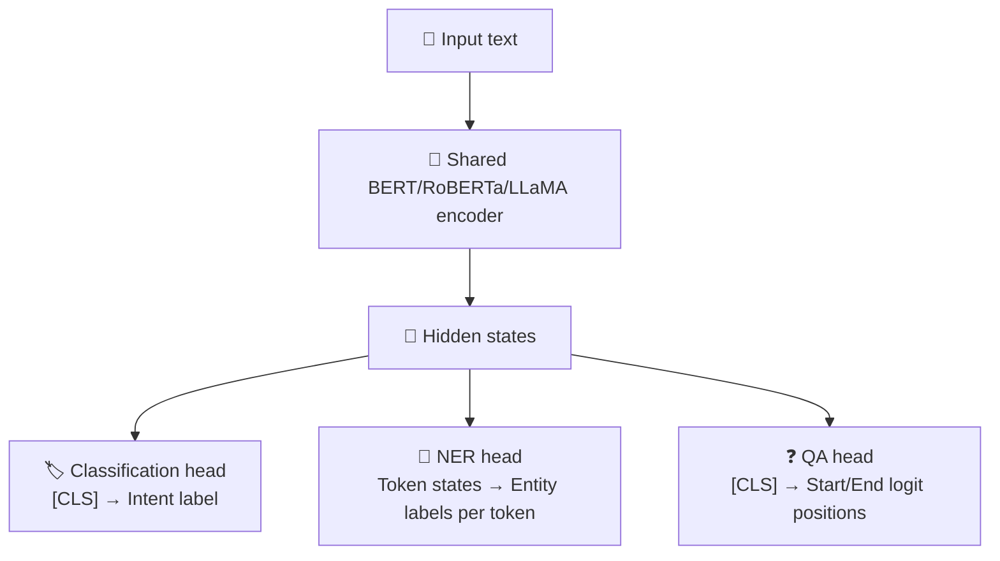

# Fine-Tuning: SFT and Parameter-Efficient Methods

Fine-tuning continues training a pretrained model on task- or behaviour-specific data. This chapter covers the decision to fine-tune at all, supervised fine-tuning (and why the loss is masked), and the parameter-efficient methods - LoRA and QLoRA - that make fine-tuning affordable; preference tuning and reinforcement learning follow in the next chapters.

```objectives
time: 50 min
outcomes:
  - Decide between prompting, RAG and fine-tuning for a requirement, and between full fine-tuning and PEFT
  - Prepare SFT data with the model's chat template and mask the loss to the response tokens
  - Derive LoRA's parameter count and initialisation, and choose rank, alpha and target modules
  - Estimate memory for full, LoRA and QLoRA fine-tuning of a given model and configure a QLoRA run
  - Evaluate a fine-tune for task gains and for regressions on general capability
prerequisites:
  - "[GPU Memory & Hardware](../../04-Pretraining/Notes/02-GPU-and-Hardware.mdx) - bytes per parameter"
  - "[Pretraining Overview](../../04-Pretraining/Notes/01-Training-and-Pretraining.mdx) - the causal LM loss"
```

## Fine-Tuning Taxonomy

### Concept

Fine-tuning adapts a pretrained base model for specific tasks or behaviors. The spectrum ranges from minimal (few-shot prompting) to maximal (full parameter updates).


*Increasing parameter modification, left to right.*

**Key decision: fine-tune vs RAG vs prompt engineering?**

| Approach | Best for | Cost | Data needed |
|----------|---------|------|-------------|
| Prompt engineering | Behavior change, style, instruction framing | Free | None |
| RAG | Adding new factual knowledge | Medium | Documents |
| Fine-tuning | Consistent format/style, task specialization | High | Labeled examples |
| Full fine-tuning | Complete behavior overhaul, new domain | Very high | Large labeled dataset |

**Rule of thumb:** Try prompting first, RAG second, fine-tuning only when both are insufficient.

---

## Supervised Fine-Tuning (SFT)

### Concept

SFT trains the model on labeled (input, output) pairs using the standard CLM loss. The model learns to produce the desired output format and style.

**Instruction dataset format:**
```json
{
  "instruction": "Summarize this article in 2 sentences.",
  "input": "The transformer architecture was introduced...",
  "output": "Transformers use self-attention mechanisms...\nThis architecture now dominates NLP."
}
```

**Critical technique - loss masking:**

During SFT, you only compute the loss on the **completion tokens** (the output), not the instruction tokens. This is crucial:

```
Full sequence: [INST]Summarize this.[/INST] The model should focus on...
Loss mask:     [  0  ]  0  0   0  [  0  ]  1   1     1     1   1  ...
```

Why? You want the model to learn to generate good outputs, not to memorize the instruction phrasing. Computing loss on the instruction would also wastefully push the model toward strange completions of instruction fragments.

**Tricky Q:** *Why do you mask the instruction tokens during SFT loss computation?*  
If you include instruction tokens in the loss, you're computing gradients to "predict" arbitrary instruction text - but instructions vary across examples and have no consistent pattern to learn. More importantly, you want to optimize output quality, not instruction completion. Masking ensures gradients only flow from the target output.

**SFT data quality > quantity:**
- LIMA (Zhou et al., 2023) fine-tuned a 65B model on 1,000 carefully curated examples and got responses that human raters often preferred or rated equal to those of models trained with far more data - evidence that most capability comes from pretraining and SFT mainly teaches format and style
- Diversity matters: different tasks, domains, lengths, and formats
- Consistency matters: the output should reflect the persona and format you want the model to learn

---

## Beyond SFT: Preference Tuning and RL

SFT imitates demonstrations. The next stages optimise for what people or verifiers prefer; each has its own chapter:

| Method | Needs | How it works | Chapter |
|---|---|---|---|
| **RLHF with PPO** | Preference data → reward model; a critic | On-policy RL maximising reward with a KL penalty to the SFT model | [RL for LLMs](03-RL-for-LLMs.mdx) |
| **DPO and variants (IPO, KTO, SimPO, ORPO)** | Chosen/rejected pairs | A supervised loss derived from the RLHF objective; no reward model or RL loop; offline | [Preference Optimization](02-Preference-Optimization.mdx) |
| **Rejection-sampling fine-tuning** | A scorer or verifier | Sample several answers, keep the best, run SFT on them | [RL for LLMs](03-RL-for-LLMs.mdx) |
| **GRPO / RLVR** | A reward function or verifier (tests, exact answers) | Online RL with group-relative advantages instead of a critic; drives reasoning models | [RL for LLMs](03-RL-for-LLMs.mdx), [Reasoning Models](04-Reasoning-Models-and-Test-Time-Compute.mdx) |

Llama 3's post-training, for example, combined SFT, rejection sampling and DPO; DeepSeek-R1 added large-scale GRPO with verifiable rewards. ("RFT" is ambiguous - rejection-sampling fine-tuning or OpenAI's reinforcement fine-tuning - so spell it out.)

---

## Parameter-Efficient Fine-Tuning (PEFT)

### Concept

Full fine-tuning updates all model parameters. For a 7B model, that's 7 billion gradients, a full copy of optimizer states, etc. PEFT methods update a tiny fraction of parameters.

**Why not full fine-tuning?**
1. **Cost:** mixed-precision Adam needs ~16 bytes per parameter (BF16 weights + grads, FP32 master weights + momentum + variance) - 8× the BF16 weights alone
2. **Catastrophic forgetting:** Full updates overwrite general capabilities
3. **Storage:** Each fine-tuned variant requires saving the full model
4. **Composability:** Hard to combine multiple task-specific fine-tunes

---

## LoRA - Low-Rank Adaptation

### Concept

LoRA (Hu et al., 2021) is the dominant PEFT method. The key insight: the change in weights during fine-tuning has low intrinsic rank - it can be approximated by two small matrices.

**The math:**
```
During full fine-tuning:
  W_new = W_0 + ΔW    (W_0 frozen, ΔW = same shape as W_0)

LoRA approximation:
  ΔW ≈ B × A    where B ∈ ℝ^{d×r}, A ∈ ℝ^{r×k}, rank r << min(d,k)

Forward pass:
  output = x·W_0 + x·(B·A) = x·W_0 + x·ΔW
```

- **W_0** (base model weights): **frozen** - never updated
- **A** (right matrix): initialized with random Gaussian
- **B** (left matrix): initialized with zeros → ΔW = B×A = 0 at start → training starts from the base model behavior
- **r** (rank): hyperparameter, typically 4–64. Lower rank = fewer parameters, potentially lower quality

**Parameter savings:**
```
Full weight: d × k (e.g., 4096 × 4096 = 16.8M)
LoRA:        r × k + d × r = r × (d + k) (e.g., r=16: 16 × 8192 = 131K)
Reduction:   16.8M → 131K = 128× fewer parameters to train
```

**Where to apply LoRA:** the original paper adapted only the Q and V projections; the QLoRA paper found adapting **all linear layers** (attention and MLP) was needed to match full fine-tuning, and most current recipes use `target_modules="all-linear"`.

**Scaling parameter alpha (α):**
```
output = x·W_0 + (α/r) × x·(B·A)
```
α controls the effective learning rate of the LoRA update. Often set to `r` (so α/r = 1) or `2r`.

---

## QLoRA - Quantized LoRA

### Concept

QLoRA (Dettmers et al., 2023) enables fine-tuning very large models on consumer hardware by:
1. **Quantizing the base model to NF4** (4-bit NormalFloat) - reduces base model memory by 4×
2. **Training LoRA adapters in BF16** - the adapters are small, full-precision
3. **Double quantization** - quantize the quantization constants themselves for extra savings

**Why NF4?** LLM weights have a distribution close to normal. NF4 places quantization bins at equal probability intervals of the normal distribution - better coverage of likely weight values than uniform INT4.

**VRAM comparison for fine-tuning LLaMA-3 8B:**
```
Full fine-tuning (BF16):    8B × 16 bytes = 128 GB model state + activations
                            → sharded (ZeRO-3/FSDP) across 2-4× 80 GB GPUs

LoRA (BF16 base):           16 GB weights + ~0.3 GB adapters + optimizer ≈ 24 GB
                            Fits on 1× A100-40GB

QLoRA (NF4 base + BF16 LoRA): 8B × 0.5 bytes ≈ 4-5 GB weights
                                + adapters and their optimizer state (< 1 GB)
                                + activations (several GB, depends on sequence length)
                                ≈ 10-16 GB in practice → fits on 1× RTX 4090 (24 GB) ✓
```

### Code

```python
# QLoRA fine-tuning with PEFT + BitsAndBytes
from transformers import AutoModelForCausalLM, AutoTokenizer, BitsAndBytesConfig
from peft import LoraConfig, get_peft_model, prepare_model_for_kbit_training, TaskType
import torch

# Step 1: Load base model in NF4 (4-bit quantization)
bnb_config = BitsAndBytesConfig(
    load_in_4bit=True,
    bnb_4bit_use_double_quant=True,   # quantize quantization constants
    bnb_4bit_quant_type="nf4",        # NormalFloat4
    bnb_4bit_compute_dtype=torch.bfloat16  # compute in BF16
)

model = AutoModelForCausalLM.from_pretrained(
    "meta-llama/Llama-3.2-1B",
    quantization_config=bnb_config,
    device_map="auto"
)

tokenizer = AutoTokenizer.from_pretrained("meta-llama/Llama-3.2-1B")
tokenizer.pad_token = tokenizer.eos_token

# Prepare the quantized model for training: casts norms to fp32 and enables input gradients
# (required with gradient checkpointing) - skipping this is the classic silent QLoRA failure
model = prepare_model_for_kbit_training(model)

# Step 2: Add LoRA adapters
lora_config = LoraConfig(
    r=16,                       # rank
    lora_alpha=32,              # scaling = alpha/r = 2
    target_modules="all-linear",  # attention and MLP projections, as in the QLoRA paper
    lora_dropout=0.1,
    bias="none",
    task_type=TaskType.CAUSAL_LM
)

model = get_peft_model(model, lora_config)
model.print_trainable_parameters()
# Output: trainable params: ~11M | all params: ~1.25B | trainable%: ~0.9%

# Step 3: Training loop (simplified)
from transformers import TrainingArguments, Trainer

training_args = TrainingArguments(
    output_dir="./qlora_output",
    num_train_epochs=3,
    per_device_train_batch_size=4,
    gradient_accumulation_steps=4,  # effective batch = 4×4 = 16
    learning_rate=2e-4,
    bf16=True,          # match bnb_4bit_compute_dtype above
    logging_steps=10,
    save_strategy="epoch",
    optim="paged_adamw_32bit",  # memory-efficient optimizer for QLoRA
)
```

---

## Multi-Head Fine-Tuning

### Concept

Multi-head fine-tuning uses a **shared encoder backbone** with **multiple task-specific output heads**. This allows a single model to perform several tasks with minimal parameter overhead.

**Architecture:**


**Implementation pattern:**

```python
import torch
import torch.nn as nn
from transformers import AutoModel

class MultiTaskModel(nn.Module):
    def __init__(self, model_name, num_classes_intent, num_entity_types, hidden_size=768):
        super().__init__()
        self.encoder = AutoModel.from_pretrained(model_name)
        
        # Task head 1: sequence classification (intent)
        self.classification_head = nn.Sequential(
            nn.Dropout(0.1),
            nn.Linear(hidden_size, num_classes_intent)
        )
        
        # Task head 2: token classification (NER)
        self.ner_head = nn.Sequential(
            nn.Dropout(0.1),
            nn.Linear(hidden_size, num_entity_types)
        )
        
        # Task head 3: extractive QA (start/end positions)
        self.qa_head = nn.Linear(hidden_size, 2)  # 2 = start + end logits

    def forward(self, input_ids, attention_mask, task="classification"):
        outputs = self.encoder(input_ids=input_ids, attention_mask=attention_mask)
        hidden_states = outputs.last_hidden_state  # [batch, seq, hidden]
        cls_embedding = hidden_states[:, 0, :]     # [batch, hidden] - CLS token
        
        if task == "classification":
            return self.classification_head(cls_embedding)
        elif task == "ner":
            return self.ner_head(hidden_states)    # per-token logits
        elif task == "qa":
            logits = self.qa_head(hidden_states)   # [batch, seq, 2]
            return logits[:, :, 0], logits[:, :, 1]  # start, end
        else:
            raise ValueError(f"Unknown task: {task}")

# Multi-task training strategy
model = MultiTaskModel("bert-base-uncased", num_classes_intent=10, num_entity_types=9)

# Option 1: Joint training - interleave batches from all tasks
# Option 2: Sequential training - train task 1 then task 2 (catastrophic forgetting risk!)
# Option 3: Task-specific learning rates
optimizer = torch.optim.AdamW([
    {"params": model.encoder.parameters(), "lr": 2e-5},      # small lr for shared encoder
    {"params": model.classification_head.parameters(), "lr": 1e-4},  # larger for heads
    {"params": model.ner_head.parameters(), "lr": 1e-4},
    {"params": model.qa_head.parameters(), "lr": 1e-4},
])
```

**Multi-task interference mitigation:**
- **Gradient surgery (PCGrad):** Projects gradients from one task onto the perpendicular of conflicting gradients from another task - reduces destructive interference
- **Task-specific adapters:** Freeze the shared backbone and train separate LoRA adapters per task - no interference possible
- **Careful task weighting:** Weight task losses to prevent one task dominating gradient updates
- **Sample difficulty:** Easy tasks can hurt hard tasks if they dominate the batch - use balanced sampling

---

## PEFT Methods Comparison

| Method | Trainable params | Quality | Memory | When to use |
|--------|-----------------|---------|--------|-------------|
| Full fine-tune | 100% | Best | Very high | Plenty of data + compute |
| LoRA (r=16) | ~0.5–1% | Near full | Medium | Most fine-tuning tasks |
| QLoRA (NF4) | ~0.5–1% LoRA | Near LoRA | Low | Limited GPU (single 24GB) |
| Prefix tuning | ~0.1% | Good for generation | Low | Domain-specific generation |
| Prompt tuning | ~0.01% | Acceptable | Minimal | Very limited compute |
| Adapters | ~1–5% | Good | Medium | Multi-task with swappable modules |

---

## Choosing the Right Fine-Tuning Method

| Use Case | Recommended Method |
|----------|--------------------|
| Lightweight tuning for multiple tasks | LoRA / QLoRA / Adapter Tuning |
| Teaching specific structured response formats | SFT (plus rejection-sampling fine-tuning on verified outputs) |
| Aligning with human preferences | SFT, then DPO-family preference tuning (or RLHF with a reward model) |
| Tuning on large domain corpus without labels | Continual Pretraining |
| High compute, max performance task adaptation | Full Fine-Tuning |
| Few-shot, low-resource setups | Prefix Tuning / LoRA |
| Fast prototyping with prebuilt tools | PEFT (Hugging Face library) |
| Long-chain reasoning (math, code) | RL with verifiable rewards (GRPO and variants) |

**Continual Pretraining** (distinct from instruction fine-tuning): Resume language model training on unlabeled domain-specific corpus. Captures domain jargon and writing style without requiring labeled examples. Risk: forgetting general language knowledge. Used when you want the model to "speak the language" of your domain before task-specific instruction tuning.

---

## Fine-Tuning Evaluation

### Concept

After fine-tuning, you need to verify that quality improved on the target task without degrading general capability. Evaluation spans multiple dimensions.

| Category | Method | What It Measures | Tools |
|----------|--------|-----------------|-------|
| Quantitative Metrics | Accuracy, F1, BLEU, ROUGE, Perplexity | Basic task correctness or fluency | `evaluate`, scikit-learn, sacrebleu, rouge-score, bert_score |
| LLM-as-a-Judge | GPT-4/Gemini comparison & scoring | Human-like eval for quality, factuality, tone | TruLens, promptfoo, LangSmith |
| Embedding Similarity | BERTScore, Cosine similarity | Semantic similarity of output to ground truth | bert_score, sentence-transformers |
| Prompt-Based Unit Tests | Pass/Fail output checks | Regression testing on curated prompts | promptfoo, LangSmith, Evals-as-Code |
| RAG-Specific Metrics | Faithfulness, Context Recall, Precision | Groundedness of RAG output in source | RAGAS, TruLens, LangChain evals |
| Human Feedback | Thumbs-up/down, rating | Real-world helpfulness and satisfaction | LangSmith, TruLens, custom dashboards |
| Live Monitoring | Latency, fail rates, usage stats | Operational metrics in production | OpenTelemetry, MLflow, Weights & Biases |

**Code snippet - ROUGE + BERTScore evaluation:**

```python
import evaluate

rouge = evaluate.load("rouge")
bertscore = evaluate.load("bertscore")

predictions = ["The model predicts the next token using attention."]
references = ["LLMs use attention mechanisms to predict the next token."]

print(rouge.compute(predictions=predictions, references=references))
print(bertscore.compute(predictions=predictions, references=references, lang="en"))
```

**Regression testing:** Always keep a fixed "golden set" of prompts and expected behaviors. After each fine-tuning run, check that scores on this set don't degrade - catches catastrophic forgetting before deployment.

---

## Hands-On Lab

Want to actually run a LoRA/QLoRA fine-tune, not just the math? See the [Fine-Tuning Lab](../../06-Fine-Tuning-Lab/INDEX.mdx) module - hands-on `peft`/`bitsandbytes` configuration, instruction data formatting and loss masking, a runnable QLoRA training script, and a measured base-vs-tuned benchmark (quality, latency, VRAM, cost).

---

## Study Notes

- Try prompting, then RAG; fine-tune for consistent format, style or task behaviour that prompting can't deliver - fine-tuning is a poor way to add changing facts
- SFT uses the causal LM loss masked to response tokens; format with the model's chat template
- LoRA: ΔW ≈ B·A with rank r ≪ min(d, k); B initialised to zero so training starts from the base model; scale α/r; adapt all linear layers
- LoRA parameters per matrix = r(d + k); for 4096 × 4096 at r = 16: 131K vs 16.8M
- QLoRA: frozen NF4 base + bf16 adapters + double quantization + paged optimizers; call `prepare_model_for_kbit_training`
- Full fine-tuning needs ~16 bytes/param of model state; LoRA and QLoRA cut this to roughly the base weights plus activations
- Preference tuning (DPO family) and RL (PPO, GRPO) come after SFT - see the next chapters
- Evaluate on the target task and on a fixed general suite to catch forgetting

## Check Yourself

```quiz
- q: "LoRA with rank 8 is applied to a 4096 × 11008 projection. How many trainable parameters does it add?"
  options: ["8 × (4096 + 11008) ≈ 121K", "4096 × 11008 ≈ 45M", "8 × 4096 ≈ 33K", "8 × 11008 ≈ 88K"]
  answer: 1
- q: "Why is B initialised to zero in LoRA?"
  options:
    - "So ΔW = BA = 0 at the start and training begins exactly from the base model's behaviour"
    - "To save memory"
    - "Because A is also zero"
    - "To speed up convergence by 2×"
  answer: 1
- q: "Your support bot must reflect a policy that changes weekly. Fine-tune or RAG?"
  options: ["RAG - facts that change belong in retrieved documents", "Fine-tune weekly", "Full fine-tuning once", "Prompt engineering only"]
  answer: 1
- q: "Why mask the prompt tokens out of the SFT loss?"
  answer: "The goal is to learn to produce good responses; training to predict the (varied, arbitrary) prompt text wastes gradient signal and can teach the model to imitate user turns. Masking makes every gradient come from response quality."
- q: "What does `prepare_model_for_kbit_training` do, and what happens if you skip it?"
  answer: "It casts layer norms to fp32 and enables gradients on the input embeddings (needed with gradient checkpointing). Without it, training can run without errors but the adapters receive no or unstable gradients, so the model barely learns."
```

## Exercises

```exercise
- title: Memory for three ways to fine-tune
  task: |
    For an 8B model, estimate the memory for (a) full fine-tuning with mixed-precision AdamW, (b) LoRA at r = 16 on all linear layers of a bf16 base, and (c) QLoRA with an NF4 base. Assume Llama-3-8B shapes (32 layers, d_model 4096, 1024-dim K/V, FFN 14336) and ignore activations. Which runs on one 24 GB GPU?
  solution: |
    (a) 8B × 16 bytes = 128 GB - needs sharding across several 80 GB GPUs. (b) Per layer, LoRA adds r × (d + k) for Q (4096+4096), K and V (4096+1024 each), O (4096+4096) and three MLP matrices (4096+14336 each): 16 × (8192 + 5120 + 5120 + 8192 + 3 × 18432) ≈ 1.31M per layer, ≈ 42M total. With AdamW in fp32 that's ~0.7 GB of adapter state, plus 16 GB of bf16 base weights → ~17 GB before activations; tight on 24 GB. (c) NF4 base ≈ 4.5-5 GB + the same ~0.7 GB → comfortably fits on 24 GB with room for activations.
- title: Does fine-tuning help your task?
  task: |
    Pick a narrow task (for example extracting fields from invoices into JSON). Build 200 labelled examples, split 150/50, and compare few-shot prompting of an instruct model with a QLoRA fine-tune of the same model on the 50 held-out items. Report accuracy with confidence intervals and the cost of each approach.
  solution: |
    Expect the fine-tune to win on format consistency and on edge cases present in the training data, with a smaller gap on the easy majority. With 50 test items the CIs are wide (±10-14 points); decide only if the gap is clearly larger than that, and weigh the ongoing cost of maintaining a fine-tuned model.
```

## References

- Hu et al., [LoRA: Low-Rank Adaptation of Large Language Models](https://arxiv.org/abs/2106.09685) (2021)
- Dettmers et al., [QLoRA: Efficient Finetuning of Quantized LLMs](https://arxiv.org/abs/2305.14314) (2023)
- Zhou et al., [LIMA: Less Is More for Alignment](https://arxiv.org/abs/2305.11206) (2023)
- Ouyang et al., [Training language models to follow instructions with human feedback (InstructGPT)](https://arxiv.org/abs/2203.02155) (2022)
- Biderman et al., [LoRA Learns Less and Forgets Less](https://arxiv.org/abs/2405.09673) (2024)
- Yu et al., [Gradient Surgery for Multi-Task Learning (PCGrad)](https://arxiv.org/abs/2001.06782) (2020)
- Hugging Face, [PEFT documentation](https://huggingface.co/docs/peft) (2026)

*Last reviewed: 2026-09*
