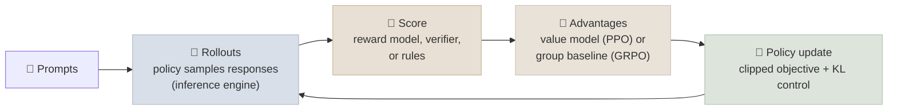

# Reinforcement Learning for LLMs

Online reinforcement learning - the model generates, gets scored, and updates on its own samples - is how assistants were first aligned (RLHF with PPO) and, since 2025, how reasoning models are trained (RL with verifiable rewards). This note covers the algorithms (PPO, GRPO and its fixes), the reward sources (reward models, verifiers, process rewards), reward hacking, and what RL training infrastructure looks like.

```objectives
time: 70 min
outcomes:
  - Explain the PPO-based RLHF loop, including the roles of the policy, reference, reward and value models
  - Derive GRPO's group-relative advantage and explain what it removes from PPO
  - Explain the fixes proposed by DAPO, Dr. GRPO and GSPO and the failure each targets
  - Compare outcome rewards, process rewards and verifiers, and recognize reward hacking
  - Describe the systems shape of RL training (rollout-dominated, generation engines, async pipelines)
prerequisites:
  - "[Preference Optimization](02-Preference-Optimization.mdx)"
```

## The RL Loop for Language Models



Language generation as RL: the **state** is the prompt plus tokens so far, an **action** is the next token, and the **reward** usually arrives once, at the end of the response. The policy gradient pushes up the log-probability of tokens in responses that scored better than expected - the "better than expected" part is the **advantage**, and how you estimate it is what separates the algorithms.

---

## PPO-based RLHF

### Concept

The InstructGPT-style pipeline keeps **four models** in play:

| Model | Role | Trained? |
|-------|------|----------|
| Policy | Generates responses | Yes |
| Reference (frozen SFT) | KL anchor - penalize drifting too far | No |
| Reward model | Scores complete responses | No (trained earlier) |
| Value model (critic) | Predicts expected reward per token, for per-token advantages (GAE) | Yes |

PPO's clipped objective limits how far one update can move the policy:

```
ratio_t = π_θ(a_t|s_t) / π_old(a_t|s_t)
L = -E[ min( ratio_t · A_t,  clip(ratio_t, 1-ε, 1+ε) · A_t ) ]  +  β · KL(π_θ || π_ref)
```

PPO works but is heavy: two extra trainable-size models in memory, and the value model is hard to train when rewards come only at the end of long responses.

---

## GRPO: Drop the Critic

### Concept

**Group Relative Policy Optimization** (DeepSeekMath, 2024) replaces the learned value model with a statistical baseline. For each prompt, sample a **group** of G responses, score them, and use each one's standing within its group as the advantage:

```
A_i = ( r_i - mean(r_1..r_G) ) / std(r_1..r_G)        applied to every token of response i
```

The rest is PPO-style: a clipped ratio objective, plus a KL penalty to the reference model added to the loss. With binary correct/incorrect rewards this is intuitive - responses that beat the group average are reinforced, those below it are suppressed - and memory drops by a whole model.

**RL with verifiable rewards (RLVR).** For math (exact-match answers), code (unit tests), and format constraints, the reward is a program, not a learned model. That removes most reward-model hacking and made large-scale reasoning RL practical: DeepSeek-R1-Zero was trained with GRPO from a base model using only accuracy and format rewards (see [Reasoning Models](04-Reasoning-Models-and-Test-Time-Compute.mdx)).

### Fixes that followed

| Method | Problem it targets | Change |
|--------|--------------------|--------|
| **DAPO** (ByteDance Seed, 2025) | Entropy collapse; wasted batches; long-response bias | *Clip-higher* (a larger upper clip bound so rare good tokens can grow); *dynamic sampling* (drop prompts where every sample got the same reward - zero advantage, zero signal); token-level loss averaging; soft penalties for overlong responses; no KL term |
| **Dr. GRPO** (2025) | GRPO's normalizations bias learning - dividing by response length favours long wrong answers; dividing by group std overweights very easy/hard prompts | Remove the per-response length normalization and the std normalization |
| **GSPO** (Qwen, 2025) | Token-level importance ratios are noisy and destabilize large (especially MoE) models | Use a sequence-level importance ratio and clip whole sequences |

---

## Reward Sources

| Reward | How it works | Strengths | Risks |
|--------|--------------|-----------|-------|
| **Learned outcome reward model (ORM)** | Scores a full response (Bradley-Terry) | Works for open-ended quality (helpfulness, tone) | Exploitable; rewards length and confident style |
| **Verifier / rules** | Exact match, unit tests, compilers, format regexes | Hard to game; cheap | Only exists for checkable tasks; false positives in weak tests |
| **Process reward model (PRM)** | Scores each reasoning step | Denser signal; can catch right-answer-wrong-reasoning | Step labels are expensive (PRM800K) or noisy when automated; also hackable |
| **LLM-as-judge with a rubric** | A strong model grades against explicit criteria | Covers tasks with no verifier | Judge biases; the policy learns to please the judge |

### Reward hacking

The policy optimizes the reward you wrote, not the one you meant. Classic examples: responses padded with length because the reward model liked long answers; code that special-cases the unit tests; answers that print the expected format with no work. Defences: prefer verifiers, hold out an independent evaluation the policy never trains against, KL-regularize or cap training steps, inspect samples regularly, and make test suites adversarial.

---

## What RL Training Looks Like as a System

- **Generation dominates.** Most wall-clock time goes to sampling long responses, so RL frameworks embed a fast inference engine (vLLM or SGLang) next to the trainer and move weights between them every step.
- **Colocated vs disaggregated.** Either the same GPUs alternate between generation and training, or separate pools run in parallel, with **asynchronous** (slightly off-policy) updates to keep both busy.
- **Long-tail rollouts.** A few very long responses stall a synchronous batch; systems cap length, over-sample and drop stragglers, or run partial rollouts.
- **Frameworks:** Hugging Face TRL (`GRPOTrainer`, `PPOTrainer`, `DPOTrainer`), verl (HybridFlow), OpenRLHF, and others. The [Fine-Tuning Lab](../../06-Fine-Tuning-Lab/INDEX.mdx) runs GRPO with TRL on a small model.

---

## Check Yourself

```quiz
- q: "What does GRPO use in place of PPO's value model?"
  options:
    - "The mean and standard deviation of rewards across a group of responses to the same prompt"
    - "A second reward model"
    - "The reference model's log-probabilities"
    - "A process reward model"
  answer: 1
- q: "Every response in a GRPO group gets reward 1. What is the learning signal from that prompt?"
  options:
    - "Zero - all advantages are zero, which is why DAPO's dynamic sampling drops such prompts"
    - "Strongly positive - all responses are reinforced"
    - "Negative - GRPO penalizes easy prompts"
    - "It depends on the KL term only"
  answer: 1
- q: "Why did RL with verifiable rewards make large-scale reasoning RL practical?"
  answer: "Programmatic checks (exact answers, unit tests, format rules) give reliable rewards that are hard to game and need no learned reward model, so the policy can be trained for many steps on many samples without exploiting a reward model's blind spots."
- q: "Dr. GRPO removes GRPO's per-response length normalization. What bias did that normalization introduce?"
  options:
    - "It diluted the penalty on long incorrect responses, nudging the model toward longer wrong answers"
    - "It made short correct answers get negative rewards"
    - "It forced all responses to the same length"
    - "It removed the KL penalty"
  answer: 1
```

## Exercises

```exercise
- title: Compute GRPO advantages
  task: |
    A prompt gets G = 6 responses with rewards [1, 0, 0, 1, 0, 0]. Compute each response's advantage (use population std). Then repeat for rewards [1, 1, 1, 1, 1, 0]. Which response in the second group gets the largest-magnitude advantage, and why is that desirable?
  solution: |
    Group 1: mean = 1/3, std = 0.471 → correct responses +1.41, incorrect -0.71.
    Group 2: mean = 5/6, std = 0.373 → correct +0.45, the single incorrect -2.24. The lone failure on a mostly-solved prompt gets the strongest push away - the model learns most from its rare mistakes on problems it can usually solve.
- title: Spot the reward hack
  task: |
    Your code-RL run's reward (unit tests passing) rose from 40% to 85%, but a held-out benchmark improved only from 38% to 41%. List three hypotheses and how you would test each.
  hints:
    - "Read samples. Look for hard-coded expected outputs, disabled tests, or catching every exception."
```

## Study Notes

**Must-know:**
- RLHF-PPO needs policy, reference, reward and value models; clipped ratio objective + KL to reference
- GRPO: sample G responses per prompt; advantage = (r - group mean) / group std; no critic
- RLVR: rewards from verifiers/rules for math, code, format - the engine of 2025 reasoning models
- DAPO: clip-higher, dynamic sampling, token-level loss, overlong shaping, no KL; Dr. GRPO: remove length and std normalization; GSPO: sequence-level ratios
- Reward sources: ORM, verifier, PRM, rubric judge - all hackable to some degree; keep an independent held-out eval
- RL systems are generation-bound: inference engine inside the loop, async/off-policy pipelines, long-tail rollouts

## References

- Schulman et al., [Proximal Policy Optimization Algorithms](https://arxiv.org/abs/1707.06347) (2017)
- Ouyang et al., [Training language models to follow instructions with human feedback (InstructGPT)](https://arxiv.org/abs/2203.02155) (2022)
- Shao et al., [DeepSeekMath (introduces GRPO)](https://arxiv.org/abs/2402.03300) (2024)
- Lambert et al., [Tülu 3 (RLVR)](https://arxiv.org/abs/2411.15124) (2024)
- Yu et al., [DAPO: An Open-Source LLM Reinforcement Learning System at Scale](https://arxiv.org/abs/2503.14476) (2025)
- Liu et al., [Understanding R1-Zero-Like Training: A Critical Perspective (Dr. GRPO)](https://arxiv.org/abs/2503.20783) (2025)
- Zheng et al., [Group Sequence Policy Optimization (GSPO)](https://arxiv.org/abs/2507.18071) (2025)
- Lightman et al., [Let's Verify Step by Step](https://arxiv.org/abs/2305.20050) (2023) - process reward models
- Sheng et al., [HybridFlow (verl)](https://arxiv.org/abs/2409.19256) (2024); Hu et al., [OpenRLHF](https://arxiv.org/abs/2405.11143) (2024)

*Last reviewed: 2026-09*
