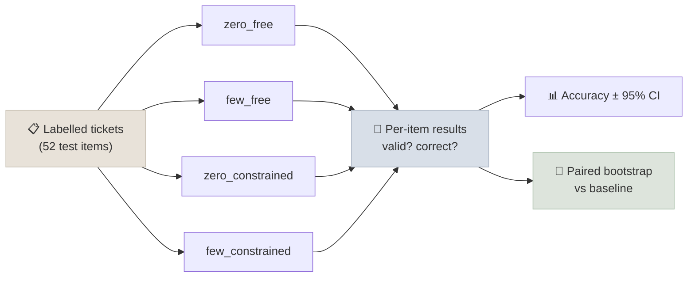

# Code Lab 01 - Prompt Evals & Structured Outputs

Evaluate prompt variants the way you would evaluate code changes: run zero-shot and few-shot prompts, with and without schema-constrained decoding, over the same labelled test set on a small local model - and let bootstrap confidence intervals tell you which differences are real.

← **Back to Overview:** [Prompt & Context Engineering](../INDEX.mdx) · **Concepts:** [Core Techniques](../Notes/02-Core-Techniques.mdx) · [Structured Outputs](../Notes/04-Structured-Outputs.mdx) · [Prompts in Production](../Notes/08-Prompts-in-Production.mdx)

```objectives
time: 1.5 hours
outcomes:
  - Build a labelled eval set and a harness that scores prompt variants on the same items
  - Measure valid-output rate and accuracy with 95% bootstrap confidence intervals
  - Decide whether a prompt change is an improvement using a paired bootstrap on per-item differences
  - Use Outlines to constrain a local model's output to a Pydantic schema
prerequisites:
  - "[Core Techniques](../Notes/02-Core-Techniques.mdx) - zero-shot and few-shot prompting"
  - "[Structured Outputs](../Notes/04-Structured-Outputs.mdx) - constrained decoding"
  - "Python 3.10+; about 2 GB of disk for the model"
```

---

## What's In This Lab

| Property | Detail |
|---|---|
| Model | `Qwen/Qwen3-0.6B` (instruct, thinking disabled); any Hugging Face chat model via `--model` |
| Data | `tickets.py`: 60 support tickets in 4 categories; 8 form the few-shot pool, 52 the test set |
| Variants | `zero_free`, `few_free`, `zero_constrained`, `few_constrained` |
| Metrics | Valid-output rate, accuracy with 95% bootstrap CI, paired bootstrap CI vs the first variant |
| Verified | Full run on a laptop CPU/MPS (Apple M-series) in about 2 minutes with torch 2.14, transformers 5.17 and outlines 1.3 |
| Files | `01-Prompt-Evals-and-Structured-Outputs/{prompt_lab.py, tickets.py, requirements.txt}` |



## Run It

```bash
cd 05-Prompt-Engineering/CodeLabs/01-Prompt-Evals-and-Structured-Outputs
pip install -r requirements.txt

python prompt_lab.py --limit 8          # smoke test
python prompt_lab.py                    # all four variants on 52 items
python prompt_lab.py --model Qwen/Qwen3-1.7B --variants zero_free,few_free
```

A reference run (Qwen3-0.6B, 52 items):

```text
zero_free          valid=100.0%  acc= 75.0%  95% CI [61.5%, 86.5%]
few_free           valid=100.0%  acc= 78.8%  95% CI [67.3%, 88.5%]
zero_constrained   valid=100.0%  acc= 73.1%  95% CI [59.6%, 84.6%]
few_constrained    valid=100.0%  acc= 78.8%  95% CI [67.3%, 90.4%]
few_free vs zero_free: diff=+3.8%  95% CI [-7.7%, +15.4%]  not significant
zero_constrained vs zero_free: diff=-1.9%  95% CI [-7.7%, +3.8%]  not significant
few_constrained vs zero_free: diff=+3.8%  95% CI [-5.8%, +13.5%]  not significant
```

## Walkthrough - What to Look At

1. **The intervals are wide.** With 52 items, a 95% interval on accuracy spans about 25 points. Eyeballing a handful of outputs, or even comparing two averages, can't tell you whether a prompt is better.
2. **Paired beats unpaired.** The paired interval on `few_free − zero_free` is narrower than the gap between the two per-variant intervals suggests, because pairing removes item difficulty. It still spans zero: a +3.8-point gain is not established at this sample size.
3. **Constrained decoding didn't matter here - and that's informative.** A one-field JSON object with an enum is easy for a modern instruct model, so free generation was already 100% valid. Constraints earn their keep with nested schemas, smaller or base models, and long outputs (see the first exercise).
4. **Few-shot examples as chat turns.** `build_messages` inserts the examples as prior user/assistant turns rather than one text block - the natural format for chat models.
5. **The label definitions are in the system prompt.** Most misclassifications are boundary disagreements (e.g. is "SSO login loops" a bug or account access?). Improving the definitions is often worth more than adding examples - try it and measure.

## Check Yourself

```quiz
- q: "Variant A scores 78% and variant B 75% on the same 52 items; the paired 95% CI of A−B is [−5%, +12%]. What do you report?"
  options:
    - "No established difference - collect more data or accept either"
    - "A is 3 points better"
    - "B is better because its interval is narrower"
    - "The experiment is invalid"
  answer: 1
- q: "Why did schema-constrained decoding not improve the valid-output rate in this lab?"
  options:
    - "The schema is a single enum field, which the instruct model already produced reliably"
    - "Outlines was not actually applied"
    - "The model was too large"
    - "Temperature was too high"
  answer: 1
- q: "Why does the script shuffle the test set with a fixed seed before applying --limit?"
  answer: "The data is stored grouped by category, so the first N items would all be billing tickets. Shuffling with a fixed seed makes smoke tests roughly balanced across categories while keeping runs reproducible."
```

## Exercises

```exercise
- title: Make constraints matter
  task: |
    Extend `TicketLabel` with `urgent: bool` and `entities: list[Entity]` where `Entity` has `type` (product, person or amount) and `value`. Update the system prompt and the few-shot answers to describe the new fields. Re-run all variants with `--max-new-tokens 120` and compare valid-output rates.
  hints: ["The parser's non-greedy regex `\\{.*?\\}` stops at the first closing brace - make it greedy for nested objects."]
  solution: |
    In our run on Qwen3-0.6B, zero-shot free generation fell to 88.5% valid (six unparseable outputs), while both constrained variants stayed at 100%. Few-shot free generation was also 100% valid - examples of the exact output shape are a strong format signal too. Constraints guarantee shape at zero cost in examples or tokens; they don't make the category more accurate.
- title: Improve the prompt, prove it
  task: |
    Rewrite the category definitions in `SYSTEM` to address the errors you see (print mismatches to find them). Compare the new prompt against the original with the paired bootstrap. Then add 60 more labelled tickets of your own and repeat. Does the conclusion change?
  hints: ["Print (ticket, gold, pred) for wrong items in the loop."]
  solution: |
    Targeted definition fixes often give a few points; on 52 items the interval will usually still include zero. Doubling the test set narrows the interval by roughly a factor of √2 - the practical lesson is to size eval sets for the effect you need to detect.
- title: Scale the model
  task: |
    Run `zero_free` and `few_free` with Qwen3-1.7B and Qwen3-4B (GPU or patience required). Plot accuracy against model size with intervals. Is few-shot's benefit larger for smaller models?
  solution: |
    Typically accuracy rises with size and the few-shot gain shrinks, because larger models infer the task from the definitions alone. Report intervals - differences between adjacent sizes may not be significant on 52 items.
```

## References

- Qwen Team, [Qwen3 Technical Report](https://arxiv.org/abs/2505.09388) (2025)
- [Outlines documentation](https://dottxt-ai.github.io/outlines/)
- Efron & Tibshirani, *An Introduction to the Bootstrap* (1993) - the resampling method used for the intervals

*Last reviewed: 2026-09*
