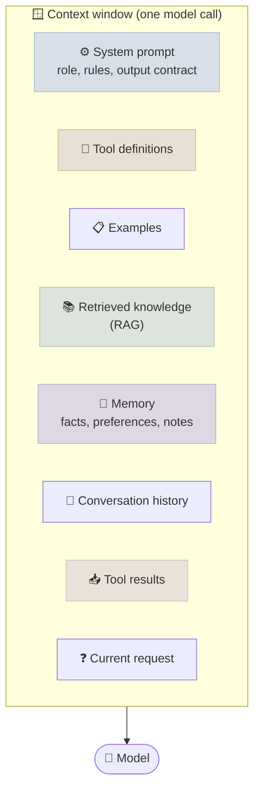
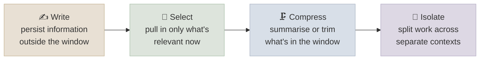

# Context Engineering

Context engineering is deciding, for every model call, which tokens go into the context window - instructions, examples, tool definitions, retrieved documents, memory, history and tool results - so the model gets the smallest set of high-signal information it needs.

```objectives
time: 45 min
outcomes:
  - List the components that compete for a model's context and estimate a token budget for each
  - Explain the evidence that quality degrades with context length (lost in the middle, effective context, context rot) and what it implies for design
  - Apply the four strategies - write, select, compress, isolate - to a long-running assistant or agent
  - Place instructions, documents and questions in a long prompt to maximise quality
prerequisites:
  - "[Prompt Fundamentals](01-Prompt-Fundamentals.mdx)"
```

## From Prompts to Contexts

Prompt engineering focused on the wording of one instruction. Production systems - RAG pipelines, assistants with memory, agents running for hours - assemble the context programmatically on every call, and most of it isn't written by a person. The question becomes: *what should be in the window right now?*



Every component costs tokens (money and latency) and attention. Context windows have grown to hundreds of thousands or millions of tokens, but the evidence below shows that *using* a long context well is much harder than *fitting* one.

---

## Why Less Is More: the Evidence

| Study | Finding | Implication |
|---|---|---|
| **Lost in the Middle** (Liu et al., TACL 2024) | Multi-document QA accuracy is highest when the relevant document is first or last and drops when it is in the middle; with 20-30 documents, GPT-3.5-Turbo with the answer in the middle did *worse* than with no documents at all (closed-book, 56.1%) | Position matters; irrelevant documents are not harmless |
| **RULER** (Hsieh et al., COLM 2024) | Models that pass simple needle-in-a-haystack tests degrade sharply on harder long-context tasks (multi-hop tracing, aggregation); "effective" context is often a fraction of the advertised window | Don't trust the advertised window - test at your real lengths and task |
| **NoLiMa** (Modarressi et al., ICML 2025) | When the needle shares no literal words with the question, performance of most models falls far below their short-context baseline by 32K tokens | Long-context retrieval leans on surface matching; semantic lookups over long inputs are fragile |
| **Context Rot** (Chroma, 2025) | Across 18 models, performance grows less reliable as input length increases, even on simple tasks; distractors and low question-evidence similarity make it worse | Quality degrades gradually, not at a cliff - every extra token has a cost |

Newer models have improved on all of these, but the direction of the evidence is consistent: **relevance beats volume**.

---

## Four Strategies

A useful taxonomy for managing context (popularised by LangChain's write/select/compress/isolate framing and echoed in Anthropic's guidance for agents):



| Strategy | Techniques | Example |
|---|---|---|
| **Write** | Scratchpads and notes files; long-term memory stores; saving plans and progress | An agent keeps a `progress.md` of decisions and open tasks instead of relying on the transcript |
| **Select** | RAG over documents; retrieving relevant memories; retrieving few-shot examples; loading tool definitions on demand ("tool search") | Retrieve the 5 most relevant policy chunks instead of pasting the whole handbook |
| **Compress** | Summarising old turns; *compaction* (replace the transcript with a summary when nearing the limit); clearing old, bulky tool results; trimming documents to relevant passages | After a 200-row query result has been used, replace it with "query returned 200 rows; key finding: ..." |
| **Isolate** | Sub-agents with their own clean context that return a condensed result; sandboxes that hold large objects outside the context | A research sub-agent reads 30 pages and returns a 500-token brief to the orchestrator |

A related principle is **just-in-time context**: rather than loading everything up front, give the model lightweight references (file paths, IDs, search tools) and let it fetch details when needed - the way a person uses a file system rather than memorising it. The cost is extra tool calls and latency; the benefit is a smaller, more relevant context. These strategies are the core of [Agent Memory](../../10-Agent-Building-Blocks/Notes/02-Agent-Memory.mdx) and of long-running agent harnesses in [Agent Engineering](../../19-Agent-Engineering/INDEX.mdx).

---

## Arranging a Long Context

When a prompt does contain long material:

1. **Put long documents first and the question last.** Anthropic's long-context guidance reports that placing the query after the documents can improve response quality by up to 30% on complex multi-document inputs.
2. **Wrap each document in tags with metadata** (`<document index="3"><source>..</source><content>..</content></document>`) so the model can cite and distinguish them.
3. **Ask for relevant quotes first** for long-document QA - extracting the supporting passages before answering focuses the model and makes answers checkable.
4. **Order retrieved passages by relevance** and keep the count small; the best passage should be first (or last), not buried.
5. **Keep stable content at the start** so it can be reused from the prompt cache (see [Prompt Caching & Cost](07-Prompt-Caching-and-Cost.mdx)); put per-request content at the end.

---

## Budgeting the Window

A worked budget for an assistant on a model with a 200K-token window, aiming to keep typical calls far below the limit:

| Component | Budget | Management |
|---|---|---|
| System prompt and rules | 1-3K | Stable - cached |
| Tool definitions | 2-10K | Load only the tools relevant to the task, or use tool search |
| Few-shot examples | 0-3K | Retrieve the nearest examples if needed |
| Retrieved documents | 5-20K | Top-k after reranking; trim to passages |
| Memory | 0.5-2K | Retrieve relevant memories only |
| Conversation history | 5-30K | Keep recent turns verbatim, compact older ones |
| Tool results | Variable | Truncate or summarise large outputs; clear stale ones |
| Output (including reasoning) | 4-32K | Reserve explicitly in `max_tokens` |

The numbers are illustrative; the habit is not. Count tokens per component in production logs, and alert when a component grows without bound - usually history or tool results.

---

## Check Yourself

```quiz
- q: "An assistant's answers get worse over a long session even though the context never exceeds the model's window. Which strategy most directly addresses this?"
  options:
    - "Compress: compact older turns and clear stale tool results"
    - "Switch to a model with a larger window"
    - "Raise the temperature"
    - "Move the system prompt to the end"
  answer: 1
  explain: "Quality degrades with length well before the limit (context rot). A larger window doesn't fix that; keeping the context short and relevant does."
- q: "What did the Lost in the Middle study find for GPT-3.5-Turbo with 20-30 retrieved documents and the answer in the middle?"
  options:
    - "Accuracy fell below its closed-book accuracy (no documents at all)"
    - "Accuracy was unaffected by position"
    - "Accuracy was highest in the middle"
    - "The model refused to answer"
  answer: 1
- q: "Which is an example of the 'isolate' strategy?"
  options:
    - "A sub-agent explores a codebase in its own context and returns a short summary to the main agent"
    - "Summarising the first 50 turns of a conversation"
    - "Retrieving the top 5 documents"
    - "Saving user preferences to a database"
  answer: 1
- q: "For a long contract plus a question, where should the question go and why?"
  answer: "After the documents, at the end of the prompt. Vendor guidance and experiments show queries placed after long documents produce better answers; it also keeps the stable document prefix cacheable across different questions."
```

## Exercises

```exercise
- title: Audit a context
  task: |
    Log the full request of one call from an assistant or agent you use (or build a toy one with 10 turns and 3 tool calls). Break its tokens down by component using the table above. Which component would you cut first, and with which strategy?
  solution: |
    In most real traces, tool results and history dominate while the system prompt is small. The usual first cuts are clearing or summarising tool results once used (compress) and loading only relevant tools (select) - not trimming the system prompt.
- title: Position experiment
  task: |
    Build 30 questions over a set of 20 short documents where exactly one document contains each answer. Put the answer-bearing document at position 1, 10 and 20 and measure accuracy with a model of your choice. Then repeat with the question placed before vs after the documents.
  solution: |
    Expect a U-shaped or at least position-dependent curve on smaller models and a flatter one on strong current models, and better results with the question after the documents. The exercise shows why you test your own model and lengths instead of assuming.
```

## Study Notes

**Must-know:**
- Context engineering = choosing every token in each call: instructions, tools, examples, knowledge, memory, history, tool results
- Evidence: lost in the middle, RULER effective context, NoLiMa, context rot - quality degrades with length and distractors
- Strategies: write (persist outside), select (retrieve relevant), compress (summarise/compact/clear), isolate (sub-agents)
- Long inputs: documents first, question last, tagged documents, quote-then-answer
- Budget tokens per component and watch the ones that grow (history, tool results)

## References

- Liu et al., [Lost in the Middle: How Language Models Use Long Contexts](https://arxiv.org/abs/2307.03172) (TACL 2024)
- Hsieh et al., [RULER: What's the Real Context Size of Your Long-Context Language Models?](https://arxiv.org/abs/2404.06654) (COLM 2024)
- Modarressi et al., [NoLiMa: Long-Context Evaluation Beyond Literal Matching](https://arxiv.org/abs/2502.05167) (ICML 2025)
- Hong, Troynikov & Huber, [Context Rot: How Increasing Input Tokens Impacts LLM Performance](https://www.trychroma.com/research/context-rot) (Chroma, 2025)
- Anthropic, [Effective context engineering for AI agents](https://www.anthropic.com/engineering/effective-context-engineering-for-ai-agents) (2025)
- LangChain, [Context Engineering for Agents](https://blog.langchain.com/context-engineering-for-agents/) (2025)
- Anthropic, [Long context prompting tips](https://platform.claude.com/docs/en/build-with-claude/prompt-engineering/long-context-tips)

*Last reviewed: 2026-09*
