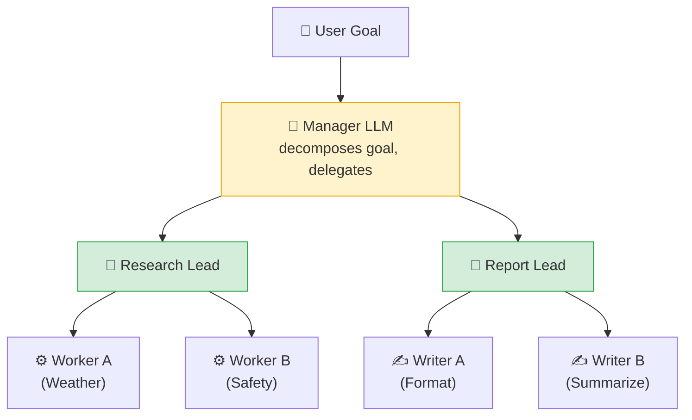

# 03 - Hierarchical Architecture

## Pattern: Manager → Team Leads → Workers

## When to Use Hierarchical

| Scenario | Why Hierarchical? |
|---|---|
| Complex goal needing decomposition | Manager breaks it into sub-goals |
| Teams with different specializations | Each team lead manages its domain |
| Dynamic task assignment | Manager decides what to delegate based on input |
| Separation of planning and execution | Manager plans, workers execute |

## Trade-offs

| Pro | Con |
|---|---|
| Clear chain of command | More agents = more LLM calls |
| Manager can adapt delegation | Manager is a bottleneck and single point of failure |
| Workers stay focused | Harder to debug - which level failed? |

## Mock Task

**Goal:** Produce a comprehensive travel report for 2 cities  
**Manager:** Assigns research tasks to Research Lead and writing tasks to Report Lead  
**Research Lead:** Delegates weather and safety collection to specialist workers  
**Report Lead:** Delegates formatting and summarization to writer workers

## Framework Implementations

| Framework | Hierarchy Mechanism |
|---|---|
| LangChain | Nested LCEL chains - manager chain calls sub-chains |
| LangGraph | Multi-level graph with supervisor nodes routing to subgraphs |
| CrewAI | `Process.hierarchical` with a `manager_llm` |
| ADK | Multi-agent with sub-agents registered in parent agent |
