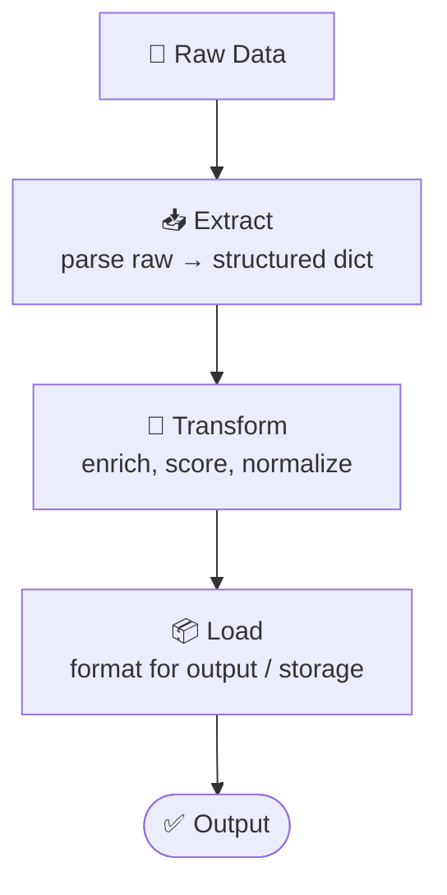

# 05 - Pipeline Architecture

## Pattern: Pure Data-Flow, No Shared State

## Pipeline vs Sequential

| Sequential | Pipeline |
|---|---|
| LLM at every step | LLM may only appear in some steps |
| Steps can have side effects | Steps are pure functions (deterministic) |
| Context matters between steps | Each step only sees its immediate input |
| Agents with personas | Functions / transforms |

## Mock Task: ETL Travel Data Pipeline

- **Extract:** Parse raw city strings → structured dicts
- **Transform:** Score, rank, add derived fields
- **Load:** Format into final JSON report

## When to Use Pipeline

- Data transformation that doesn't need LLM at every step
- Deterministic processing with clear input/output contracts
- High volume, low latency (pure functions, no LLM overhead)
