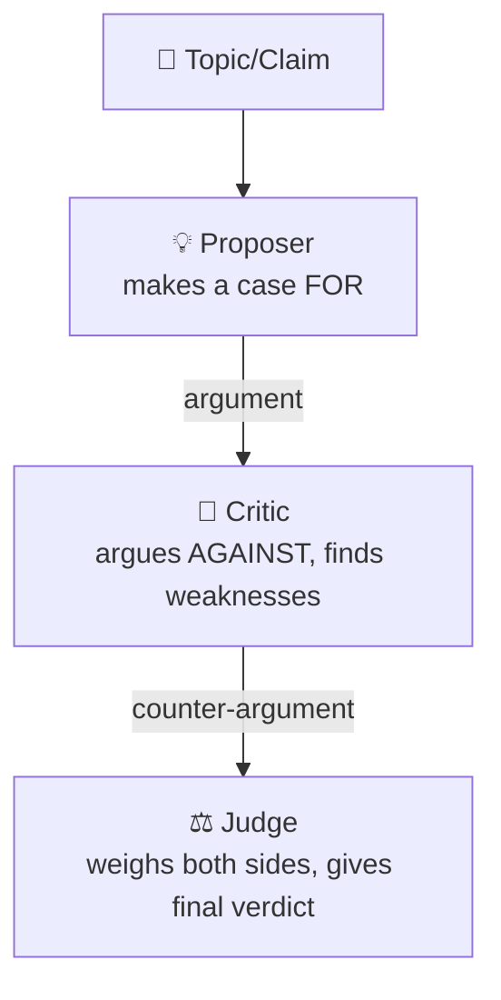

# 06 - Adversarial Debate Architecture

## Pattern: Proposer vs Critic → Judge Decides

## Why Adversarial Debate?

| Benefit | Explanation |
|---|---|
| Bias reduction | Two opposing LLMs catch each other's blind spots |
| Better reasoning | Being challenged forces stronger arguments |
| Calibration | Judge gives a more balanced verdict than a single LLM |
| Quality assurance | Critic finds issues that a single-pass LLM misses |

## Mock Task

**Topic:** "Tokyo is the best travel destination for a one-week trip"  
**Proposer:** Makes the strongest case FOR Tokyo  
**Critic:** Argues AGAINST, surfaces weaknesses  
**Judge:** Evaluates both arguments and gives a final verdict with score

## When to Use

- High-stakes decisions needing devil's advocate
- Content quality checks (generate → critique → revise verdict)
- Red-teaming AI outputs
- Balanced analysis of controversial topics
