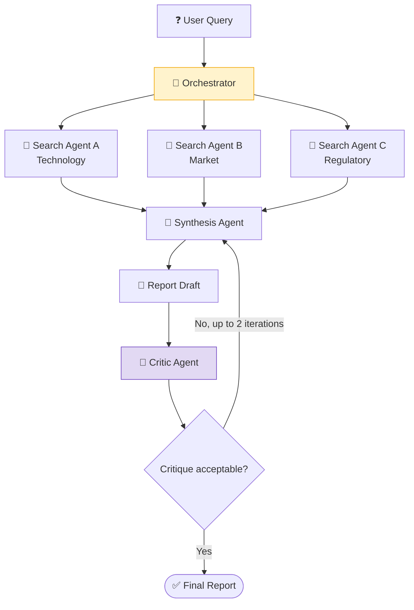

# Research Assistant System

A multi-agent system that takes a research question, fans out to parallel search agents, synthesizes findings, runs a critique pass, and produces a structured research report.

## Architecture



## Patterns Used

| Pattern | Where It Appears |
|---------|-----------------|
| Orchestrator-Subagent | Orchestrator delegates to Search + Synthesis + Critic |
| Parallel / Fan-out | Three search agents run concurrently |
| Reflexion | Critic evaluates synthesis; synthesis revises if needed |

## Agent Roles

| Agent | Role | Tools |
|-------|------|-------|
| Orchestrator | Receives query, coordinates all agents, returns final report | None (coordination only) |
| Search Agent (×3) | Searches one domain (tech/market/regulatory) and returns structured findings | `search_domain()` |
| Synthesis Agent | Merges all search results into a coherent structured report | `format_report()` |
| Critic Agent | Evaluates report for gaps, unsupported claims, and missing sections | None (reasoning only) |

## State Flow

```
State: {
  query: str,
  search_results: {technology: [], market: [], regulatory: []},
  synthesis: str,
  critique: str,
  iteration: int,
  final_report: str
}
```

## What This Demonstrates

1. Parallel subagent execution (fan-out pattern)
2. Result aggregation from multiple sources
3. Reflexion loop with a separate critic agent
4. Termination conditions (max iterations, critique acceptance)
5. Structured state that flows through all agents

## Implementations

- [LangChain](LangChain/system.py) - LCEL chains with AgentExecutor for each agent
- [LangGraph](LangGraph/system.py) - State graph with `Send()` for parallel execution
- [CrewAI](CrewAI/system.py) - Research crew with defined roles and tasks
- [ADK](ADK/system.py) - ParallelAgent + SequentialAgent composition

## Running

```bash
# From the Codes/ directory
python 03-Agentic-Systems/01-Research-Assistant/LangGraph/system.py
```

The system uses mock search tools - no external API keys needed beyond `GOOGLE_API_KEY`.
