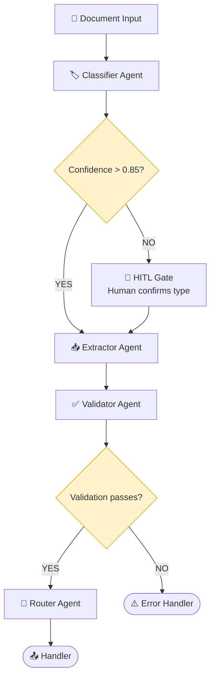

# Document Processor System

An agentic pipeline that ingests a document, classifies its type, extracts structured data, validates the extraction, and routes it to the appropriate handler - with a HITL gate for low-confidence classifications.

## Architecture

## Patterns Used

| Pattern | Where It Appears |
|---------|-----------------|
| Pipeline / Sequential | Classify → Extract → Validate → Route |
| Conditional Routing | Confidence-gated HITL; validation pass/fail routing |
| HITL Gate | Human confirms document type when classifier is uncertain |

## Agent Roles

| Agent | Role | Output |
|-------|------|--------|
| Classifier | Identifies document type and confidence | `{type, confidence, reasoning}` |
| HITL Handler | (Simulated) human confirmation of type | Confirmed document type |
| Extractor | Extracts structured fields based on document type | Structured data dict |
| Validator | Checks extracted data for completeness and consistency | `{valid, issues}` |
| Router | Determines the appropriate handler and sends output there | Routed output |

## Document Types Supported

| Type | Key Fields Extracted |
|------|---------------------|
| `invoice` | vendor, amount, date, line_items, due_date |
| `contract` | parties, effective_date, terms, termination_clause |
| `resume` | name, email, skills, experience, education |

## What This Demonstrates

1. Sequential pipeline pattern with typed stage interfaces
2. Confidence-gated HITL - low-confidence triggers human review
3. Conditional routing based on validation results
4. Schema-based extraction (different schemas per document type)
5. Graceful error handling and partial results

## Implementations

- [LangChain](LangChain/system.py) - Chain pipeline with conditional branching
- [LangGraph](LangGraph/system.py) - State graph with conditional edges for HITL and validation
- [CrewAI](CrewAI/system.py) - Sequential crew with classification, extraction, and validation tasks
- [ADK](ADK/system.py) - SequentialAgent with conditional subagent routing
