# Agentic Architectural Patterns

← **Back to Overview:** [Agentic AI](../INDEX.mdx)

---

## Overview

An architectural pattern defines the **structural blueprint** of an agentic system - how many agents there are, how they relate to each other, and how control and information flow between them. Choosing the right pattern is the first major system design decision.

Eight fundamental patterns cover the vast majority of real-world agentic systems. Most production systems combine two or three of them.

| Pattern | Control | Execution | Best For |
|---------|---------|-----------|----------|
| Single Agent | Self | Sequential | Focused, single-domain tasks |
| Orchestrator-Subagent | Centralized | Sequential or parallel | Complex tasks with clear decomposition |
| Hierarchical | Multi-level | Delegated | Large-scale, nested task trees |
| Peer-to-Peer | Distributed | Collaborative | Fluid collaboration, no fixed hierarchy |
| Pipeline / Sequential | Chain | Sequential | ETL-style, document processing |
| Parallel / Fan-out | Centralized | Concurrent | Multi-source research, speedup |
| Adversarial / Debate | Structured | Turn-based | Fact-checking, red-teaming, critical analysis |
| Reflexion / Self-Critique | Self | Iterative | Quality-sensitive tasks |

---

## Pattern 1 - Single Agent

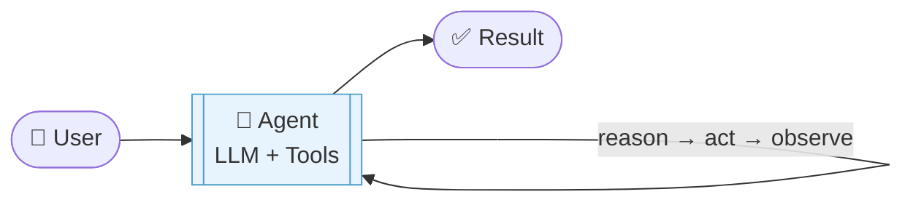

**Structure:** One LLM with access to tools, operating in a reasoning loop. The agent reasons about what to do, calls a tool, observes the result, reasons again, and repeats until it can answer.

**Control:** The LLM itself decides what to do next - no external orchestration.

**When to use:**
- The task fits in a single context window
- A single area of expertise is sufficient (no need for specialists)
- The task doesn't require parallelism
- Simplicity and debuggability are priorities

**Limitations:**
- Context window is the hard ceiling - complex tasks accumulate too much history
- No specialization - one agent handling everything tends to be mediocre at all of it
- Sequential by nature - can't parallelize subtasks

**Example:** A customer support agent that uses tools to look up orders, check inventory, and process refunds.

---

## Pattern 2 - Orchestrator-Subagent

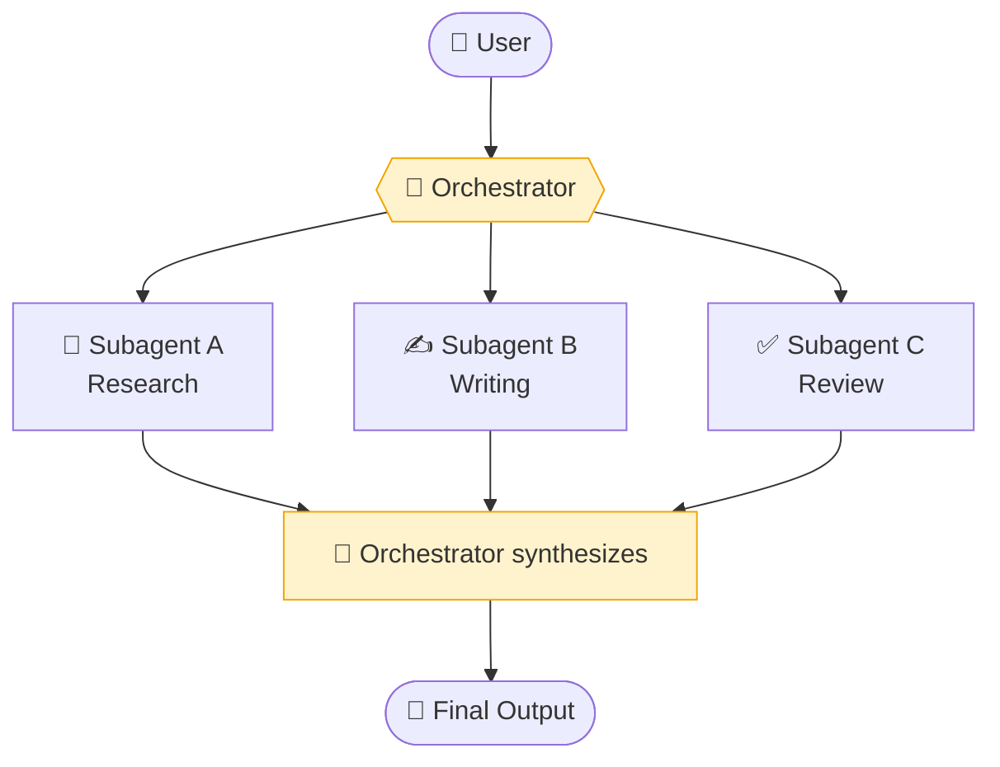

**Structure:** An orchestrator agent receives the high-level goal, decomposes it into subtasks, and delegates each to a specialized subagent. Subagents return results to the orchestrator, which synthesizes them.

**Control:** Centralized - the orchestrator owns the plan and the coordination. Subagents are stateless workers.

**When to use:**
- Task naturally decomposes into distinct, specialized subtasks
- Different subtasks require different expertise or tools
- Some subtasks can run in parallel
- You want to isolate failures - one subagent failing doesn't crash the whole system

**Key design decisions:**
- How static is the plan? (Fixed decomposition vs dynamic replanning)
- Do subagents run sequentially or in parallel?
- How does the orchestrator handle a subagent failure?

**Example:** A content creation system where the orchestrator delegates to a research agent, a writing agent, and a fact-checking agent.

---

## Pattern 3 - Hierarchical

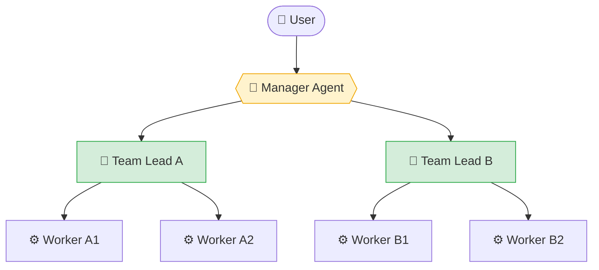

**Structure:** Multi-level orchestration. A top-level manager decomposes the goal at a high level and delegates to team leads. Each team lead further decomposes their portion and delegates to worker agents.

**Control:** Hierarchical - each level owns its scope. The manager doesn't micromanage workers; it manages team leads.

**When to use:**
- Very large tasks that require many agents (10+)
- Clear hierarchical decomposition exists in the domain
- You want management boundaries - a team lead can fail and be retried without the manager needing to know the details

**Tradeoffs:**
- More layers = more latency (each layer adds a round-trip)
- Harder to debug - a failure in a worker surfaces only after propagating up
- Powerful for scale, overkill for simple tasks

**Example:** A software engineering system: Manager (architecture) → Team Lead A (backend) with worker agents for each service, Team Lead B (frontend) with worker agents for each component.

---

## Pattern 4 - Peer-to-Peer (Decentralized)

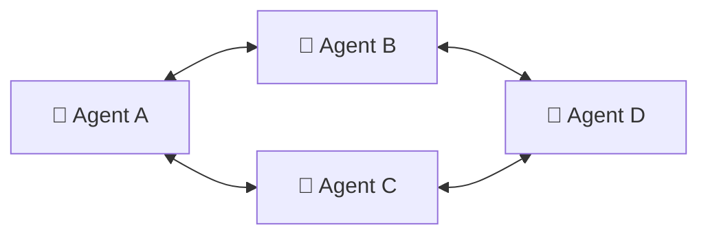

**Structure:** No central coordinator. Agents communicate directly with each other, passing messages or sharing a common state. Each agent decides independently what to do based on its local view.

**Control:** Distributed - no single agent owns the plan. Coordination emerges from agent interactions.

**When to use:**
- Roles are fluid and change during execution
- True collaboration is needed, not just task delegation
- Fault tolerance is critical - no single point of failure
- The task benefits from independent perspectives arriving at a consensus

**Challenges:**
- Harder to reason about correctness - emergent behavior is unpredictable
- Risk of conflicting agents or deadlock
- Debugging is significantly harder (no single trace to follow)
- Usually requires a shared state mechanism (blackboard, event bus)

**Example:** A negotiation system where multiple agents represent different stakeholders and must reach agreement.

---

## Pattern 5 - Pipeline / Sequential

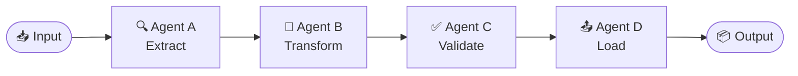

**Structure:** Agents form a processing chain. Each agent receives the previous agent's output as its input and passes its output to the next agent.

**Control:** The chain structure itself controls flow. There's no orchestrator - the pipeline is the architecture.

**When to use:**
- Task naturally decomposes into sequential stages
- Each stage has a well-defined input/output contract
- Data transforms progressively (ETL pattern)
- You want to replace one stage without touching others (modularity)

**Key design decisions:**
- What happens when a stage fails? Retry, skip, or halt?
- Can stages run asynchronously (queue-based) or must they be synchronous?
- Should intermediate outputs be cached?

**Example:** Document processing: OCR → extract text → classify document type → extract structured fields → validate schema → store in database.

---

## Pattern 6 - Parallel / Fan-out

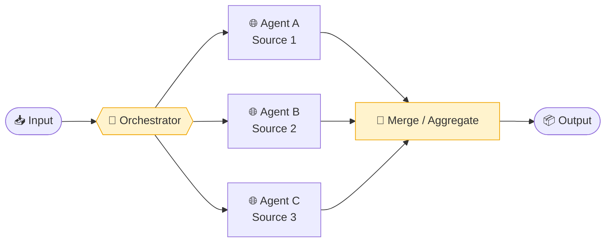

**Structure:** An orchestrator dispatches multiple agents to work concurrently on independent subtasks. Results are collected and aggregated once all agents complete.

**Control:** Centralized orchestrator dispatches and aggregates. Workers are independent.

**When to use:**
- Multiple independent data sources need to be queried
- The same task needs to be run with multiple variations and results compared
- Latency reduction is important (parallelism reduces wall-clock time)
- You need breadth of coverage (more sources → more comprehensive result)

**Aggregation strategies:**
- Union all results (then deduplicate)
- Rank and select top-k across all results
- Have a synthesis agent merge results intelligently
- Majority vote (for classification tasks)

**Example:** A research assistant that simultaneously queries academic papers, news articles, and company filings, then synthesizes all results.

---

## Pattern 7 - Adversarial / Debate

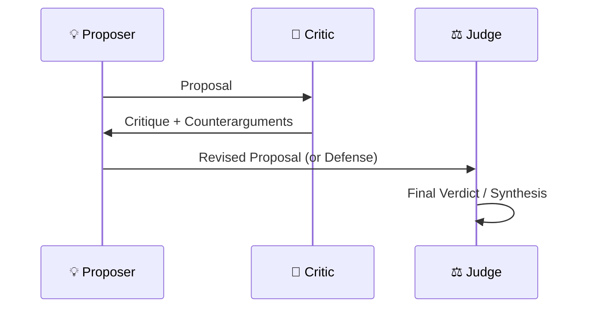

**Structure:** Two or more agents argue opposing positions through multiple rounds, with a judge synthesizing the debate into a final output.

**Control:** The debate protocol controls the flow - fixed turns, roles, and a termination condition.

**When to use:**
- Quality and accuracy are more important than speed
- You want to stress-test a conclusion before acting on it
- Red-teaming or adversarial review is valuable (security analysis, legal review)
- Fact-checking where a single agent might be over-confident

**Variants:**
- One proposer + one critic + one judge (classic debate)
- Multiple critics simultaneously (parallel critique)
- Self-debate: one agent argues both sides before deciding

**Example:** A due diligence system where one agent builds the investment thesis and another agent is specifically instructed to find flaws, holes, and risks.

---

## Pattern 8 - Reflexion / Self-Critique

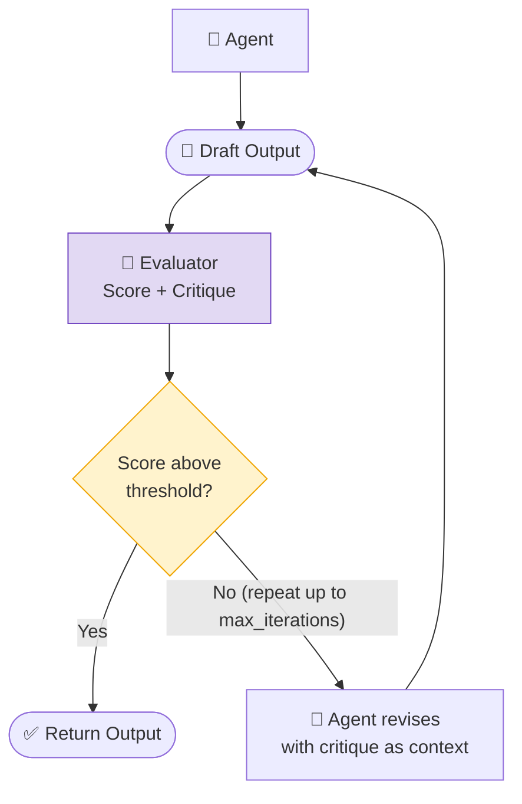

**Structure:** The agent (or a separate evaluator agent) evaluates the output quality, identifies specific weaknesses, and feeds the critique back to the agent for improvement. Repeats until quality threshold is met or max iterations is reached.

**Control:** The evaluation loop controls termination. Can be self-evaluation (same LLM) or external (separate evaluator model).

**When to use:**
- Output quality is critical and a single pass is insufficient
- There's a clear quality criterion that can be evaluated automatically
- The task is iterative by nature (writing, code, analysis)
- You want to reduce hallucination in high-stakes outputs

**Evaluator design:**
- Use a stronger or different model as the evaluator (avoids self-reinforcement bias)
- Define the rubric explicitly in the evaluator's prompt
- Always set a `max_iterations` limit to prevent infinite loops

**Example:** A code generation system where a tester agent runs the generated code, reports failures, and the generator revises based on the test output.

---

## Feedback and Correction Loops

A feedback loop is the mechanism by which an agent's outputs or actions are evaluated and the result is fed back to inform subsequent decisions. Every agentic system should have at least one.

### Types of Feedback Loops

**Tool observation loop (innermost)**
The most basic loop: the agent calls a tool, reads the result, and decides what to do next. This is baked into every agent's ReAct cycle.

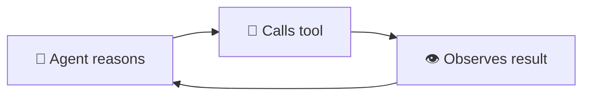

**Critic/evaluator loop**
A separate LLM call evaluates the agent's output against a rubric and returns a critique. The agent then revises. Used in Reflexion pattern.

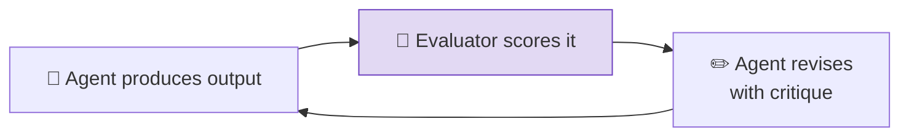

**Human feedback loop**
A human reviews and corrects or approves the agent's output at a defined checkpoint. See HITL section below.

**Environment feedback loop**
The agent executes an action in an environment (runs code, submits a form) and observes the environment's response (test results, HTTP status, error messages).

### Designing Good Feedback

- **Specificity**: Feedback that says "this is wrong" is useless. Feedback that says "the date format is MM/DD/YYYY but the API expects YYYY-MM-DD" enables correction.
- **Grounded feedback**: Feedback should reference specific parts of the output, not be a general quality judgment.
- **Termination conditions**: Every feedback loop needs a stopping condition - max iterations, quality threshold, or explicit done signal. Without one, agents loop indefinitely.

---

## Human-in-the-Loop Architectures

HITL inserts a human review or approval step at defined points in the agent's execution. It is not a failure of automation - it is a deliberate design choice to bound the system's autonomy.

### When HITL Is Required

| Trigger | Reason |
|---------|--------|
| Irreversible action | Sending email, making payment, deleting data - these can't be undone |
| Low confidence | Agent uncertainty above a threshold signals need for human judgment |
| Sensitive data | Personal information, regulated data requires human accountability |
| Risk threshold | Action cost, scope, or potential impact exceeds a defined limit |
| Novel situation | Agent encounters a scenario it wasn't designed for |
| Regulatory requirement | Compliance mandates human sign-off (financial, medical, legal) |

### HITL Patterns

**Approval gate (synchronous)**
Agent pauses execution, presents a proposed action to a human, and waits for approval/rejection before proceeding.

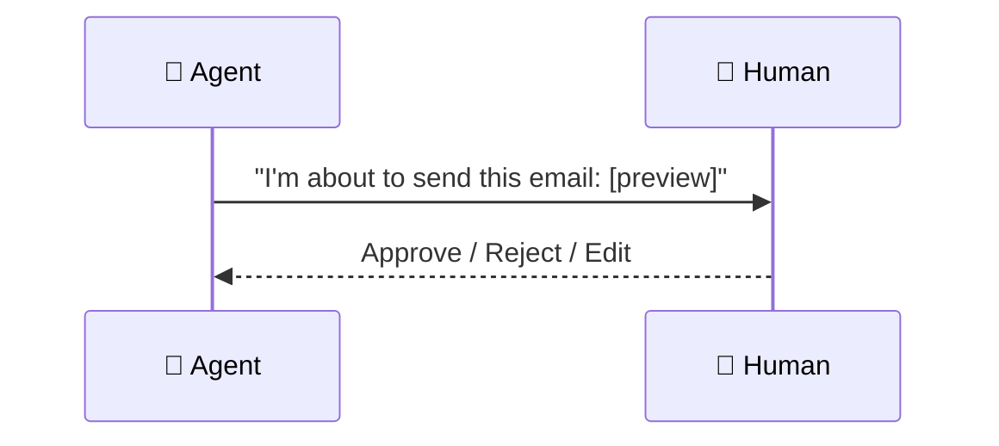

**Review queue (asynchronous)**
Agent produces an output and enqueues it for human review. Execution continues with other tasks; the reviewed item is processed later.

**Confidence-gated HITL**
Agent estimates its own confidence and routes to human only when below a threshold. High-confidence actions proceed automatically.

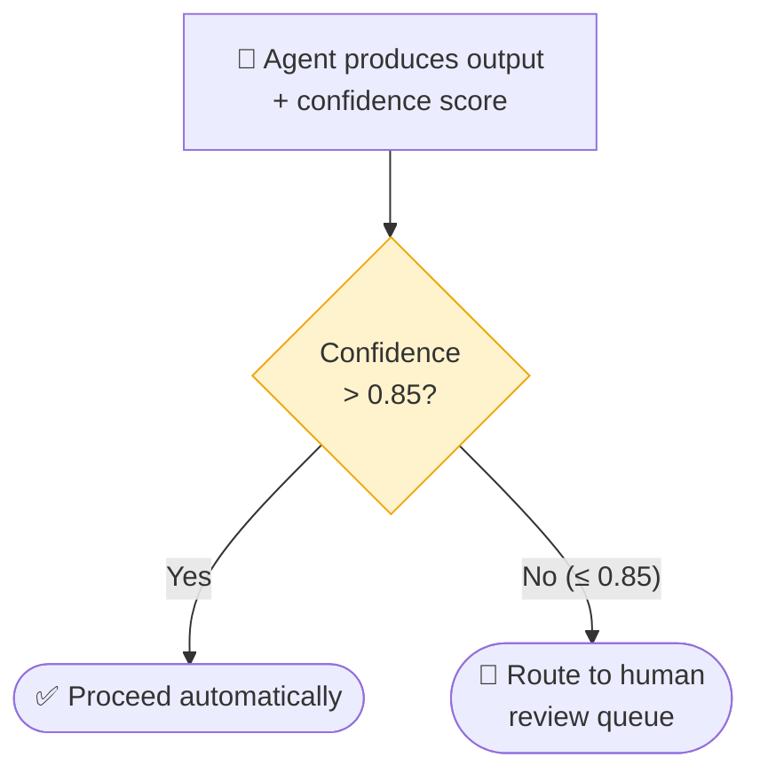

**Escalation path**
Agent can explicitly request human help when it encounters a situation it can't resolve - a built-in "I don't know how to handle this" mechanism.

### HITL Design Principles

- **Minimize interruptions**: HITL that triggers too often becomes noise and gets ignored. Reserve it for genuinely high-stakes decisions.
- **Provide context**: When routing to human, include: what the agent was trying to do, what action it wants to take, why it's uncertain, and what the consequences are.
- **Timeout handling**: What happens if the human doesn't respond? The agent needs a fallback: retry later, escalate further, or abort gracefully.
- **Audit trail**: Every human intervention should be logged with who approved, what was approved, and when.

---

## Hybrid Patterns

Real production systems rarely use a single pattern in isolation. The most common combinations:

**Orchestrator-Subagent + Parallel**
The orchestrator fans out to parallel subagents for independent subtasks, then synthesizes. Most research and analysis systems use this.

**Pipeline + Reflexion**
A pipeline where one or more stages include a self-critique loop before passing output to the next stage. Common in document processing where each extraction step is quality-checked.

**Hierarchical + Parallel**
A two-level hierarchy where the top-level manager orchestrates multiple team leads, and each team lead runs its workers in parallel. Used in large software engineering systems.

**Orchestrator-Subagent + Debate**
The orchestrator includes a debate step for high-stakes decisions: one subagent proposes, another critiques, the orchestrator adjudicates before proceeding.

---

## Pattern Selection Guide

| If you need... | Use this pattern |
|----------------|-----------------|
| Simplicity and debuggability | Single Agent |
| Task decomposition with specialists | Orchestrator-Subagent |
| 10+ agents with management boundaries | Hierarchical |
| No fixed hierarchy, fluid collaboration | Peer-to-Peer |
| Fixed sequential stages, modular | Pipeline |
| Speed from concurrency, breadth of coverage | Parallel / Fan-out |
| Stress-testing, red-teaming, fact-checking | Adversarial / Debate |
| Quality over speed, iterative improvement | Reflexion |

---

## Study Notes

- The pattern is a **structural decision**, not a framework decision. LangGraph, CrewAI, ADK, and LangChain can all implement all 8 patterns - the pattern is about agent relationships, not code.
- **Orchestrator-Subagent is the workhorse** of production agentic systems. Most real systems are variants of this.
- **Don't default to complexity**. A single agent handles a surprising fraction of real tasks well. Add agents only when there's a clear reason: specialization, parallelism, or quality improvement.
- **Pipeline is the most reliable pattern** because it's statically defined and each stage has a clear interface. Use it when you can.
- **Reflexion is expensive** - each iteration doubles the LLM calls. Use it only where quality justifies the cost.
- HITL is **not a workaround** - it's a first-class architectural element. Design for it from the start, not as an afterthought.

---

## Q&A Review Bank

**Q1: What distinguishes an architectural pattern from a design pattern in agentic systems?** `[Easy]`
A: An architectural pattern defines the structural blueprint - how many agents exist, how they relate to each other, and how control and information flow between them. A design pattern defines the behavior and logic of individual agents or agent interactions (e.g., how reflection works inside a single agent). The choice of architectural pattern is the first major system design decision; design patterns are applied within that structure. The same design pattern (e.g., Reflexion) can appear inside any architectural pattern (Pipeline, Orchestrator-Subagent, etc.).

**Q2: When would you choose a Pipeline pattern over an Orchestrator-Subagent pattern?** `[Medium]`
A: Choose Pipeline when the task naturally decomposes into sequential stages with well-defined input/output contracts, each stage can be implemented and tested independently, and the execution order is fixed at design time. Choose Orchestrator-Subagent when the decomposition is dynamic, subtasks can run in parallel, or different subtasks require different tools and expertise. Pipeline is the most reliable pattern because its behavior is statically defined and easy to reason about; Orchestrator-Subagent is more powerful but introduces coordination overhead. If you can model the task as a fixed ETL chain, Pipeline is almost always preferable.

**Q3: What are the specific conditions that justify adding a Reflexion loop to your system?** `[Medium]`
A: Three conditions must all be true: the output quality from a single pass is consistently insufficient for production use, there is a clear quality criterion that can be evaluated automatically (a rubric, test suite, or factual check), and the task's latency tolerance can absorb the extra LLM round-trips. You should also always set a `max_iterations` limit and use a different or stronger model as the evaluator to avoid self-consistency bias (the same model often fails to catch its own errors). If you can't define a stopping criterion, don't use Reflexion - you'll build an infinite loop.

**Q4: Why is Orchestrator-Subagent the default production pattern, and what is its single biggest risk?** `[Hard]`
A: It's the default because it maps naturally to how complex tasks decompose (one coordinator, multiple specialists), it makes HITL easy to implement (insert a gate in the orchestrator), it's easy to debug (one place holds all decisions and state), and it can run subagents in parallel for latency reduction. The single biggest risk is that the orchestrator is both a bottleneck and a single point of failure - all coordination and planning flows through one LLM, and if the orchestrator's reasoning degrades (context drift, hallucinated plan), the entire system fails. Mitigations: task ledger external to conversation history, explicit subagent output validation, and replanning logic when a subagent fails.

**Q5: When does HITL become required rather than optional?** `[Medium]`
A: HITL is required for irreversible actions (sending email, making payments, deleting data - these cannot be undone), when agent confidence is below a threshold, when regulated data (PII, financial, medical records) is involved, when compliance mandates human sign-off, and when the estimated cost or scope exceeds a defined risk threshold. HITL is optional for high-confidence, reversible, low-risk decisions. The key design principle: HITL that triggers too frequently becomes noise and gets ignored; reserve it for decisions where a human mistake is recoverable but an agent mistake is not.

**Q6: Describe a scenario where you would combine three architectural patterns.** `[Hard]`
A: A research and analysis system combines Orchestrator-Subagent + Parallel + Reflexion: the orchestrator decomposes "Prepare a competitive analysis of EV manufacturers" into subtasks and fans out to five parallel research agents (one per manufacturer) - that's Orchestrator-Subagent + Parallel. Each research agent has an internal Reflexion loop: it produces a structured research summary, an evaluator agent checks whether the data is complete and sourced, and the research agent revises if not. The orchestrator then synthesizes all five validated summaries into the final analysis. This combination achieves breadth (parallel), correctness (reflection), and coordination (orchestrator) in a single system.
