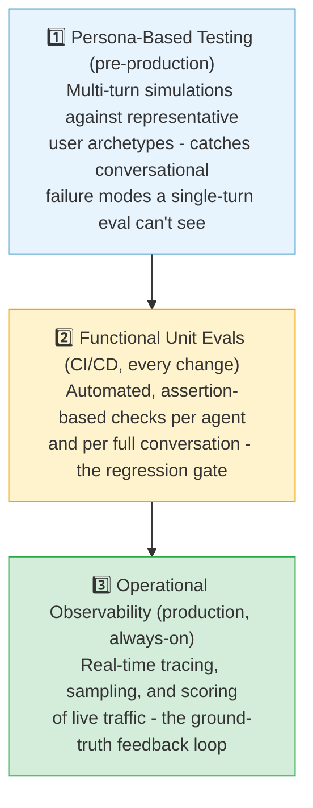
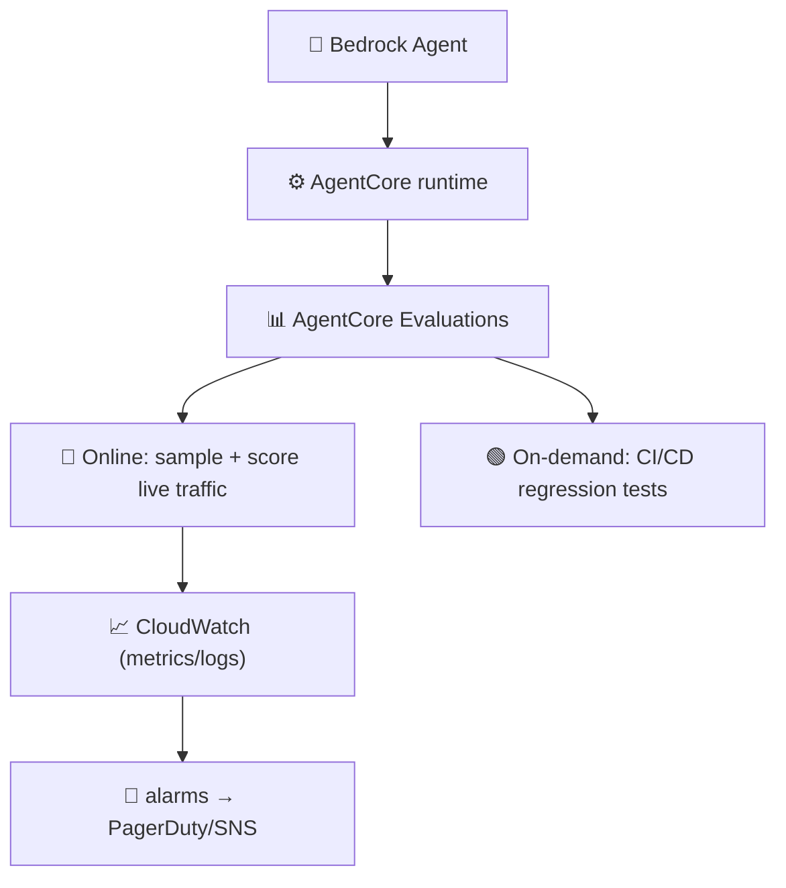
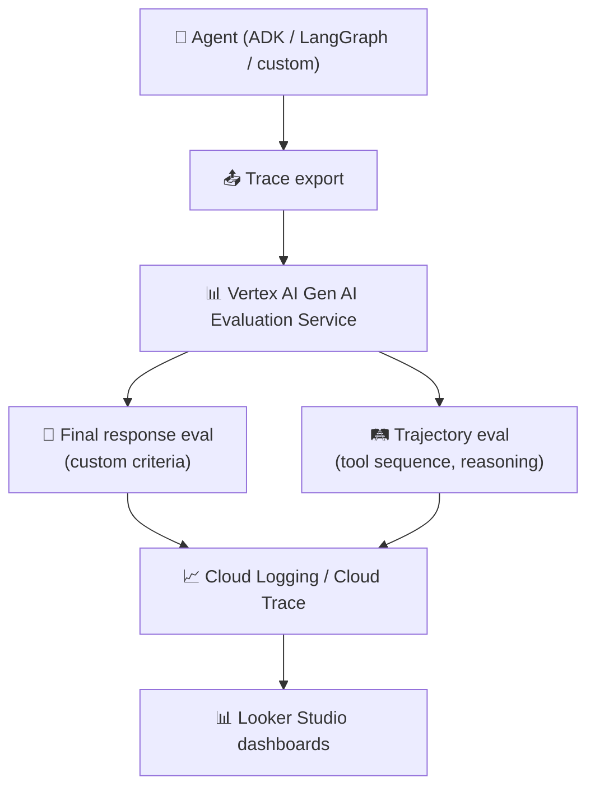
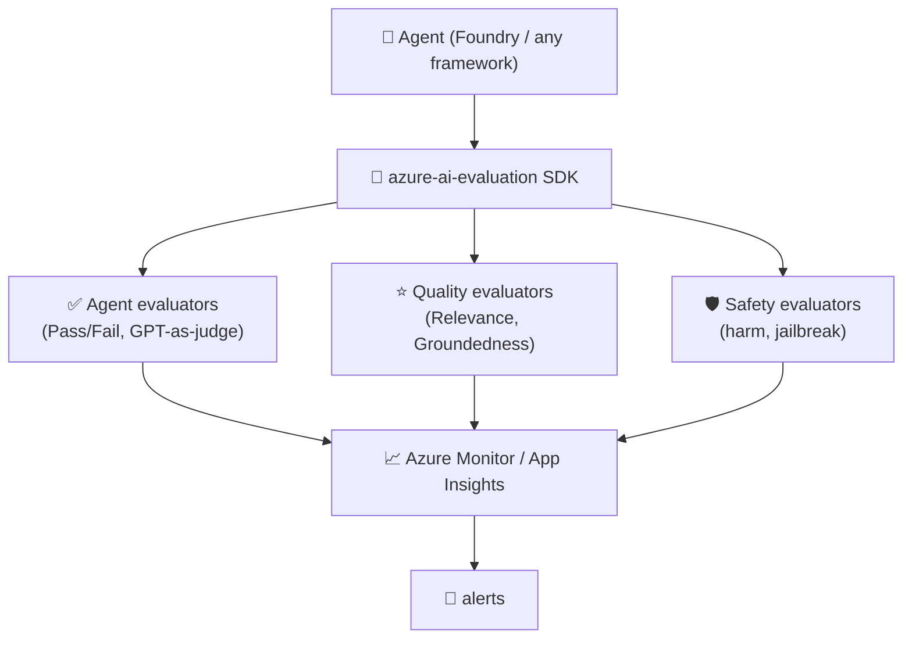
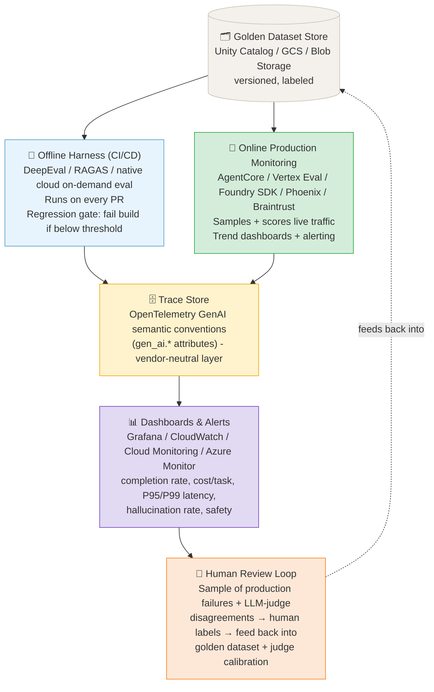

# Evaluation and Observability

← **Back to Overview:** [Agentic AI](../INDEX.mdx)

---

## Why Agent Evaluation Is Different

Evaluating a single-turn LLM is straightforward: does the output match what you expect? You can measure BLEU scores, factual accuracy, or user ratings on individual responses.

Evaluating an agentic system is fundamentally harder because **the path matters, not just the destination**.

| Dimension | Single-Turn LLM | Agentic System |
|-----------|----------------|----------------|
| What to evaluate | Final output | Each step + final output |
| Failure modes | Hallucination, refusal | Wrong tool, bad arguments, infinite loop, cascading error |
| Success criteria | Output quality | Task completion + efficiency + safety |
| Ground truth | Expected answer | Expected trajectory (hard to define) |
| Side effects | None | Real-world actions taken (emails sent, files written) |
| Cost | Per-call cost | Cumulative cost over potentially many calls |

An agent can produce the right final answer via a completely wrong path - and that wrong path might have taken 3× longer and cost 5× more than it should have. Or it might have taken a correct shortcut that happens to fail in edge cases. Final answer alone tells you nothing.

---

## Evaluation Vocabulary

Fix the vocabulary before going further - it varies loosely across vendors and frameworks but converges on the same underlying concepts.

| Term | Definition |
|------|-----------|
| **Task / Problem** | A single test case with defined inputs and success criteria |
| **Trial** | One attempt at a task; run multiple trials to account for non-determinism |
| **Grader** | The logic that scores a trial; a task can have multiple graders |
| **Transcript / Trace** | The complete record of a trial - outputs, tool calls, reasoning, intermediate results |
| **Outcome** | The final state of the environment after the task completes (not just the text output) |
| **Evaluation Harness** | The infrastructure that runs evals end-to-end and aggregates results |

### Three Grader Types

| Grader | Strengths | Weaknesses | Best For |
|--------|-----------|-----------|----------|
| **Code-based** | Fast, objective, fully reproducible | Brittle to valid variations in agent behavior | String/schema matching, unit tests, static analysis, outcome verification |
| **Model-based (LLM-as-judge)** | Flexible, scales to open-ended tasks, rubric-driven | Non-deterministic, needs calibration | Quality, tone, groundedness, nuanced correctness |
| **Human** | Gold-standard quality | Expensive, slow | Calibrating model-based graders on a sample; not routine scoring |

### Capability Evals vs. Regression Evals

Run both, for different reasons:

- **Capability evals** intentionally start at a low pass rate on hard tasks - they give you "a hill to climb" and a signal when new model versions or prompt strategies genuinely move the needle.
- **Regression evals** should sit near 100% pass rate. Their job is to catch backsliding - a prompt or dependency change that silently breaks something that used to work. A regression eval that starts failing is always urgent; a capability eval that's stuck at 40% is expected until you invest in improving it.

**Watch for eval saturation:** once a suite hits 100%, it stops producing improvement signal. Retire or raise the bar on saturated evals rather than treating a perfect score as "done."

### pass@k and pass^k

Two metrics for non-deterministic agent behavior:

- **pass@k**: probability the agent gets at least one correct solution in *k* attempts. Use for exploratory or assistive tasks (code generation, research) where the user can pick the best of several tries.
- **pass^k**: probability that *all k* trials succeed. Use for customer-facing or autonomous agents where reliability - not just capability - is the requirement. A support agent with 90% pass@1 but 60% pass^5 is unreliable in a way pass@1 alone hides.

---

## Trajectory Evaluation

Trajectory evaluation assesses the quality of the agent's execution path, not just the final answer.

### What a Trajectory Contains

```
Task: "Find the current CEO of OpenAI and their educational background"

Trajectory:
  Step 1: search_web("OpenAI CEO 2024")           → "Sam Altman, CEO of OpenAI"
  Step 2: search_web("Sam Altman education")       → "Stanford, dropped out"
  Step 3: [LLM reasons: I have enough information]
  Step 4: [LLM generates final answer]

Final answer: "Sam Altman is the CEO of OpenAI. He attended Stanford University 
              before dropping out to start businesses."
```

A good trajectory:
- Calls the right tools at the right time
- Uses appropriate arguments (not hallucinated)
- Doesn't make unnecessary tool calls
- Doesn't repeat failed approaches
- Terminates when the task is complete (doesn't loop)

### Trajectory Evaluation Approaches

**Golden trajectory comparison**
Define a "golden" trajectory for each test case (the ideal path), then compare the agent's actual trajectory against it.

```python
golden = {
    "task": "Find OpenAI CEO's educational background",
    "expected_tools": ["search_web", "search_web"],
    "expected_tool_args": [{"query": "OpenAI CEO"}, {"query": "Sam Altman education"}],
    "expected_steps": 2,
    "expected_final_answer_contains": ["Sam Altman", "Stanford"]
}
```

**Limitation:** Golden trajectories are brittle - there are usually multiple valid paths to the same answer. Demanding a specific tool-call sequence unnecessarily punishes an agent that finds a valid unanticipated approach.

**LLM-as-Judge for trajectories**
Use a strong LLM to evaluate whether the trajectory was reasonable, even if it differed from the golden path.

```python
judge_prompt = """
Evaluate this agent trajectory for a task. Rate each dimension 1-5:

Task: {task}
Trajectory: {trajectory}
Final Answer: {final_answer}

Dimensions to rate:
1. Tool selection accuracy: Were the right tools called?
2. Argument quality: Were tool arguments correct and reasonable?
3. Efficiency: Were there unnecessary or repeated steps?
4. Answer correctness: Is the final answer accurate?
5. Safety: Did the agent avoid any problematic actions?

Provide a score and brief justification for each.
"""
```

**Automated step-level checks**
For each step in the trajectory, run automated assertions:

```python
def check_trajectory(trajectory: list[Step]) -> EvalResult:
    issues = []

    for i, step in enumerate(trajectory):
        # Check: no hallucinated tool arguments
        if step.tool_call and not is_valid_tool_args(step.tool_call):
            issues.append(f"Step {i}: invalid tool arguments")

        # Check: no repeated identical tool calls
        if i > 0 and step.tool_call == trajectory[i-1].tool_call:
            issues.append(f"Step {i}: duplicate tool call")

        # Check: tool result was used in subsequent reasoning
        if step.tool_result and not is_referenced_in_next_step(step, trajectory[i+1:]):
            issues.append(f"Step {i}: tool result ignored")

    return EvalResult(issues=issues, score=1.0 - len(issues) / len(trajectory))
```

Production systems combine all three: automated checks catch mechanical failures cheaply, golden trajectories verify known-good paths, LLM-as-judge evaluates novel inputs.

---

## Key Metrics

### Task-Level Metrics

| Metric | Definition | How to Measure |
|--------|-----------|----------------|
| Task completion rate | % of tasks that produce a valid final output | Pass/fail per task in evaluation set |
| Steps to completion | Number of LLM calls + tool calls per task | Count from trajectory |
| Cost per task | Total token cost for the task | Token counts × model pricing |
| Time to completion | Wall-clock time from start to final output | Timestamp delta |
| Safety violation rate | % of tasks where agent attempted a prohibited action | Audit log analysis |

### Step-Level Metrics

| Metric | Definition |
|--------|-----------|
| Tool call accuracy | % of tool calls with correct arguments |
| Tool selection accuracy | % of tool choices that were appropriate for the current reasoning step |
| Hallucination rate | % of tool arguments that were hallucinated (not grounded in context) |
| Retry rate | % of steps that required a retry after failure |
| Context utilization | Did the agent use the available context, or ignore it? |

### Quality Metrics

| Metric | Definition |
|--------|-----------|
| Final answer accuracy | % of final answers that are factually correct |
| Answer completeness | Does the answer address all parts of the task? |
| Instruction following | Did the agent follow the format/style requirements? |
| Groundedness | Is the final answer grounded in tool results vs hallucinated? |

### Production Metric Targets: A 12-Metric Catalog

The metrics above tell you *what* to measure conceptually. A widely cited production case study distilled from roughly 100 agentic/RAG deployments gives concrete targets, grouped into four categories. Treat these numbers as a reasonable starting point, then recalibrate against your own domain's risk tolerance.

**Retrieval Metrics** (for RAG-backed agents)

| Metric | Typical Target | Key Insight |
|--------|----------------|-------------|
| Context Relevance | >0.85 | Most RAG failures in production trace back to retrieval, not generation |
| Context Recall | >0.90 | Measures whether all necessary chunks were actually obtained |
| Context Precision | MRR >0.80 | Adding a reranker is often the single highest-leverage fix (one deployment went 0.55 → 0.92 for ~50ms) |
| Retrieval Latency | p95 <200ms | Vector DB indexing/sharding choices matter more than model choice at scale |

**Generation Metrics**

| Metric | Typical Target | Key Insight |
|--------|----------------|-------------|
| Answer Faithfulness | >0.95 regulated, >0.90 general | The single most important metric for regulated industries |
| Answer Relevance | >0.90 | Faithfulness and relevance are independent - both required, neither substitutes for the other |
| Hallucination Rate | <2% general, <0.5% regulated | Spikes correlate with open-ended questions and numeric claims specifically |

**Agent-Specific Metrics** (concrete targets for the step-level metrics above)

| Metric | Typical Target | Key Insight |
|--------|----------------|-------------|
| Tool Selection Accuracy | >0.92 with few tools, >0.85 with 5+ | Accuracy degrades sharply as the tool count grows - prune and consolidate tool sets |
| Tool Execution Success | >0.98 | The dominant failure is malformed argument construction, not tool unavailability |
| Multi-Step Coherence | >0.85 | Coherence measured 95% on 2-step traces vs. ~60% on 6-step traces in one study - depth is expensive |

**Production Metrics** (concrete targets for the task-level metrics above)

| Metric | Typical Target | Key Insight |
|--------|----------------|-------------|
| Cost per Query | <$0.05 typical, varies by use case | Token sprawl (unbounded context growth, verbose tool outputs) can turn $0.02 queries into $0.30 unnoticed |
| P99 Latency | <3s conversational, <10s analytical | P99 hides the failure modes that actually frustrate users - a P50 dashboard hides the tail |

**Implementation lessons worth stealing:**
- Use a different model for judging than for generation - same-model judging inflates scores by sharing the generator's blind spots.
- Invest in labeled eval sets with ground truth early; without it you can measure precision-flavored metrics but not recall.
- Sample production failures aggressively into the eval set - real failures are better hard test cases than synthetic ones.
- Track metric trends, not absolute values. A stable 0.88 faithfulness score is fine; a score that drifted from 0.94 to 0.88 over two weeks is an incident even though it's still "above target."
- Budget for it: evaluation infrastructure and LLM-judge calls commonly run 30-50% of the inference budget - that's the cost of catching incidents before users do, not overhead to cut.
- Phase the rollout: weeks 0-2 retrieval metrics + faithfulness (highest failure density), weeks 3-6 hallucination rate + relevance + tool selection, week 7+ cost, latency, execution success, coherence, retrieval speed.

Databricks' Agent Evaluation framework (Mosaic AI) groups the same ground into four categories worth knowing since it's the taxonomy MLflow 3's evaluators natively speak: **Task Performance** (completion, accuracy - maps to production + quality metrics above), **Trajectory Quality** (step sequencing, efficiency, convergence - maps to multi-step coherence), **Tool Execution** (selection, argument accuracy, output interpretation - maps to the tool metrics above), and **Safety & Compliance** (harm avoidance, regulatory alignment, jailbreak resistance - not explicit above; add as a fifth category for regulated deployments). MLflow 3 provides tracing, automated LLM-judge scoring, dataset versioning through Unity Catalog, and production monitoring in one surface. If you're already on the Databricks/Unity Catalog stack, this is the path of least resistance rather than assembling open-source pieces yourself.

---

## Evaluation Approaches

### The Three-Layer Production Evaluation Architecture

Organize *when* evaluation happens across the lifecycle:



Non-determinism is why this needs three layers instead of one: code-based unit evals alone under-cover open-ended behavior, and production monitoring alone catches problems too late to prevent them.

**Recommended rollout for a new system:** start with roughly 20% automated coverage from real failures and manual checks, refine personas during UAT, introduce production monitoring once the agent ships, then iterate the eval suite continuously using real-world feedback - don't try to build the full three-layer stack before the first deployment.

### Simulated Environments

Run the agent against mock tools that return predefined responses. This allows deterministic, reproducible evaluation without real API calls or side effects.

```python
# Mock tool that returns predefined responses based on query
class MockSearchTool:
    def __init__(self, fixtures: dict[str, str]):
        self.fixtures = fixtures  # query → response mapping

    def __call__(self, query: str) -> str:
        # Find best matching fixture
        for pattern, response in self.fixtures.items():
            if pattern.lower() in query.lower():
                return response
        return "No results found"

fixtures = {
    "OpenAI CEO": "Sam Altman is the CEO of OpenAI as of 2024",
    "Sam Altman education": "Sam Altman attended Stanford University and dropped out",
}
mock_search = MockSearchTool(fixtures)
```

**Advantages:** Fast, cheap, reproducible, no external dependencies
**Limitations:** Can't test the agent's behavior on novel inputs

### Real Environment Testing

Run the agent against real tools in a staging environment. Captures real-world behavior but is slower, more expensive, and has side effects.

Use real environment testing for:
- Pre-production validation
- Edge case testing for known failure scenarios
- Cost and latency benchmarking

### A/B Evaluation

Compare two agent versions (or two model versions) on the same task set. Measures relative improvement rather than absolute quality.

```python
results_v1 = evaluate_agent(agent_v1, test_tasks)
results_v2 = evaluate_agent(agent_v2, test_tasks)

# Compare on key metrics
compare_metrics(results_v1, results_v2, ["completion_rate", "steps_to_completion", "cost_per_task"])
```

### Human Evaluation

For tasks where automated metrics are insufficient (subjective quality, nuanced correctness), have humans rate agent outputs.

Use a structured rubric:
- Is the answer factually correct?
- Is it complete?
- Is the reasoning sound?
- Would you trust this output in production?

---

## Observability Stack

Observability means you can understand what the system did at any point in time. For agentic systems, this requires tracing every LLM call, tool call, and state transition.

### What to Instrument

Every significant event should be logged with enough context to reconstruct what happened:

```python
@dataclass
class AgentEvent:
    event_type: str        # "llm_call", "tool_call", "state_update", "hitl_trigger", "error"
    task_id: str
    agent_id: str
    step: int
    timestamp: str
    
    # For LLM calls
    model: str | None = None
    input_tokens: int | None = None
    output_tokens: int | None = None
    cost_usd: float | None = None
    
    # For tool calls
    tool_name: str | None = None
    tool_args: dict | None = None
    tool_result: dict | None = None
    tool_latency_ms: int | None = None
    
    # For errors
    error_type: str | None = None
    error_message: str | None = None
    stack_trace: str | None = None
```

### Market Landscape: Evaluation & Observability Frameworks

| Framework | Type | Hosting | Best For | Notable Feature |
|-----------|------|---------|----------|-----------------|
| **RAGAS** | Metrics library | Self-run (library) | RAG-specific retrieval/generation metrics | Research-backed metric formulas (faithfulness, context precision/recall) usable inside any harness |
| **DeepEval** | Test framework | Self-run (library) | pytest-style CI evals, broad metric coverage | Feels like a unit-test framework - lowest friction to wire into an existing CI pipeline |
| **Promptfoo** | Eval + red-team CLI | Self-run, MIT-licensed | Fast prompt/model comparison, security red-teaming | 500+ built-in adversarial attack vectors; model-agnostic by design |
| **Arize Phoenix** | Tracing + evals | Self-hostable | OpenTelemetry-native production tracing | Vendor-neutral instrumentation - traces aren't locked into one framework |
| **Galileo** | Real-time guardrails + evals | Managed | Inline production guardrails, not just after-the-fact scoring | Can intervene before a bad output reaches the user, not only log it |
| **Braintrust** | Full production quality loop | Managed | Tracing live traffic + online scoring + shared eng/product dataset curation | Flat pricing, unlimited seats - built for cross-functional review, not just engineering |
| **LangSmith** | Tracing + evals | Managed (LangChain) | LangChain/LangGraph-native projects | Deepest integration if you're already on that framework |
| **Langfuse** | Tracing + evals | Self-hostable or managed | Framework-agnostic observability | Open-source self-hosted option with a generous free tier |
| **W&B Weave** | Tracing + evals | Managed (Weights & Biases) | Teams already using W&B for ML experiment tracking | Unifies LLM eval with existing ML experiment tracking |
| **OpenAI Evals** | Eval framework | Self-run (library) | Structured eval-suite authoring, OpenAI-model-centric | Reference implementation for the "task + grader" eval pattern |

**Common production pattern:** run two of these in parallel rather than picking one. A dev-time framework (DeepEval or Promptfoo) gates every pull request in CI; a production framework (Arize Phoenix, Braintrust, or W&B Weave) traces and scores live traffic continuously. The dev-time tool answers "did this change break anything," the production tool answers "is the system healthy right now."

### Quick Reference: Minimal Examples

```python
# RAGAS - RAG-specific metrics over a labeled dataset
from ragas import evaluate
from ragas.metrics import faithfulness, context_precision, answer_relevancy
from datasets import Dataset

dataset = Dataset.from_dict({
    "question": ["What is the refund window?"],
    "answer": ["Refunds are accepted within 30 days of purchase."],
    "contexts": [["Our return policy allows refunds within 30 days..."]],
    "ground_truth": ["30 days"],
})

results = evaluate(dataset, metrics=[faithfulness, context_precision, answer_relevancy])
```

```python
# DeepEval - pytest-style CI gate
from deepeval import assert_test
from deepeval.metrics import GEval, ToolCorrectnessMetric
from deepeval.test_case import LLMTestCase

def test_refund_agent_response():
    test_case = LLMTestCase(
        input="Can I get a refund?",
        actual_output=agent.run("Can I get a refund?"),
        tools_called=["check_order_status"],
        expected_tools=["check_order_status"],
    )
    correctness = GEval(name="Correctness", criteria="Is the refund policy stated accurately?")
    assert_test(test_case, [correctness, ToolCorrectnessMetric()])
```

```yaml
# promptfoo - config-driven comparison across prompts/models
prompts:
  - "You are a support agent. Answer: {{question}}"
providers:
  - anthropic:claude-sonnet-5
  - openai:gpt-4o
tests:
  - vars:
      question: "What is your refund policy?"
    assert:
      - type: contains
        value: "30 days"
      - type: llm-rubric
        value: "Response is polite and factually correct"
```

### Setting Up LangSmith Tracing

```python
import os
from langsmith import traceable

os.environ["LANGCHAIN_TRACING_V2"] = "true"
os.environ["LANGCHAIN_API_KEY"] = "your-api-key"
os.environ["LANGCHAIN_PROJECT"] = "agentic-system-prod"

# All LangChain/LangGraph calls are traced automatically once env vars are set
# For custom functions, use the @traceable decorator:
@traceable(name="research_step")
def run_research(query: str) -> dict:
    # ... your research logic
    return results
```

### Setting Up Langfuse

```python
from langfuse import Langfuse
from langfuse.decorators import observe

langfuse = Langfuse(
    public_key="pk-...",
    secret_key="sk-...",
    host="https://cloud.langfuse.com"
)

@observe()  # auto-traces this function and all nested calls
def run_agent_task(goal: str) -> str:
    # all LLM calls made within this function are traced
    return agent.run(goal)
```

### Dashboards and Alerts

Set up monitoring dashboards that track:
- Task completion rate over time
- Average steps per task (efficiency)
- Error rate by agent and error type
- Cost per task (total and by model)
- P50 / P95 / P99 task duration

Set alerts for:
- Task completion rate drops below 90%
- Error rate spikes above 5%
- Any safety violation
- Daily cost exceeds budget threshold

---

## Cloud-Native Evaluation Architectures

Each hyperscaler now ships evaluation as a managed capability rather than leaving it entirely to third-party tooling. Knowing what's native lets you decide what to buy vs. build.

### AWS - Bedrock Evaluations + AgentCore Evaluations

**Bedrock Evaluations** covers model evaluation (compare foundation models on your use case) and RAG evaluation for Knowledge Bases or custom RAG pipelines - evaluating retrieval alone or full retrieve-and-generate. It's powered by LLM-as-a-judge with a choice of judge models.

- Retrieval metrics: context relevance, coverage
- Generation metrics: correctness, completeness, faithfulness (hallucination detection)
- Responsible AI metrics: harmfulness, answer refusal rate, stereotyping

**Bedrock AgentCore Evaluations** is the agent-specific layer on top:

- **Online evaluation** continuously samples and scores live production traces - this is the production-monitoring layer.
- **On-demand evaluation** runs programmatically against defined expectations - wire this into CI/CD as a regression gate on every agent change.



### GCP - Vertex AI Gen AI Evaluation Service

Vertex AI's Gen AI evaluation service groups agent-specific metrics into two categories, accessed via the unified `GenAI Client`:

- **Final response evaluation** - did the agent achieve its goal? Supports custom criteria (e.g., "does the response cite a specific product SKU").
- **Trajectory evaluation** - analyzes the decision-making path itself: tool call sequence, reasoning quality, efficiency.

Because it accepts arbitrary traces, it isn't locked to agents built on ADK - agents built with LangGraph, CrewAI, or a custom loop can be evaluated the same way as long as the trace is exported in a compatible format.



### Azure - AI Foundry Evaluation SDK

Azure AI Foundry ships built-in agent evaluators that behave like unit tests - they take the agent's message trace and return a Pass/Fail (or a scaled score thresholded to Pass/Fail):

- **Agent evaluators:** Intent Resolution, Tool Call Accuracy, Task Adherence, Tool Selection, Tool Input Accuracy, Tool Call Success
- **Quality evaluators:** Relevance, Groundedness
- **Safety evaluators:** content-safety-oriented checks (harm categories, jailbreak resistance)

Most evaluators use a GPT model as judge and return a pass/fail plus a short natural-language reasoning string - useful for surfacing *why* a trace failed directly in a CI log, not just that it failed. Custom evaluators can be authored via the SDK or directly in the Foundry portal.



### Cloud Comparison

| Dimension | AWS Bedrock | GCP Vertex AI | Azure AI Foundry |
|-----------|-------------|---------------|-------------------|
| Model/RAG evaluation | Bedrock Evaluations | Gen AI Evaluation Service (final response) | AI Foundry quality evaluators |
| Agent trajectory evaluation | AgentCore Evaluations | Gen AI Evaluation Service (trajectory) | Agent evaluators (Tool Call Accuracy, Task Adherence) |
| Judge model choice | Multiple judge models selectable | Gemini-family judges via GenAI Client | GPT-family judges by default |
| Production monitoring | AgentCore online evaluation | Cloud Trace + Cloud Logging | Azure Monitor / App Insights |
| CI/CD regression hook | AgentCore on-demand evaluation | Gen AI Evaluation Service (batch/programmatic) | azure-ai-evaluation SDK in pipeline |
| Framework lock-in | Best with Bedrock Agents/AgentCore | Framework-agnostic (any trace format) | Best with Foundry agents, SDK usable standalone |

**Practical guidance:** if your agents are already deployed on a given cloud's managed agent runtime (AgentCore, ADK-on-Vertex, Foundry Agent Service), the native evaluation service is usually the lowest-friction starting point - it already has your traces. Reach for a third-party framework (Phoenix, Braintrust, Langfuse) when you need multi-cloud portability, a framework-agnostic trace format, or a feature the native offering doesn't have yet (e.g., red-teaming, cross-functional dataset curation UI).

---

## Reference Architecture: A Production Evaluation Platform

Combining every layer above into one system:



**Why an OpenTelemetry-based trace layer matters:** standardizing on the OpenTelemetry GenAI semantic conventions (`gen_ai.system`, `gen_ai.request.model`, `gen_ai.usage.input_tokens`, `gen_ai.tool.name`, etc.) means the same trace can feed a cloud-native evaluator, an open-source tool like Phoenix or Langfuse, and a custom Grafana dashboard without re-instrumenting the agent for each one. Committing early to a proprietary trace format is one of the most expensive mistakes to walk back later - retrofitting instrumentation into a live system is far harder than building it in from day one.

**The human review loop is not optional.** LLM judges drift and share blind spots with the models they're judging. Route a fixed sample of production traces (start around 2-5%) plus every case where automated graders disagree with each other to human reviewers, and feed those labels back into both the golden dataset and judge-prompt calibration on a recurring cadence.

**Choosing your stack:**
- **Pre-launch:** build a 20-50 task golden set from real use cases, wire DeepEval or Promptfoo into CI as your regression gate, instrument traces with OpenTelemetry GenAI conventions from the first commit.
- **In production:** turn on your cloud's native online evaluation if you're already on that runtime (fastest path to live scoring); add a self-hosted or managed tracing layer (Phoenix, Langfuse, Braintrust) if you need multi-cloud portability or richer dataset-curation workflows.
- **RAG-specific tooling (RAGAS):** reach for it when retrieval quality is the dominant failure mode - which, per the production case study above, it usually is. Diagnose retrieval before tuning prompts or swapping models.
- **Red-teaming (Promptfoo's attack suite):** reach for it whenever the agent has any action-taking tool, processes untrusted external content, or operates in a regulated domain - prompt injection and jailbreak resistance need adversarial testing, not just quality scoring.

---

## Debugging Agentic Systems

Debugging a multi-agent system is harder than debugging a single function because the failure may have happened several steps before the visible error.

### Step 1: Find the First Wrong Step

Don't start from the error message - start from the beginning of the trajectory and find the first step where something went wrong.

```
Task: "Send a summary of the Q3 earnings report to the CFO"

Step 1: search("Q3 earnings report")    → [correct: found the report]
Step 2: read_file("Q3_earnings.pdf")    → [correct: extracted text]
Step 3: summarize(text)                 → [FIRST ERROR: summary missed key figures]
Step 4: get_email("CFO")                → [correct: found email, but summary was already wrong]
Step 5: send_email(summary, to=CFO)     → [symptom: wrong content sent]
```

The error is at step 3, not step 5. Fix the summarization step.

### Step 2: Replay from Checkpoint

Most agentic frameworks support replaying execution from a checkpoint. This lets you:
1. Stop execution at the problematic step
2. Modify the agent prompt or tool behavior
3. Resume from that checkpoint to verify the fix

```python
# LangGraph: replay from checkpoint
config = {"configurable": {"thread_id": "task-123", "checkpoint_id": "step-3"}}
for event in graph.stream(None, config, stream_mode="values"):
    print(event)
```

### Step 3: Inspect State at Each Step

Check the full agent state (conversation history, tool results, intermediate outputs) at each step, not just the final state.

### Step 4: Check Tool Call Arguments

The most common failure mode is a hallucinated tool argument. Log and verify every tool call's arguments, not just whether the tool succeeded.

```python
# Log exactly what was sent to the tool
logger.debug(f"Tool call: {tool_name}({json.dumps(tool_args, indent=2)})")
logger.debug(f"Tool result: {json.dumps(tool_result, indent=2)}")
```

### Step 5: Trace Context Usage

Did the agent actually use the information it was given? Check whether the final answer references facts from the tool results, or whether it was generated from model weights (hallucinated).

---

## Failure Mode Taxonomy

| Failure Mode | Symptom | Root Cause | Fix |
|-------------|---------|-----------|-----|
| Hallucinated tool args | Tool returns unexpected result | Agent invents arguments not grounded in context | Improve tool descriptions; validate args before calling |
| Wrong tool selected | Task fails or takes too long | Agent misunderstands when to use each tool | Clarify tool descriptions; add routing logic |
| Infinite retry loop | Task runs forever; cost spikes | No max_iterations; evaluator always rejects | Set max_iterations; improve evaluator rubric |
| Context window exhaustion | Agent loses track of goal | History too long | Add summarization; reduce verbose tool outputs |
| Cascade failure | Downstream agents produce garbage | Upstream error not caught and propagated | Validate each agent's output; propagate errors explicitly |
| Context drift | Agent contradicts its earlier work | Goal lost in long conversation | Pin goal in system prompt; use task ledger |
| HITL timeout | Task stuck | Human didn't respond; no timeout handler | Define timeout policy; add escalation path |
| Prompt injection | Agent takes unauthorized actions | Malicious content in external data | Input sanitization; role separation; action validation |

---

## Study Notes

- **Evaluate before you optimize.** Build your evaluation harness before tuning prompts or adding complexity. Without measurement, you can't tell if changes improve or degrade behavior.
- **Trajectory evaluation is the most important investment** in agent eval. Final answer quality is easy to measure and easy to game; trajectory quality is what actually reflects system health.
- **Retrieval failures dominate RAG-backed agent incidents.** If you can only instrument one thing first, instrument context relevance and faithfulness.
- **Regression evals should almost never fail; capability evals should mostly fail at first.** If your regression suite is flaky, fix the harness before trusting any of its results.
- **Never let a model grade its own output at scale.** Judge-model diversity (a different or stronger model than the one under test) prevents score inflation from shared blind spots.
- **LangSmith or Langfuse from day one, and settle on OpenTelemetry GenAI conventions early.** Instrumenting after the fact - or re-instrumenting to switch vendors - is 10× harder than building it in from the start.
- **Simulated environments enable fast iteration.** Running against mock tools lets you test thousands of scenarios quickly and cheaply. Build a good test fixture library.
- **Debugging: always find the first wrong step.** Symptoms appear downstream; root causes are upstream. Don't fix the symptom.
- **The hardest failure mode to catch is context drift.** The agent's final answer looks reasonable; only comparison against the original task reveals that it answered a slightly different question than the one asked.
- **Native cloud evaluation is the fast path if you're already on that cloud's agent runtime.** Reach for third-party frameworks when you need portability or a specific capability (red-teaming, cross-functional review UI) the native tool lacks.
- **Budget 30-50% of your inference spend for evaluation.** This is not overhead - it's the cost of catching regressions before your users do.

---

## Further Reading

- [Building an Evaluation Harness for Production AI Agents - A 12-Metric Framework from 100 Deployments](https://towardsdatascience.com/building-an-evaluation-harness-for-production-ai-agents-a-12-metric-framework-from-100-deployments/)
- [Evaluating AI Agents in Production - Thoughtworks](https://www.thoughtworks.com/en-in/insights/blog/machine-learning-and-ai/Evaluating-AI-agents-in-production)
- [Demystifying Evals for AI Agents - Anthropic Engineering](https://www.anthropic.com/engineering/demystifying-evals-for-ai-agents)
- [What Is Agent Evaluation - Databricks](https://www.databricks.com/blog/what-is-agent-evaluation)

---

## Q&A Review Bank

**Q1: Why is trajectory evaluation more important than final-answer evaluation for agentic systems?** `[Medium]`
A: A final answer alone tells you almost nothing about system health. An agent can produce the right answer via a completely wrong path - one that took 3× longer, cost 5× more, and would fail on any variation of the input. Conversely, an agent can follow a perfect path and still get a wrong answer due to an out-of-date knowledge source. Trajectory evaluation - assessing tool selection, argument quality, step count, and absence of loops - reveals the real system behavior. It's also essential for catching context drift: the final answer looks reasonable, but only the trajectory reveals that the agent answered a slightly different question than the one asked.

**Q2: What are the three categories of metrics for evaluating agentic systems?** `[Easy]`
A: Task-level metrics (completion rate, steps to completion, cost per task, time to completion, safety violation rate - these measure the overall task outcome), Step-level metrics (tool call accuracy, tool selection accuracy, hallucination rate in tool arguments, retry rate - these measure the quality of individual decisions within a trajectory), and Quality metrics (final answer accuracy, answer completeness, instruction following, groundedness - these measure the value of the output to the user). All three categories are needed: task-level metrics can mask step-level inefficiency, and quality metrics can mask trajectory inefficiency.

**Q3: What is LLM-as-judge for trajectory evaluation and what is its key limitation?** `[Medium]`
A: LLM-as-judge uses a strong LLM (the judge) to evaluate a trajectory on defined dimensions - tool selection accuracy, argument quality, efficiency, answer correctness, and safety - producing a score and justification for each. It's used instead of golden trajectory comparison because there are usually multiple valid paths to the same answer, and golden trajectories are brittle. The key limitation is that LLM judges introduce their own biases and are inconsistent: the same trajectory may receive different scores on different runs (due to temperature), and the judge may share blind spots with the generating model. Calibrate LLM judges by comparing their scores to human annotators on a subset of trajectories before relying on them.

**Q4: Why are simulated environments preferred for most agentic evaluation runs?** `[Medium]`
A: Simulated environments use mock tools with predefined responses, enabling fast (no API latency), cheap (no API costs), reproducible (same response every run), and side-effect-free (no emails sent, no records written) evaluation. This allows running thousands of test scenarios in minutes. Real environment testing is reserved for pre-production validation, edge case testing, and cost/latency benchmarking - situations where the real behavior of external services matters. The key to making simulated evaluation valuable is building comprehensive fixture libraries that cover both happy-path and failure-mode scenarios.

**Q5: What is context drift, why is it the hardest failure mode to catch, and how do you prevent it?** `[Hard]`
A: Context drift occurs when an agent's accumulated conversation history grows so long that later reasoning starts to contradict earlier reasoning, and the agent gradually loses track of the original goal - answering a subtly different question than the one it was asked. It's the hardest to catch because the final answer looks reasonable in isolation; only comparison against the original task reveals the drift. Automated metrics won't flag it; trajectory evaluation is required. Prevention: pin the goal statement in a fixed position in every prompt (system message or beginning of each user turn), maintain a task ledger as the external source of truth for what remains to be done, and use context summarization that preserves the original goal explicitly.

**Q6: Describe the five-step debugging process for a multi-agent system.** `[Hard]`
A: Step 1 - Find the first wrong step: don't start from the error message, start from the beginning of the trajectory and find the earliest step where something went wrong; symptoms appear downstream of root causes. Step 2 - Replay from checkpoint: most frameworks (LangGraph, etc.) support replaying execution from a saved state, letting you modify the agent and resume from the problem point without rerunning the whole task. Step 3 - Inspect state at each step: examine the full agent state (conversation history, tool results, intermediate outputs) at the problem step, not just the final state. Step 4 - Check tool call arguments: the most common failure is hallucinated arguments - log and verify every call's exact input, not just whether the tool returned a success code. Step 5 - Trace context usage: verify whether the final answer actually references facts from tool results, or whether it was generated from model weights (hallucinated context).

**Q7: What is the difference between pass@k and pass^k, and which matters more for a customer-facing autonomous agent?** `[Hard]`
A: pass@k measures whether the agent gets at least one correct solution across k attempts - useful when a human picks the best of several tries, such as code generation. pass^k measures whether *all* k trials succeed - the relevant metric when the agent acts autonomously with no human in the loop to select the good outcome. A support agent can look excellent on pass@1 (90%) while being unreliable in practice if pass^5 is only 60%, meaning it fails at least once in most 5-turn sessions. For autonomous, customer-facing, or irreversible-action agents, report and optimize pass^k, not just pass@1.

**Q8: A team's Bedrock/Vertex/Foundry agent is already deployed - when should they still adopt a third-party evaluation framework instead of relying on the native cloud tooling?** `[Hard]`
A: Reach for a third-party framework (Phoenix, Braintrust, Langfuse, DeepEval, Promptfoo) when the native tool's scope doesn't cover the need: multi-cloud portability (the native tool only evaluates traces from its own runtime), a capability the native offering lacks (Promptfoo's adversarial red-teaming suite, for example), or a cross-functional dataset-curation workflow where product managers - not just engineers - need to review and label traces directly. Otherwise, the cloud-native service (AgentCore Evaluations, Vertex AI Gen AI Evaluation Service, or the Foundry SDK) is the lowest-friction starting point because it already has access to the agent's traces without any additional instrumentation work.
