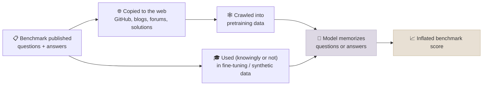

# Contamination and Leaderboards

A benchmark score means "the model can do this kind of task" only if the model hasn't seen the test. Web-scale pretraining makes that hard to guarantee: benchmark questions, answers and discussions end up in Common Crawl. This note covers how contamination happens, how to detect and avoid it, and how to read public leaderboards - including preference arenas - without being misled.

```objectives
time: 40 min
outcomes:
  - Explain how benchmark contamination happens and why it inflates scores
  - Describe detection methods - n-gram overlap, perplexity/membership tests, canary strings, performance on fresh variants
  - Design evaluations that resist contamination (time-split, private held-out, perturbed variants)
  - Read preference-arena leaderboards critically, including style effects and selective reporting
prerequisites:
  - "[What Benchmarks Measure](01-What-Benchmarks-Measure.mdx)"
  - "[Data Curation and Mixtures](../../03-Pretraining/Notes/03-Data-Curation-and-Mixtures.mdx) - decontamination in the data pipeline"
```

## How Contamination Happens



Contamination ranges from **verbatim** (the exact question and answer in training data) to **indirect** (paraphrases, translated copies, solution write-ups, or synthetic data generated by a model that itself saw the test). Indirect contamination is harder to detect and increasingly common.

**Evidence it matters:** when researchers wrote GSM1k - new grade-school math problems matched in style and difficulty to GSM8K - several model families scored markedly lower on it than on GSM8K, consistent with overfitting to the public set (Zhang et al., 2024).

---

## Detecting Contamination

| Method | How it works | Limits |
|--------|--------------|--------|
| **N-gram overlap** | Search the training corpus for long n-gram matches with test items (e.g. 13-grams) | Needs corpus access; misses paraphrases |
| **Membership inference** (e.g. Min-K% Prob) | Test items the model saw tend to have unusually few very-low-probability tokens | Noisy; works best for verbatim leaks |
| **Canary strings** | Benchmarks embed a unique GUID; if the model can complete it, the data leaked (BIG-bench does this) | Only works if the canary was kept intact |
| **Fresh or perturbed variants** | Compare scores on the public set with new, equivalent questions (GSM1k), or with rephrased / reordered-option versions | Building equivalent sets is expensive |
| **Time-split** | Evaluate only on items created after the model's training cutoff (LiveCodeBench, new AIME years) | Requires ongoing benchmark maintenance |

---

## Designing Contamination-Resistant Evals

1. **Keep a private held-out set** that never touches the internet or any training pipeline - including synthetic-data generators.
2. **Prefer time-split benchmarks** and report which window you used.
3. **Perturb** - rephrase questions, shuffle options, change numbers - and treat a large drop as a red flag.
4. **Decontaminate training data** against every benchmark you plan to report (see the data pipeline's decontamination stage).
5. **Report the gap** between public and private scores; a big gap is itself a finding.

---

## Leaderboards

### Static leaderboards

Aggregators such as [Artificial Analysis](https://artificialanalysis.ai/) run a fixed suite under a consistent harness and report speed and price alongside quality - useful because they remove the "every vendor used a different setup" problem. They still inherit each benchmark's saturation and contamination issues.

### Preference arenas

**Chatbot Arena / LMArena** collects pairwise human votes on anonymous model responses and fits Bradley-Terry ratings. It measures what real users prefer in open-ended chat, which static benchmarks miss. Known caveats:

- **Style effects.** Longer, more formatted, more confident answers win votes independent of correctness; LMArena introduced *style control* to adjust for length and markdown.
- **Prompt distribution.** Votes reflect the kinds of prompts arena users submit - weighted toward chat, coding help and creative writing, light on specialist domains.
- **Selective reporting.** "The Leaderboard Illusion" (Singh et al., 2025) documented providers privately testing many model variants and publishing only the best, and unequal access to arena data - both inflate rankings.

**How to use leaderboards well:** as a coarse filter for a shortlist, never as the final decision. The deciding evaluation is the one you build on your own task (see [Building Your Own Evals](04-Building-Your-Own-Evals.mdx)).

---

## Check Yourself

```quiz
- q: "A model scores 92% on GSM8K but 78% on GSM1k, a fresh set of matched problems. What is the most likely explanation?"
  options:
    - "Overfitting or contamination on the public GSM8K set"
    - "GSM1k is simply much harder by design"
    - "The model lacks arithmetic ability"
    - "Random variation - the sets are small"
  answer: 1
  explain: "GSM1k was built to match GSM8K's difficulty. A large gap, repeated across a model family, points to memorization of the public set rather than a difference in skill."
- q: "Which detection method works even when you have no access to the model's training data?"
  options:
    - "Comparing scores on fresh or perturbed variants of the benchmark"
    - "N-gram overlap search"
    - "Deduplication statistics"
    - "Reading the data card"
  answer: 1
- q: "Why can a model rank highly on a human-preference arena without being more accurate?"
  answer: "Human votes reward style - length, formatting, confidence - as well as correctness, and the prompts come from arena users rather than your domain. Selective submission of many private variants can also inflate a provider's top score."
```

## Exercises

```exercise
- title: Perturbation test
  task: |
    Take 50 questions from a public multiple-choice benchmark. Create a perturbed version of each (shuffle the options, rephrase the stem without changing its meaning). Evaluate one open model on both versions. Report the accuracy gap with a bootstrap confidence interval, and interpret it.
- title: Build a canary
  task: |
    Your team is publishing an internal benchmark to a partner. Write a data-handling policy (half a page) covering a canary string, a private held-out split, a time-split refresh cadence, and how you will detect leakage in future models.
```

## Study Notes

**Must-know:**
- Contamination: benchmark text (or paraphrases, solutions, synthetic copies) in training data inflates scores
- Detection: n-gram overlap, membership inference (Min-K% Prob), canary strings, fresh/perturbed variants (GSM1k), time-split
- Defences: private held-out sets, time-split benchmarks, perturbation tests, decontaminating training data, reporting public-vs-private gaps
- Arenas measure human preference in chat, with style and selection effects; use leaderboards to shortlist, not to decide

## References

- Zhang et al., [A Careful Examination of Large Language Model Performance on Grade School Arithmetic (GSM1k)](https://arxiv.org/abs/2405.00332) (2024)
- Shi et al., [Detecting Pretraining Data from Large Language Models (Min-K% Prob)](https://arxiv.org/abs/2310.16789) (2023)
- Srivastava et al., [Beyond the Imitation Game (BIG-bench)](https://arxiv.org/abs/2206.04615) (2022) - canary strings
- Chiang et al., [Chatbot Arena](https://arxiv.org/abs/2403.04132) (2024)
- Singh et al., [The Leaderboard Illusion](https://arxiv.org/abs/2504.20879) (2025)
- Jain et al., [LiveCodeBench](https://arxiv.org/abs/2403.07974) (2024) - time-split evaluation

*Last reviewed: 2026-09*
