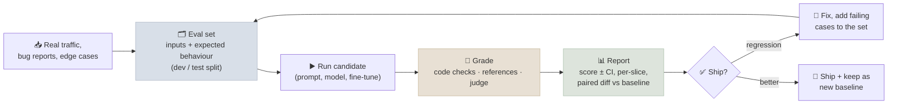

# Building Your Own Evals

Public benchmarks tell you roughly how capable a model is. Whether it is good enough **for your product** - and whether a new prompt, fine-tune or model version made things better or worse - only your own evaluation can say. This note covers how to build a task-specific eval set, choose metrics, handle statistics honestly, evaluate long context, and wire evals into development as regression gates.

```objectives
time: 50 min
outcomes:
  - Build a task-specific eval set from real traffic, known failures and edge cases, with a train/test discipline
  - Choose metrics per task type - exact match, programmatic checks, reference similarity, judge rubrics
  - Report results with confidence intervals and use paired comparisons to detect real differences
  - Evaluate long-context behaviour beyond needle-in-a-haystack
  - Set up an eval harness and regression gates in CI
prerequisites:
  - "[What Benchmarks Measure](01-What-Benchmarks-Measure.mdx)"
  - "[LLM-as-Judge](03-LLM-as-Judge.mdx)"
```

## The Eval Loop



---

## Building the Eval Set

- **Start from reality.** Sample real (anonymized) inputs, stratified by type. Add every bug report and production failure as a new case - an eval set is a regression suite that grows.
- **Cover the edges deliberately:** empty or huge inputs, adversarial and prompt-injection attempts, multilingual inputs, requests the system should refuse or escalate.
- **Write down expected behaviour,** not just an expected string - "must cite the refund policy; must not promise a refund amount".
- **Keep a dev/test split.** Iterate prompts against the dev set; report on the test set you did not tune against. Otherwise you are overfitting your own eval.
- **Size it for the decision.** 50 cases catch big regressions; detecting a 3-point change needs hundreds (see statistics below).

## Choosing Metrics

| Task type | Best grader | Example |
|-----------|-------------|---------|
| Classification, extraction into fields | Exact match / F1 per field | Ticket routing, invoice fields |
| Structured output | Schema validation + field checks | JSON tool arguments |
| Math, code, SQL | Execution against tests or expected results | Unit tests pass; query returns expected rows |
| Grounded QA / RAG | Judge with the source document: supported? complete? | Policy Q&A |
| Open-ended writing | Rubric judge + periodic human review | Summaries, emails |
| Multi-step agents | Final-state checks + trajectory review | Task completed; forbidden actions not taken |

Prefer code-based checks wherever possible; use judges for what code can't check; spot-check both with humans.

---

## Statistics You Can't Skip

An eval score is an estimate. With n items and accuracy p, the standard error is about `sqrt(p(1-p)/n)`:

| n | p = 0.80 | 95% CI (± 1.96 SE) |
|---|----------|--------------------|
| 50 | 0.80 | ± 11 points |
| 200 | 0.80 | ± 5.5 points |
| 1,000 | 0.80 | ± 2.5 points |

- **Report intervals.** "82% (95% CI 77-87%)" is honest; "82%" invites over-reading.
- **Compare paired.** When two systems run on the same items, analyse per-item differences (paired bootstrap, or McNemar's test for pass/fail). Pairing cancels item difficulty and detects much smaller real differences than comparing two independent intervals.
- **Cluster when items are related.** Several questions about the same document aren't independent; resample by document.
- **Account for sampling noise.** At temperature > 0, run several samples per item or fix the seed, and report the variance.

---

## Evaluating Long Context

**Needle-in-a-haystack** (hide one fact in long filler, ask for it) is now too easy - most models pass it at their advertised length. Better tests:

- **RULER**: multiple needles, multi-hop tracing, aggregation and QA at increasing lengths - reveals an "effective" context length often far below the advertised one.
- **Your own long documents**: questions whose answers require combining information from several places, placed at different depths.
- **Report by position and length** - accuracy at the start, middle and end of the context, at 8K / 32K / 128K.

---

## Tooling

| Tool | What it's for |
|------|---------------|
| [lm-evaluation-harness](https://github.com/EleutherAI/lm-evaluation-harness) (EleutherAI) | Standard academic benchmarks on open models; reproducible configs. Used in the [Eval Harness lab](../CodeLabs/01-Eval-Harness.mdx) |
| [Inspect](https://inspect.aisi.org.uk/) (UK AI Security Institute) | Custom evals including agentic, tool-using tasks with sandboxes |
| [promptfoo](https://www.promptfoo.dev/) | Prompt/model comparison and regression tests in CI |
| Observability platforms (Langfuse, LangSmith, Braintrust, and others) | Datasets, experiment tracking and online evaluation for LLM apps - covered in [Production Agents](../../16-Production-Agents/INDEX.mdx) |

**Regression gates in CI:** run the fast subset of the eval on every prompt or model change, fail the build if a critical slice drops beyond its confidence interval, and run the full set nightly or before release.

---

## Check Yourself

```quiz
- q: "Your eval has 100 items. System A scores 81%, System B 84%, on the same items. What is the right next step?"
  options:
    - "Run a paired test on per-item results before concluding B is better"
    - "Ship B - it is 3 points better"
    - "Conclude they are identical because the intervals overlap"
    - "Add more benchmarks from public leaderboards"
  answer: 1
  explain: "With 100 items each score has roughly a ±8-point interval, but a paired analysis on the same items can still detect a real difference if most items agree and the disagreements favour B."
- q: "Why keep a separate test split of your own eval set?"
  options:
    - "Iterating prompts against the same items overfits them; the untouched split gives an honest estimate"
    - "Test splits run faster"
    - "Judges need a different split"
    - "It is required by lm-evaluation-harness"
  answer: 1
- q: "Why is needle-in-a-haystack no longer a sufficient long-context test?"
  answer: "Most current models pass single-needle retrieval at their advertised lengths, yet still fail when tasks need multiple facts, multi-hop reasoning or aggregation across the context. Tests like RULER and your own multi-part questions at several depths reveal the effective context length."
```

## Exercises

```exercise
- title: Size an eval
  task: |
    You expect your system to score about 90% and want a 95% confidence interval no wider than ±2 points. How many independent items do you need? What changes if you compare two systems paired on the same items?
  solution: |
    SE must be ≤ 2 / 1.96 ≈ 1.02 points = 0.0102. sqrt(0.9 × 0.1 / n) ≤ 0.0102 → n ≥ 0.09 / 0.000104 ≈ 865 items. For a paired comparison the required size depends on how often the systems disagree - if they disagree on only 10% of items, far fewer items are needed to detect a given difference than two independent 865-item evaluations.
- title: Build a regression suite
  task: |
    For an LLM feature you own (or an imagined one), write 30 eval cases: 20 from representative traffic, 5 from known failures, 5 adversarial. For each, write the expected behaviour and choose a grader (code check or judge criterion). Split 20/10 dev/test.
```

## Study Notes

**Must-know:**
- Eval sets grow from real traffic, failures and deliberate edge cases; keep a dev/test split
- Grader per task type: exact match/F1, schema checks, execution, grounded judge, rubric judge, final-state checks
- SE ≈ sqrt(p(1-p)/n); 200 items at 80% → ±5.5 points; report CIs and use paired comparisons (bootstrap, McNemar)
- Long context: go beyond needle-in-a-haystack (RULER, multi-part questions by depth)
- Regression gates in CI: fast subset per change, full suite nightly/pre-release

## References

- Miller, [Adding Error Bars to Evals: A Statistical Approach to Language Model Evaluations](https://arxiv.org/abs/2411.00640) (2024)
- Biderman et al., [Lessons from the Trenches on Reproducible Evaluation of Language Models](https://arxiv.org/abs/2405.14782) (2024) - lm-evaluation-harness
- Hsieh et al., [RULER: What's the Real Context Size of Your Long-Context Language Models?](https://arxiv.org/abs/2404.06654) (2024)
- Liu et al., [Lost in the Middle](https://arxiv.org/abs/2307.03172) (2023)
- UK AI Security Institute, [Inspect](https://inspect.aisi.org.uk/)

*Last reviewed: 2026-09*
