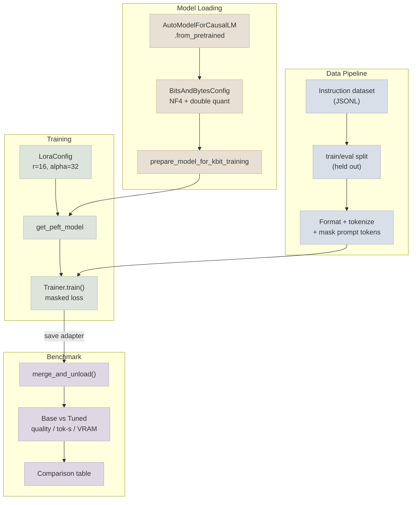

# Code Lab 01 - QLoRA Fine-Tune

A real, runnable QLoRA fine-tune of a small open instruction model on a compact instruction dataset - loaded in 4-bit via `bitsandbytes`, adapted with a `peft` LoRA config, trained with prompt/completion masking, and benchmarked against the un-tuned base model on quality, latency, and VRAM.

← **Back to Overview:** [Fine-Tuning Lab](../INDEX.mdx) · **Back to Concepts:** [LoRA & QLoRA Hands-On](../Notes/02-LoRA-and-QLoRA-Hands-On.mdx) · [Instruction Data & Training Runs](../Notes/03-Instruction-Data-and-Training-Runs.mdx) · [Benchmarking Base vs Tuned](../Notes/04-Benchmarking-Base-vs-Tuned.mdx)

```objectives
time: 2-3 hours (plus GPU time)
outcomes:
  - Run a QLoRA fine-tune end to end - 4-bit base, LoRA adapters, masked prompt/completion loss, held-out split
  - Benchmark the tuned model against its base on quality, tokens per second and peak VRAM
  - Decide from the benchmark whether the fine-tune is worth deploying
prerequisites:
  - "[LoRA & QLoRA Hands-On](../Notes/02-LoRA-and-QLoRA-Hands-On.mdx) and [Instruction Data & Training Runs](../Notes/03-Instruction-Data-and-Training-Runs.mdx)"
  - "A CUDA GPU with 12-24 GB (bitsandbytes 4-bit needs CUDA); `--no-quantize` runs a plain LoRA fine-tune elsewhere"
```

---

## What's In This Lab

| Property | Detail |
|---|---|
| Task | Instruction-following fine-tune (support-ticket-style responses; swappable for any instruction/response dataset) |
| Base model | A small open ~1-2B instruction model (default: `Qwen/Qwen3-1.7B`), reachable on a single consumer/free-tier GPU |
| Quantization | 4-bit NF4 base weights via `bitsandbytes`, BF16 LoRA adapters |
| Adapter | `peft` `LoraConfig` with `target_modules="all-linear"` (r = 16, alpha = 32) |
| Training | Masked prompt/completion loss, `transformers.Trainer`, checkpointed adapter output |
| Benchmark | Base vs adapter-merged model: quality proxy, tokens/sec, peak VRAM |
| Complexity | Intermediate-Advanced |
| Files | `01-QLoRA-Fine-Tune/{train_qlora.py, benchmark.py, requirements.txt, README.mdx}` |

## Architecture



## Running

```bash
cd 06-Fine-Tuning-Lab/CodeLabs/01-QLoRA-Fine-Tune
pip install -r requirements.txt
python train_qlora.py --epochs 3 --output-dir ./qlora-adapter
python benchmark.py --adapter-dir ./qlora-adapter
```

Full details, code walkthrough, and what each part demonstrates: see [README](https://github.com/sundante/sun-course-genai/tree/main/src/content/06-Fine-Tuning-Lab/CodeLabs/01-QLoRA-Fine-Tune).

## Check Yourself

```quiz
- q: "The benchmark compares base and tuned models. Where must the evaluation examples come from?"
  options: ["A split carved out before training and never trained on", "The last 10% of the training data after training", "Any examples the tuned model gets right", "The training set"]
  answer: 1
- q: "Why does benchmark.py run warm-up generations before timing?"
  answer: "The first calls pay one-time costs (kernel selection, caching, memory allocation); excluding them measures steady-state throughput."
- q: "The tuned model is better on the task but 20% slower. What is the most likely reason if the adapter was not merged?"
  options: ["The extra low-rank matmuls of the unmerged adapter (and the 4-bit dequantisation path)", "The LoRA dropout", "The tokenizer", "The eval set size"]
  answer: 1
```

## Exercises

```exercise
- title: Merge and re-benchmark
  task: |
    Load the base in bf16, attach the trained adapter, merge it with merge_and_unload(), save the merged model and re-run benchmark.py. Compare quality and tokens per second with the unmerged 4-bit setup.
  solution: |
    Quality should match within noise (the merge is exact in bf16); tokens per second usually improves because the merged model has no adapter path or 4-bit dequantisation overhead - at the cost of a larger artifact and higher memory.
- title: Is it worth it?
  task: |
    Add a third arm to the benchmark: the base model with a 3-shot prompt. Compare all three on quality (with confidence intervals), input tokens per request and cost per 1,000 requests, then write a one-paragraph recommendation.
  solution: |
    Few-shot usually closes part of the gap at the cost of longer prompts. If the tuned model's quality lead over few-shot is within the confidence interval, the recommendation is to ship the prompt; if it is clearly larger and volume is high, the fine-tune pays back (see the break-even exercise in Benchmarking Base vs Tuned).
```

## References

- Dettmers et al., [QLoRA](https://arxiv.org/abs/2305.14314) (2023)
- Hugging Face, [PEFT](https://huggingface.co/docs/peft) and [Transformers Trainer](https://huggingface.co/docs/transformers/main_classes/trainer) documentation (2026)

*Last reviewed: 2026-09*
