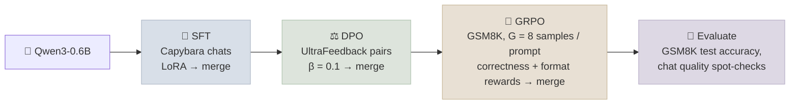

# Code Lab 02 - SFT, DPO and GRPO with TRL

Run the three stages of modern post-training on a small open model, with LoRA adapters and Hugging Face TRL: supervised fine-tuning on chat demonstrations, DPO on preference pairs, then GRPO with verifiable math rewards. One script, one command per stage.

← **Back to Overview:** [Fine-Tuning Lab](../INDEX.mdx) · **Concepts:** [Preference Optimization](../../05-Post-Training/Notes/02-Preference-Optimization.mdx) · [RL for LLMs](../../05-Post-Training/Notes/03-RL-for-LLMs.mdx)

```objectives
time: 3-4 hours (plus GPU time)
outcomes:
  - Run SFT, DPO and GRPO with TRL's trainers and explain what each stage's dataset looks like
  - Read DPO training metrics (loss starting at ln 2, reward margins and accuracies) and GRPO metrics (per-reward means, group std)
  - Write verifiable reward functions and debug them before spending GPU time
  - Decide when to merge LoRA adapters between stages
prerequisites:
  - "[Lab 01 - QLoRA Fine-Tune](01-QLoRA-Fine-Tune.mdx)"
  - "[Preference Optimization](../../05-Post-Training/Notes/02-Preference-Optimization.mdx) and [RL for LLMs](../../05-Post-Training/Notes/03-RL-for-LLMs.mdx)"
```

---

## What's In This Lab

| Property | Detail |
|---|---|
| Base model | `Qwen/Qwen3-0.6B` by default (any causal LM with a chat template works) |
| Stages | `sft` on `trl-lib/Capybara` → `dpo` on `trl-lib/ultrafeedback_binarized` → `grpo` on GSM8K |
| Adapters | LoRA on all linear layers; merged after each stage so the next stage (or vLLM) loads a plain model |
| GRPO rewards | `correctness_reward` (final `#### <number>` matches the reference: 1.0) + `format_reward` (answer line in the required format: 0.2) |
| Verified | All three stages run end to end on a laptop CPU with `--smoke` (tiny random model, 8 examples, 2 steps) using TRL 1.14 / transformers 5.17 / peft 0.21. Full runs are not GPU-verified here - expect roughly an hour per stage on one 24 GB GPU at the default sizes. |
| Files | `02-SFT-DPO-GRPO-with-TRL/{post_train.py, requirements.txt}` |



## Run It

```bash
cd 06-Fine-Tuning-Lab/CodeLabs/02-SFT-DPO-GRPO-with-TRL
pip install -r requirements.txt

# Smoke-test every stage first (minutes on a laptop CPU)
for s in sft dpo grpo; do python post_train.py $s --model trl-internal-testing/tiny-Qwen3ForCausalLM --smoke; done

# Real runs (GPU)
python post_train.py sft  --output-dir runs/sft
python post_train.py dpo  --model runs/sft/merged --output-dir runs/dpo
python post_train.py grpo --model runs/dpo/merged --output-dir runs/grpo
```

## Walkthrough - What to Look At

1. **Dataset shapes.** SFT rows are `messages` lists; DPO rows are `prompt` / `chosen` / `rejected`; GRPO rows are a `prompt` (system + user messages) plus a `solution` column that TRL passes to the reward functions as a keyword argument.
2. **DPO's first loss is ln 2 ≈ 0.693.** At step 0 the policy equals the reference, so the implicit reward margin is zero and `-log σ(0) = ln 2`. Watch `rewards/margins` grow and `rewards/accuracies` rise above 0.5.
3. **No second model for DPO's reference.** With a LoRA adapter, TRL computes reference log-probabilities by disabling the adapter - the frozen base *is* the reference.
4. **GRPO's group.** `num_generations` is G: completions sampled per prompt to form the group baseline. Prompts where all G samples get the same reward contribute nothing - watch the per-reward `std` in the logs.
5. **TRL's GRPO defaults are DAPO-style.** `GRPOConfig` defaults to a token-level (`"dapo"`) loss and `beta = 0.0` - no KL penalty. Set `beta > 0` to add one.
6. **Test rewards before training.** The reward functions are plain Python - call them on hand-written completions (see the exercise) before spending GPU hours.

## Check Yourself

```quiz
- q: "Your DPO run logs a loss of 0.693 at step 0. What does that tell you?"
  options:
    - "Everything is wired correctly - the policy equals the reference, so the margin is zero and the loss is ln 2"
    - "The learning rate is too high"
    - "The chosen and rejected columns are swapped"
    - "The model has already converged"
  answer: 1
- q: "In GRPO logs, the correctness reward's std within groups is 0 for most prompts. What is happening, and what should you change?"
  options:
    - "Most groups are all-right or all-wrong, so they carry no advantage - adjust difficulty (filter prompts) or raise G"
    - "The reward function is broken and must be rewritten"
    - "The KL penalty is too strong"
    - "This is ideal - it means the model is confident"
  answer: 1
- q: "Why merge the LoRA adapter after each stage?"
  answer: "Each stage then starts from a plain model with the previous stage's behaviour baked in, the next stage can attach a fresh adapter (and, for DPO, use the merged model as its reference), and the output can be served by engines such as vLLM without adapter support."
```

## Exercises

```exercise
- title: Unit-test the rewards
  task: |
    Import `correctness_reward` and `format_reward` from `post_train.py` and write four test completions: correct and well-formatted; correct with a comma in the number (`#### 1,200`); wrong; correct answer followed by extra text. Predict each reward, then check. Is rewarding format separately a risk (can the model learn to output `#### 0` for the format bonus)?
  solution: |
    Expected: (1.0, 0.2), (1.0, 0.2), (0.0, 0.0 or 0.2 depending on format), (1.0, 0.0). A format-only strategy earns 0.2 per sample, far below the 1.0 for correct answers, so it is not optimal once the model can solve some problems - but keep the format reward small relative to correctness for exactly this reason.
- title: Measure the stages
  task: |
    Evaluate the base model, and each stage's merged output, on 200 GSM8K test questions using the same prompt and answer extraction. Plot accuracy by stage and describe which stage moved it most. Then spot-check chat quality on 10 open-ended prompts - did GRPO on math hurt general chat?
- title: Add a KL penalty
  task: |
    Rerun GRPO with `beta=0.04`. Compare reward curves and GSM8K accuracy with the default (`beta=0.0`), and the model's behaviour on non-math prompts.
```

## References

- Hugging Face, [TRL documentation](https://huggingface.co/docs/trl) - `SFTTrainer`, `DPOTrainer`, `GRPOTrainer`
- Rafailov et al., [Direct Preference Optimization](https://arxiv.org/abs/2305.18290) (2023)
- Shao et al., [DeepSeekMath (GRPO)](https://arxiv.org/abs/2402.03300) (2024); Yu et al., [DAPO](https://arxiv.org/abs/2503.14476) (2025)
- Cobbe et al., [Training Verifiers to Solve Math Word Problems (GSM8K)](https://arxiv.org/abs/2110.14168) (2021)
- Cui et al., [UltraFeedback](https://arxiv.org/abs/2310.01377) (2023)

*Last reviewed: 2026-09*
