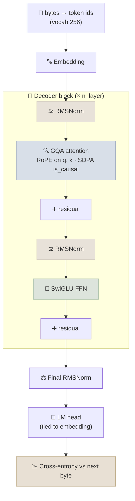

# Code Lab 02 - GPT From Scratch

Build and train a small decoder-only transformer in about 250 lines of plain PyTorch, using the same building blocks as current open models - RMSNorm, rotary position embeddings, grouped-query attention through the fused attention kernel, SwiGLU, and weight tying. After this lab, a Llama- or Qwen-style `config.json` should read like a list of choices you have already made yourself.

← **Back to Overview:** [PyTorch Fundamentals](../INDEX.mdx) · **Concepts:** [PyTorch for LLMs](../Notes/06-PyTorch-for-LLMs.mdx) · [Transformer Architecture](../../03-Foundation-Models/Notes/03-Architecture.mdx)

```objectives
time: 2-3 hours
outcomes:
  - Implement RMSNorm, RoPE, grouped-query attention and a SwiGLU block, and explain each design choice
  - Write a language-model training loop with warmup + cosine decay, AdamW with selective weight decay, gradient clipping and bf16 autocast
  - Diagnose training from the loss curve, starting from the ln(vocab) sanity check
  - Save weights safely with safetensors and sample text with temperature and top-k
prerequisites:
  - "[Training Loop From Scratch](../Notes/03-Training-Loop-From-Scratch.mdx)"
  - "[Transformer Architecture](../../03-Foundation-Models/Notes/03-Architecture.mdx) and [Attention Mechanisms](../../03-Foundation-Models/Notes/04-Attention-Mechanisms.mdx)"
```

---

## What's In This Lab

| Property | Detail |
|---|---|
| Task | Character (byte) level language modeling on Tiny Shakespeare (~1 MB, downloaded on first run) |
| Model | `GPT` in `model.py`: 6 layers, 6 query heads, 2 KV heads, d_model 384 - about 9.5M parameters (a `tiny` 0.4M preset exists for CPU) |
| Training | `train.py`: random-window batches, AdamW (β₂ = 0.95), warmup + cosine LR, grad-norm clipping, bf16 autocast on GPU, optional `torch.compile` |
| Output | Train/val loss every 250 steps, `checkpoints/model.safetensors`, and a 300-byte sample |
| Verified | `--preset tiny --steps 400` runs on a laptop CPU in ~10 s: loss falls from 5.57 to ~1.85 and samples look like Shakespeare-shaped text. The default preset needs a GPU for a reasonable run time. |
| Files | `02-GPT-From-Scratch/{model.py, train.py, requirements.txt}` |

## Architecture



## Run It

```bash
cd 06-PyTorch/CodeLabs/02-GPT-From-Scratch
pip install -r requirements.txt

python train.py --preset tiny --steps 400   # CPU smoke test, ~10 seconds
python train.py                              # default model; use a GPU
python train.py --compile                    # add torch.compile (first steps are slow while it compiles)
```

## Walkthrough - What to Look At

1. **The first loss value.** With 256 possible bytes and random weights, the model guesses uniformly, so loss starts at ln(256) ≈ 5.55. If your first loss is far from that, initialization or the loss wiring is wrong.
2. **`Attention.forward`** - queries have 6 heads, keys/values only 2. `scaled_dot_product_attention(..., enable_gqa=True)` shares each KV head across 3 query heads without copying tensors, and `is_causal=True` applies the mask inside the fused kernel.
3. **`apply_rope`** - positions are injected by rotating query/key channel pairs, not by adding a position embedding; nothing positional is learned.
4. **`build_optimizer`** - weight decay applies only to matrices; RMSNorm gains are not decayed. β₂ = 0.95 (instead of Adam's default 0.999) is the standard LLM choice because it adapts faster to gradient-scale changes and reduces loss spikes.
5. **`lr_at`** - linear warmup then cosine decay. Try the WSD alternative in the exercises.
6. **Checkpoint** - `safetensors` stores raw tensors only. A pickled `.pt` file can execute arbitrary code when loaded; this is why model hubs moved to safetensors.

## Check Yourself

```quiz
- q: "Your first logged loss is 12.3 with a 256-token vocabulary. What is the most likely problem?"
  options:
    - "Initialization is far too large, so the model is confidently wrong from step 0"
    - "The learning rate is too low"
    - "The model is overfitting"
    - "Nothing - early losses are always large"
  answer: 1
  explain: "An untrained model should be close to uniform, giving ln(256) ≈ 5.55. A much larger value means logits start out large and confidently wrong, which usually points to initialization (or a loss/label bug)."
- q: "Why does the model use 2 KV heads for 6 query heads?"
  options:
    - "To cut the KV cache and attention memory traffic by 3× while keeping 6 query heads"
    - "Because RoPE only works with 2 heads"
    - "To reduce the number of parameters in the FFN"
    - "Because causal masking requires fewer key heads"
  answer: 1
- q: "Why is the output projection tied to the input embedding?"
  answer: "Both map between token ids and the model dimension, so sharing one matrix removes vocab × d_model parameters and tends to help small models. Large models often untie them because the saving is negligible relative to their size."
```

## Exercises

```exercise
- title: Add a KV cache to generate()
  task: |
    `generate()` re-runs the whole context for every new token. Add a KV cache so each step only processes the newest token, and measure the speed-up for 500 generated tokens. Keep RoPE correct: the new token's position is the current cache length.
  hints:
    - "Return (k, v) from each Attention call and concatenate along the sequence dimension on the next step."
    - "With a cache, the single new query attends to all cached keys, so is_causal must be False for those decode steps."
- title: Warmup-stable-decay schedule
  task: |
    Replace cosine decay with WSD: warm up, hold the peak learning rate for ~80% of training, then decay linearly to min_lr over the final ~20%. Compare the final validation loss with cosine at the same step budget, and explain why WSD makes it cheap to "continue training" from a checkpoint.
- title: Scale the model
  task: |
    Double `d_model` and `n_layer`. Predict the parameter count before running (count embedding, attention and SwiGLU matrices), then check with `num_params()`. Does validation loss improve on Tiny Shakespeare, or does the larger model overfit a 1 MB corpus?
```

## References

- Karpathy, [nanoGPT](https://github.com/karpathy/nanoGPT) and [build-nanogpt](https://github.com/karpathy/build-nanogpt) - the style this lab follows
- Su et al., [RoFormer: Rotary Position Embedding](https://arxiv.org/abs/2104.09864) (2021)
- Zhang & Sennrich, [Root Mean Square Layer Normalization](https://arxiv.org/abs/1910.07467) (2019)
- Shazeer, [GLU Variants Improve Transformer](https://arxiv.org/abs/2002.05202) (2020)
- Ainslie et al., [GQA](https://arxiv.org/abs/2305.13245) (2023)
- PyTorch docs: [`scaled_dot_product_attention`](https://pytorch.org/docs/stable/generated/torch.nn.functional.scaled_dot_product_attention.html)

*Last reviewed: 2026-09*
