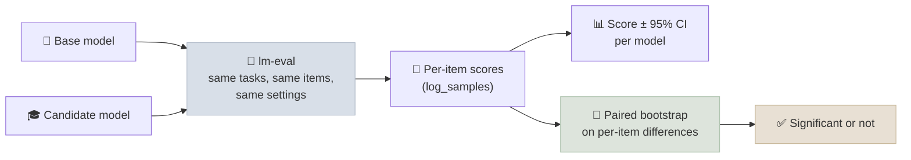

# Code Lab 01 - Evaluation Harness: Base vs Tuned

Run standard benchmarks with EleutherAI's lm-evaluation-harness on a base model and a fine-tuned candidate, and compare them the right way: per-task scores with confidence intervals, and a paired bootstrap on per-item differences, so a 2-point gap on 200 questions isn't mistaken for progress.

← **Back to Overview:** [Evaluation & Benchmarks](../INDEX.mdx) · **Concepts:** [What Benchmarks Measure](../Notes/01-What-Benchmarks-Measure.mdx) · [Building Your Own Evals](../Notes/04-Building-Your-Own-Evals.mdx)

```objectives
time: 2 hours (plus GPU time)
outcomes:
  - Run lm-evaluation-harness from the command line and from Python, with and without the chat template
  - Read the harness's per-sample logs and choose the right metric and answer-extraction filter
  - Compare two models with per-item paired bootstrap confidence intervals
  - Explain why the same model can score differently under different harness settings
prerequisites:
  - "[Building Your Own Evals](../Notes/04-Building-Your-Own-Evals.mdx) - confidence intervals and paired comparisons"
  - "A candidate model to test - e.g. the output of the [SFT, DPO & GRPO lab](../../06-Fine-Tuning-Lab/CodeLabs/02-SFT-DPO-GRPO-with-TRL.mdx)"
```

---

## What's In This Lab

| Property | Detail |
|---|---|
| Harness | `lm-eval` 0.4.x (`lm-eval run ...` CLI and `lm_eval.simple_evaluate` Python API) |
| Default tasks | `gsm8k` (generative, exact match after answer extraction) and `arc_easy` (multiple choice by log-likelihood) |
| Comparison | `compare.py` runs both models on the same items, reports score ± 95% CI per model and a paired bootstrap CI on the per-item difference |
| Verified | The CLI and `compare.py` run end to end on a laptop CPU with tiny test models (`--limit 8`), using lm-eval 0.4.13. Full-size runs are not GPU-verified here. |
| Files | `01-Eval-Harness/{compare.py, requirements.txt}` |



## Run It

```bash
cd 07-Evaluation/CodeLabs/01-Eval-Harness
pip install -r requirements.txt

# 1. The CLI - one model, quick look (note the Stderr column)
lm-eval run --model hf --model_args pretrained=Qwen/Qwen3-0.6B,dtype=bfloat16 \
    --tasks gsm8k,arc_easy --limit 200 --batch_size auto --apply_chat_template \
    --output_path results

# 2. Base vs candidate with paired statistics
python compare.py --base Qwen/Qwen3-0.6B \
    --candidate ../../../06-Fine-Tuning-Lab/CodeLabs/02-SFT-DPO-GRPO-with-TRL/runs/grpo/merged \
    --tasks gsm8k,arc_easy --limit 200 --chat-template

# CPU smoke test with tiny random models
python compare.py --base trl-internal-testing/tiny-Qwen3ForCausalLM \
    --candidate trl-internal-testing/tiny-Qwen2ForCausalLM-2.5 --limit 8 --max-gen-toks 16
```

## Walkthrough - What to Look At

1. **The Stderr column.** The CLI prints a standard error next to every metric. On 8 items the smoke test shows `acc 0.25 ± 0.16` - a reminder that small samples say almost nothing.
2. **Two kinds of scoring.** `arc_easy` picks the option with the highest log-likelihood (`acc`, and the length-normalized `acc_norm`); `gsm8k` generates text and extracts the final number with a regex filter (`strict-match` or `flexible-extract`). The script records which filter it used.
3. **`--apply_chat_template` changes the score.** Instruct models expect their chat format; base models often do better without it. Always report which you used.
4. **Paired vs unpaired.** The per-model intervals can overlap even when the paired difference is significant, because pairing removes item difficulty. The script prints how many items each model won - the raw material of the paired test.
5. **`--limit` is a subset.** It takes the first N items. Fine for iteration; report full-task numbers before making claims.

## Check Yourself

```quiz
- q: "The base model scores 0.52 (95% CI 0.45-0.59) and the candidate 0.57 (95% CI 0.50-0.64) on the same 200 GSM8K items. The paired difference is +0.05 with 95% CI +0.02 to +0.08. What do you conclude?"
  options:
    - "The candidate is better - the paired interval excludes zero even though the per-model intervals overlap"
    - "No difference - the per-model intervals overlap"
    - "The candidate is 5 points better on the full benchmark"
    - "The test is invalid because the intervals overlap"
  answer: 1
- q: "Why might the same model score several points differently in two papers that both report 'GSM8K'?"
  answer: "Different shots and prompt formats, chat template on or off, different answer-extraction filters (strict vs flexible), different generation limits or sampling, subsets vs the full test set, and different harness versions."
```

## Exercises

```exercise
- title: Measure the post-training stages
  task: |
    Using the models saved by the SFT, DPO & GRPO lab, run `compare.py` for base → SFT, SFT → DPO and DPO → GRPO on gsm8k and arc_easy with `--limit 500`. Which transitions are significant? Did GRPO on math change arc_easy?
- title: Add your own task
  task: |
    lm-eval tasks are YAML files. Write a custom task over 50 of your own question/answer pairs (a JSONL file), using exact match after lowercasing. Run it with `--include_path` and compare two models.
  hints:
    - "Start from an existing task YAML in the harness repository (for example gsm8k) and change `dataset_path`, `doc_to_text`, `doc_to_target` and the metric."
```

## References

- EleutherAI, [lm-evaluation-harness](https://github.com/EleutherAI/lm-evaluation-harness) and its [interface docs](https://github.com/EleutherAI/lm-evaluation-harness/blob/main/docs/interface.md)
- Biderman et al., [Lessons from the Trenches on Reproducible Evaluation of Language Models](https://arxiv.org/abs/2405.14782) (2024)
- Miller, [Adding Error Bars to Evals](https://arxiv.org/abs/2411.00640) (2024)
- Efron & Tibshirani, *An Introduction to the Bootstrap* (1993)

*Last reviewed: 2026-09*
