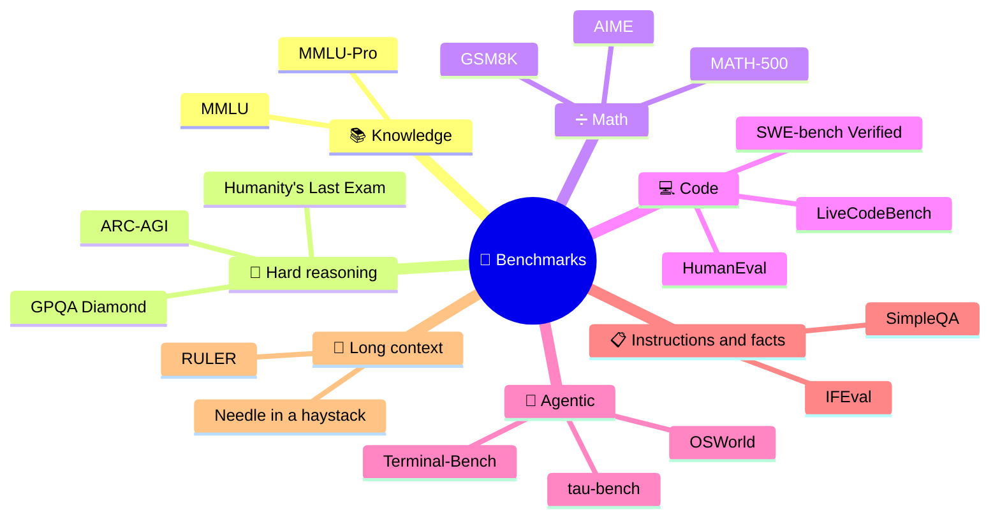

# What Benchmarks Measure

Every model card leads with a table of benchmark scores. To read one critically you need to know what each benchmark actually tests, how it is scored, and whether it still separates good models from great ones. This note is a field guide to the benchmarks you will see most, grouped by the capability they target.

```objectives
time: 45 min
outcomes:
  - Name the main benchmark for each capability (knowledge, reasoning, math, code, agentic, instruction following, factuality, long context) and say what it tests
  - Explain how scoring works - multiple choice by log-likelihood vs generation with answer extraction, pass@k, pass^k
  - Recognize benchmark saturation and explain why the leaderboard keeps moving to harder tests
  - Read a model card's benchmark table and ask the right follow-up questions (shots, prompts, thinking budget, harness)
prerequisites:
  - "[LLM Fundamentals](../../01-LLM-Foundations/Notes/01-LLM-Fundamentals.mdx)"
```

## A Map of Common Benchmarks



| Benchmark | Capability | Format | What to know |
|-----------|-----------|--------|--------------|
| **MMLU** (2020) | Broad knowledge, 57 subjects | 4-option multiple choice | Saturated at the frontier; some questions have wrong labels |
| **MMLU-Pro** (2024) | Knowledge + reasoning | 10-option multiple choice, harder questions | Built to restore headroom over MMLU; less sensitive to prompt wording |
| **GPQA Diamond** (2023) | Graduate-level science | 4-option MC, 198 questions written to be "Google-proof" | Domain experts score ~65%; skilled non-experts with web access ~34% |
| **Humanity's Last Exam** (2025) | Frontier-difficulty questions across fields | ~2,500 questions, MC and short answer | Designed to be hard for current models; also measures calibration |
| **GSM8K** (2021) | Grade-school math word problems | Free-form, exact numeric match | Saturated; used as a sanity check and for RL demos |
| **MATH / MATH-500** (2021) | Competition math | Free-form, answer equivalence | MATH-500 is a representative 500-problem subset |
| **AIME** (yearly) | Olympiad-qualifier math | 30 integer-answer problems per year | Small - scores swing a lot; new years give uncontaminated sets |
| **HumanEval** (2021) | Function-level Python | Unit tests, pass@k | Saturated and widely leaked |
| **LiveCodeBench** (2024) | Competitive programming | Unit tests; problems tagged by release date | Evaluate only on problems released after the model's cutoff |
| **SWE-bench Verified** (2024) | Real GitHub issue resolution | Agent edits a repo; hidden tests must pass | 500 human-validated tasks from the original SWE-bench |
| **τ-bench** (2024) | Tool-using customer-service agents | Simulated user + APIs; database state checked | Introduced pass^k (all k attempts must succeed) |
| **IFEval** (2023) | Following verifiable instructions ("no commas", "3 paragraphs") | Programmatic checks | Cheap and objective; narrow |
| **SimpleQA** (2024) | Short factual questions | Graded correct / incorrect / not attempted | Measures hallucination vs abstention |
| **RULER** (2024) | Long-context retrieval and reasoning | Synthetic tasks at increasing lengths | Shows effective context is often far below advertised |

Agentic benchmarks are covered in depth in [Production Agents](../../17-Production-Agents/INDEX.mdx).

---

## How Scoring Works

### Multiple choice: log-likelihood vs generation

- **Log-likelihood scoring** (classic harness default for base models): compute the model's probability of each option's text and pick the highest. No generation, no parsing - but it measures something slightly different from how a chat model is used. Variants normalize by length (`acc_norm`).
- **Generative scoring**: the model writes an answer (often after reasoning), and a regex or a judge extracts it. Closer to real use; sensitive to prompt format and to the extraction rule.

The same model can differ by several points between the two - one reason scores from different reports aren't comparable.

### pass@k and pass^k

```
pass@k  = probability that at least one of k samples is correct
          unbiased estimator from n ≥ k samples with c correct:  1 - C(n-c, k) / C(n, k)
pass^k  = probability that all k independent attempts succeed
          (≈ p^k for per-attempt success p) - a reliability measure for agents
```

pass@k rewards a model that *can* solve a task; pass^k rewards one that *reliably* does. An agent with 80% per-attempt success has pass^8 ≈ 17%.

---

## Saturation and the Moving Frontier

A benchmark stops being useful when top models cluster near its ceiling (or near its label-noise floor): MMLU, GSM8K and HumanEval are there. The community responds with harder or fresher tests - MMLU-Pro, GPQA, HLE, LiveCodeBench, SWE-bench Verified - which then saturate in turn. Two consequences:

1. **Compare models on benchmarks that still separate them.** A 0.5-point MMLU difference between frontier models is noise.
2. **Prefer benchmarks with a freshness mechanism** (release-dated problems, new yearly sets, private held-out splits) - see [Contamination and Leaderboards](02-Contamination-and-Leaderboards.mdx).

---

## Questions to Ask About Any Score

| Question | Why it changes the number |
|----------|---------------------------|
| How many shots, and which prompt? | Few-shot examples and wording can move scores by several points |
| Thinking on or off, and at what budget/effort? | Reasoning models gain most on math/code at high effort |
| Single sample or majority vote / best-of-N? | "maj@64" and pass@1 are different numbers |
| Which harness and answer extraction? | Log-likelihood vs generative, strict vs flexible regex |
| Full benchmark or a subset? | Subsets (e.g. MATH-500) and "verified" splits differ |
| Tools allowed? | Code execution or search changes math and knowledge scores |
| How many questions? | 30 AIME problems → each is 3.3 points; confidence intervals matter |

---

## Check Yourself

```quiz
- q: "An agent succeeds on 90% of individual attempts at a task. Roughly what is its pass^5 (all five attempts succeed)?"
  options:
    - "About 59%"
    - "About 99.999%"
    - "90%"
    - "About 45%"
  answer: 1
  explain: "0.9^5 ≈ 0.59. pass@5 (at least one success) would be 1 - 0.1^5 ≈ 99.999%."
- q: "Why is LiveCodeBench considered more trustworthy than HumanEval for comparing recent models?"
  options:
    - "Its problems are tagged by release date, so you can evaluate only on problems published after a model's training cutoff"
    - "It has more problems"
    - "It uses a stronger judge model"
    - "It allows tool use"
  answer: 1
- q: "Model A reports 88.1 on a benchmark and Model B 87.6. What do you need to know before concluding A is better?"
  answer: "The evaluation setup for both (shots, prompt, thinking effort, sampling and aggregation, harness and extraction, subset), the number of questions and the resulting confidence interval, and whether contamination is plausible. A 0.5-point gap is often within noise or explained by setup differences."
```

## Exercises

```exercise
- title: Compute pass@k
  task: |
    A model is sampled n = 20 times on a coding problem and 3 samples pass. Compute the unbiased pass@1, pass@5 and pass@10 using `1 - C(n-c, k) / C(n, k)`. Then explain why taking 5 of the 20 samples at random and checking "any pass" gives a noisier estimate.
  solution: |
    pass@1 = 3/20 = 0.15. pass@5 = 1 - C(17,5)/C(20,5) = 1 - 6188/15504 ≈ 0.601. pass@10 = 1 - C(17,10)/C(20,10) = 1 - 19448/184756 ≈ 0.895. The combinatorial estimator averages over all subsets of size k; drawing one random subset adds sampling noise.
- title: Audit a model card
  task: |
    Take the benchmark table from any recent model release. For each row, record the shots, prompting, thinking/effort setting, aggregation (pass@1 vs majority vote) and harness if stated. Which rows could you reproduce from the information given?
```

## Study Notes

**Must-know:**
- Knowledge: MMLU (saturated), MMLU-Pro; hard reasoning: GPQA Diamond, HLE; math: GSM8K (saturated), MATH-500, AIME; code: HumanEval (saturated), LiveCodeBench, SWE-bench Verified; agents: τ-bench, Terminal-Bench, OSWorld; IFEval, SimpleQA, RULER
- Log-likelihood vs generative scoring can differ by several points for the same model
- pass@k (any of k succeeds) vs pass^k (all k succeed, ≈ p^k) - the second measures reliability
- Always ask: shots, prompt, thinking effort, aggregation, harness, subset, tools, sample size

## References

- Hendrycks et al., [MMLU](https://arxiv.org/abs/2009.03300) (2020); Wang et al., [MMLU-Pro](https://arxiv.org/abs/2406.01574) (2024)
- Rein et al., [GPQA](https://arxiv.org/abs/2311.12022) (2023); Phan et al., [Humanity's Last Exam](https://arxiv.org/abs/2501.14249) (2025)
- Cobbe et al., [GSM8K](https://arxiv.org/abs/2110.14168) (2021); Hendrycks et al., [MATH](https://arxiv.org/abs/2103.03874) (2021)
- Chen et al., [Evaluating LLMs Trained on Code (HumanEval, pass@k estimator)](https://arxiv.org/abs/2107.03374) (2021); Jain et al., [LiveCodeBench](https://arxiv.org/abs/2403.07974) (2024)
- Jimenez et al., [SWE-bench](https://arxiv.org/abs/2310.06770) (2023); OpenAI, [Introducing SWE-bench Verified](https://openai.com/index/introducing-swe-bench-verified/) (2024)
- Yao et al., [τ-bench](https://arxiv.org/abs/2406.12045) (2024)
- Zhou et al., [IFEval](https://arxiv.org/abs/2311.07911) (2023); Wei et al., [SimpleQA](https://arxiv.org/abs/2411.04368) (2024); Hsieh et al., [RULER](https://arxiv.org/abs/2404.06654) (2024)

*Last reviewed: 2026-09*
