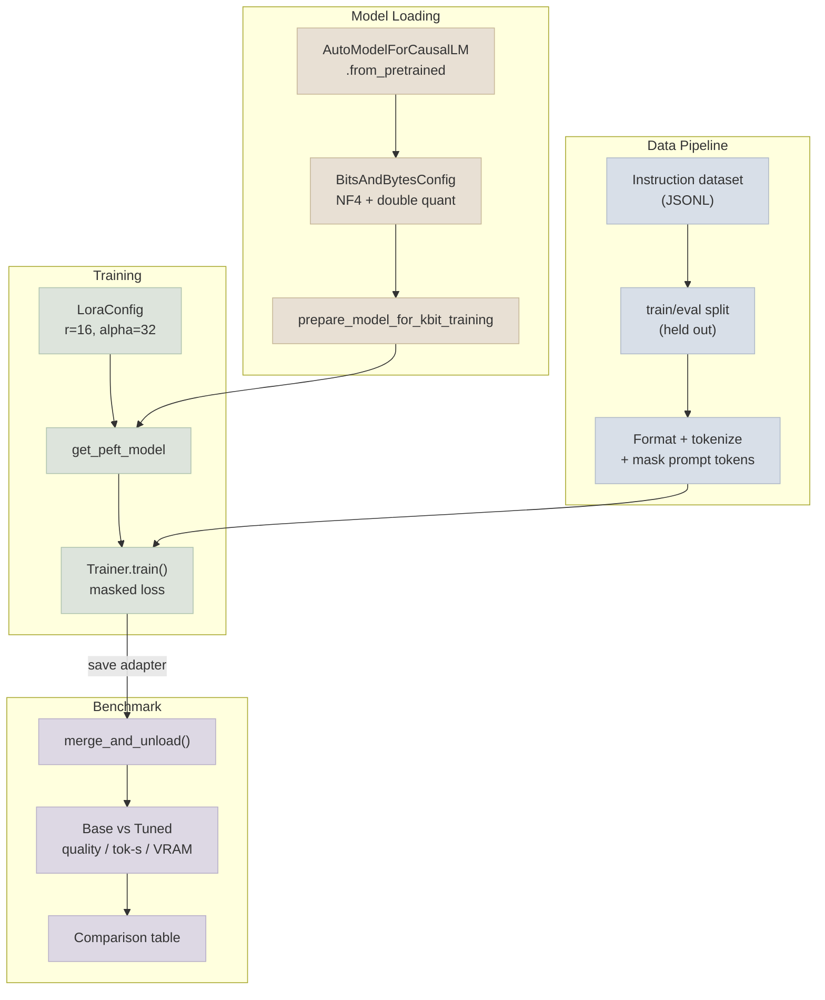

# Code Lab 01 - QLoRA Fine-Tune

A real, runnable QLoRA fine-tune of a small open instruction model on a compact instruction dataset - loaded in 4-bit via `bitsandbytes`, adapted with a `peft` LoRA config, trained with prompt/completion masking, and benchmarked against the un-tuned base model on quality, latency, and VRAM.

← **Back to Overview:** [Fine-Tuning Lab](../INDEX.mdx) · **Back to Concepts:** [LoRA & QLoRA Hands-On](../Notes/02-LoRA-and-QLoRA-Hands-On.mdx) · [Instruction Data & Training Runs](../Notes/03-Instruction-Data-and-Training-Runs.mdx) · [Benchmarking Base vs Tuned](../Notes/04-Benchmarking-Base-vs-Tuned.mdx)

---

## What's In This Lab

| Property | Detail |
|---|---|
| Task | Instruction-following fine-tune (support-ticket-style responses; swappable for any instruction/response dataset) |
| Base model | A small open ~1-2B instruction model (default: `Qwen/Qwen2.5-1.5B-Instruct`), reachable on a single consumer/free-tier GPU |
| Quantization | 4-bit NF4 base weights via `bitsandbytes`, BF16 LoRA adapters |
| Adapter | `peft` `LoraConfig` targeting attention projections |
| Training | Masked prompt/completion loss, `transformers.Trainer`, checkpointed adapter output |
| Benchmark | Base vs adapter-merged model: quality proxy, tokens/sec, peak VRAM |
| Complexity | Intermediate-Advanced |
| Files | `01-QLoRA-Fine-Tune/{train_qlora.py, benchmark.py, requirements.txt, README.mdx}` |

## Architecture



## Running

```bash
cd 07-Fine-Tuning-Lab/CodeLabs/01-QLoRA-Fine-Tune
pip install -r requirements.txt
python train_qlora.py --epochs 3 --output-dir ./qlora-adapter
python benchmark.py --adapter-dir ./qlora-adapter
```

Full details, code walkthrough, and what each part demonstrates: see [README](01-QLoRA-Fine-Tune/README.mdx).
